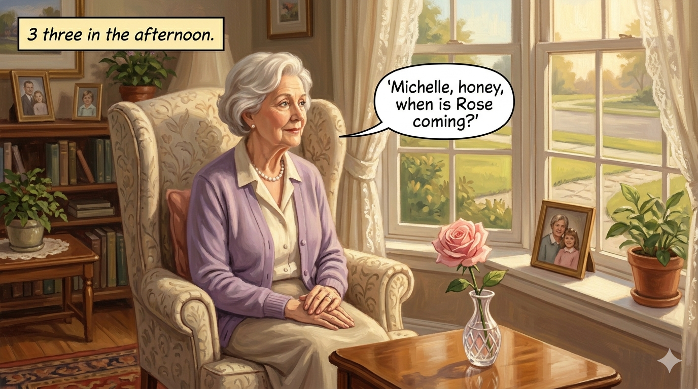
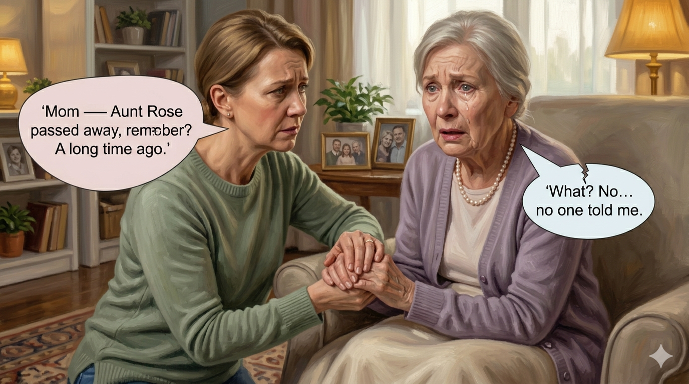
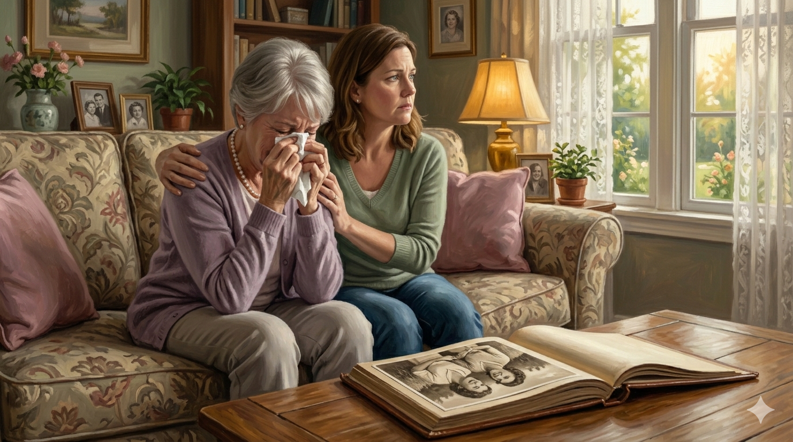
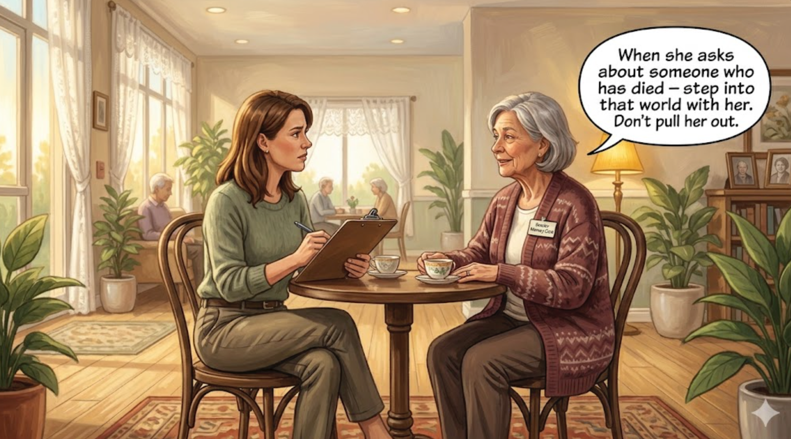

# Aunt Rose Is Coming: Stepping Into Her World

<!--  -->

Cover Image Prompt

Please generate a 16:9 image in warm, painterly contemporary realism depicting an older woman, Barbara, 80, with soft white hair and kind blue eyes, sitting by a large bay window in a cozy living room. She is dressed carefully in a lavender cardigan and a string of pearls. She holds a single cut rose in a small glass vase on the coffee table beside her, watching the front walkway expectantly. Beside her sits her daughter Michelle, 47, in a soft green sweater, with one hand gently resting on her mother's hand. Michelle is looking at her mother, not out the window. Afternoon light filters through lace curtains. The color palette is soft lavender, warm cream, faded rose, and golden afternoon light. The emotional tone is tender and bittersweet — a daughter choosing presence over correction. Generate the image immediately without asking clarifying questions.

Narrative Prompt

This is a graphic novel for family caregivers of people living with dementia. Michelle, 47, is a nurse practitioner. Her mother, Barbara, 80, is in the moderate-to-late stage of Alzheimer's. Barbara has begun asking, every afternoon around three o'clock, when her younger sister Rose is coming. Rose died thirty years ago of breast cancer. Michelle has been telling her mother the truth every time. Each time, her mother experiences the death as news: fresh grief, tears, asking why no one told her. The story shows Michelle learning validation therapy — entering her mother's world instead of forcing her mother into ours. Michelle learns that "Rose is coming" is not really about Rose; it is about loneliness, about the comfort of a beloved sister, about a Saturday in 1962 that was safe and green. The solution isn't to lie; it is to honor the love behind the question. Michelle eventually says, "Tell me about Rose while we wait," and discovers hours of story she had never heard. Tone is gentle, dignified, honest about grief. End with hope. Include Alzheimer's Association 24/7 Helpline (1-800-272-3900). American English spelling throughout.

### Prologue – Three O'Clock, Every Day

It is three o'clock on a Wednesday. Barbara is sitting by the front window in her lavender cardigan. She has put on her pearls. On the coffee table, in a small cut-glass vase, there is a single pink rose from the garden. Barbara is waiting for her sister. Her sister has been dead for thirty years. Michelle does not yet know that what she is about to learn this afternoon will change the next two years of her mother's life — and hers.

<!--  -->

Image Prompt

Please generate a 16:9 image in warm contemporary realism depicting a cozy living room at three in the afternoon. Barbara, 80, sits upright in a wingback chair by the bay window, wearing a lavender cardigan and pearls, hands folded neatly on her lap, watching the front walkway expectantly. A single pink rose in a small cut-glass vase sits on the coffee table. The color palette is soft lavender, warm cream, pale rose pink, and afternoon gold. The emotional tone is tender anticipation. Speech bubble from Barbara (soft, hopeful): "Michelle, honey, when is Rose coming?" Generate the image immediately without asking clarifying questions.

"Michelle, honey, when is Rose coming?" It was the third time that day. Michelle stood in the kitchen doorway with a dish towel in her hand and watched her mother watch the walkway. Her mother had put on pearls. Her mother had cut a rose. Her mother had been waiting, some days, for three hours. Michelle took a breath. The correct answer, the true answer, was not kind. And she was about to give it again.

## Panel 2 – The Truth, Delivered

<!--  -->

Image Prompt

Please generate a 16:9 image in warm contemporary realism showing Michelle kneeling beside her mother's chair, holding her mother's hands gently. Michelle's expression is careful, pained. Barbara's face has collapsed into fresh grief — eyes wide, mouth slightly open, a tear on her cheek. The color palette is muted rose, pale cream, and soft gray. The emotional tone is devastating — a loving daughter, a mother grieving her sister for what feels like the first time. Speech bubble from Michelle (gentle): "Mom — Aunt Rose passed away, remember? A long time ago." Speech bubble from Barbara (shattered): "What? No... no one told me." Generate the image immediately without asking clarifying questions.

"Mom, Aunt Rose passed away, remember? A long time ago." It was the truth. It was kind, the way Michelle had been taught kindness in nursing school — clear, respectful, honest. And her mother's face broke apart the way it had broken apart at the funeral in 1996. "What?" her mother whispered. "No... no one told me." And Michelle, who had given this news thirty-seven times, watched her mother learn of her sister's death for the thirty-seventh time.

## Panel 3 – Grief, on Repeat

<!--  -->

Image Prompt

Please generate a 16:9 image in warm contemporary realism showing Barbara sitting on a couch, a tissue pressed to her eyes, shoulders shaking quietly with grief. Michelle sits beside her with one arm around her, looking out the window with a haunted expression. An old family photo album lies open on the coffee table, showing a black-and-white photo of two young women laughing. The color palette is soft gray-blue, pale lavender, sepia. The emotional tone is heavy sorrow — a grief that should have ended thirty years ago, landing fresh today. No speech bubbles. Generate the image immediately without asking clarifying questions.

For an hour her mother cried. For an hour Michelle held her. Michelle looked at the old family photo album, open to a Kodachrome print of the two sisters at a picnic in 1962, and she thought, this is cruelty. Not cruelty on purpose. Cruelty because I don't know any better. She thought of her patients at the clinic, who always thanked her for telling them the truth, and she understood that her mother was not one of those patients anymore.

## Panel 4 – The Nurse at the Assisted-Living Open House

<!--  -->

Image Prompt

Please generate a 16:9 image in warm contemporary realism depicting a bright, airy lobby of an assisted-living community. Michelle stands with a clipboard of questions, talking to a woman in her sixties, the director of memory care, who wears a warm cardigan and a name tag. They are seated at a small bistro table. Plants and soft light surround them. The color palette is pale sage, warm cream, and honey wood. The emotional tone is attentive learning. Speech bubble from director: "When she asks about someone who has died — step into that world with her. Don't pull her out." Generate the image immediately without asking clarifying questions.

On Saturday Michelle toured an assisted-living community she did not intend to use yet. The memory care director, a woman named Carol, asked Michelle what was hardest. Michelle told her about Rose. Carol did not look surprised. "When she asks about someone who has died," Carol said, "step into that world with her. Don't pull her out. Tell me — what was Rose like?" And Michelle, asked that question for the first time in decades, began to cry.

## Panel 5 – Who Was Rose?

<!--  -->

Image Prompt

Please generate a 16:9 image in warm contemporary realism showing a flashback or mental image — two young women, perhaps 18 and 22, in a 1962 setting, laughing together on a porch. One is Barbara as a young woman, one is Rose. They are both holding iced teas. A screen door and climbing roses frame the scene. The image has a softened, remembered quality. The color palette is nostalgic green, cream, pink, and warm gold. The emotional tone is loving memory. No speech bubbles. Generate the image immediately without asking clarifying questions.

Rose was four years younger than Barbara. Rose had been the funny one. Rose had taught Barbara how to drive, backwards, in a cornfield, in a 1958 sedan, against the advice of both their parents. Rose had sent Barbara a card every week of her first year of marriage. Rose had died the autumn Michelle started high school, and Michelle, in her grief, had not asked enough questions. Now her mother was asking for Rose, and Michelle began to understand that the ask was an invitation.

## Panel 6 – A New Answer

<!--  -->

Image Prompt

Please generate a 16:9 image in warm contemporary realism showing Michelle sitting down next to her mother by the window, instead of standing. Michelle has a cup of tea for herself and one for her mother on a tray. Her face is relaxed, curious, open. Barbara is leaning forward with a half-smile, ready to talk. The color palette is warm amber, soft rose, pale green, and gold. The emotional tone is the arrival of a different kind of afternoon. Speech bubble from Michelle: "Mom — tell me about Rose while we wait." Speech bubble from Barbara (brightening): "Oh! Well, she was a pistol..." Generate the image immediately without asking clarifying questions.

Monday afternoon, at three o'clock, her mother said, "When is Rose coming?" Michelle sat down beside her with two cups of tea. She did not correct. She did not say "remember." She said, "Tell me about Rose while we wait." And her mother, whose short-term memory had gone but whose long-term memory was still bright and whole, smiled and said, "Oh, honey. She was a pistol."

## Panel 7 – The Cornfield Story

<!--  -->

Image Prompt

Please generate a 16:9 image in warm contemporary realism depicting Barbara animatedly telling a story, both hands gesturing, one raised as if gripping an imaginary steering wheel, her face full of delight. Michelle leans forward, laughing. The living room glows in afternoon sun. The color palette is honey gold, warm peach, soft green, cream. The emotional tone is joyful connection — a daughter hearing a story she'd never been told. Speech bubble from Barbara: "I was seventeen — Rose made me drive backwards through the corn so Mother wouldn't hear!" Generate the image immediately without asking clarifying questions.

Barbara told the cornfield story. Michelle had heard the outline once, maybe twice, as a child. She had never heard the details. Rose had said, "If you can drive it backwards, you can drive it forwards." Rose had sung a song about a man named Clementine until Barbara could do a three-point turn in the dark. Their mother had found out and grounded them both for a month. Michelle laughed until her stomach hurt. Her mother laughed with her. Three o'clock came and went and neither of them noticed.

## Panel 8 – The Hard Day

<!--  -->

Image Prompt

Please generate a 16:9 image in warm contemporary realism showing Barbara standing at the window, upset, one hand pressed to the glass. Rain streaks the window outside. Michelle stands a few feet behind her, watching with concern. The color palette is cool blue-gray, pale lavender, and muted amber from a single lamp. The emotional tone is quiet worry — validation does not erase all hard afternoons. Speech bubble from Barbara (distressed): "She's late. She's never late. Something's wrong." Generate the image immediately without asking clarifying questions.

Not every afternoon was easy. On the rainy Thursday her mother said, "She's late. She's never late. Something's wrong." Michelle did not know what to do with panic. She did not want to feed it. She did not want to dismiss it either. She thought of Carol's words, and she took her mother's hand, and she said, "Rose called earlier. She said to tell you she loves you and she'll come when the rain stops." Her mother breathed out, nodded, and sat down. The rain continued. Her mother waited, peacefully.

## Panel 9 – Was That a Lie?

<!--  -->

Image Prompt

Please generate a 16:9 image in warm contemporary realism depicting Michelle later that evening in her own bedroom, sitting on the edge of her bed, staring at her phone. Soft yellow lamplight, a half-packed nursing tote on the floor. Her brow is furrowed. The color palette is warm amber, muted navy, and cream. The emotional tone is thoughtful, a little conflicted. No speech bubbles. Generate the image immediately without asking clarifying questions.

That night Michelle sat on the edge of her bed and worried. Was that a lie? Carol had told her, at the open house, about the difference between a lie and a kindness. A lie takes something. A kindness gives something. The sentence "Rose called" had taken nothing from her mother. It had given her an afternoon free of dread. Michelle thought about the nurse practitioner code she had sworn and decided the code had been written for a world where telling the truth was the kindness, and that this was a different world.

## Panel 10 – A Photograph on the Mantel

<!--  -->

Image Prompt

Please generate a 16:9 image in warm contemporary realism showing a close-up of a fireplace mantel. A silver frame holds a black-and-white photograph of two young women, Barbara and Rose, sitting on a porch swing, laughing. Next to the frame, Barbara's hand, age-spotted, is setting down a small cut pink rose in a bud vase. Soft firelight glows from below. The color palette is sepia, warm gold, rose pink, and deep amber. The emotional tone is reverent, loving. No speech bubbles. Generate the image immediately without asking clarifying questions.

Michelle moved the old photograph of Barbara and Rose from the hallway to the mantel in the living room. Her mother did not remember moving it, but her mother spoke to it every afternoon, sometimes telling Rose about the weather, sometimes scolding her gently for being late. On the mantel, next to the photograph, Michelle placed a small bud vase. Every afternoon, her mother cut a single rose for it. Her mother, who could no longer remember lunch, still remembered to do this.

## Panel 11 – The Harder Conversation

<!--  -->

Image Prompt

Please generate a 16:9 image in warm contemporary realism depicting Michelle and her adult brother, Greg, mid-40s with salt-and-pepper hair, standing in the kitchen in the evening. Greg looks skeptical, arms folded, leaning against the counter. Michelle is patient, explaining. A half-full coffee pot sits between them. The color palette is warm beige, soft terra-cotta, and pale blue evening sky out the window. The emotional tone is family disagreement resolving into understanding. Speech bubble from Greg: "You're just going to let her keep waiting for someone who isn't coming?" Speech bubble from Michelle: "I'm going to let her keep her sister, Greg. That's what I'm doing." Generate the image immediately without asking clarifying questions.

Her brother Greg flew in from Denver that weekend. He was kind and he was worried, and he said what a lot of siblings say: "You're just going to let her keep waiting for someone who isn't coming?" Michelle, instead of arguing, handed him a cup of coffee. "I'm going to let her keep her sister, Greg. That's what I'm doing." Greg was quiet. On Sunday he sat with their mother for two hours and heard a story about Rose and a pie and a church social, and he did not correct a single detail.

## Panel 12 – A Peaceful Afternoon

<!--  -->

Image Prompt

Please generate a 16:9 image in warm contemporary realism depicting Barbara, peacefully asleep in the wingback chair by the window, a knitted throw tucked around her shoulders. The single pink rose still sits in its vase on the coffee table. Michelle is visible in the background, putting a cup of tea quietly on the counter, smiling a little. Late-afternoon golden light fills the room. The color palette is warm gold, soft lavender, deep cream, and rose pink. The emotional tone is quiet peace, the settled peace that validation can bring. No speech bubbles. Generate the image immediately without asking clarifying questions.

On a Sunday in late spring, at three o'clock, her mother asked about Rose. Michelle said, "Tell me about the pie, Mom." Her mother told her about the pie. Her mother fell asleep in the chair with the pink rose on the table beside her and a small smile on her mouth. Michelle covered her with a throw and stood in the doorway and watched. Her mother was waiting for her sister. Her mother was not alone. Sometimes that was all peace was.

### Epilogue – What Michelle Learned

| Challenge | How Michelle Responded | Lesson for Caregivers |
|-----------|------------------------|-----------------------|
| Mother asked for a sister who died | First told the truth, which caused fresh grief each time | Delivering a death over and over is not kindness — it is unintentional harm |
| Felt lying was wrong | Learned the difference between a lie (takes something) and a kindness (gives something) | Meeting someone in their reality is not deception; it is compassion |
| Did not know Rose's stories | Asked "Tell me about Rose while we wait" | The ask for a lost loved one is often an invitation to tell stories |
| Panic on a rainy afternoon | Said "Rose called — she'll come when the rain stops" | A gentle redirect can release anxiety without creating fear |
| Brother disagreed with approach | Explained: "I'm letting her keep her sister" | Families may not agree; share what you've learned and let the care speak for itself |
| Mother repeated the question daily | Moved Rose's photo to the mantel, added a rose vase | Environment can hold a memory when the mind can't |

### A Note to Readers

When a loved one asks for someone who has died, you are facing one of the hardest choices in dementia care. **Validation therapy**, pioneered by Naomi Feil, suggests you step into their emotional world rather than force them into ours. You do not have to lie. You can say, "Tell me about her while we wait." You can honor the love without delivering the death again and again.

Some families feel this is dishonest. It isn't. It is the difference between a factual truth and a *relational* truth: your loved one is asking to feel their sister's presence, not to be informed of her absence. Giving them that presence, through memory and story, is an act of love.

The Alzheimer's Association 24/7 Helpline (**1-800-272-3900**) has counselors who can walk you through these situations, including hard family conversations about "therapeutic fibs."

---

*"My mother spent thirty years grieving her sister. I decided not to make her grieve for a thirty-first."*
—Michelle, caregiver

*"Don't drag them into our reality. Step gently into theirs."*
—Carol, memory care director

*"A kindness gives something. A lie takes something. Know which one you're offering."*
—Caregiver's journal

---

## References

1. [Validation Therapy – Wikipedia](https://en.wikipedia.org/wiki/Validation_therapy) - Background on Naomi Feil's method and evidence base.
2. [Naomi Feil – Wikipedia](https://en.wikipedia.org/wiki/Naomi_Feil) - Biography of the validation therapy pioneer.
3. [Communicating with a Person with Dementia – Alzheimer's Association](https://www.alz.org/help-support/caregiving/daily-care/communications) - Guidance on responding to repeated questions and loss-related questions.
4. [Alzheimer's Caregiving: Changes in Communication Skills – National Institute on Aging](https://www.nia.nih.gov/health/alzheimers-changes-behavior-and-communication/alzheimers-caregiving-changes-communication) - Federal guidance on adapting conversation as dementia progresses.
5. [Ambiguous Loss – Pauline Boss](https://en.wikipedia.org/wiki/Ambiguous_loss) - Framework for the grief families feel when a loved one is present but changed.
