# The Bath: Why Fear, Not Stubbornness, Drives Refusal

<!-- 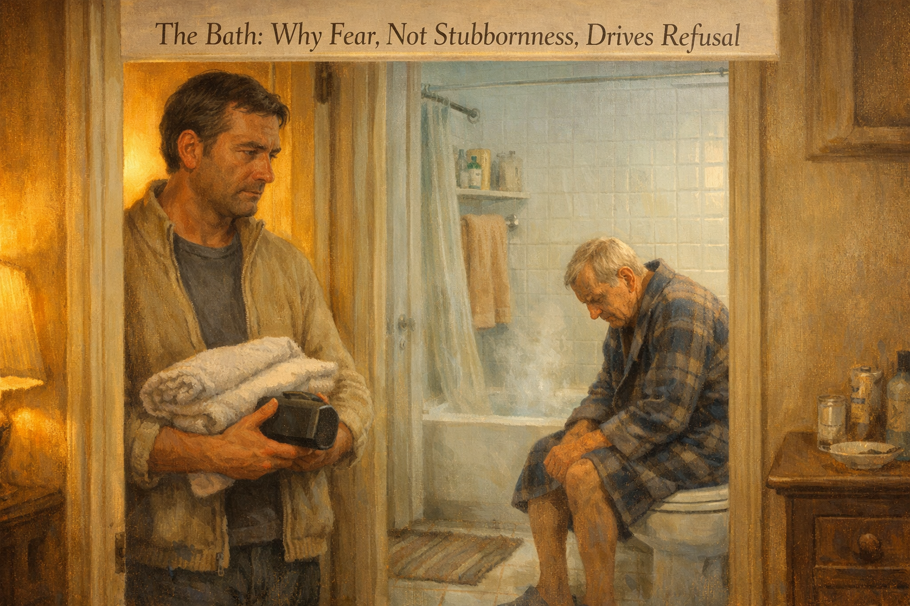 -->

Cover Image Prompt

Please generate a 16:9 image in warm, painterly contemporary realism depicting a small bathroom scene from the doorway. A man in his forties with short dark hair and tired eyes stands just outside the bathroom, holding a soft folded towel and a small portable speaker. Inside the bathroom, an older man in his late seventies with thinning gray hair sits on the edge of a closed toilet in a flannel robe, shoulders hunched, looking down at bright white tile. Steam rises gently from a filling tub. Warm yellow lamplight spills from the hallway; cool fluorescent light fills the bathroom. The color palette is soft cream, warm amber, pale gray-blue, and muted sage. The emotional tone is quiet, tender, and honest — showing both the fear of the older man and the patience the younger man is learning. Generate the image immediately without asking clarifying questions.

Narrative Prompt

This is a graphic novel for caregivers and family members of people living with dementia. The central character is James, a 44-year-old high-school teacher who has moved in with his 77-year-old father, Arthur, a retired mail carrier in the middle stage of Alzheimer's disease. Arthur showered every morning of his adult life, but now refuses to bathe. James first tries firmness ("Dad, it's time"), then pleading ("Please, for me"), then bribery ("You can have ice cream after"). Each attempt ends with Arthur frightened and James ashamed. The story should show, with care and specificity, why bathing becomes terrifying in dementia: cold tile, loud running water, a stranger's voice echoing off hard surfaces, fluorescent light, not knowing why you are being undressed, not recognizing the room, not recognizing the helper. It should show James learning to break the task down — first warming the room, then playing familiar music, then offering a choice of two washcloths, then explaining each step one second before it happens. The tone is warm, honest, and practical. James is flawed and learning. Arthur is confused but still a person with preferences and dignity. No shaming of caregivers who have tried firmness before. End with hope: not that bathing becomes easy, but that it becomes possible, most days. Include Alzheimer's Association 24/7 Helpline (1-800-272-3900). American English spelling throughout.

### Prologue – The Third Argument This Week

It is Thursday evening. James has been living with his father for six months. Arthur has not had a full bath or shower in eleven days. The house is starting to smell faintly like the back of a closet, and James is starting to smell like his own failure. Tonight he will try again. Tonight he will lose again. He does not yet know that losing is the first lesson.

<!-- 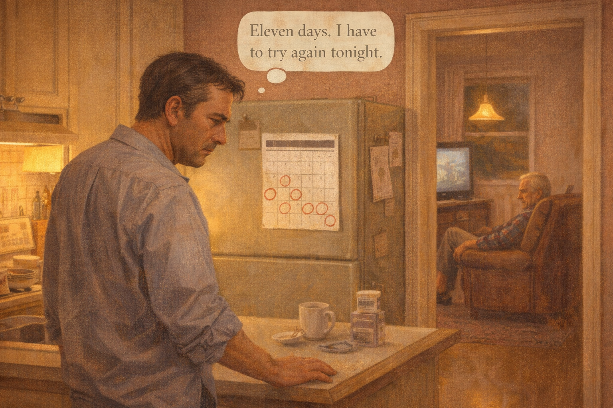 -->

Image Prompt

(This is panel 1. Do not put the panel number in the image.)
Please generate a 16:9 image in warm contemporary realism depicting the prologue scene. The scene shows a modest suburban kitchen at dusk. James, 44, dark hair, rumpled button-down shirt, stands at the kitchen counter looking at a calendar on the fridge where several days are circled in red marker. His shoulders are tense. In the background through a doorway, Arthur, 77, thinning gray hair, flannel shirt and slippers, sits in a worn armchair watching a muted television. The color palette is dusty rose, warm brown, pale cream, and soft amber from a pendant light. The emotional tone is weary and tender. Speech bubble from James (thinking): "Eleven days. I have to try again tonight." Generate the image immediately without asking clarifying questions.

James looked at the calendar and counted the red circles. Eleven days since the last full bath. He had tried everything he knew. He had tried being firm. He had tried being patient. He had tried bribing his father with vanilla ice cream and a ride to the hardware store. Each night he went to bed angry at a man who used to shave in three strokes and comb his hair with water from the tap.

## Panel 2 – The Firm Approach

<!-- 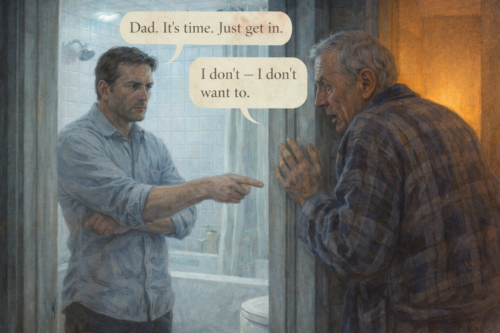 -->

Image Prompt

(This is panel 2. Do not put the panel number in the image.)
Please generate a 16:9 image in warm contemporary realism depicting a confrontation in a small bathroom doorway. James, 44, stands with arms folded, jaw tight, pointing toward the tub. Arthur, 77, in a faded blue flannel robe, stands half-turned away with his hand gripping the doorframe, eyes wide and fearful. Bright cool fluorescent light floods the bathroom; warm lamplight spills from the hallway behind Arthur. White tile walls reflect harshly. The color palette is stark white, cold blue-gray, and a single warm amber pool from the hallway. The emotional tone is tense and painful — a well-meaning son losing patience with his frightened father. Speech bubble from James: "Dad. It's time. Just get in." Speech bubble from Arthur: "I don't — I don't want to." Generate the image immediately without asking clarifying questions.

The first approach was the one James had grown up with. Firm. Clear. No nonsense. His father had used this voice on him a thousand times over homework and curfews, and it had always worked. So James tried it back. "Dad, it's time. Just get in." Arthur gripped the doorframe the way a child grips the edge of a pool, and James saw, for one awful second, that his father was afraid of him.

## Panel 3 – The Pleading

<!-- 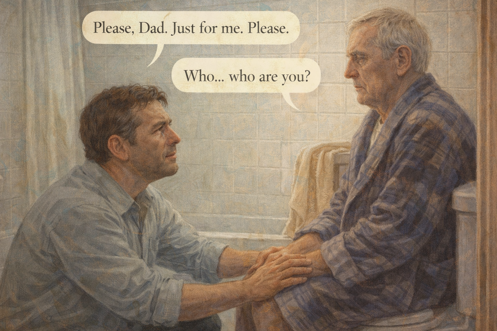 -->

Image Prompt

(This is panel 3. Do not put the panel number in the image.)
Please generate a 16:9 image in warm contemporary realism showing James kneeling in front of his father, who is sitting on the closed toilet lid in a small bathroom. James has both hands gently on his father's knees, his face pleading, close to tears. Arthur stares past him at the white tile wall, vacant and distant. A towel is draped over the tub. The color palette is muted sage, pale peach, and soft gray. The emotional tone is raw and vulnerable. Speech bubble from James: "Please, Dad. Just for me. Please." Speech bubble from Arthur: "Who... who are you?" Generate the image immediately without asking clarifying questions.

The second approach was pleading. James knelt on the bath mat with his palms on his father's knees and asked, please, just this once, for me. Arthur looked at him the way you look at a polite stranger asking for directions. "Who are you?" Arthur said. James said, "Dad, it's me. It's James." Arthur said, "Who?" James stood up and walked out and closed the bedroom door behind himself and cried into a dish towel so his father would not hear.

## Panel 4 – The Bribery

<!-- 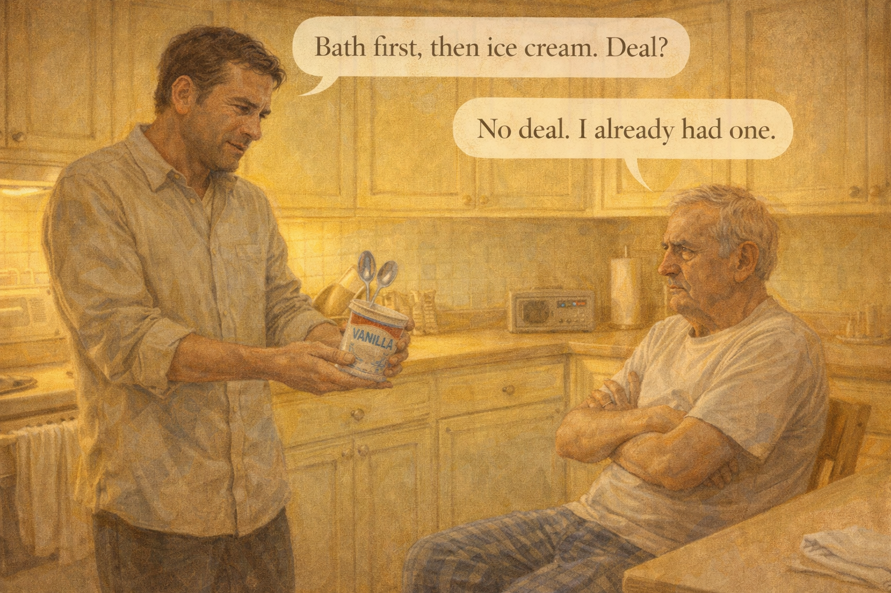 -->

Image Prompt

(This is panel 4. Do not put the panel number in the image.)
Please generate a 16:9 image in warm contemporary realism depicting a kitchen scene. James holds out a pint of vanilla ice cream hopefully, with two spoons in his hand. Arthur, in pajama pants and a t-shirt, sits at the kitchen table with his arms crossed, scowling like a child. A small portable radio plays on the counter. The color palette is buttercream, honey, and pale olive green. The emotional tone is almost comic but undercut by sadness. Speech bubble from James: "Bath first, then ice cream. Deal?" Speech bubble from Arthur: "No deal. I already had one." Generate the image immediately without asking clarifying questions.

The third approach was bribery. James produced the vanilla ice cream like a magician producing a rabbit. "Bath first, then ice cream. Deal?" Arthur said no deal, he had already had one, which was not true. James put the ice cream back. He sat on the kitchen floor with his back against the dishwasher and realized he was trying to negotiate with a man who no longer remembered that negotiations had beginnings and endings.

## Panel 5 – The Nurse's Question

<!-- 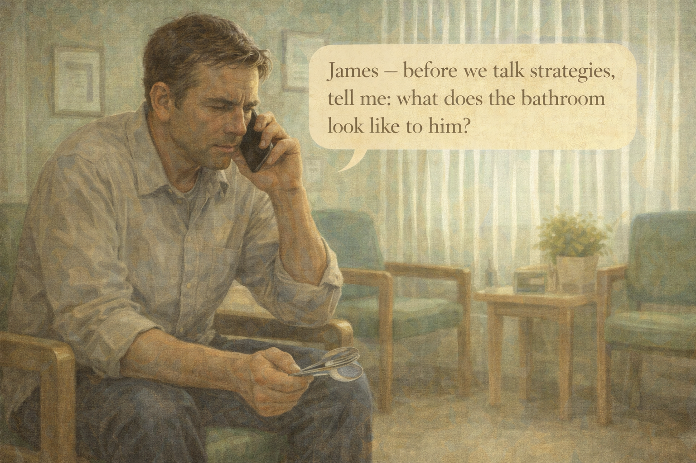 -->

Image Prompt

(This is panel 5. Do not put the panel number in the image.)
Please generate a 16:9 image in warm contemporary realism showing James sitting on a green vinyl chair in a medical clinic waiting area, phone pressed to his ear. He leans forward, elbow on knee, listening intently. Soft afternoon light comes through vertical blinds. The color palette is pale seafoam, warm wood, and soft cream. The emotional tone is tentative hope, the first crack of light. Speech bubble (from phone, small): "James — before we talk strategies, tell me: what does the bathroom look like to him?" Generate the image immediately without asking clarifying questions.

On Thursday James called the Alzheimer's Association helpline. The nurse on the line did not tell him what to do. She asked him a question instead. "Before we talk strategies," she said, "tell me what the bathroom looks like to him." James opened his mouth to answer and realized, sitting there in the clinic parking lot, that he had never once in six months asked that question.

## Panel 6 – Seeing the Bathroom

<!-- 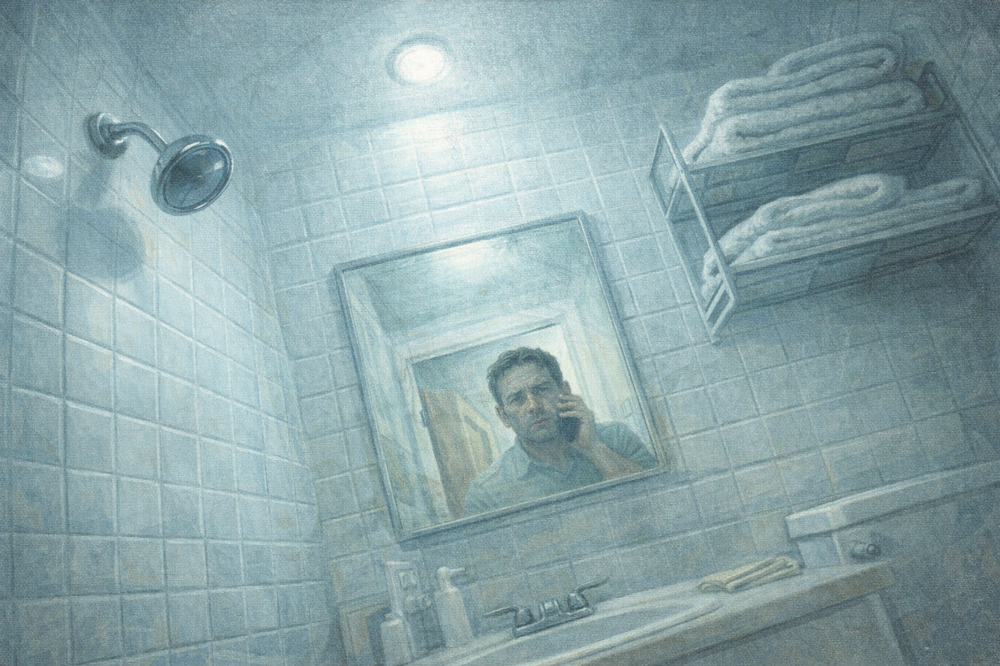 -->

Image Prompt

(This is panel 6. Do not put the panel number in the image.)
Please generate a 16:9 image in warm contemporary realism from a low angle inside a small bathroom, as if viewed by someone confused and afraid. White tile walls loom, a chrome showerhead gleams too brightly, a tiled floor appears to tilt, the mirror reflects a stranger's face. Cool fluorescent light flattens every shadow. A pile of folded towels on a shelf looks almost threatening in its strangeness. The color palette is bleached white, cold steel, and harsh cyan. The emotional tone is disorienting and frightening — the bathroom as seen by someone with dementia. No speech bubbles. Generate the image immediately without asking clarifying questions.

James walked into the bathroom that night and tried to see it the way his father might. The tile was white and cold. The light was blue-white and loud. A chrome showerhead glinted like a small, unfriendly eye. The mirror held a stranger with gray stubble. The floor, under bare feet, would feel like ice. He stood there for a long time and understood, for the first time, that the room itself was the problem.

## Panel 7 – Warming the Room

<!-- 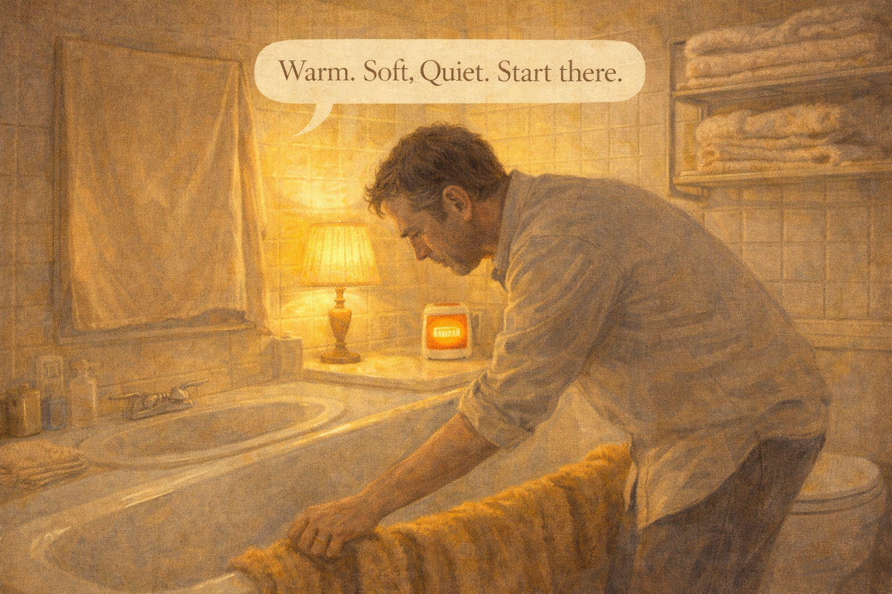 -->

Image Prompt

(This is panel 7. Do not put the panel number in the image.)
Please generate a 16:9 image in warm contemporary realism showing James preparing the bathroom. He has turned off the overhead fluorescent light and plugged in a small warm-toned table lamp on the counter. A space heater glows softly in the corner. He has draped large warm towels over the edge of the tub. The mirror is covered with a cloth. The color palette shifts to warm amber, soft gold, and cream — the same bathroom, transformed. The emotional tone is gentle and careful. James is concentrating, like someone laying out a safe place. Speech bubble from James (small, to himself): "Warm. Soft. Quiet. Start there." Generate the image immediately without asking clarifying questions.

On Friday evening, James prepared the room before he said a word to his father. He turned off the overhead light and plugged in a small lamp. He put a space heater in the corner and let the room come up to seventy-eight degrees. He covered the mirror with a pillowcase because his father sometimes argued with the old man he saw there. He draped towels warm from the dryer over the tub. Then he went to get his dad.

## Panel 8 – Familiar Music

<!-- 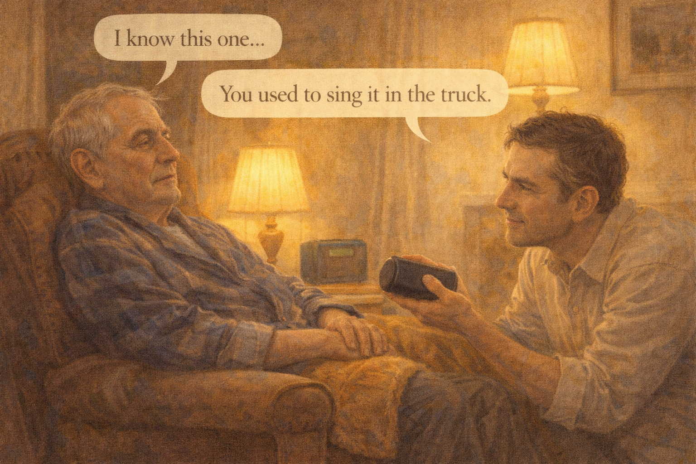 -->

Image Prompt

(This is panel 8. Do not put the panel number in the image.)
Please generate a 16:9 image in warm contemporary realism showing Arthur sitting in his armchair in the living room, head tilted slightly, listening. James kneels beside him holding a small portable speaker playing a country-western song from the 1960s. Arthur's eyes are soft, unfocused but peaceful — recognizing something old. The color palette is warm honey, deep brown, and soft amber from floor lamps. The emotional tone is quietly moving, a door opening. Speech bubble from Arthur: "I know this one..." Speech bubble from James (gentle): "You used to sing it in the truck." Generate the image immediately without asking clarifying questions.

James brought the portable speaker to his father's armchair and played the song his mother had played every Saturday morning for forty years. A steel guitar. A lonesome voice. Arthur tilted his head. "I know this one," he said. James said, "You used to sing it in the truck." His father did not remember the truck, but his foot tapped. When James held out his hand, Arthur took it, and they walked down the hall together to the warm room.

## Panel 9 – Two Washcloths

<!-- 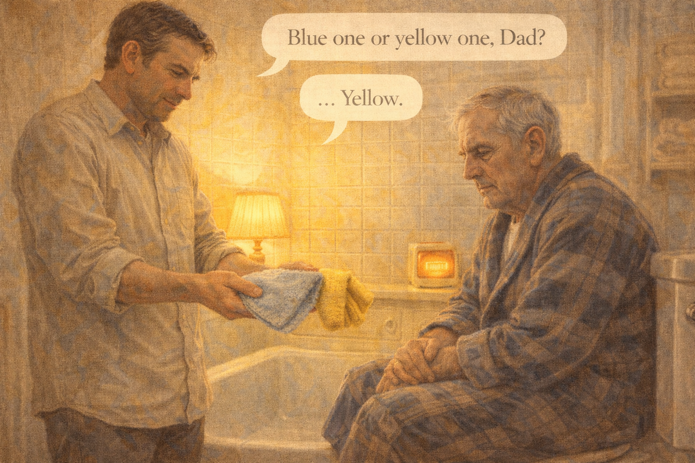 -->

Image Prompt

(This is panel 9. Do not put the panel number in the image.)
Please generate a 16:9 image in warm contemporary realism showing James holding out two folded washcloths toward his father — one pale blue, one soft yellow. Arthur sits on the closed toilet lid in his robe, studying the washcloths with concentration, as if the choice matters. The warm lamp in the corner casts a honey glow. The space heater hums quietly. The color palette is cream, pale blue, buttercup yellow, and soft wood tone. The emotional tone is intimate and respectful — a father being offered a choice. Speech bubble from James (warm, calm): "Blue one or yellow one, Dad?" Speech bubble from Arthur (thoughtful): "...Yellow." Generate the image immediately without asking clarifying questions.

In the warm bathroom James did not say "time for your bath." He said, "Blue one or yellow one, Dad?" and held up two washcloths. Arthur studied them with the seriousness of a man choosing a tie for a wedding. "Yellow," he said. James nodded. "Good choice." The choice was small and it was real, and giving it to his father was the first thing James did that night that wasn't an argument.

## Panel 10 – One Step at a Time

<!-- 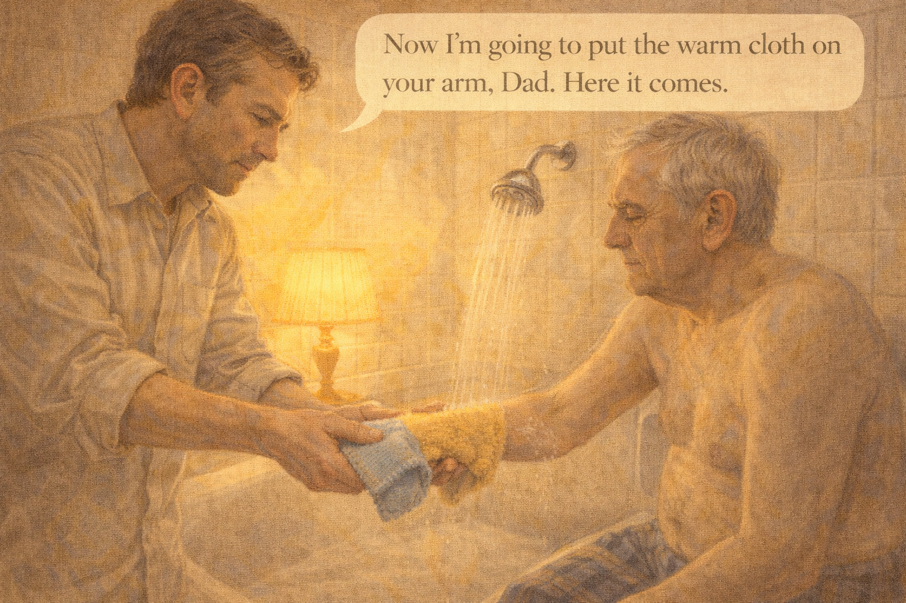 -->

Image Prompt

(This is panel 10. Do not put the panel number in the image.)
Please generate a 16:9 image in warm contemporary realism showing James carefully guiding his father's hand toward the warm washcloth, which is held under a gentle stream of warm water. Arthur is partially undressed — shirt off, pajama pants still on — sitting on a plastic shower chair in the tub. The lighting is soft amber, steam rises gently. James narrates each step before doing it. The color palette is warm peach, soft gold, and creamy white. The emotional tone is patient, methodical, reverent. Speech bubble from James (soft, one step ahead): "Now I'm going to put the warm cloth on your arm, Dad. Here it comes." Generate the image immediately without asking clarifying questions.

James had read that you should say each step one second before you did it. So he did. "I'm going to wet the cloth now, Dad. Now I'm going to put it on your arm. It's warm." Arthur flinched once when the water changed temperature, and James stopped and waited and said, "I know. Let's give it a second." His father breathed out. The bathroom, for the first time in weeks, was not a place where anything bad was happening.

## Panel 11 – Not a Full Shower

<!-- 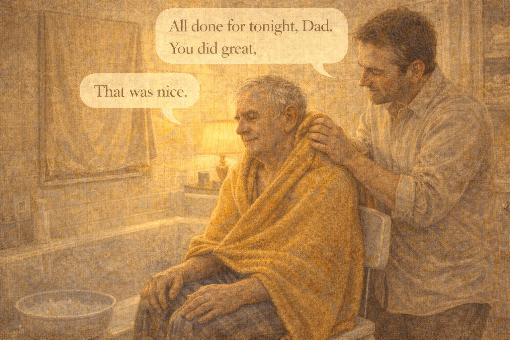 -->

Image Prompt

(This is panel 11. Do not put the panel number in the image.)
Please generate a 16:9 image in warm contemporary realism showing Arthur wrapped in a large warm towel, seated on the shower chair, while James gently dries his father's shoulders with a second towel. A basin of soapy water sits on the floor. The mirror is still covered. The music still plays softly. Arthur's face is calm, almost sleepy. The color palette is soft cream, warm taupe, and honey. The emotional tone is tender triumph — not a full shower, but clean enough, and peaceful. Speech bubble from James (gentle): "All done for tonight, Dad. You did great." Speech bubble from Arthur (quiet, warm): "That was nice." Generate the image immediately without asking clarifying questions.

It was not a full shower. It was a warm washcloth and a basin of soapy water and a second basin of clean warm water for rinsing, and twenty minutes, and one song played twice. But it was enough. Arthur was clean where it mattered. He was warm. He was not afraid. When James said, "All done for tonight, Dad, you did great," Arthur looked up and said, quietly, "That was nice."

## Panel 12 – The Phone Call to His Sister

<!-- 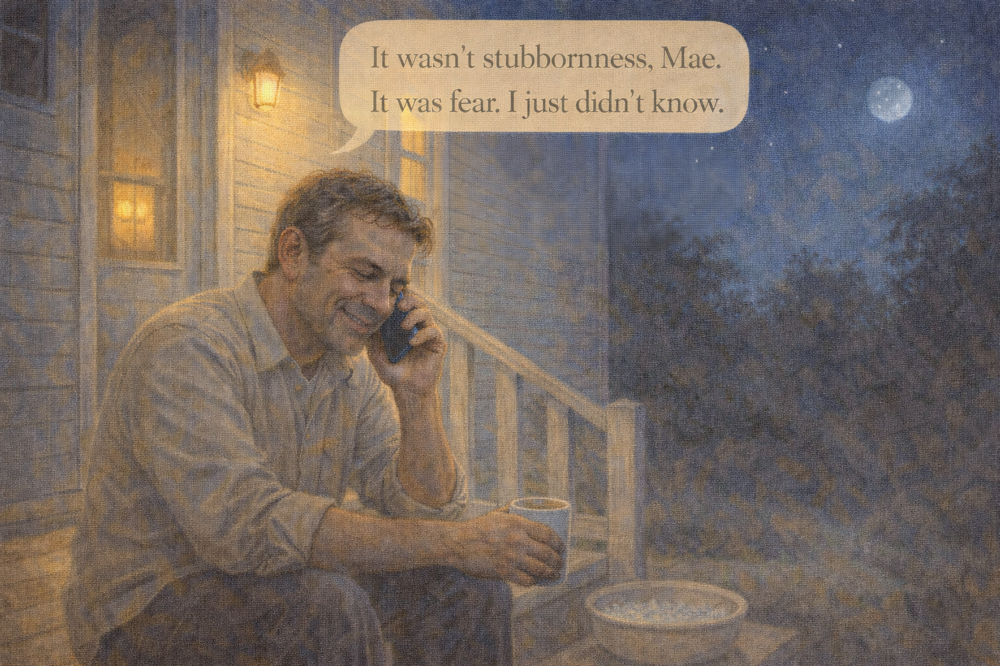 -->

Image Prompt

(This is panel 12. Do not put the panel number in the image.)
Please generate a 16:9 image in warm contemporary realism depicting James sitting on the back porch steps of a small house, phone pressed to his ear, mug of tea beside him, night sky with a few stars above. His shoulders have dropped; there is a small, exhausted smile on his face. The color palette is deep blue-indigo, warm yellow porch-light glow, and soft silver from the moon. The emotional tone is hopeful relief — he has learned something he will not forget. Speech bubble from James (quiet, to phone): "It wasn't stubbornness, Mae. It was fear. I just didn't know." Generate the image immediately without asking clarifying questions.

Later, on the back porch, James called his sister. "It wasn't stubbornness, Mae," he said. "It was fear. I just didn't know." She was quiet for a long time. Then she said, "So what do we do tomorrow?" And James, who had spent six months angry at a man who was only scared, said, "We do it again. Smaller. Slower. Warmer. And if tomorrow is bad, we try Saturday."

### Epilogue – What James Learned

| Challenge | How James Responded | Lesson for Caregivers |
|-----------|---------------------|----------------------|
| Father refused to bathe | First tried firmness, pleading, bribery — all failed | Refusal is almost always fear, not defiance |
| Bathroom felt hostile | Warmed the room, softened the light, covered the mirror | The environment is half the problem — fix it first |
| Task felt overwhelming | Broke it into a washcloth and a basin, not a full shower | Smaller is not failure — smaller is possible |
| Father felt no control | Offered choice between two washcloths | A small real choice restores dignity |
| Father startled at each step | Narrated every step one second before doing it | Predictability lowers fear |
| Father didn't recognize James | Played a song from his father's twenties | Familiar music reaches where words can't |

### A Note to Readers

If a loved one refuses to bathe, try this: **warm the room first**, soften the light, cover the mirror, play music from their young adulthood, offer a small choice, narrate one step at a time, and accept a washcloth bath when a shower is too much. A sponge bath three times a week is clean enough. No one has ever been harmed by missing a shower. Many people have been harmed by being forced into one.

The Alzheimer's Association 24/7 Helpline (**1-800-272-3900**) has nurses who will talk through bathing refusal with you, for free, at two in the morning if that is when you need them.

---

*"For a long time I thought my father was being stubborn. It turned out he was being human in a room that had stopped feeling human to him."*
—James, caregiver

*"Refusal is a word. Fear is a feeling. Always listen for the feeling underneath the word."*
—Dementia care nurse

*"A warm towel is not a small thing. Sometimes it is the whole thing."*
—Caregiver support group

---

## References

1. [Bathing – Alzheimer's Association](https://www.alz.org/help-support/caregiving/daily-care/bathing) - Practical, step-by-step caregiver guidance on bathing someone with dementia.
2. [Dementia Care Practice Recommendations](https://www.alz.org/professionals/professional-providers/dementia_care_practice_recommendations) - Evidence-based practices, including person-centered care during activities of daily living.
3. [Hygiene: Dementia and Bathing – National Institute on Aging](https://www.nia.nih.gov/health/dementia/bathing-dressing-grooming-and-alzheimers) - Federal guidance on grooming, dressing, and bathing in dementia.
4. [Activities of Daily Living – Wikipedia](https://en.wikipedia.org/wiki/Activities_of_daily_living) - Background on ADL assessment and the role of bathing as a clinical marker.
5. [Person-Centered Care – Wikipedia](https://en.wikipedia.org/wiki/Person-centred_care) - Overview of the framework that underlies modern dementia bathing practice.
