# The Car Keys on the Counter

*Taking the keys without taking dignity*

<!-- 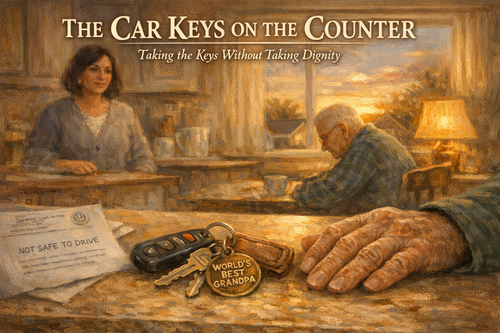 -->

Cover Image Prompt

Please generate a 16:9 cover image in warm painterly American contemporary realism — soft oil-painting brushwork with visible but refined strokes; muted warm palette of sage green, dusty lavender, cream, honey gold, rose pink, and walnut brown; warm golden afternoon window light as the key and honey-gold interior lamp glow as fill; soft low-contrast shadows; fabric textures (knit, flannel, cotton, lace) clearly visible; in the Rockwell-and-Kinkade tradition of tender domestic illustration. No saturated primaries, no neon, no photorealism, no vector flatness, no film grain, no chromatic aberration. Night scenes keep the same warm vocabulary — indigo and deep walnut in place of saturated cool blue, with honey-gold porch or lamp light as warm accent.

**Title treatment (top ~15% of frame):** Across the top of the image, centered horizontally, render the main title "THE CAR KEYS ON THE COUNTER" in a warm ivory/cream humanist serif — the kind of hand-set lettering you would see on a classic illustrated-novel cover — with a soft painterly drop-shadow so the text integrates into the scene below, never a hard graphic bar. Directly beneath the title, in a smaller italic of the same serif, render the subtitle "Taking the Keys Without Taking Dignity". The lettering should feel as if the painter lettered it themselves, in the same brush vocabulary as the painting.

**Scene:** A close-up of a kitchen counter at golden hour. In the center rests a set of car keys on a worn leather keychain — a house key, a car key, and a small round WORLD'S BEST GRANDPA charm. A weathered, age-spotted man's hand (Ray, 76, seen only as hand and dark-green flannel sleeve) rests lightly beside them in the lower-right of the frame. To the left of the keys, a folded doctor's note on medical letterhead is partly visible, with the words "NOT SAFE TO DRIVE" just readable. In the softly-blurred background: Linda, 48, medium-olive skin, dark hair in a bob, soft gray sweater, stands behind the kitchen island looking toward her father with compassion. Ray's full figure sits at the kitchen table, head slightly lowered but dignified. A warm window behind shows a sunset over suburban rooftops.

**Emotional tone:** the weight of a door closing, and the love in the room that stays open.

Generate the image immediately without asking clarifying questions.

## Narrative Prompt

This is a fictional composite story built from the experience of thousands of families who have faced the driving conversation. Linda and Ray are invented characters, but every moment here — the familiar route, the panicked phone call, the rehearsed lines, the doctor as the "bad cop" — is drawn from the real, hard reality of helping a parent stop driving. The story teaches one clear skill: who should deliver the news, and how. Art style: contemporary photorealistic illustration, warm intimate domestic tone, present-day suburban America.

## Prologue

For many families, the driving conversation is the hardest conversation. Driving is not just transportation — it is independence, identity, the right to come and go. For a parent who has driven for sixty years, the thought of handing over the keys can feel like being asked to hand over a version of themselves. And for the adult child who has to ask, it can feel like a betrayal. But waiting too long can cost someone their life. This is the story of how one family walked through that door — without breaking it.

---

## Panel 1: Thirty Years of the Same Route

<!-- 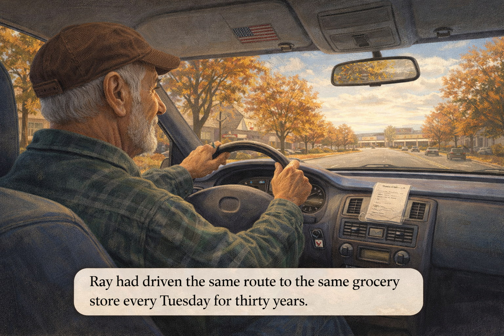 -->

Image Prompt

(This is panel 1. Do not put the panel number in the image.)

Contemporary photorealistic illustration, 16:9 wide-landscape format. **Ray** (76, medium tan skin weathered from years outdoors, short gray-white hair, a trimmed silver beard, wearing a dark green flannel shirt and a brown corduroy cap) sits at the wheel of a well-maintained 15-year-old blue sedan. He drives along a familiar suburban street with maple trees on both sides in early fall. His expression is calm, content, one hand on the wheel, the other tapping the beat of an oldies song on the steering wheel. Through the windshield we can see the grocery store where he is headed in the distance. On the dashboard: a folded shopping list, a small American flag pin on the sun visor. Color palette: warm autumn golds, rust-colored leaves, sky blue through the windshield, the muted blue of the car's interior. Emotional tone: an ordinary routine of a lifetime.

**Speech bubble 1** — a narrative caption at the bottom of the panel: "Ray had driven the same route to the same grocery store every Tuesday for thirty years."

*(No character speech bubbles in this panel.)*

Generate the image immediately without asking clarifying questions.

**Narrative:** Ray Whitaker had driven the same route to the same grocery store every Tuesday for thirty years. Three miles down Elm Avenue, left at the light, two blocks past the library, into the lot behind the Publix. He knew every crack in the asphalt. He could have driven it in his sleep. He did, sometimes, with his foot on the pedal and his mind on a song from 1971. He was seventy-six years old, and driving was not just a skill. It was a piece of who he was.

---

## Panel 2: The Day the Route Broke

<!-- 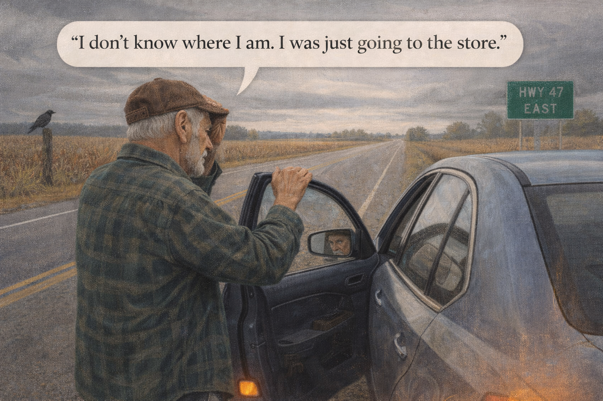 -->

Image Prompt

(This is panel 2. Do not put the panel number in the image.)

Contemporary photorealistic illustration, 16:9 wide-landscape format. A wide highway shoulder on a rural stretch of road, overcast gray afternoon, three counties from town. **Ray's** blue sedan is pulled over haphazardly onto the gravel shoulder, hazard lights blinking (small orange glow from the back). **Ray** is outside the car, standing beside the open driver's door, one hand on top of the car door, the other hand to his forehead. He looks small, bewildered, disoriented — not frightened yet, more lost. His brown corduroy cap is slightly askew. His reflection in the side mirror shows an anxious face. Behind the car, a stretch of cornfield in autumn stubble. A large green highway sign in the distance reads "HWY 47 — EAST." A crow on a fencepost. Color palette: muted grays, dusty browns, a faded blue car, the single blinking orange of the hazard lights. Emotional tone: geography has failed him; the world has become unfamiliar.

**Speech bubble 1** — tail pointing to **Ray**, positioned above him, quiet and confused: "I don't know where I am. I was just going to the store."

Generate the image immediately without asking clarifying questions.

**Narrative:** On a Tuesday afternoon in October, the route broke. Ray left the house at 10:15 to pick up bananas and bread. At 2:47 PM a state trooper found him standing next to his car on the shoulder of Highway 47, three counties east of town, a cornfield on one side and a cow pasture on the other. Ray could tell the trooper his name. He could tell him his wife's name, even though she had been gone for four years. But he could not tell him how he had gotten there, or how to get home.

---

## Panel 3: Linda Gets the Call

<!-- 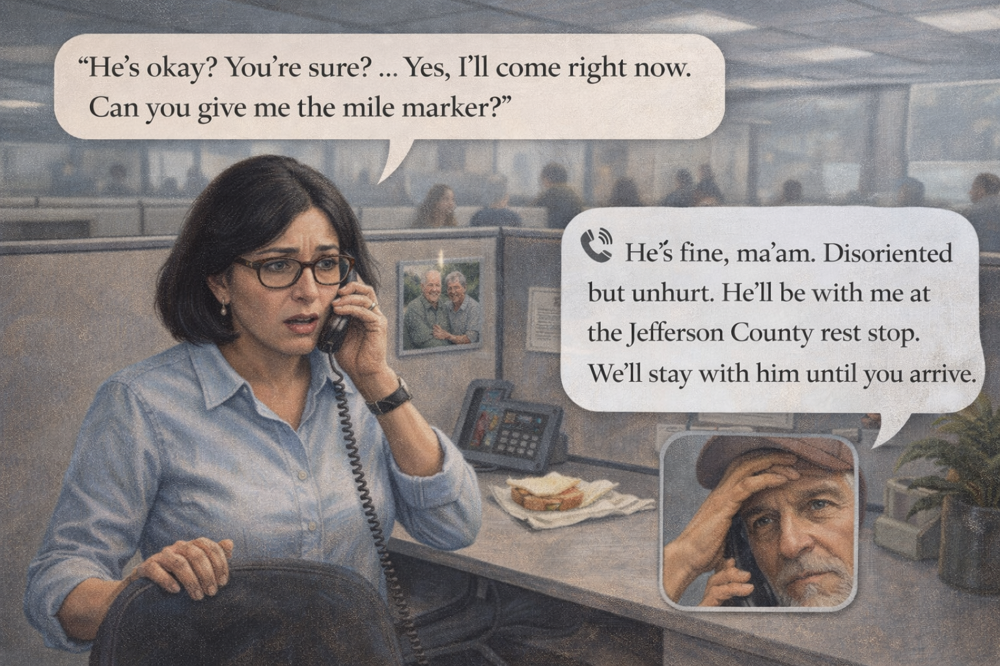 -->

Image Prompt

(This is panel 3. Do not put the panel number in the image.)

Contemporary photorealistic illustration, 16:9 wide-landscape format. Interior of a tidy office cubicle, late afternoon. **Linda** (48, medium-olive skin, dark hair in a shoulder-length bob, tortoise glasses, pale blue button-down, small silver earrings) stands at her desk, phone pressed hard to her ear, the other hand gripping the back of her office chair. Her expression has gone pale; her eyes are wide with fear. A half-eaten sandwich is on her desk. On the corkboard behind her: a family photo of her and Ray at a backyard barbecue. Office fluorescent light is flat and cool. Other cubicles are blurred around her, colleagues carrying on unaware. Color palette: cool office blues and grays, her warm skin tones, the soft brown of the framed photo behind her. Emotional tone: the moment the floor drops out beneath a working day.

**Speech bubble 1** — tail pointing to **Linda**, positioned above her, tight and shaky: "He's okay? You're sure? ...Yes, I'll come right now. Can you give me the mile marker?"

**Speech bubble 2** — a phone-style speech bubble (with small phone icon) on the right, representing the state trooper, calm and kind: "He's fine, ma'am. Disoriented but unhurt. He'll be with me at the Jefferson County rest stop. We'll stay with him until you arrive."

Generate the image immediately without asking clarifying questions.

**Narrative:** Linda was at her desk at 2:58 PM when her phone rang with an unknown number. A state trooper named Sergeant Ramos was on the line. "Your father is okay, ma'am. He's not hurt. But he's a long way from home and he's pretty confused." Linda heard her own voice crack as she wrote down the mile marker. She grabbed her keys and her purse and ran past her startled manager with a one-sentence "family emergency." On the highway, her hands shook on the steering wheel. She drove too fast and then too slow. She prayed to a god she had not prayed to in a long time.

---

## Panel 4: The Rest Stop

<!-- 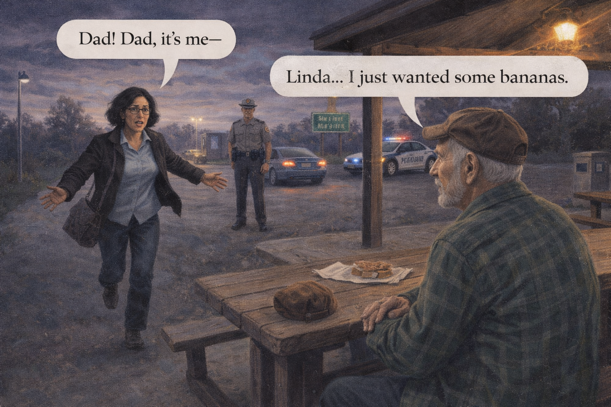 -->

Image Prompt

(This is panel 4. Do not put the panel number in the image.)

Contemporary photorealistic illustration, 16:9 wide-landscape format. A highway rest stop at dusk. **Ray** sits on a wooden picnic bench under a small pavilion, his hands clasped in his lap, his green flannel shoulders slumped, his brown corduroy cap on the bench beside him. He looks tired and relieved, but also something else — there is a new shadow behind his eyes, the shadow of knowing that something is wrong. A polite, compassionate **state trooper** (40s, neat uniform, kind face) stands a few feet away, giving him space while still watching over him. **Linda** is running into the frame from the LEFT, arms wide, a pure-love expression on her face — she has spotted her father. Her jacket is half-unzipped, her purse bouncing. In the background: Ray's blue sedan parked next to the trooper's patrol car. Picnic tables, a soda machine, a concrete restroom block. Lamppost light is just coming on. Color palette: dusky purples and grays, the warm glow of a single safety light, the red and blue accents of the patrol car. Emotional tone: relief, fear, love, all pouring in at once.

**Speech bubble 1** — tail pointing to **Linda** (running in from left), positioned above her, a quiet cry: "Dad! Dad, it's me —"

**Speech bubble 2** — tail pointing to **Ray** (on bench), positioned above him, small and ashamed: "Linda... I just wanted some bananas."

Generate the image immediately without asking clarifying questions.

**Narrative:** Linda found him at a highway rest stop at 5:42 PM, sitting on a picnic bench in the fading light. The trooper had bought him a bottle of water and a pack of peanut butter crackers. Ray looked up when she called his name, and his face did something she had never seen it do. He looked lost. "Linda," he said. "I just wanted some bananas." She held her father the way she had held her first child home from the hospital — like he was small, and precious, and dangerously fragile.

---

## Panel 5: The Silent Drive Home

<!-- 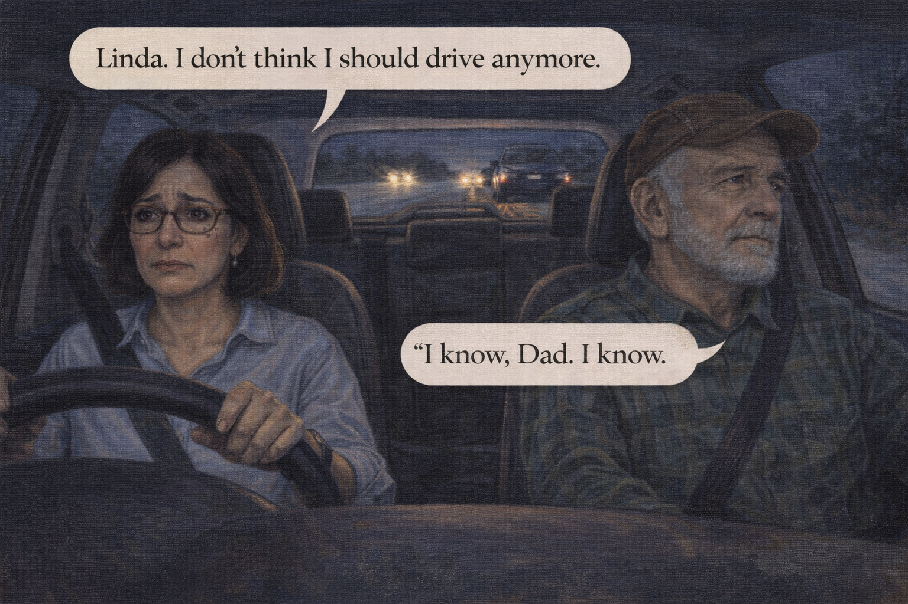 -->

Image Prompt

(This is panel 5. Do not put the panel number in the image.)

Contemporary photorealistic illustration, 16:9 wide-landscape format. Interior shot of Linda's own car (a small silver SUV, different from Ray's blue sedan) at night, driving home on a dark two-lane highway. **Linda** is behind the wheel in the CENTER-LEFT of the frame, both hands on the steering wheel, her face lit only by the amber glow of the dashboard and the occasional flash of headlights from oncoming traffic. Tears have dried on her cheeks but her eyes are red. **Ray** is in the passenger seat on the RIGHT, his green-flanneled shoulders slumped, looking out the side window at the dark countryside. Neither of them is speaking. Through the rear window, the silhouette of his blue sedan being towed on a flatbed truck far behind them. The radio is off. Color palette: deep indigo night, the warm amber of dashboard lights, the occasional wash of white from oncoming headlights. Emotional tone: the long silence between two people who both know something has just ended.

**Speech bubble 1** — tail pointing to **Ray** (right, passenger seat), positioned above him, very small, after a long pause: "Linda. I don't think I should drive anymore."

**Speech bubble 2** — tail pointing to **Linda** (left, behind wheel), positioned above her, a quiet reply through tears: "I know, Dad. I know."

Generate the image immediately without asking clarifying questions.

**Narrative:** The drive home was nearly silent. Ray's blue sedan rode home on a flatbed tow truck behind them. Neither of them turned on the radio. Somewhere around the last exit before town, in a voice so small she almost missed it, Ray said, "Linda. I don't think I should drive anymore." She could hear how much the sentence had cost him. "I know, Dad," she whispered back. "I know." They both cried quietly, without ever looking at each other, the way people cry when the grief is shared and the words are already enough.

---

## Panel 6: Morning-After Regret

<!-- 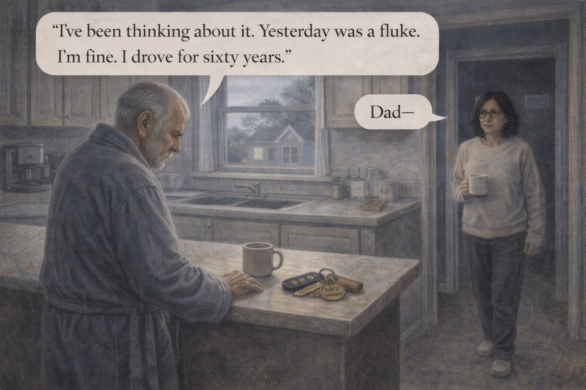 -->

Image Prompt

(This is panel 6. Do not put the panel number in the image.)

Contemporary photorealistic illustration, 16:9 wide-landscape format. Morning in Ray's kitchen. **Ray** stands at the counter in his bathrobe and slippers, staring at the **set of car keys on the counter** (leather keychain, "WORLD'S BEST GRANDPA" charm visible). His posture is rigid; his face is closed. Overnight he has reconsidered. The light is cold morning gray through the window. A cooling cup of coffee beside him. On the RIGHT side of the frame, **Linda** has just come downstairs — she is in a sweater and sweatpants, her hair unbrushed, a mug of coffee in hand, and she has paused in the doorway, reading her father's body language. Her heart is sinking. Color palette: cool gray-blues of overcast morning, pale creams, a single warm point of color from the leather keychain. Emotional tone: the walk-back, when the raw grief of last night becomes the anger of today.

**Speech bubble 1** — tail pointing to **Ray** (left, at counter), positioned above him, hard-edged and defensive: "I've been thinking about it. Yesterday was a fluke. I'm fine. I drove for sixty years."

**Speech bubble 2** — tail pointing to **Linda** (right, in doorway), positioned above her, small: "Dad —"

Generate the image immediately without asking clarifying questions.

**Narrative:** By Wednesday morning, Ray had walked it back. The man who had said *"I don't think I should drive anymore"* in the dark car was not the same man standing in the kitchen in slippers, staring at his keys. "Linda. I've been thinking. Yesterday was a fluke. I've driven for sixty years. I'm fine." Linda's heart sank. She had read that this would happen. She had not quite believed it would happen to them. Her father was not being stubborn — he was being human. Losing the keys meant losing a story he had told about himself for six decades.

---

## Panel 7: The Failed Daughter-Speech

<!-- 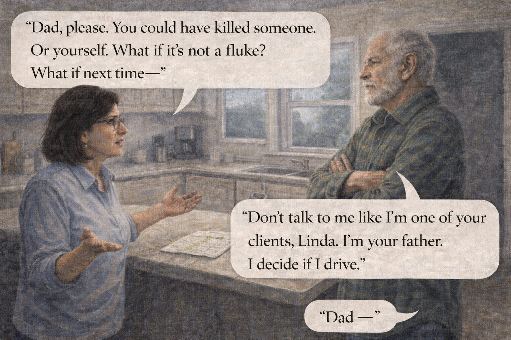 -->

Image Prompt

(This is panel 7. Do not put the panel number in the image.)

Contemporary photorealistic illustration, 16:9 wide-landscape format. Kitchen scene mid-morning. **Linda** stands on the LEFT at the kitchen island, hands wide in a pleading gesture, her face earnest and a little desperate, a printed MapQuest-style page with a highlighted route spread on the island between them. **Ray** stands on the RIGHT, arms crossed, chin tilted up, face set. He is not yelling — he is closed. He is a man who has been told how to behave and has decided he will not be. On the counter behind him, the car keys are still visible. Color palette: warm cream walls, the harder cool light of morning, blue undertones on Ray's face, warmer tones on Linda's. Emotional tone: a daughter rehearsing a script that will not land, and a father who feels corrected by his own child.

**Speech bubble 1** — tail pointing to **Linda** (left), positioned above her, earnest: "Dad, please. You could have killed someone. Or yourself. What if it's not a fluke? What if next time —"

**Speech bubble 2** — tail pointing to **Ray** (right, arms crossed), positioned above him, flat and hurt: "Don't talk to me like I'm one of your clients, Linda. I'm your father. I decide if I drive."

Generate the image immediately without asking clarifying questions.

**Narrative:** Linda tried the talk she had rehearsed on the drive home. She laid out the facts — the three counties, the cornfield, the trooper. She said the words *"you could have killed someone."* She saw her father's face close like a garage door. "Don't talk to me like I'm one of your clients, Linda. I'm your father. I decide if I drive." The sentence stopped her cold. She understood, too late, that the louder she argued, the harder he would hold on. This was not a conversation he could accept from a daughter. She needed a different voice in the room.

---

## Panel 8: The Bathroom Phone Call

<!-- 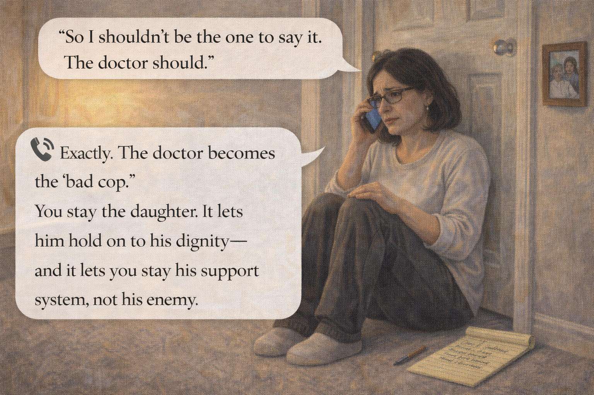 -->

Image Prompt

(This is panel 8. Do not put the panel number in the image.)

Contemporary photorealistic illustration, 16:9 wide-landscape format. Upstairs hallway of Ray's modest house. **Linda** sits on the floor with her back against a closed bathroom door, her knees up, phone to her ear, a yellow legal pad and pen on the floor beside her. Her face is tired and tear-streaked but clear-eyed — she is listening hard. Her notepad has fresh bullet points being written: *"1. Don't be the bad cop"* / *"2. Call Dr. Patel's office"* / *"3. DMV re-test request"* / *"4. Ride-share options"*. The hallway carpet is soft beige, a small framed photo of teenage Linda with her father on the wall beside her. Color palette: warm beiges, soft amber lamp glow, the cool gray of the phone screen, the yellow of the legal pad. Emotional tone: clarity arriving in the middle of exhaustion.

**Speech bubble 1** — tail pointing to **Linda** (on floor), positioned above her, quiet and focused: "So I shouldn't be the one to say it. The doctor should."

**Speech bubble 2** — a phone-style speech bubble on the right, representing the helpline counselor, warm and clear: "Exactly. The doctor becomes the 'bad cop.' You stay the daughter. It lets him hold on to his dignity — and it lets you stay his support system, not his enemy."

Generate the image immediately without asking clarifying questions.

**Narrative:** Linda called the Alzheimer's Association 24/7 helpline from the upstairs hallway. The counselor was named Denise. She had heard this story a thousand times. She gave Linda a gift that Linda did not yet know how to value. "You should not be the one to take the keys," Denise said. "The doctor should. Let the doctor be the 'bad cop.' You stay the daughter. You stay the one who drives him to the appointment. You stay the one who loves him — not the one who took something from him." Linda wrote it down on the legal pad. She underlined *the doctor*.

---

## Panel 9: The Doctor's Office

<!-- 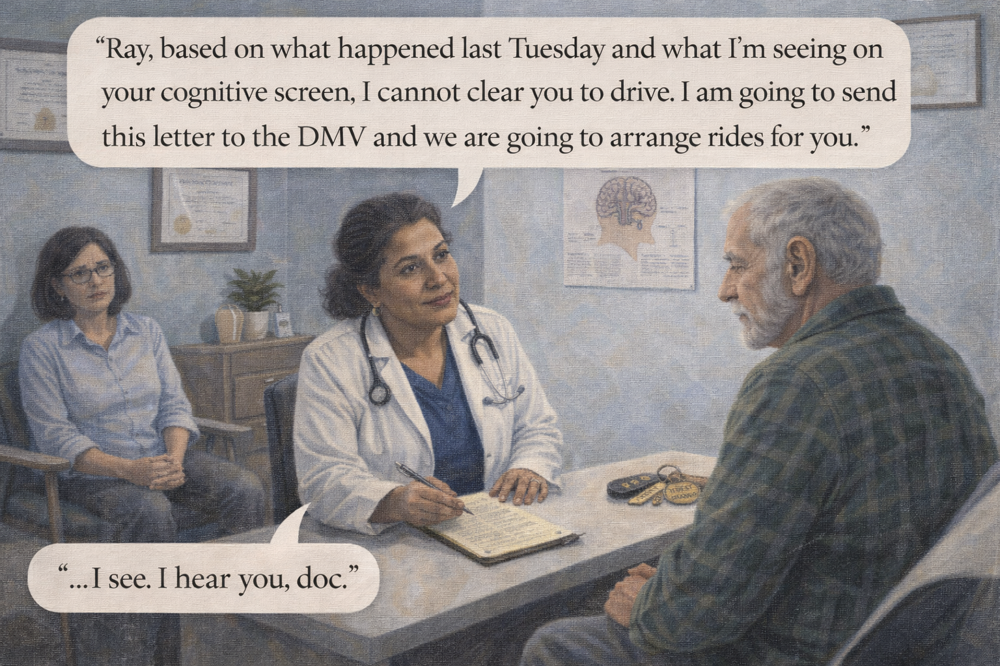 -->

Image Prompt

(This is panel 9. Do not put the panel number in the image.)

Contemporary photorealistic illustration, 16:9 wide-landscape format. Modern clinic exam room. **Dr. Patel** (50s, warm brown skin, salt-and-pepper hair, white coat, a stethoscope, a kind face) sits on a rolling stool facing **Ray**, who is on the exam table in his green flannel shirt. Dr. Patel is leaning slightly forward, a clipboard on her knee, speaking with firm gentleness. **Linda** is in a chair in the corner on the LEFT, present but quiet, her hands folded in her lap — just the daughter, just the support. A diploma on the wall; a diagram of the brain; a small potted plant. Color palette: soft professional blues, cream walls, warm accents. Emotional tone: a hard truth delivered with love by the right messenger.

**Speech bubble 1** — tail pointing to **Dr. Patel**, positioned above her, firm but warm: "Ray, based on what happened last Tuesday and what I'm seeing on your cognitive screen, I cannot clear you to drive. I am going to send this letter to the DMV and we are going to arrange rides for you."

**Speech bubble 2** — tail pointing to **Ray**, positioned above him, heavy but not angry: "...I see. I hear you, doc."

Generate the image immediately without asking clarifying questions.

**Narrative:** Dr. Patel had been Ray's primary care doctor for twelve years. She did not lecture him. She showed him the results of a short cognitive screen and the record of the incident at the rest stop. Then she said, clearly: "Ray, I cannot clear you to drive anymore. I am going to write to the state DMV to request a re-test, and I am going to ask that we find you other ways to get around." Ray was quiet for a long time. He was not angry at Dr. Patel. She had earned twelve years of trust. "I hear you, doc," he said. And when he walked out, Linda was the daughter who had been sitting quietly in the chair — not the one who had taken anything.

---

## Panel 10: The Keys on the Counter

<!-- 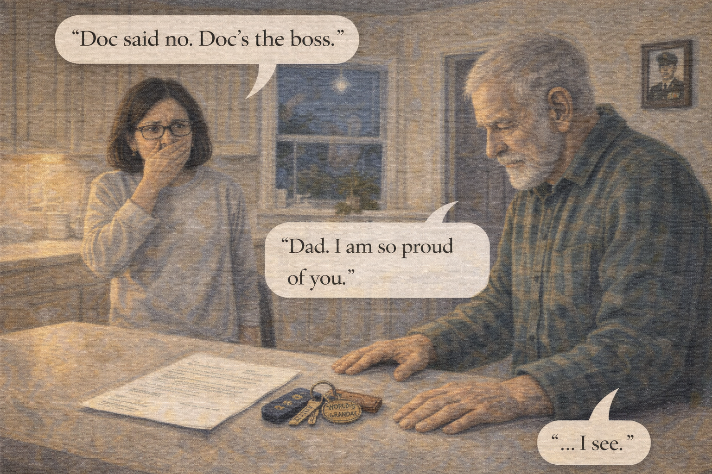 -->

Image Prompt

(This is panel 10. Do not put the panel number in the image.)

Contemporary photorealistic illustration, 16:9 wide-landscape format. Close-up domestic scene at Ray's kitchen counter, early evening. **Ray** (green flannel, weary but composed) is placing his **set of car keys on a leather keychain** onto the kitchen counter in a deliberate, almost ceremonial way. One of his hands rests open on the counter after setting them down. His head is slightly bowed. Beside the keys: **Dr. Patel's letter** on medical letterhead, one corner visible. **Linda** stands on the other side of the counter, watching her father with tears in her eyes and her hand over her mouth. On the wall above them, a small framed photo of Ray in his Marine Corps uniform as a young man — the tradition of duty. Color palette: warm amber kitchen light, the deep green of Ray's flannel, the quiet glint of metal on the keys. Emotional tone: a small personal ceremony of surrender, handled with grace.

**Speech bubble 1** — tail pointing to **Ray**, positioned above him, steady and quiet: "Doc said no. Doc's the boss."

**Speech bubble 2** — tail pointing to **Linda**, positioned above her, soft: "Dad. I am so proud of you."

Generate the image immediately without asking clarifying questions.

**Narrative:** That evening, Ray came into the kitchen and set his car keys on the counter. The leather fob with the "WORLD'S BEST GRANDPA" charm on it slid to a gentle stop. He did not look at the keys. He did not look at Linda. "Doc said no," he said quietly. "Doc's the boss." Linda put her hand over her mouth. Her father had found a way to hand over the keys and keep his dignity at the same time — because the doctor had taken them, and he was simply a good man who respected orders.

---

## Panel 11: The New Routine

<!-- 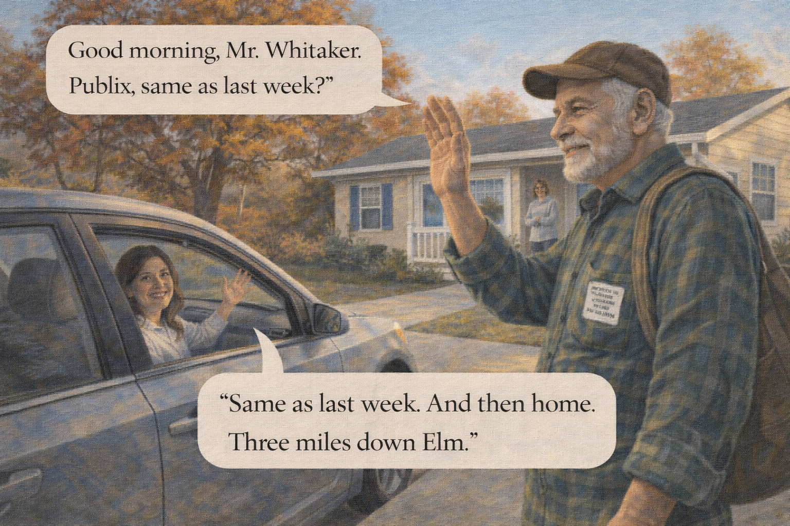 -->

Image Prompt

(This is panel 11. Do not put the panel number in the image.)

Contemporary photorealistic illustration, 16:9 wide-landscape format. A warm Tuesday morning in front of Ray's house. **Ray** stands on the sidewalk in front of his small ranch home with a cloth grocery bag slung over his shoulder, wearing his green flannel and corduroy cap. His posture is good; his face is content. He is giving a small friendly wave to a modest sedan pulling up to the curb — it is a rideshare car (generic, unbranded, no logos, just a regular car with a friendly female driver waving back through the open window). **Linda** is on the porch behind him, a mug of coffee in her hand, smiling — she drove over to see him off for his first grocery trip the new way. A small laminated card is tucked into Ray's shirt pocket, visible: *"MY NAME IS RAY WHITAKER. I HAVE ALZHEIMER'S. IF I SEEM LOST, PLEASE CALL LINDA: 555-0184."* Warm morning sun, autumn leaves. Color palette: fresh golds, soft autumn reds, the bright blue sky. Emotional tone: a new chapter, slightly smaller but not broken.

**Speech bubble 1** — tail pointing to the **driver** (in the car), positioned above the window, friendly: "Good morning, Mr. Whitaker. Publix, same as last week?"

**Speech bubble 2** — tail pointing to **Ray** (on sidewalk), positioned above him, bright: "Same as last week. And then home. Three miles down Elm."

Generate the image immediately without asking clarifying questions.

**Narrative:** The family built a new Tuesday morning. A local rideshare company Linda had vetted carefully sent the same driver each week — a woman named Denise who had grown up two blocks from Ray and remembered his late wife from church. The rides cost less than Ray had been spending on gas and insurance. Ray carried a small laminated card in his shirt pocket with his name, his diagnosis, and Linda's phone number. "Same as last week," he would tell Denise. "Three miles down Elm." He did not miss driving, exactly. But the route was still there. He just rode it now.

---

## Panel 12: A Sunday at the Park

<!-- 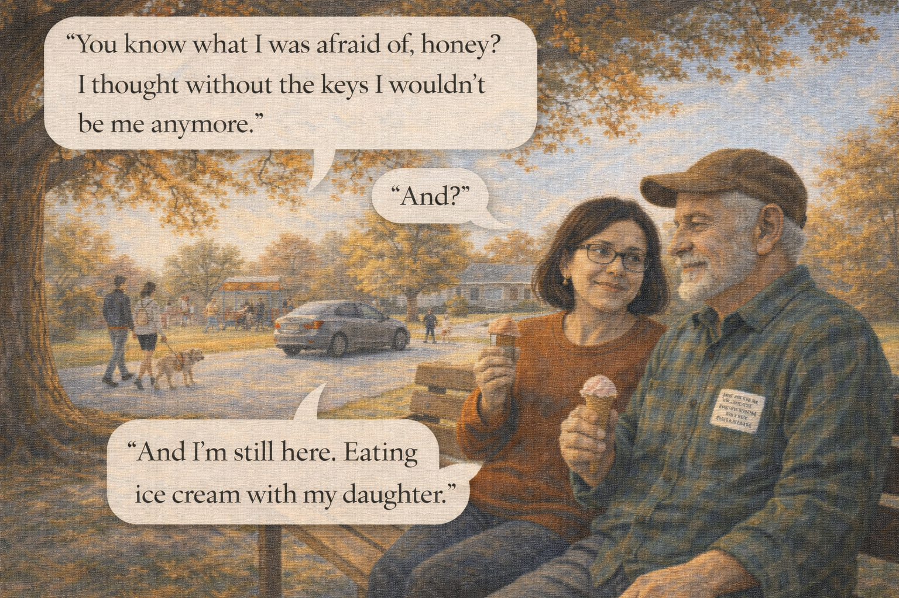 -->

Image Prompt

(This is panel 12. Do not put the panel number in the image.)

Contemporary photorealistic illustration, 16:9 wide-landscape format. A small neighborhood park on a clear Sunday afternoon. **Ray** and **Linda** sit together on a wooden park bench under the shade of a large oak tree, each holding a small ice cream cone. **Ray** is in his green flannel and corduroy cap, relaxed, watching children play on a distant playground. **Linda** is in a warm rust-colored sweater, her head tilted slightly toward her father, content. On the path beside them: a young couple walking a golden retriever. In the background, a suburban street, and at the curb, another generic unbranded rideshare car has just dropped off an elderly woman with a walker — a quiet hint that Ray's new life is part of a wider and dignified community of care. The autumn light is warm and gold. Color palette: warm autumn ambers, leaf greens and oranges, clear blue sky, a single soft pink of Linda's ice cream. Emotional tone: an ordinary Sunday, which is to say, everything.

**Speech bubble 1** — tail pointing to **Ray** (left, on bench), positioned above him, mellow and thoughtful: "You know what I was afraid of, honey? I thought without the keys I wouldn't be me anymore."

**Speech bubble 2** — tail pointing to **Linda** (right, on bench), positioned above her, warm: "And?"

**Speech bubble 3** — tail pointing to **Ray** again, positioned above him, with a small smile: "And I'm still here. Eating ice cream with my daughter."

Generate the image immediately without asking clarifying questions.

**Narrative:** Six months later, on a Sunday afternoon, Linda and Ray sat on a park bench eating ice cream. A rideshare car had dropped them off — she had started taking one, too, when she visited him, so the driver could be their shared routine. Ray watched a boy fly a small kite over the playground. "You know what I was afraid of, honey?" he said. "I thought without the keys I wouldn't be me anymore." Linda waited. Her father took a bite of his ice cream, chewed it slowly, and smiled. "And I'm still here. Eating ice cream with my daughter."

---

## Epilogue: What This Family Learned

| Challenge | Response | Lesson for Today |
|---|---|---|
| A father lost three counties from home | Immediate help from state trooper, then the Alzheimer's Association helpline | Call 911 for immediate safety, then call the helpline for what comes next. |
| Overnight regret and denial from Ray | Linda stopped arguing and sought a different messenger | Arguing with a dementia-affected parent about driving almost never works. |
| "I've driven for sixty years" — identity threatened | Framing driving as a medical judgment, not a family opinion | Separate identity from capability. The doctor handles capability. The family keeps the identity. |
| Needing to take the keys without breaking the relationship | Dr. Patel delivered the news; Linda was just in the chair | Let the doctor be the "bad cop." You stay the family. |
| Losing independence and transportation | Vetted rideshare with a regular driver, a small ID card | Driving can end. Independence does not have to end. |
| Grief of a life passage | A new Sunday routine — park, ice cream, a shared ride | Grief and love live in the same park bench on a good afternoon. |

## A Note to the Reader

If you are facing the driving conversation, please know two
things. First, waiting too long can cost a life — your loved
one's or someone else's. Second, you do not have to be the one
who says *"it's time."* That is what the doctor is for. That is
what the DMV is for. Your job is to stay the son, the daughter,
the spouse — the one who drives to the appointment, who sits in
the chair, who hands over the ice cream cone afterward.

A few specific tools that help:

- Ask the primary care doctor to do a **driving-specific cognitive evaluation**.
- Ask the doctor to report to the **state DMV**, which can require a re-test.
- Build a **new routine** before the keys are gone: trial rides, a regular driver, pre-scheduled weekly trips.
- Keep a **small ID card** in your loved one's wallet with their diagnosis and your phone number.

The **Alzheimer's Association 24/7 Helpline (1-800-272-3900)** has
a dedicated line of scripts and resources for the driving
conversation. You are not the first family to need them.

## Quotes From the Story

> "Dad. I don't think I should drive anymore." / "I know, Dad. I know." — *Ray and Linda, in the dark car*

> "Doc said no. Doc's the boss." — *Ray, setting the keys on the counter*

> "I thought without the keys I wouldn't be me anymore. And I'm still here. Eating ice cream with my daughter." — *Ray, on the park bench*

## References

1. [Wikipedia: Driving under the influence of dementia](https://en.wikipedia.org/wiki/Dementia) - General overview of dementia and its impact on daily activities including driving
2. [Alzheimer's Association: Dementia and Driving](https://www.alz.org/help-support/caregiving/safety/dementia-driving) - The definitive plain-language guide for families facing the driving conversation
3. [National Highway Traffic Safety Administration: Older Drivers](https://www.nhtsa.gov/road-safety/older-drivers) - Official U.S. government resources on aging and driving safety
4. [American Academy of Neurology: Guidelines on Driving in Dementia](https://www.aan.com/Guidelines/home/GuidelineDetail/395) - Evidence-based guidelines clinicians use to assess driving fitness
5. [CDC: Older Adult Drivers](https://www.cdc.gov/transportationsafety/older_adult_drivers/index.html) - Statistics and safety planning for older drivers and their families
