# The Caregiver in the Mirror: Burnout and the Courage to Ask for Help

<!-- 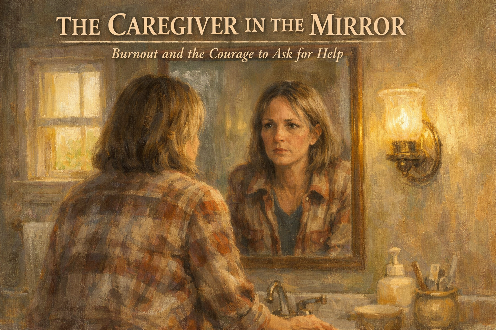 -->

Cover Image Prompt

Please generate a 16:9 image in warm, painterly contemporary realism depicting a woman, Rebecca, 49, with shoulder-length dark blonde hair showing silver at the temples, standing in a simple bathroom looking into the mirror. She wears a worn flannel shirt. Her eyes are tired; there are faint shadows beneath them. In her reflection, she meets her own gaze as if seeing herself clearly for the first time in a long time. Morning light comes through a small window. The color palette is muted sage, cream, warm peach, and soft gray. The emotional tone is a quiet, honest reckoning — the first moment of choosing yourself back. Generate the image immediately without asking clarifying questions.

Narrative Prompt

This is a graphic novel for family caregivers of people living with dementia. The central character is Rebecca, 49, whose husband Jeff, 56, has early-onset Alzheimer's disease. She has been his primary caregiver for three years. She has gained twenty pounds, lost two friendships, skipped her own mammogram for eighteen months, cried in the grocery store parking lot, and been snapping at Jeff in ways she hates herself for. The story is about ambiguous grief — loving and grieving someone who is still alive — and about caregiver burnout. Rebecca reaches a breaking point when she falls asleep at a red light. The next morning she looks in the mirror and sees someone she no longer recognizes. The story walks through her reaching out: calling the Alzheimer's Association helpline, joining a caregiver support group, accepting her sister's offer to fly in for a week of respite, making herself a doctor's appointment, starting adult day care three days a week for Jeff, and — eventually — beginning therapy for ambiguous grief. The tone is honest, not preachy. It names caregiver burnout as a medical condition, not a weakness. It honors love while refusing to romanticize self-destruction. End with hope: Rebecca laughing, at a diner, with her sister, for the first time in a year. Include Alzheimer's Association 24/7 Helpline (1-800-272-3900). American English spelling.

### Prologue – The Red Light

It is 5:47 p.m. on a Wednesday. Rebecca is driving home from the pharmacy. At a red light at Hillside and Main, she closes her eyes. Just for a second. When she wakes, the car behind her is honking. The light is green. She has been asleep at the wheel. She pulls into a parking lot and sits with her hands on the wheel for a long time. Tonight, she thinks, is the night she either asks for help or becomes another headline.

<!-- 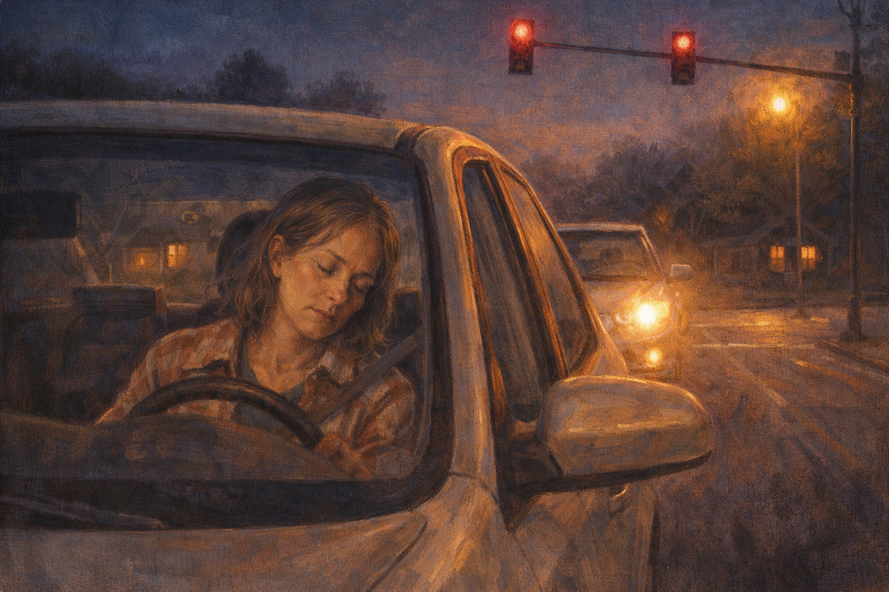 -->

Image Prompt

Please generate a 16:9 image in warm contemporary realism depicting Rebecca, 49, in a beige compact sedan at a suburban intersection at dusk. Her head has dropped slightly forward. Her eyes are closed. The red light above glows steady. A second car behind her has its headlights on. The color palette is deep indigo dusk, amber streetlight, red traffic light. The emotional tone is exhausted danger. No speech bubbles. Generate the image immediately without asking clarifying questions.

She had not meant to fall asleep. She had only closed her eyes for one second at a red light because the light was long and she was tired. It turned out a second of sleep was enough to terrify the driver behind her. She pulled into the parking lot of an old bank branch and sat until her hands stopped shaking. A woman caring for a husband with dementia had just almost killed a stranger. She could hear her own breath in the quiet car.

## Panel 2 – The Mirror

<!-- 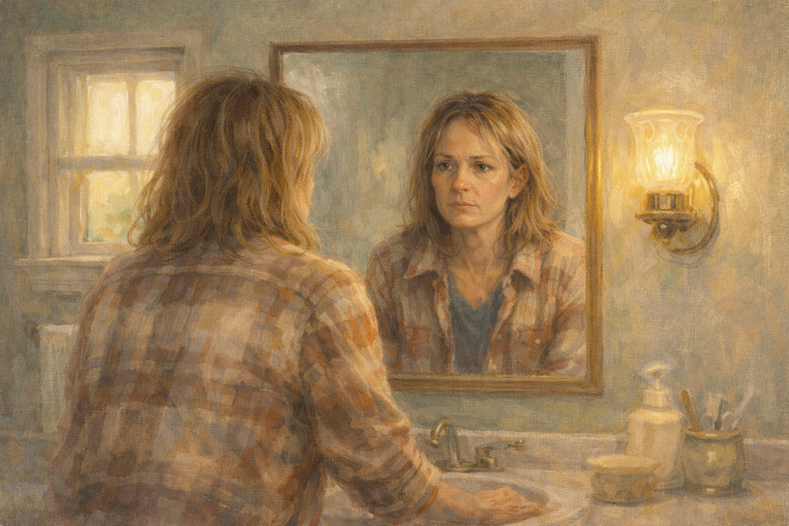 -->

Image Prompt

Please generate a 16:9 image in warm contemporary realism depicting Rebecca standing in a simple bathroom the next morning, facing the mirror. Her hair is unbrushed. She is looking at herself without flinching for the first time in a long time. Her face is tired but clear-eyed. The color palette is soft sage, warm cream, gentle peach. The emotional tone is the beginning of a decision. No speech bubbles. Generate the image immediately without asking clarifying questions.

In the bathroom mirror the next morning, Rebecca looked at herself. She saw the twenty pounds she had put on since the diagnosis. She saw the gray roots she had been coloring over and finally stopped coloring. She saw circles under her eyes, and the deep crease between her eyebrows that had not been there at forty-six. She saw, very clearly, that nobody in her family was going to rescue her, because nobody in her family was in the house. She was going to have to rescue herself.

## Panel 3 – The Phone Call

<!-- 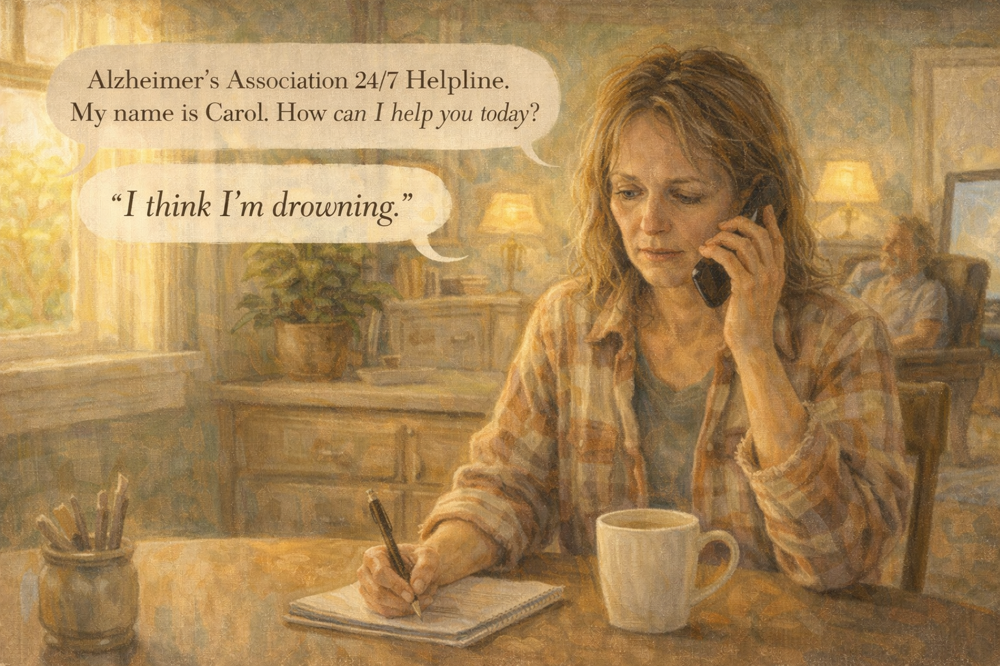 -->

Image Prompt

Please generate a 16:9 image in warm contemporary realism depicting Rebecca sitting at her kitchen table with a cup of coffee, phone pressed to her ear, a pen in her other hand, a notepad in front of her. Morning sunlight streams in. Her husband Jeff, 56, is visible in the background sitting in an armchair watching television, peaceful. The color palette is warm honey gold, cream, soft green. The emotional tone is the first courageous act. Speech bubble (from phone, small): "Alzheimer's Association 24/7 Helpline. My name is Carol. How can I help you today?" Speech bubble from Rebecca (shaky, honest): "I think I'm drowning." Generate the image immediately without asking clarifying questions.

She called the Alzheimer's Association helpline at 8:15 that morning. A woman named Carol answered. Rebecca expected to have to explain. Carol already knew. "Tell me what a normal day looks like," Carol said. Rebecca told her. Every hour of it. The waking, the washing, the watching, the pill regimen, the laundry, the cleaning up after accidents, the twelve hours on her feet, the nights that were not really nights because Jeff woke every three hours. Carol said, "Honey. You need respite. Today."

## Panel 4 – The Word "Burnout"

<!-- 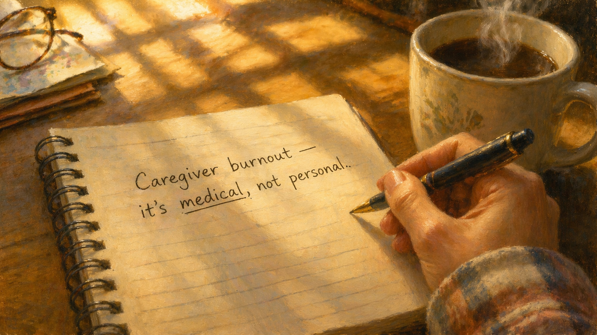 -->

Image Prompt

Please generate a 16:9 image in warm contemporary realism depicting a close-up of a notepad with handwriting: "Caregiver burnout — it's medical, not personal." A hand holds a pen. A coffee mug steams beside. Soft morning light. The color palette is warm cream, amber, deep brown, gentle gold. The emotional tone is the naming of something that had not been named. No speech bubbles. Generate the image immediately without asking clarifying questions.

Carol used a word Rebecca had heard but had never applied to herself: *burnout*. Caregiver burnout was a recognized condition, Carol said — depression, anxiety, immune collapse, and in some cases, suicidal thinking. It was not weakness. It was what happened to a healthy person who tried to do three people's work alone. Rebecca wrote the sentence down on her notepad. *It's medical, not personal.* She underlined it twice. She looked at the underlines and felt, for the first time in a month, something that was not shame.

## Panel 5 – Calling Her Sister

<!-- 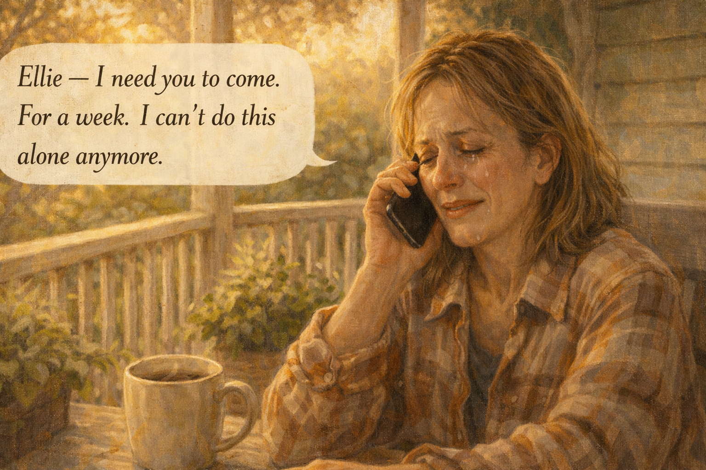 -->

Image Prompt

Please generate a 16:9 image in warm contemporary realism depicting Rebecca on her back porch, wrapped in a flannel shirt, phone to her ear. Her face has softened, wet with tears but relieved. The color palette is warm gold, soft green, cream. The emotional tone is the permission to be helped. Speech bubble from Rebecca (small, truthful): "Ellie — I need you to come. For a week. I can't do this alone anymore." Generate the image immediately without asking clarifying questions.

She called her sister Ellie in Portland. Ellie said "yes" before Rebecca finished the ask. Ellie booked a flight for Saturday. Ellie said, "Why didn't you call me a year ago?" Rebecca, who had made every excuse a person could make, said, "Because I thought I was supposed to be able to do it." Ellie said, "You are not supposed to be able to do it. Nobody is. I'll be there Saturday." Rebecca hung up, sat on the porch, and cried in a way that felt finally clean.

## Panel 6 – Adult Day Care

<!-- 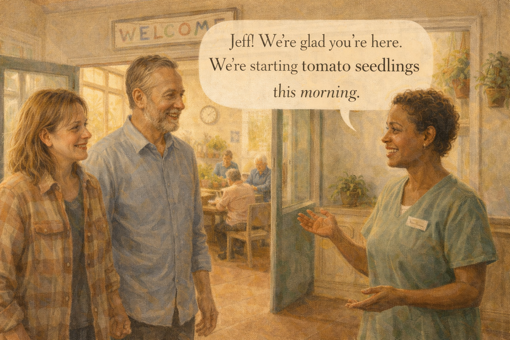 -->

Image Prompt

Please generate a 16:9 image in warm contemporary realism depicting Rebecca and Jeff walking into a bright cheerful adult day center. Staff greet Jeff warmly by name. A small group of adults with early-stage cognitive impairment is visible in the background, doing a gardening activity at a raised bed. The color palette is warm terracotta, sage green, cream, honey. The emotional tone is tentative hopeful trust. Speech bubble from staff member (warm): "Jeff! We're glad you're here. We're starting tomato seedlings this morning." Generate the image immediately without asking clarifying questions.

The adult day center took Jeff three days a week, from eight to four. The first morning Rebecca drove him there and stayed in the parking lot for twenty minutes before driving away, convinced she was a monster. At four she came back and Jeff was grinning. He had planted a tomato seedling. He did not remember planting it, but he remembered that he had liked the smell of the dirt. Rebecca cried in the parking lot for a different reason this time. He had had a good day. Without her. He could still have a good day without her.

## Panel 7 – The Doctor's Appointment

<!-- 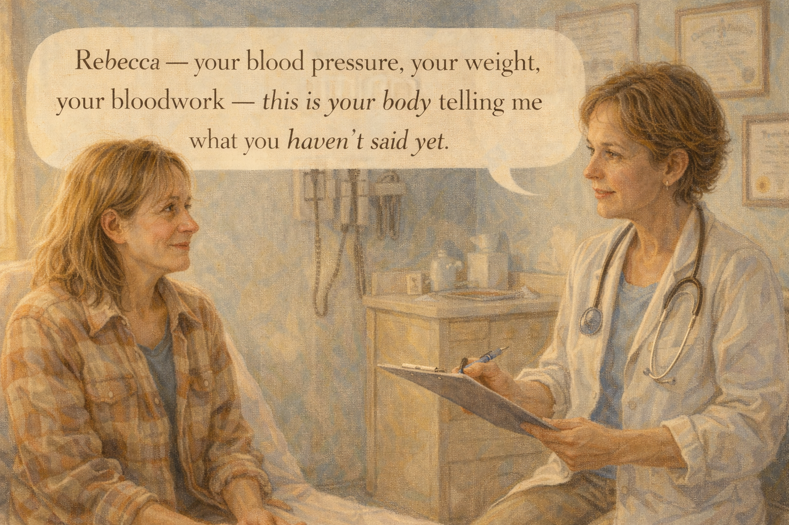 -->

Image Prompt

Please generate a 16:9 image in warm contemporary realism depicting Rebecca seated on an exam table in a warm-lit clinical office, her primary care doctor, a kind woman in her fifties, seated across from her with a gentle concerned expression, holding a clipboard. The color palette is clean pale blue, warm cream, soft gold. The emotional tone is a patient being finally seen. Speech bubble from doctor: "Rebecca — your blood pressure, your weight, your bloodwork — this is your body telling me what you haven't said yet." Generate the image immediately without asking clarifying questions.

She went to her own doctor for the first time in eighteen months. Her blood pressure was 162/96. Her fasting glucose was in the pre-diabetic range. Her doctor said, carefully, "Rebecca, your body is telling me what you haven't said yet. You are not taking care of yourself." Rebecca cried. Her doctor handed her a tissue and said, "This is what we're going to do," and wrote out a plan that did not include failing.

## Panel 8 – The Support Group

<!-- 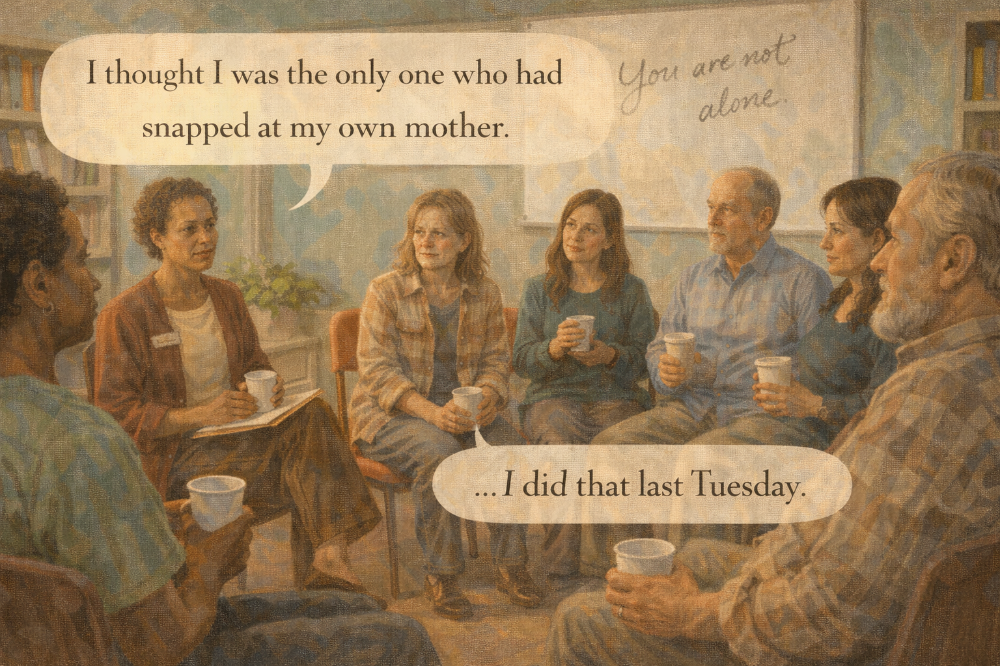 -->

Image Prompt

Please generate a 16:9 image in warm contemporary realism depicting a circle of eight people in a community-room meeting, various ages and ethnicities, each holding a paper cup of coffee. Rebecca sits among them, tentative. A facilitator with kind eyes leads the group. Someone across the circle is speaking. A whiteboard behind has the words "You are not alone." The color palette is warm cream, muted teal, deep burgundy. The emotional tone is relief of being understood. Speech bubble from another caregiver: "I thought I was the only one who had snapped at my own mother." Speech bubble from Rebecca (quiet): "...I did that last Tuesday." Generate the image immediately without asking clarifying questions.

Tuesday evening she went to a caregiver support group in the basement of a library. Eight people sat in a circle. A man named Thomas said, "I yelled at my mother this week. I'm so ashamed." Rebecca, without planning to, said, "I did that last Tuesday." Thomas looked at her and said, "Welcome." That was it. She was home. She drove home at nine and did not cry. She laughed once, softly, at a joke somebody in the circle had made. It was the first laugh she had laughed in months.

## Panel 9 – Ambiguous Grief

<!-- 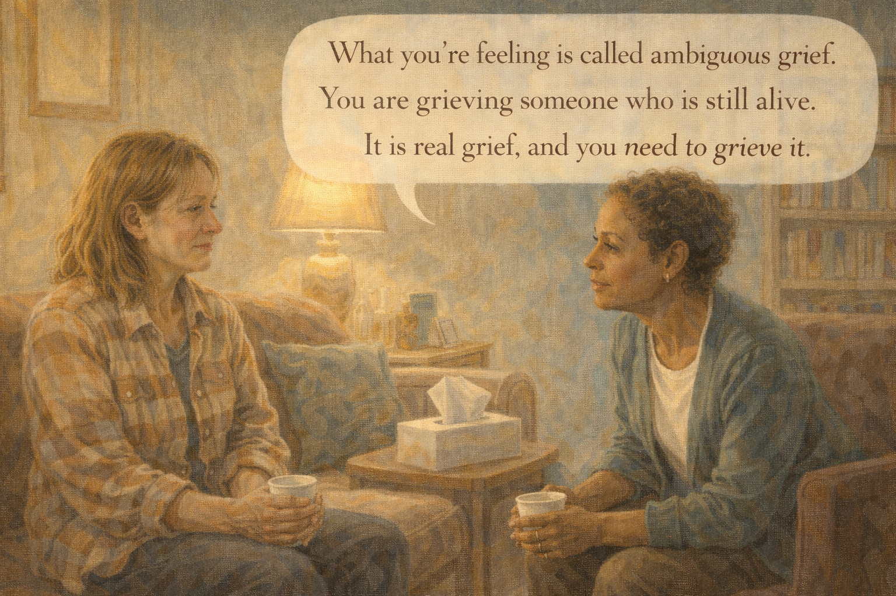 -->

Image Prompt

Please generate a 16:9 image in warm contemporary realism depicting Rebecca in a therapist's office, seated on a soft couch across from a therapist in a cardigan. A box of tissues between them. The therapist is speaking gently. The color palette is warm cream, deep teal, soft brown. The emotional tone is naming a grief that had no name before. Speech bubble from therapist: "What you're feeling is called ambiguous grief. You are grieving someone who is still alive. It is real grief, and you need to grieve it." Generate the image immediately without asking clarifying questions.

Her therapist, Dr. Patel, taught her the phrase *ambiguous grief*. Rebecca had never heard it before. It was the grief of losing someone while they were still alive. It was the grief of sleeping next to a man who was no longer her husband, exactly, but also not yet gone. "You have been grieving for three years," Dr. Patel said, "and refusing to call it grieving because he is still here. That refusal is what is breaking you. You are allowed to grieve him. You are allowed to love him and grieve him in the same hour."

## Panel 10 – Her Sister at the Diner

<!-- 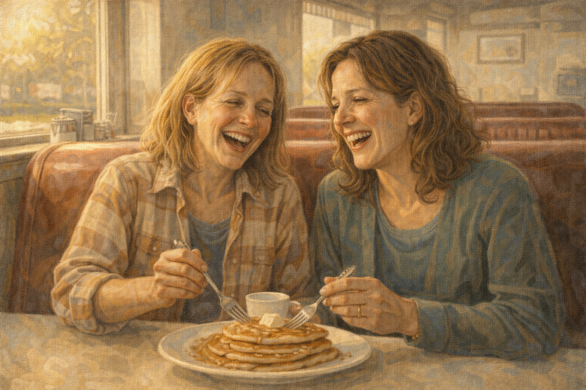 -->

Image Prompt

Please generate a 16:9 image in warm contemporary realism depicting Rebecca and her sister Ellie in a classic diner booth, sharing a plate of pancakes. Both are laughing, mid-laugh. Late-morning sunlight streams through the window. The color palette is warm honey, deep burgundy vinyl, cream. The emotional tone is joyful restoration. No speech bubbles. Generate the image immediately without asking clarifying questions.

That Saturday her sister landed and took her to a diner for pancakes. Halfway through breakfast Ellie said something so ridiculous about an old family story that Rebecca laughed. Really laughed. A laugh that came up from somewhere in her ribs and surprised her. She put her fork down and covered her face and laughed until the tears came. The waitress refilled their coffee without comment. Ellie reached across the table and held her sister's wrist.

## Panel 11 – A Different Week

<!--  -->

Image Prompt

Please generate a 16:9 image in warm contemporary realism depicting Rebecca walking briskly on a quiet suburban trail in the early morning, wearing workout clothes and headphones. The sky is rose-pink dawn. Her face is calm and present. The color palette is soft pink dawn, warm gold, deep green, cream. The emotional tone is the rebuilding of a body. No speech bubbles. Generate the image immediately without asking clarifying questions.

Rebecca built a new week. Mondays, Wednesdays, and Fridays: adult day care for Jeff. Tuesdays: support group in the evening. Thursdays: therapy. Saturdays: a morning walk before Jeff woke up. Sundays: a visit from a neighbor who sat with Jeff for two hours while Rebecca slept. It was not easy. Jeff was still getting worse. But she was no longer disappearing along with him. She had stopped the quiet slide.

## Panel 12 – Still in Love

<!-- 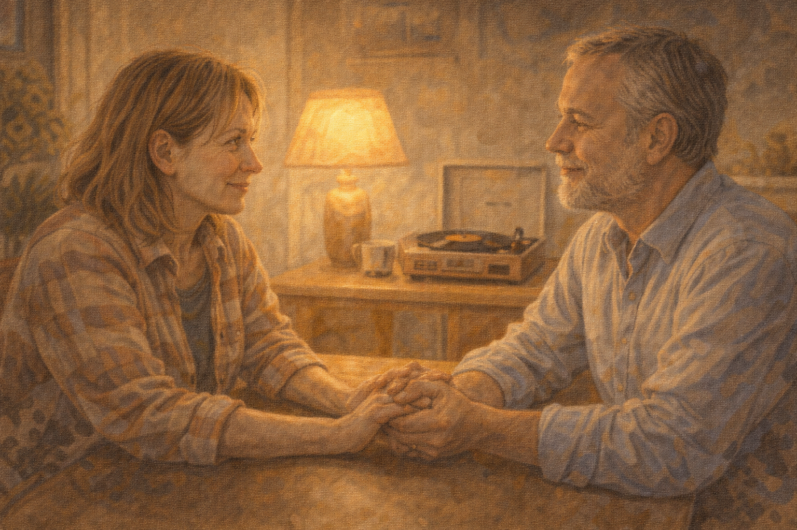 -->

Image Prompt

Please generate a 16:9 image in warm contemporary realism depicting Rebecca and Jeff at their kitchen table in the evening, holding hands. Jeff's eyes are softer, a little distant, but present enough to meet hers. A warm lamp glows. A small record player spins an old album. The color palette is deep amber, warm gold, soft rose. The emotional tone is love continuing in a new form. No speech bubbles. Generate the image immediately without asking clarifying questions.

On a Thursday evening, Jeff reached across the kitchen table and took her hand. He did not say anything. He did not need to. He still knew her on most days, in the way that mattered: the way he looked at her hand like it was familiar. Rebecca held his hand and thought, *I am still in love with you. I am also taking care of me. These are not the same thing. They are allowed to live in the same marriage.* She turned over Jeff's hand and kissed his palm and breathed.

### Epilogue – What Rebecca Learned

| Crisis | What Rebecca Did | Lesson for Caregivers |
|--------|------------------|----------------------|
| Falling asleep at a red light | Called the helpline the next morning | If you nearly crash, it is not a warning — it is the crash itself |
| Hadn't seen her doctor in 18 months | Made an appointment and followed the plan | Your health is part of your loved one's care plan |
| Felt weak for being exhausted | Learned caregiver burnout is medical | Burnout is a diagnosis, not a character flaw |
| Thought asking for help would hurt Jeff | Started adult day care three days a week | Respite helps both of you; he thrived, so did she |
| Refused to grieve a living husband | Began therapy for ambiguous grief | You can love someone and grieve them at the same time |
| Felt alone in her specific misery | Joined a support group | Other caregivers have your same exact Tuesday |

### A Note to Readers

Caregiver burnout is real. It is associated with:

- **Depression and anxiety** (40-70% of dementia caregivers)
- **Sleep deprivation** and chronic fatigue
- **Weight gain or loss**, hypertension, elevated blood glucose
- **Social isolation** and lost friendships
- **A 63% higher risk of mortality** than non-caregiving spouses of the same age

If any of this sounds like you, please consider:

- Calling the Alzheimer's Association 24/7 Helpline: **1-800-272-3900**
- Asking your doctor about adult day care and respite programs
- Joining a caregiver support group (in person or online)
- Making your own doctor's appointment this week
- Accepting help when offered — every time

You are not a failure for needing help. You are a person doing extraordinary work. The world has very little in place to catch you. You have to ask.

---

*"I thought I was supposed to be able to do it. I was wrong. Nobody is supposed to be able to do it alone."*
—Rebecca, caregiver

*"Burnout is a diagnosis, not a character flaw."*
—Alzheimer's Association counselor

*"You can love him and grieve him in the same hour. Both are true."*
—Dr. Patel

---

## References

1. [Caregiver Health – Alzheimer's Association](https://www.alz.org/help-support/caregiving/caregiver-health) - Overview of caregiver burnout and self-care resources.
2. [Caregiver Stress and Burnout – Wikipedia](https://en.wikipedia.org/wiki/Caregiver_stress) - Background on the syndrome and its health consequences.
3. [Ambiguous Loss – Wikipedia](https://en.wikipedia.org/wiki/Ambiguous_loss) - Pauline Boss's framework for grieving a living person.
4. [Caregiver Health – National Institute on Aging](https://www.nia.nih.gov/health/caregiving) - Federal resources for caregivers.
5. [Family Caregiver Alliance](https://www.caregiver.org/) - National nonprofit offering respite, education, and support.
