# Four O'Clock

*A Family's Journey Through Sundowning*

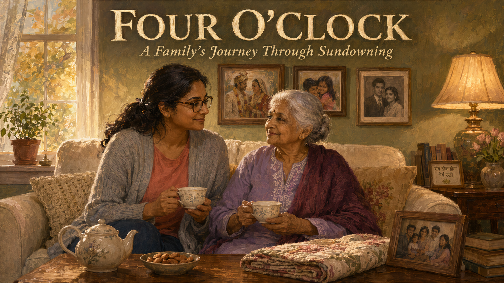

Cover Image Prompt

Contemporary photorealistic illustration, warm cinematic tone, 16:9 wide-landscape format. A suburban American living room bathed in golden late-afternoon light at 4:00 PM. In the foreground, two Indian-American women sit together on a cream-colored sofa sharing a moment of quiet connection. On the left, **Priya Sharma**, age 39, medium-brown skin, long dark hair tied in a loose low ponytail, tortoise-shell glasses, soft gray cardigan over a coral T-shirt, dark jeans; she is leaning slightly toward her mother-in-law with a gentle, tired smile, holding a small ceramic teacup with both hands. On the right, **Anita Sharma**, age 82, silver hair in a neat bun, warm brown skin, wearing a soft lavender kurta with light embroidery at the collar, a maroon shawl over her shoulders; she looks calm and present, holding her own teacup, a small smile on her lips. Between them on a low wooden coffee table: a small teapot, a dish of almonds, a folded quilt, and a family photo in a wooden frame. Behind them, sheer curtains are pulled wide open, letting in rich amber sunlight that catches dust motes in the air. A warm table lamp glows in the corner. The wall above them holds three framed photos — a wedding, grandchildren, and an older black-and-white photo of a young couple (Anita and her late husband). A small potted tulsi plant on the windowsill. Color palette: warm ambers, golden light, soft lavenders, deep teals, cream whites. Emotional tone: earned peace, tender love, the calm that comes after a hard-learned lesson.

Title text overlay centered at the top in clean modern sans-serif: "FOUR O'CLOCK" in warm white with a subtle shadow. Subtitle below in smaller italic: "A Family's Journey Through Sundowning"

Generate the image immediately without asking clarifying questions.

## Narrative Prompt

This is a fictional composite story built from the lived experience of thousands of family caregivers. Priya and Anita are invented characters, but every moment in this story — the four o'clock agitation, the failed attempts at reasoning, the quiet bathroom phone call, the eventual calm — is drawn from the real pattern called **sundowning**, which affects many people with dementia and Alzheimer's disease. The story teaches one clear skill: how to recognize the pattern and respond to it with environmental and routine changes rather than argument. Art style: contemporary photorealistic illustration with a warm, intimate domestic tone, present-day suburban America.

## Prologue

Every family living with dementia eventually meets four o'clock. It arrives quietly — a gentle grandmother suddenly pacing the living room, a calm father demanding to "go home" from the living room he has sat in for forty years. For a long time it has no name. It feels like a personality change, a crisis, a failure of care. But it has a name: **sundowning**. And once you know its name, you can plan around it. This is the story of how Priya Sharma learned that name — and how the four o'clock hour became, again, a peaceful one.

---

## Panel 1: A Morning That Felt Normal

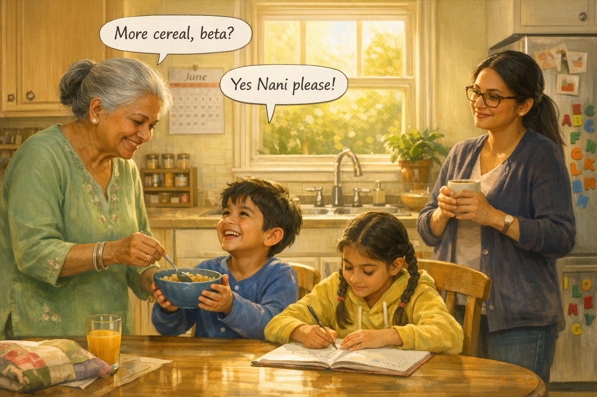

Image Prompt

Contemporary photorealistic illustration, 16:9 wide-landscape format. A bright sunny suburban American kitchen at 9 AM, warm yellow morning light pouring through a window over the sink. **Anita Sharma** (82, silver hair in a neat bun, warm brown skin, soft green kurta with small floral embroidery, slim silver bangles on her wrists) stands beside the kitchen table on the LEFT side of the frame, gently spooning cereal into a blue bowl held up by a small boy (age 6, brown skin, tousled black hair, blue pajamas) who is beaming up at her. Next to the boy sits a girl (age 9, brown skin, two braids, yellow hoodie, scribbling in a school notebook). On the RIGHT side of the frame, **Priya Sharma** (39, long dark hair in a low ponytail, tortoise-shell glasses, navy cardigan, mug of coffee in her hand) leans against the kitchen counter watching her mother-in-law with a soft, grateful smile. Background details: a wall calendar on June, a magnetic alphabet on the fridge, a wooden spice rack, a plant on the windowsill, morning sunlight creating rectangles on the floor. Color palette: buttery yellows, soft greens, warm wood tones, cream walls. Emotional tone: ordinary happiness, family warmth, a good morning.

**Speech bubble 1** — tail pointing to **Anita** (who is on the LEFT), positioned above her: "More cereal, beta?"

**Speech bubble 2** — tail pointing to the **little boy** (center-left), positioned above him: "Yes Nani please!"

Generate the image immediately without asking clarifying questions.

**Narrative:** Priya Sharma's mother-in-law Anita had lived with the family for two years. Mornings were easy. Anita would pour cereal for the grandkids, hum old Hindi songs at the stove, and tell the same three stories about the 1971 monsoon that Priya could recite by heart. Priya would smile, drink her coffee, and begin her workday grateful that the children had their Nani close. For a long time, this was the rhythm of the house. For a long time, it was enough.

---

## Panel 2: The Clock Strikes Four

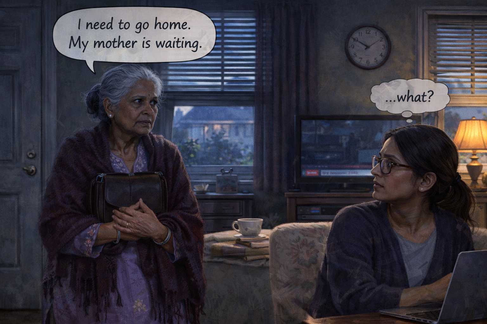

Image Prompt

Contemporary photorealistic illustration, 16:9 wide-landscape format. The same family living room, but now in dim late-afternoon light at 4:00 PM. Heavy gray-blue light filters through half-closed blinds — the sun has dropped behind the neighbor's roof. A round wall clock above the TV on the LEFT shows exactly 4:00. On the RIGHT side of the frame, **Priya** sits at a small desk in the corner of the living room, laptop open, glasses on, in a dark sweater — she is turning her head sharply to look at her mother-in-law, an expression of concern forming. In the CENTER of the frame stands **Anita** (82), but she looks different from Panel 1: shoulders tense, a small handbag clutched tightly to her chest with both hands, her gaze unfocused and anxious. She is staring at the front door on the left edge of the frame. She is wearing the same lavender kurta but has now added a wool shawl as if ready to leave. The TV in the background plays muted evening news (red ticker visible). A cup of unfinished tea sits forgotten on the coffee table. Color palette: cool gray-blues, muted purples, dim amber from a single lamp, low contrast. Emotional tone: the first unease, something has changed in the room.

**Speech bubble 1** — tail pointing to **Anita** (center), positioned to her upper right: "I need to go home. My mother is waiting."

**Speech bubble 2** — tail pointing to **Priya** (right side, at desk), positioned above her in lighter thought-bubble style: "...what?"

Generate the image immediately without asking clarifying questions.

**Narrative:** The first time it happened, it was a Tuesday. The wall clock read 4:00. Priya looked up from a work call to see Anita standing in the living room with her purse, coat on, looking for the front door. "I need to go home," she said. "My mother is waiting." Priya blinked. Anita's mother had died in 1974. The light in the room had gone gray. The TV murmured the evening news. Nothing else about the day had changed — except Anita.

---

## Panel 3: Reasoning Fails

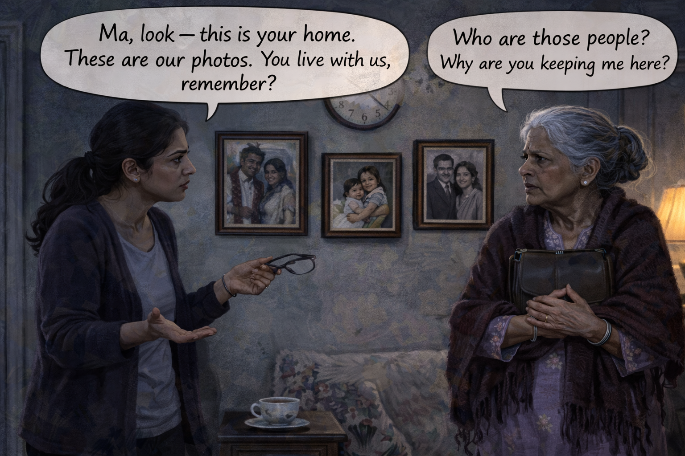

Image Prompt

Contemporary photorealistic illustration, 16:9 wide-landscape format. Same living room, same dim 4 PM light, now maybe ten minutes later. **Priya** (on the LEFT, standing, one hand gently on Anita's arm, the other gesturing toward the wall of family photos) is speaking earnestly, her brow furrowed, trying to explain. She has removed her glasses and holds them in her gesturing hand. **Anita** (on the RIGHT of Priya, still clutching her handbag, coat on) is pulling slightly away from Priya, her face clouded with confusion and rising frustration — she does NOT recognize the photos Priya is pointing to. On the wall between them, three family photos: a wedding photo of Priya and her husband, a photo of Anita holding a baby (Priya's son), and an older photo of Anita with her late husband. Above the photos, the round clock now reads 4:12. The lighting is still cool and low. Color palette: muted grays, dusty blues, the photos in their frames providing the only warm tones. Emotional tone: earnest misguided effort on Priya's side, confusion and mistrust on Anita's side.

**Speech bubble 1** — tail pointing to **Priya** (on the LEFT), positioned above her: "Ma, look — this is your home. These are our photos. You live with us, remember?"

**Speech bubble 2** — tail pointing to **Anita** (on the RIGHT), positioned above her head: "Who are those people? Why are you keeping me here?"

Generate the image immediately without asking clarifying questions.

**Narrative:** Priya did what any loving daughter-in-law would do. She tried to help Anita remember. "Ma, this IS your home. Look — here is your grandson. Here is your wedding. You live with us." But reasoning was the wrong tool. Every photo Anita didn't recognize felt like proof that something was very wrong — not with her memory, but with the woman in front of her. Anita pulled her arm back. Her voice rose. The more Priya explained, the more frightened her mother-in-law became.

---

## Panel 4: Escalation

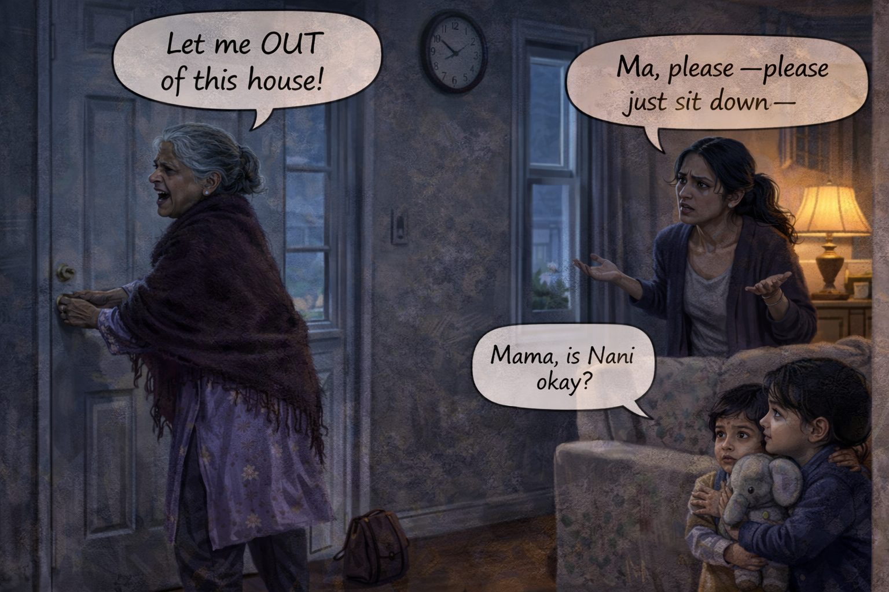

Image Prompt

Contemporary photorealistic illustration, 16:9 wide-landscape format. The same living room, now 4:47 PM (clock visible in upper left). **Anita** (on the LEFT side of frame, near the front door) is at the door, both hands on the doorknob, trying to turn it; she is visibly upset, mouth open mid-word, a strand of silver hair fallen loose from her bun. Her handbag is on the floor beside her. **Priya** (on the RIGHT, a few feet behind Anita, palms up in a pleading gesture) looks exhausted and near tears, her cardigan falling off one shoulder, her hair now disheveled. On the floor by the sofa, the two grandchildren (the 6-year-old boy and 9-year-old girl from Panel 1) peek around the corner from a hallway, watching with wide frightened eyes — the little boy is clutching a stuffed elephant, the girl has one hand on his shoulder. The lighting is dim and cold — outside through the window sidelights you can see dusk has begun. Color palette: cold steely blues, muted purples, one warm orange glow from a single lamp that feels lonely. Emotional tone: the storm has fully arrived, everyone is afraid.

**Speech bubble 1** — tail pointing to **Anita** (on the LEFT, at the door), positioned above her: "Let me OUT of this house!"

**Speech bubble 2** — tail pointing to **Priya** (on the RIGHT), positioned above her, in a slightly smaller trembling style: "Ma, please — please just sit down —"

**Speech bubble 3** — tail pointing to the **little boy** (lower right corner, peeking from hallway), positioned small and quiet near him: "Mama, is Nani okay?"

Generate the image immediately without asking clarifying questions.

**Narrative:** By five o'clock the whole house was tense. Anita was at the door, trying the knob. Priya was begging. The children were watching. Priya felt her jaw clench in a way she had never known a jaw could clench. Eventually the storm passed — as mysteriously as it had come. By 6:30 Anita was back on the sofa, softer now, asking if anyone would like some tea. Priya made the tea. And then she went into the bathroom, closed the door, and put her forehead against the tile.

---

## Panel 5: The Bathroom Phone Call

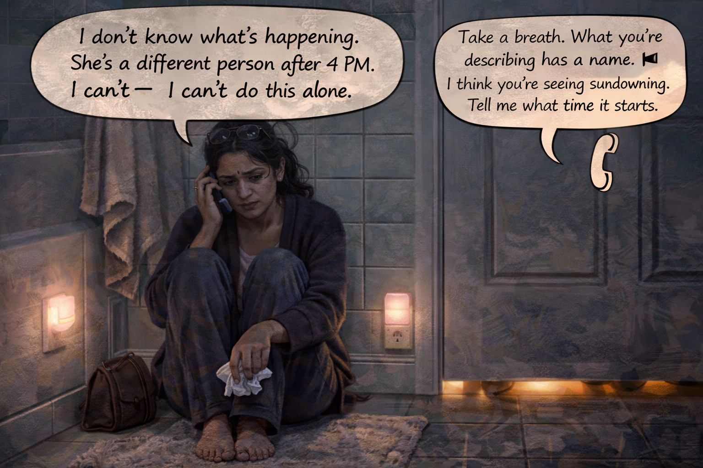

Image Prompt

Contemporary photorealistic illustration, 16:9 wide-landscape format. Interior of a small suburban bathroom, very intimate framing. **Priya** sits on the cold tile floor in the CENTER of the frame, her back against a white-and-teal tiled wall, knees drawn up, a phone pressed to her right ear. Her glasses are pushed up onto her head, her eyes are red and wet, a few tears tracking down her cheek. She is holding the phone loosely, as if she is finally allowing herself to crack. A bath towel hangs off the edge of the tub beside her. A small pink nightlight is plugged in low on the wall — a gentle detail. Under the bathroom door at the bottom of the frame, soft light from the hallway and the shadow of two small feet (one of the children listening on the other side). A crumpled tissue in Priya's left hand. Color palette: cool teal tiles, soft whites, pale pink nightlight glow, warm amber from under the door. Emotional tone: this is the breaking point, and it is quiet, and it is where the help begins.

**Speech bubble 1** — tail pointing to **Priya** (center of frame, sitting on floor), positioned above her head in a soft shaky style: "I don't know what's happening. She's a different person after 4 PM. I can't — I can't do this alone."

**Speech bubble 2** — a phone-style speech bubble (with a small phone icon in the tail) connected to the phone Priya is holding, representing the voice of the **Alzheimer's Association helpline counselor**, positioned in the upper right: "Take a breath. What you're describing has a name. I think you're seeing sundowning. Tell me what time it starts."

Generate the image immediately without asking clarifying questions.

**Narrative:** The Alzheimer's Association 24/7 helpline is free. It is staffed by people who have heard every version of this phone call. Priya dialed it at 7:42 on a Tuesday evening, after the children were asleep, sitting on the bathroom floor because it was the only room with a lock. The woman on the other end did not rush her. She listened. And then she said the word that would change Priya's next year: *sundowning*. It had a name. Priya wrote it on a piece of toilet paper because it was the only paper within reach.

---

## Panel 6: The Word Sundowning

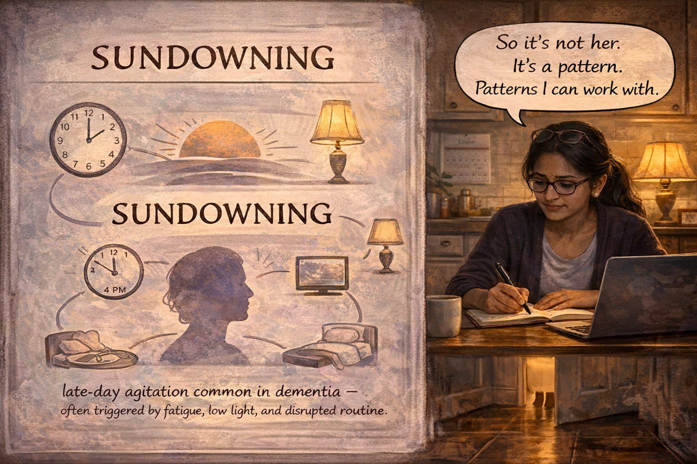

Image Prompt

Contemporary photorealistic illustration, 16:9 wide-landscape format, stylized educational diagram framing with a warm domestic background. The RIGHT half of the frame shows **Priya** later that night, sitting at her kitchen table under a pool of warm lamplight, laptop open, a notebook in front of her, a pen in hand, glasses back on. She is writing calmly, her face tired but focused — no longer in panic, now in student mode. On the LEFT half of the frame, a soft semi-transparent "thought overlay" or textbook-like inset panel: a simple illustration of a setting sun behind a silhouetted human head; around the head, small icons — a clock showing 4 PM, a lamp, a TV with static, a bed with a rumpled blanket, a dinner plate — connected by soft lines to the word **SUNDOWNING** in large gentle hand-lettered type. A smaller caption underneath in smaller text: *"late-day agitation common in dementia — often triggered by fatigue, low light, and disrupted routine."* Color palette: warm kitchen ambers on the right, soft lavender and dusk-orange in the diagram, educational and calming. Emotional tone: the relief of having a name for something.

**Speech bubble 1** — tail pointing to **Priya** (on the RIGHT, at the kitchen table), positioned above her in a calm style: "So it's not her. It's a pattern. Patterns I can work with."

*(Note: the diagram on the left has no speech bubbles; it is an illustrative inset / overlay, not a character.)*

Generate the image immediately without asking clarifying questions.

**Narrative:** Sundowning is a pattern of agitation, confusion, or distress that shows up in the late afternoon and early evening in many people with dementia. Nobody fully knows why — fatigue from a long day, disrupted internal clocks, low light that makes the world look strange, hunger, overstimulation from TV. Priya read for an hour. She took notes. And somewhere in that hour, the knot in her chest loosened. The most frightening thing about the four o'clock storm had been that it felt like losing Anita. Knowing it was sundowning meant Anita was still there — hidden inside a pattern that could be learned.

---

## Panel 7: Finding the Pattern

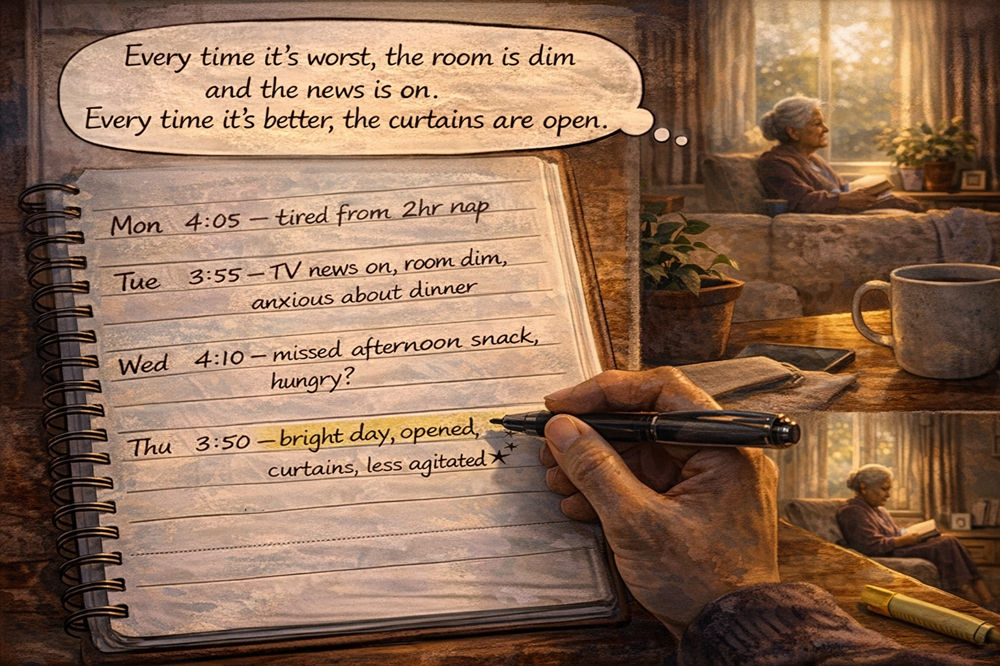

Image Prompt

Contemporary photorealistic illustration, 16:9 wide-landscape format, looking over **Priya's** shoulder as she writes in a notebook at her kitchen table. The notebook fills the LEFT half of the frame in clear detail: a handwritten chart with days of the week in one column and observations in neat cursive — *"Mon 4:05 — tired from 2hr nap. Tue 3:55 — TV news on, room dim, anxious about dinner. Wed 4:10 — missed afternoon snack, hungry? Thu 3:50 — bright day, opened curtains, less agitated!"* Small hand-drawn stars next to the Thursday entry. Priya's hand with the pen in it is visible at the bottom of the notebook. On the RIGHT half of the frame, through the kitchen into the living room, **Anita** is visible in soft focus in a sunny morning chair with a book in her lap, peaceful — a reminder of the person Priya is learning to protect. A mug of coffee beside the notebook, a small green plant, morning light. Color palette: warm natural daylight, soft browns of the notebook paper, a splash of yellow from a highlighter on the table. Emotional tone: detective work done with love, the beginning of competence.

**Speech bubble 1** — tail pointing to **Priya** (whose hand is visible in foreground), positioned above the notebook as a thought bubble: "Every time it's worst, the room is dim and the news is on. Every time it's better, the curtains are open."

Generate the image immediately without asking clarifying questions.

**Narrative:** Priya became a detective in her own home. For a week she wrote everything down: what Anita had eaten, how long her nap had been, whether the curtains were open, what was on the TV, how bright the room was. On Thursday, sunlight had flooded the living room all afternoon and the four o'clock hour had come and gone without a storm. On Tuesday, the blinds had been drawn and the news anchor's voice had droned and the storm had been a Category 4. The pattern was real. The pattern was fixable.

---

## Panel 8: The 3:30 Shift

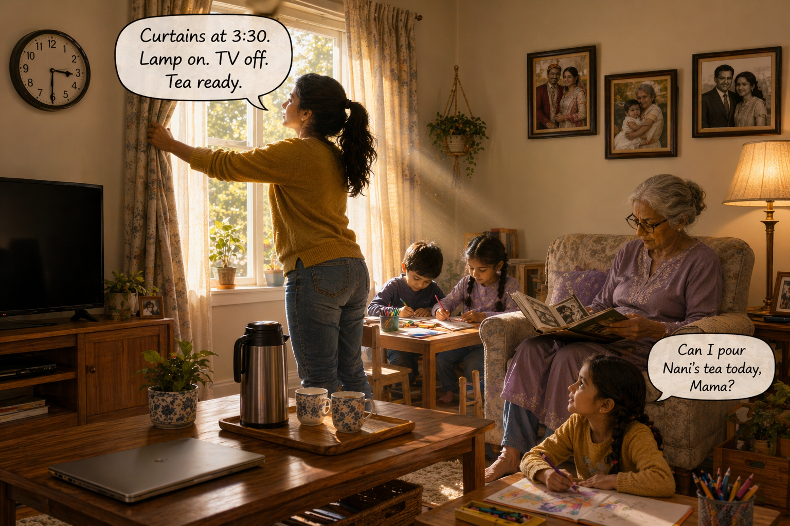

Image Prompt

Contemporary photorealistic illustration, 16:9 wide-landscape format. The same living room, bright and bustling, at exactly 3:30 PM (clock visible on wall). **Priya** (in jeans and a mustard-yellow sweater, hair in a ponytail) is in action mode in the CENTER-LEFT of the frame, reaching up to PULL OPEN a tall set of curtains — afternoon sunlight is pouring in past her hand, making a bright diagonal shaft across the room. Her laptop is closed on the coffee table (she has stopped work for this). On the RIGHT, a warm floor lamp is newly switched on. On the FAR LEFT, the TV is off (screen black). A new detail: a small cushion with a soft lavender fabric on Anita's usual armchair. On the coffee table, a thermos of tea and two small ceramic cups set out. The grandchildren are quietly coloring at a low table by the window, in the warm light. **Anita** is visible on the right side of the frame in her armchair, reading glasses on, thumbing through an old photo album — calm, still in the before-the-storm hours. Color palette: warm gold afternoon light, cream walls, mustard yellow, soft lavender accents. Emotional tone: the preparation, the ritual of protection, a home being re-engineered with love.

**Speech bubble 1** — tail pointing to **Priya** (center-left, opening curtains), positioned above her: "Curtains at 3:30. Lamp on. TV off. Tea ready."

**Speech bubble 2** — tail pointing to the **little girl** (bottom right, coloring), small and cheerful, positioned above her: "Can I pour Nani's tea today, Mama?"

Generate the image immediately without asking clarifying questions.

**Narrative:** The next week Priya ran an experiment. At 3:30 every afternoon she stopped work, opened every curtain in the living room, turned on the warm floor lamp, switched off the television, and set out a thermos of tea and two cups. She called it the Four O'Clock Shift. The children, who had understood more than anyone realized, asked if they could help. The nine-year-old became the official tea-pourer. The six-year-old became the official curtain-opener. Anita, watching all of this from her armchair, did not know what any of it meant. She only knew that the light was beautiful.

---

## Panel 9: The Tea Ritual

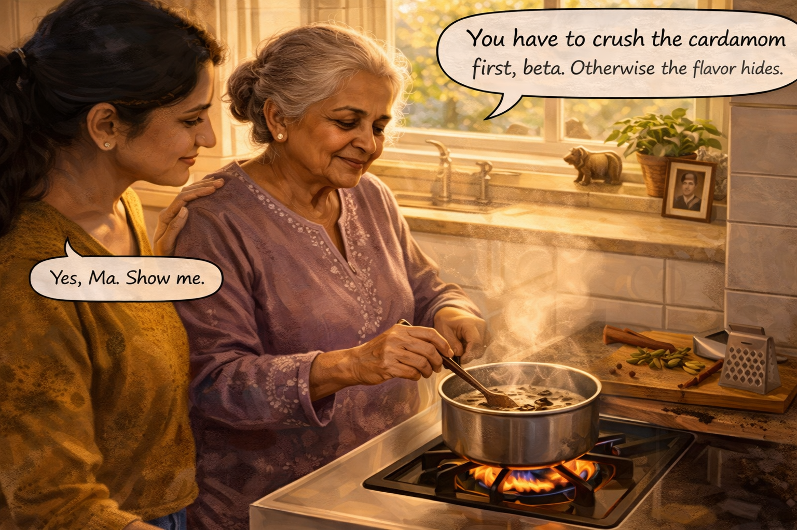

Image Prompt

Contemporary photorealistic illustration, 16:9 wide-landscape format. Warm bright kitchen scene, 3:45 PM. **Priya** (LEFT of frame) and **Anita** (CENTER of frame) are standing together at the stove making chai from scratch. A small saucepan on a low flame has milk simmering with black tea leaves floating on top. On a wooden cutting board beside the stove: small green cardamom pods, a knob of fresh ginger being grated, a cinnamon stick, black peppercorns — all the familiar ingredients of Indian masala chai. Anita is holding a small wooden spoon, stirring the pot slowly with the confident motion of someone who has made this a thousand times — her shoulders are relaxed, her face serene, her eyes soft. Priya watches her mother-in-law with a small grateful smile, one hand resting lightly on Anita's back. The steam from the chai rises in soft curls toward the window, where warm afternoon sunlight pours in. On the windowsill: a small brass elephant figurine, a potted tulsi plant, a framed photo of Anita's late husband as a young man. Color palette: warm ambers, the orange glow of the stove flame, spice-colored browns and greens. Emotional tone: muscle memory, dignity, the hands remembering what the mind forgets.

**Speech bubble 1** — tail pointing to **Anita** (center, stirring), positioned above her in a soft calm style: "You have to crush the cardamom first, beta. Otherwise the flavor hides."

**Speech bubble 2** — tail pointing to **Priya** (left), positioned above her, small and warm: "Yes, Ma. Show me."

Generate the image immediately without asking clarifying questions.

**Narrative:** Priya added one more piece to the ritual: making chai *together*. Not chai for Anita. Chai with Anita. The muscles in Anita's hands remembered what her mind had forgotten — the cardamom crushed with the flat of a knife, the ginger grated into the milk, the careful stir that meant the tea was almost ready. The brain that loses names late in Alzheimer's disease often keeps what doctors call *procedural memory* much longer. Anita could not remember that she had taught Priya this recipe twenty years ago. But her hands remembered every step. And every step was a form of being herself again.

---

## Panel 10: 4:10 PM, Peace

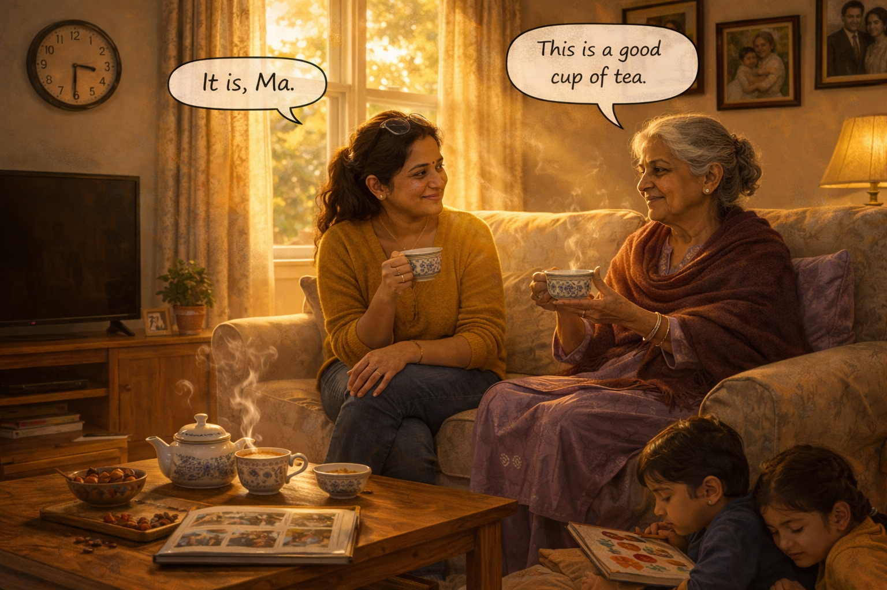

Image Prompt

Contemporary photorealistic illustration, 16:9 wide-landscape format. The living room at 4:10 PM (clock visible above the TV, which is off). **Priya** and **Anita** sit together on the cream-colored sofa, angled toward each other. The curtains are wide open; golden late-afternoon sunlight pours across the room in long warm beams, catching dust motes and the curl of steam from the small teapot on the coffee table. Each woman holds a small ceramic teacup in her hands. **Anita** (on the RIGHT) is wearing the lavender kurta and maroon shawl — no coat, no handbag, no tension in her shoulders — her face calm, a small soft smile as she watches the steam rise from her cup. **Priya** (on the LEFT) has her legs tucked under her, glasses pushed up on her head, shoulders finally dropped from their usual caregiver hunch, looking at her mother-in-law with visible love. Between them on the coffee table: the teapot, a small dish of almonds and dates, an open photo album showing old pictures from India. The two grandchildren are curled up on the rug at the women's feet, quietly drawing, half-dozing in the warm light. Color palette: rich ambers, warm lavenders, cream, the gold of afternoon light. Emotional tone: the storm did not come, and we built this together.

**Speech bubble 1** — tail pointing to **Anita** (right, on sofa), positioned above her, small and content: "This is a good cup of tea."

**Speech bubble 2** — tail pointing to **Priya** (left, on sofa), positioned above her, warm and quiet: "It is, Ma."

Generate the image immediately without asking clarifying questions.

**Narrative:** The four o'clock hour came. Priya held her breath. Anita sipped her tea. The light was rich. The television was silent. The children were drawing on the rug. And somewhere between 4:05 and 4:15, the storm that used to arrive on schedule did not arrive. Priya realized she had been waiting for it — her shoulders tense, listening for the sound of the front door handle. Nothing. Only steam, and tea, and her mother-in-law humming a song from 1962. Priya cried a little, quietly, into her cup. This time from relief.

---

## Panel 11: A Harder Day

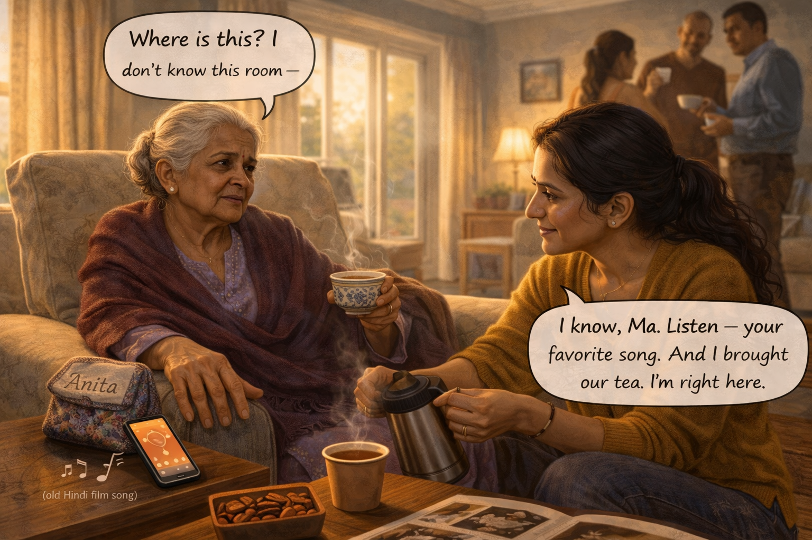

Image Prompt

Contemporary photorealistic illustration, 16:9 wide-landscape format. Interior of a suburban cousin's living room in another town — clearly an unfamiliar space, a family gathering in the background. It is 4:20 PM and **Anita** (in the CENTER-LEFT of the frame) is in an armchair by a picture window but showing the early signs of sundowning: her hand gripping the armrest, her eyes anxious, looking around the unfamiliar room as extended family chat in the background. On the RIGHT side of the frame, **Priya** is crouched beside Anita's chair, in calm capable mode — she has already: opened the curtains wide (bright light is now streaming in, a soft orange), propped her phone nearby playing an old Hindi film song (musical notes suggested as small curly icons coming from the phone speaker), pulled a small travel thermos from her tote bag, and is in the middle of pouring chai into a paper cup. Her face is steady, her posture protective — this is a woman who knows her tools now. In the background, blurred and soft-focused, three relatives stand chatting with teacups. A small embroidered travel pouch with **Anita's** name sewn on it is visible on the armrest — clearly Priya's now-practiced "four o'clock kit." Color palette: slightly cooler light than the home scenes, but the warm amber of the phone screen, the chai steam, and the curtain-sun pushing back against it. Emotional tone: harder day, real life, but handled — skill, not luck.

**Speech bubble 1** — tail pointing to **Anita** (center-left, in armchair), positioned above her, slightly shaky: "Where is this? I don't know this room —"

**Speech bubble 2** — tail pointing to **Priya** (right, crouched beside chair), positioned near her, calm and low-voiced: "I know, Ma. Listen — your favorite song. And I brought our tea. I'm right here."

**Speech bubble 3** — a small bubble with musical notes (♪ ♪) coming from the **phone** on the side table, tail pointing to the phone: "♪ ♪ (old Hindi film song)"

Generate the image immediately without asking clarifying questions.

**Narrative:** Of course it wasn't perfect. Travel was hard. Holidays were hard. A rainy afternoon with the curtains drawn was hard. A new bathroom at a cousin's house was hard. But Priya had tools now. She packed what she called the Four O'Clock Kit: a thermos of chai, a folded shawl, a small speaker, a playlist of songs Anita had grown up with, and a printed card she would quietly hand to unfamiliar hosts that read *"My mother-in-law has Alzheimer's. Late afternoons can be hard. Please don't be offended if we need to step away."* The kit did not stop every storm. But it shortened them. And Priya stopped feeling ambushed.

---

## Panel 12: Six Months Later

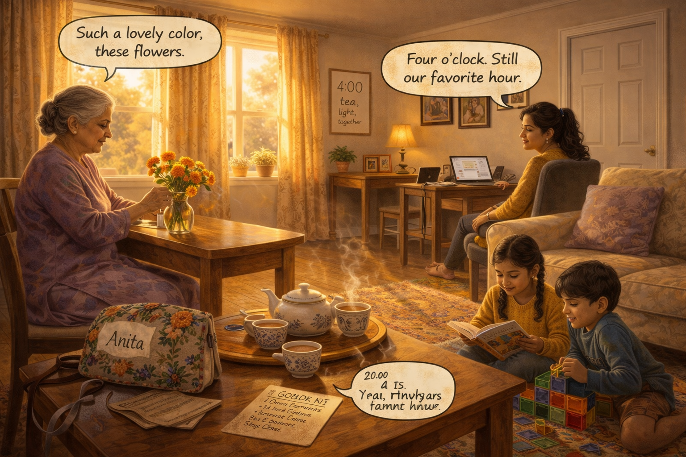

Image Prompt

Contemporary photorealistic illustration, 16:9 wide-landscape format. The family living room at 4:00 PM, six months after panel 2 — the exact same room, same clock, same sofa, same door. But the entire emotional temperature has changed. The curtains are thrown wide; golden autumn afternoon light fills the whole room. **Anita** (on the LEFT) sits at the dining table near the window, gently arranging a small vase of marigolds in warm oranges and yellows — calm, humming, content. **Priya** (CENTER-RIGHT) is at her desk in the corner, laptop open, but turned slightly in her chair so she can see her mother-in-law, a soft smile on her face; she is not tensed, not listening for trouble. The **little girl** is on the floor reading a book aloud to the **little boy**, who is building something out of magnetic tiles. A warm teapot and four small cups on the coffee table. On the wall, a new addition since panel 2: a simple framed piece of calligraphy in warm brown ink on cream paper that reads **"4:00 — tea, light, together"** — clearly a piece the family made. The clock reads 4:00. The front door is closed and untouched. Color palette: autumn ambers, marigold oranges, cream, warm wood — the palette of peace earned, not inherited. Emotional tone: this is the reward for the work, and it is not dramatic, it is daily.

**Speech bubble 1** — tail pointing to **Anita** (left, at the dining table), positioned above her, soft and to herself: "Such a lovely color, these flowers."

**Speech bubble 2** — tail pointing to **Priya** (center-right, at desk), positioned above her, quiet and inward like a thought: "Four o'clock. Still our favorite hour."

Generate the image immediately without asking clarifying questions.

**Narrative:** Six months later, the family had a new saying, written in the calligraphy the nine-year-old had made in her art class and framed above the sofa: *four o'clock — tea, light, together.* It was not a promise that every afternoon would be gentle. Dementia does not honor promises. But it was a commitment to meet the hour with a plan instead of fear. Anita still had hard days. Priya still had hard days. But four o'clock was no longer the name of a storm. It was the name of a ritual — and in a disease that steals rituals, the Sharma family had built a new one, on purpose, together.

---

## Epilogue: What This Family Learned

| Challenge | Response | Lesson for Today |
|---|---|---|
| Anita's sudden agitation at 4 PM every afternoon | Priya called the Alzheimer's Association helpline and learned the name *sundowning* | When a behavior has a pattern, it has a name. Names mean strategies. |
| Trying to reason with Anita, showing her family photos | Switched to validating her feeling ("You miss your mother") instead of correcting her facts | In dementia, the emotional truth matters more than the factual one. |
| A dim room and a droning TV at dusk | Opened curtains at 3:30, warm lamp on, television off | Light and sound matter more than caregivers realize — treat them as medication. |
| Anita losing the self she knew in the storms | A shared chai-making ritual using procedural memory | The hands often remember what the mind has forgotten. Build around what still works. |
| Travel and holidays disrupting the routine | The Four O'Clock Kit — thermos, shawl, playlist, hand-card for hosts | Portable rituals travel. So does the skill you have learned. |
| Priya drowning alone in the bathroom at 7 PM | Reached out to the helpline, then a local caregiver support group | You cannot do this alone. Asking for help is the first caregiving skill, not the last. |

## A Note to the Reader

If your afternoons feel like Priya's first Tuesday — if a gentle
parent or spouse becomes someone you do not recognize when the
light goes gray — please know that you have not done anything
wrong. Sundowning is common. It has a name. And with some
detective work and some small changes to light, routine, and
ritual, many families find that the four o'clock hour can become
theirs again.

You are not alone. The **Alzheimer's Association 24/7 Helpline
(1-800-272-3900)** is free, confidential, and open every minute
of every day — including four o'clock.

## Quotes From the Story

> "So it's not her. It's a pattern. Patterns I can work with." — *Priya*

> "You have to crush the cardamom first, beta. Otherwise the flavor hides." — *Anita*

> "Four o'clock — tea, light, together." — *the family's written ritual*

## References

1. [Wikipedia: Sundowning](https://en.wikipedia.org/wiki/Sundowning) - Overview of the sundowning phenomenon seen in many people with dementia and Alzheimer's disease
2. [Wikipedia: Alzheimer's disease](https://en.wikipedia.org/wiki/Alzheimer%27s_disease) - The most common cause of dementia and the most common underlying condition associated with sundowning
3. [Wikipedia: Procedural memory](https://en.wikipedia.org/wiki/Procedural_memory) - The long-lasting "how-to" memory system that often remains accessible even as declarative memory fades, explaining why familiar rituals like cooking chai still work
4. [Alzheimer's Association: Sleep Issues and Sundowning](https://www.alz.org/help-support/caregiving/stages-behaviors/sleep-issues-sundowning) - Practical guidance on recognizing and responding to sundowning, from the leading U.S. patient advocacy organization
5. [National Institute on Aging: Tips for Coping with Sundowning](https://www.nia.nih.gov/health/alzheimers-changes-behavior-and-communication/tips-coping-sundowning) - Evidence-based strategies from the U.S. government's primary aging research agency
