# The Grab Bar We Should Have Put Up

*Prevention is paperwork you are grateful for later*

<!-- 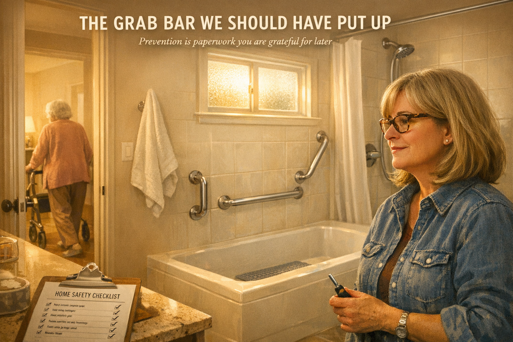 -->

Cover Image Prompt

Contemporary photorealistic illustration, warm cinematic tone, 16:9 wide-landscape format. A small suburban bathroom, warm and clean, with a newly installed stainless steel **grab bar** mounted beside a white bathtub and a matching grab bar inside the shower area. Morning light pours through a frosted window above the tub. A small non-slip mat inside the tub. A fresh white towel on a hook. In the foreground at a safe distance, **Sandra**, age 50, white woman with shoulder-length ash-blonde hair, tortoise-shell glasses, in a denim work shirt with sleeves rolled up and a small screwdriver in her hand, looking at the completed installation with a quiet satisfaction and a faint shadow of regret. On the bathroom counter beside her: a small clipboard with a printed "HOME SAFETY CHECKLIST" — items checked off. Through the open bathroom door, a hallway where **Georgia**, age 79, slim older white woman with soft gray hair, pink house cardigan, soft brown slacks, moves slowly with a three-wheel walker, back to her own life. Color palette: warm creams, soft morning yellow, the cool silver of the grab bars, pale blush pink. Emotional tone: learning-late, but learning well.

Title text overlay centered at top in clean modern sans-serif: "THE GRAB BAR WE SHOULD HAVE PUT UP" in warm white. Subtitle in smaller italic: "Prevention is paperwork you are grateful for later"

Generate the image immediately without asking clarifying questions.

## Narrative Prompt

This is a fictional composite story built from the experience of thousands of adult children caring for a parent with early dementia. Sandra and Georgia are invented characters, but every moment here — the "I'll get to it" grab bar, the fall in the tub, the hospital, the hard weekend of real home-proofing — is drawn from the reality of falls in older adults with dementia, the single biggest preventable cause of sudden decline. The story teaches one clear skill: a room-by-room home-safety audit that takes one weekend and buys years of safer living at home. Art style: contemporary photorealistic illustration, warm intimate domestic tone, present-day suburban America.

## Prologue

One in three adults over the age of 65 falls every year. A single fall is not always catastrophic. But for a person with dementia, one bad fall — a broken hip, a head injury, two weeks in a hospital bed — can accelerate cognitive decline faster than almost anything else the disease does on its own. The weekend it takes to install grab bars, rip up throw rugs, add night-lights, and fix the stairs can save years of independent living. It is, without exaggeration, the highest-value weekend of a caregiver's year. This is the story of how one family learned that — the hard way.

---

## Panel 1: Mom Is Doing Great

<!-- 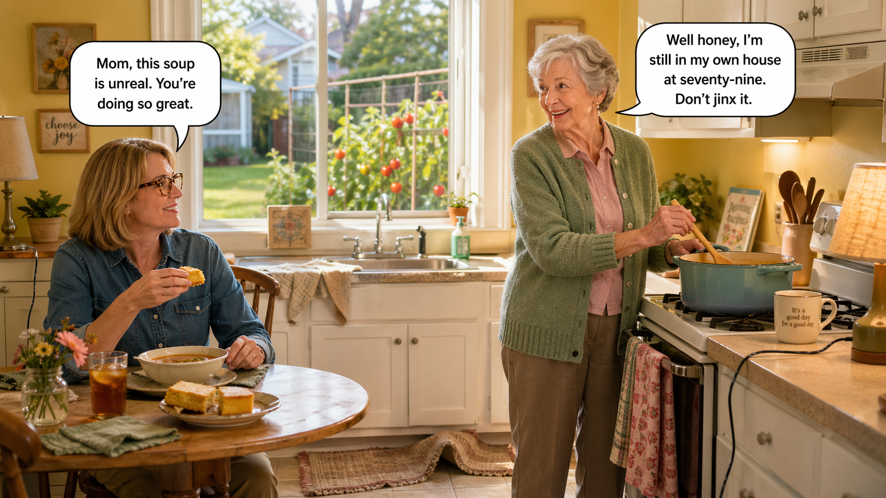 -->

Image Prompt

Contemporary photorealistic illustration, 16:9 wide-landscape format. A sunny Sunday afternoon in **Georgia's** small, tidy kitchen. **Georgia** (79, slim older white woman with soft gray hair neatly styled, pink house cardigan, soft brown slacks, no walker yet) stands at the stove cheerfully stirring a pot of soup. **Sandra** (50, white woman, ash-blonde bob, tortoise-shell glasses, denim button-down, khaki pants) sits at a small kitchen table eating a piece of cornbread, happy and relaxed. Through the window behind them: a neatly-kept backyard with a small garden of late-summer tomatoes. The kitchen has subtle but noticeable hazards that the camera hints at without hitting too hard: a small throw rug bunched slightly at the edge of the sink (foreground detail), a coffee mug positioned near the stove, a loose electrical cord running from a lamp. Color palette: buttery yellows, soft pinks, sage green of the cardigan. Emotional tone: warm false-security, love in a room that is not yet safe.

**Speech bubble 1** — tail pointing to **Sandra** (at table), positioned above her, warm and casual: "Mom, this soup is unreal. You're doing so great."

**Speech bubble 2** — tail pointing to **Georgia** (at stove), positioned above her, pleased: "Well honey, I'm still in my own house at seventy-nine. Don't jinx it."

Generate the image immediately without asking clarifying questions.

**Narrative:** Sandra visited her mother on Sunday afternoons. Georgia, at seventy-nine, was still in her own house, cooking her own soup, tending her own tomatoes. Her Alzheimer's was mild — she forgot birthdays and sometimes where she had put her glasses, but the thread of her days was still her own. Sandra was proud of her mother. She was proud of herself, too, for keeping her mother at home. She had a little list in her head of small improvements she had been meaning to make around the house: a grab bar in the tub, some night-lights in the hall, a fresh coat of paint on the stair treads. She had been meaning to. It was on the list.

---

## Panel 2: The List That Stayed on the List

<!-- 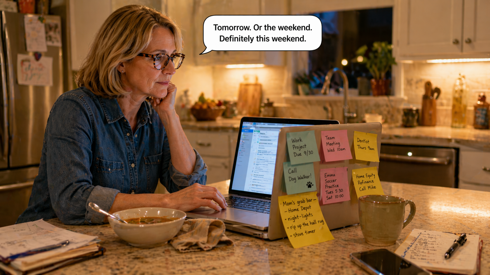 -->

Image Prompt

Contemporary photorealistic illustration, 16:9 wide-landscape format. **Sandra** sits at her own kitchen counter at home that evening, her laptop open, a half-eaten bowl of soup, and a sticky note on the laptop screen with handwritten items: *"Mom's grab bar — Home Depot,"* *"night-lights,"* *"rip up the hall rug,"* *"stove timer."* The sticky note is crowded with more sticky notes from other tasks — work meetings, a work project, a dentist appointment, a dog-walker reminder, her daughter's soccer practice schedule, a home-equity refinance reminder. The note about Mom is slowly slipping off the edge. She is scrolling through work email, not looking at the sticky note. A mug of coffee. Color palette: warm kitchen lighting, the yellow pop of the sticky note, the cool blue of the laptop screen. Emotional tone: the ordinary way important things get quietly deferred.

**Speech bubble 1** — tail pointing to **Sandra**, positioned above her, casual thought: "Tomorrow. Or the weekend. Definitely this weekend."

Generate the image immediately without asking clarifying questions.

**Narrative:** That Sunday evening at home, Sandra opened her laptop. The sticky note with the words *"Mom's grab bar — Home Depot"* was slowly being pushed off the screen by newer sticky notes — a work deadline, her daughter's cleats, a dog-grooming appointment. She looked at the sticky note and thought, *Tomorrow. Or the weekend. Definitely this weekend.* She had thought that the weekend before, too. And the weekend before that. She was a good daughter with a busy life. The list stayed on the list.

---

## Panel 3: The Phone Call

<!-- 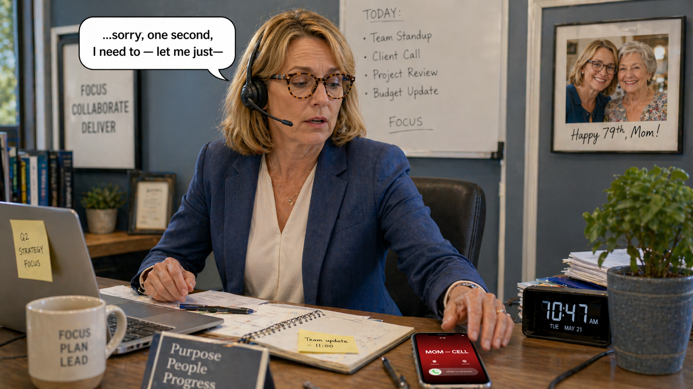 -->

Image Prompt

Contemporary photorealistic illustration, 16:9 wide-landscape format. Sandra's office at work, Tuesday morning 10:47 AM. **Sandra** is at her desk in a small pleasant office, headset on her ear during a video call — she is mid-sentence, professional expression. Her personal cell phone on the desk has just lit up with an incoming call labeled "MOM — CELL" in large letters. Her eyes have just flicked to the phone screen; the blood has started to drain from her face. Behind her on the wall: a framed photo of Georgia and Sandra at a recent birthday. Color palette: cool office blues, the bright warning red of the phone call indicator, her warm skin going pale. Emotional tone: the before-and-after second of every caregiver's life.

**Speech bubble 1** — tail pointing to **Sandra**, positioned above her, on the work call but distracted: "...sorry, one second, I need to — let me just—"

*(On the phone screen: the call-ID clearly reads "MOM — CELL.")*

Generate the image immediately without asking clarifying questions.

**Narrative:** On Tuesday at 10:47 AM, Sandra's cell phone lit up in the middle of a work video call. *MOM — CELL.* Her mother never called during the workday. Sandra excused herself and answered in the hallway. The voice on the other end was not her mother. It was a paramedic named Javier. "Ma'am, your mother is okay — she's awake and talking. But she slipped in the tub. We're taking her to Providence Memorial."

---

## Panel 4: The Hospital Bed

<!-- 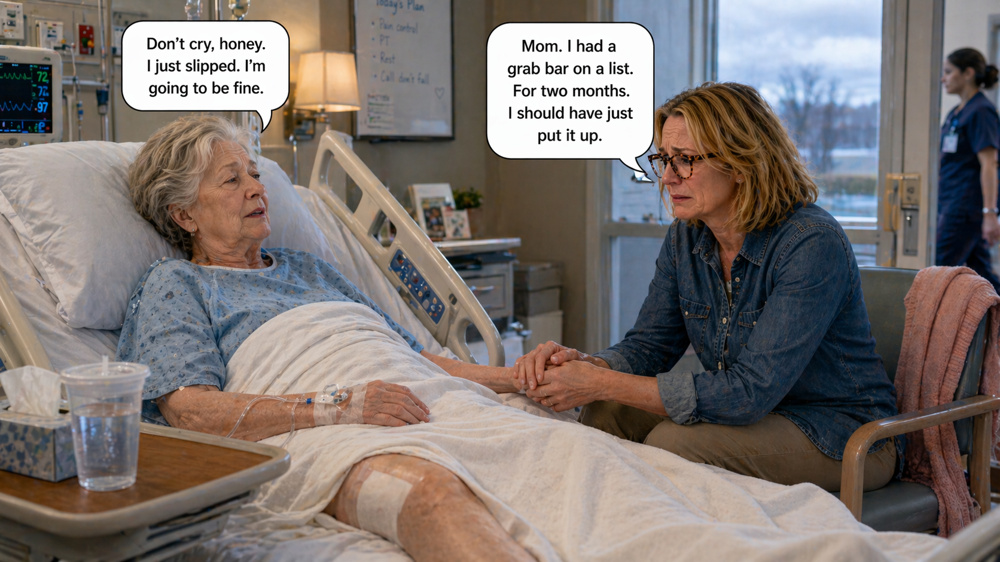 -->

Image Prompt

Contemporary photorealistic illustration, 16:9 wide-landscape format. A hospital room. **Georgia** lies in a hospital bed, a white blanket pulled up to her chest, an IV line in her arm, a soft blue hospital gown. Her left hip has a small obvious dressing under the blanket; her leg is slightly elevated. She looks pale, tired, a little disoriented. A wheeled bedside tray with a plastic cup of water and a small box of tissues. **Sandra** sits in a bedside chair, leaning forward, both hands holding one of her mother's hands, her face ragged with regret. She has not brushed her hair since the call. Monitors beep softly. A window shows the overcast afternoon. A nurse walks past the doorway in the background. Color palette: clinical pale blues and whites, the muted pink of Georgia's cardigan on the chair nearby, a single warm amber lamp. Emotional tone: the "I should have" weight of a preventable injury.

**Speech bubble 1** — tail pointing to **Georgia** (in bed), positioned above her, faint and gentle: "Don't cry, honey. I just slipped. I'm going to be fine."

**Speech bubble 2** — tail pointing to **Sandra**, positioned above her, quiet and broken: "Mom. I had a grab bar on a list. For two months. I should have just put it up."

Generate the image immediately without asking clarifying questions.

**Narrative:** Her mother had slipped stepping out of the tub. She had landed hard on the bathroom floor and broken her left hip. She had crawled on her elbows to where her cell phone had fallen and called 911. It had taken her fourteen minutes. At the hospital, Georgia was pale and apologetic. "Don't cry, honey. I just slipped. I'm going to be fine." Sandra sat by the bed holding her mother's hand. The sticky note was still on her laptop at home. *Grab bar. Home Depot.* She closed her eyes and whispered, "I had it on a list. I should have just put it up."

---

## Panel 5: The Rehab Decline

<!-- 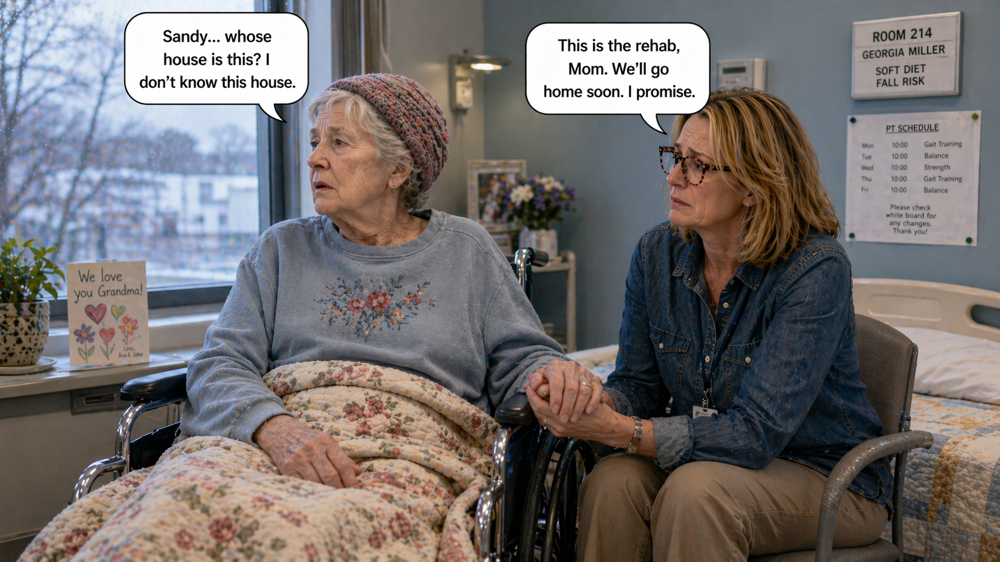 -->

Image Prompt

Contemporary photorealistic illustration, 16:9 wide-landscape format. A rehabilitation-facility room, two weeks after panel 4. **Georgia** sits in a wheelchair by a window, a floral blanket over her legs, a small knit cap on her head. Her expression is different from any previous panel — softer, more distant, with a slight puzzled quality. She is looking out the window without really seeing it. **Sandra** sits in a chair beside her, her mother's hand in hers, her face sad and watchful. A small name tag above Georgia's bed reads "ROOM 214 — GEORGIA MILLER — SOFT DIET — FALL RISK." A physical therapist's printed schedule hangs on the wall. A get-well card from grandchildren. Color palette: institutional pale blues, soft grays, a single warm quilt. Emotional tone: the real, quiet danger of post-fall decline.

**Speech bubble 1** — tail pointing to **Georgia** (in wheelchair), positioned above her, soft and confused: "Sandy... whose house is this? I don't know this house."

**Speech bubble 2** — tail pointing to **Sandra**, positioned above her, small and hurting: "This is the rehab, Mom. We'll go home soon. I promise."

Generate the image immediately without asking clarifying questions.

**Narrative:** Two weeks in rehab changed more than Georgia's hip. It changed her mind. The foreign room, the different beds, the medications for pain and sleep, the loss of her daily routine — all of it pressed down on a brain that had been managing fine on familiar tracks. Georgia began to ask questions she had not asked before. "Whose house is this?" "Where is my cat?" "When is my husband coming?" (Her husband had died in 2017.) The neurologist called it *hospital-associated decline.* Sandra called it what it was: her mother's Alzheimer's, worse. The fall had not broken only a bone.

---

## Panel 6: The Home-Safety Booklet

<!-- 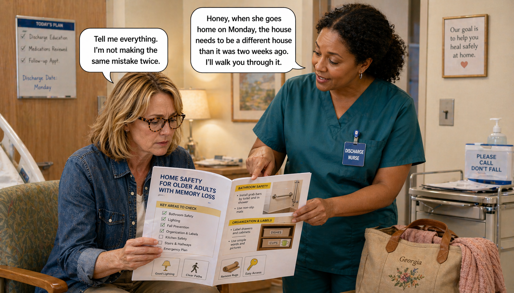 -->

Image Prompt

Contemporary photorealistic illustration, 16:9 wide-landscape format. Georgia's hospital-discharge room. **Sandra** sits in a chair reading a printed booklet labeled *"HOME SAFETY FOR OLDER ADULTS WITH MEMORY LOSS"* — pages visible with checklists, photos of grab bars, labeled drawers, simple home-safety icons. Her shoulders are hunched forward in concentration. Next to her, a kind **discharge nurse** (Black woman in her 40s, teal scrubs, a compassionate face) stands gently pointing at an item on the booklet. A rolling medical cart nearby, a small bag of Georgia's personal effects. Georgia is out of frame. Color palette: warm creams, teal scrubs, the bright yellow of the highlighted items in the booklet. Emotional tone: a daughter becoming her mother's safety engineer.

**Speech bubble 1** — tail pointing to the **nurse**, positioned above her, warm and clear: "Honey, when she goes home on Monday, the house needs to be a different house than it was two weeks ago. I'll walk you through it."

**Speech bubble 2** — tail pointing to **Sandra**, positioned above her, determined: "Tell me everything. I'm not making the same mistake twice."

Generate the image immediately without asking clarifying questions.

**Narrative:** At the rehab discharge meeting, a kind nurse named Yvonne pressed a small stapled booklet into Sandra's hands: *Home Safety for Older Adults with Memory Loss.* "Honey," Yvonne said, "when your mother goes home on Monday, the house needs to be a different house than it was two weeks ago. I'll walk you through it." Sandra nodded hard. "Tell me everything." Yvonne gave her a ballpoint pen. They went through the booklet room by room. Sandra made notes in the margins. By the end, a two-page checklist had become the longest Saturday of her life — and the best Saturday of her year.

---

## Panel 7: The Bathroom

<!-- 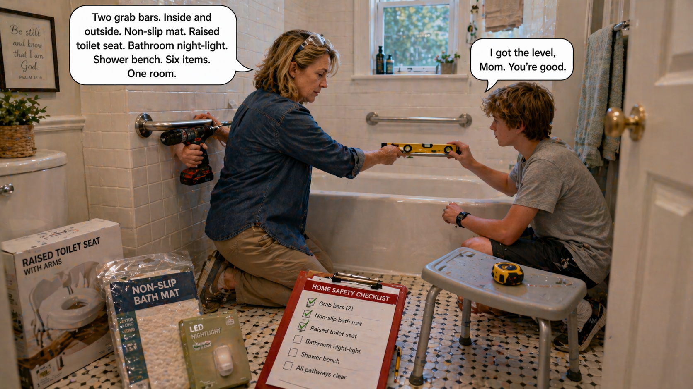 -->

Image Prompt

Contemporary photorealistic illustration, 16:9 wide-landscape format. Georgia's small bathroom. **Sandra** is on her knees beside the bathtub, drill in hand, installing a **stainless-steel grab bar** into the tile wall above the tub's outer edge. A second, completed grab bar is already mounted on the far wall of the tub. She is concentrating hard, protective goggles pushed up on her head. Spread across the bathroom floor: a new raised toilet seat still in its box, a non-slip bath mat in clear plastic, a nightlight for the bathroom, a small shower-bench stool, and the **HOME SAFETY CHECKLIST** clipboard with the top three items checked off. Her teenage son **Tyler** (16, sandy hair, gray T-shirt, focused expression) is kneeling beside her holding the drill's level. Color palette: clean whites, stainless silver, a pop of the bright red checklist and yellow measuring tape. Emotional tone: love turned practical, work that matters.

**Speech bubble 1** — tail pointing to **Sandra**, positioned above her, focused: "Two grab bars. Inside and outside. Non-slip mat. Raised toilet seat. Bathroom night-light. Shower bench. Six items. One room."

**Speech bubble 2** — tail pointing to **Tyler**, positioned above him, serious: "I got the level, Mom. You're good."

Generate the image immediately without asking clarifying questions.

**Narrative:** Saturday began at 7 AM. Sandra's teenage son Tyler came to help. They started in the bathroom — the room where it had all gone wrong. Two stainless-steel grab bars. A non-slip bath mat. A raised toilet seat. A simple motion-activated night-light in the outlet. A shower bench so Georgia could sit while she bathed. Sandra checked each item off the clipboard Yvonne had given her. "Six items. One room." Tyler held the level. Sandra drilled the holes. The grab bars went into the wall the way they should have gone in six months ago.

---

## Panel 8: The Floors

<!-- 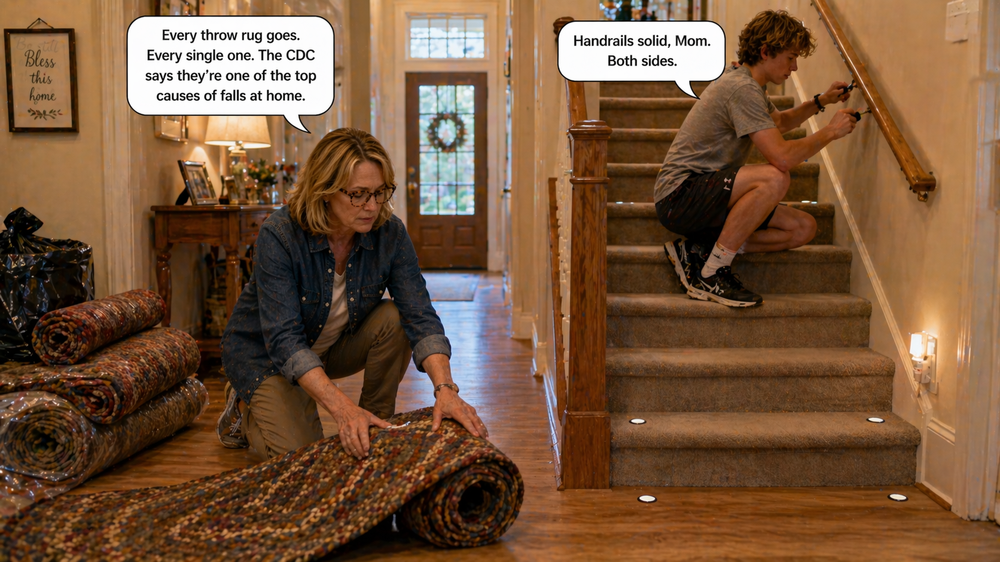 -->

Image Prompt

Contemporary photorealistic illustration, 16:9 wide-landscape format. Georgia's front hallway and entryway. **Sandra** and **Tyler** are rolling up an old braided throw rug — the exact kind of loose rug that causes falls. A small pile of rolled-up rugs sits by the front door, destined for the trash or the basement. On the hallway carpet now laid bare, small round bright-reflective safety dots have been added at the top and bottom of the stairs. A new motion-activated night-light glows softly at the foot of the stairs. The stair handrails are being reinforced — Tyler is at the top of the stairs tightening the handrail brackets with a screwdriver. Color palette: warm wooden browns, cream walls, the soft orange glow of the new night-light. Emotional tone: steady focused progress.

**Speech bubble 1** — tail pointing to **Sandra** (rolling up the rug), positioned above her, firm: "Every throw rug goes. Every single one. The CDC says they're one of the top causes of falls at home."

**Speech bubble 2** — tail pointing to **Tyler** (tightening handrail), positioned above him: "Handrails solid, Mom. Both sides."

Generate the image immediately without asking clarifying questions.

**Narrative:** Next, the floors. Sandra had read that throw rugs were one of the top causes of falls at home. Georgia had four of them. They rolled up every single one, even the pretty one from her grandmother. They replaced them with nothing — bare floor was safer. They tightened every handrail on the staircase. They added reflective bright tape to the top and bottom step and a motion-activated night-light at the foot of the stairs. A pair of rubber-soled house slippers replaced the soft mule-style slippers Georgia had always worn. Two rooms. Twenty items.

---

## Panel 9: The Kitchen

<!-- 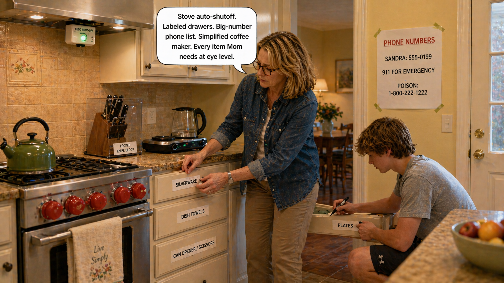 -->

Image Prompt

Contemporary photorealistic illustration, 16:9 wide-landscape format. Georgia's kitchen. **Sandra** has installed a small **auto-shutoff device** under the stove hood (a visible gadget with a small green LED). She is labeling kitchen drawers with large printed sticky labels: *"SILVERWARE,"* *"DISH TOWELS,"* *"CAN OPENER / SCISSORS,"* *"PLATES."* The sharp knives have been moved to a locked knife block. The stove has new bright-red knob covers. On the counter: a simplified two-burner electric kettle (replacing a more complicated coffee maker Georgia used to use). Near the door to the kitchen: a large printed "PHONE NUMBERS" sheet taped to the wall — *"SANDRA: 555-0199 / 911 FOR EMERGENCY / POISON: 1-800-222-1222."* Tyler is writing labels on another drawer. Color palette: buttery kitchen yellows, cream cabinets, bright red and lime green accents from the safety devices. Emotional tone: a kitchen re-engineered with love.

**Speech bubble 1** — tail pointing to **Sandra**, positioned above her, methodical: "Stove auto-shutoff. Labeled drawers. Big-number phone list. Simplified coffee maker. Every item Mom needs at eye level."

Generate the image immediately without asking clarifying questions.

**Narrative:** The kitchen was harder. Georgia had always cooked. Her kitchen was her kingdom. Sandra did not want to strip the kitchen of that — she just wanted to make it safer. She installed an automatic stove shut-off (a small device that cut power to the burners after a set time if nobody was stirring). She replaced the complicated coffee maker with a simple one-button electric kettle. She put the sharp knives in a single locked drawer. She labeled every other drawer with large printed labels — *silverware, towels, plates* — so Georgia could still find her way. She taped a big-print emergency phone list to the wall.

---

## Panel 10: The Bedroom

<!-- 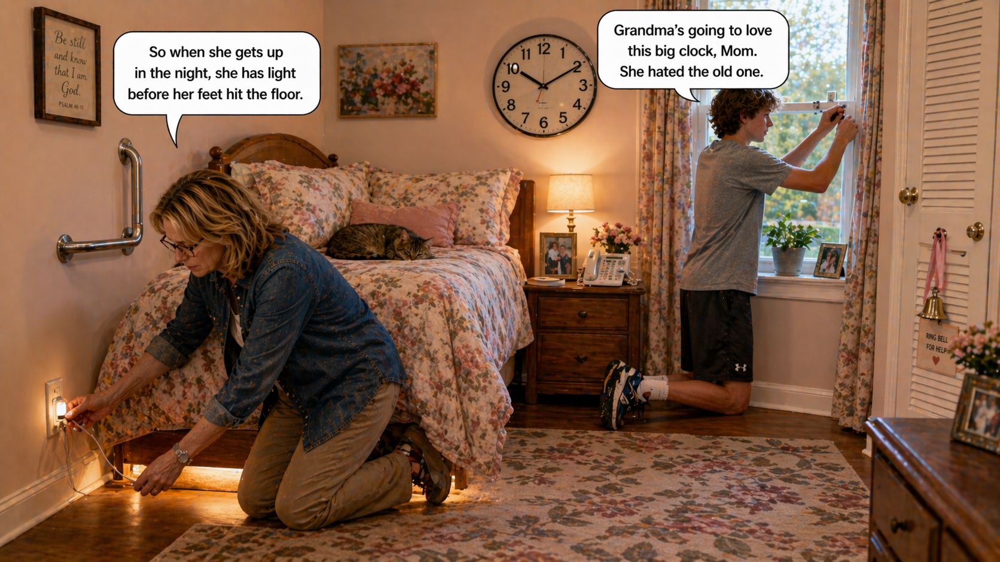 -->

Image Prompt

Contemporary photorealistic illustration, 16:9 wide-landscape format. Georgia's bedroom. A soft floral comforter on the bed. **Sandra** is on her knees next to the bed plugging a small motion-activated **under-bed night-light** into a wall outlet; a warm amber strip of light glows under the bed the moment she plugs it in. The bedroom has additional upgrades: a grab bar beside the bed to help with standing, a bedside landline phone with extra-large buttons, a simple battery-operated wall clock with huge black numbers on a white face, a small bell on a ribbon tied to Georgia's closet door. **Tyler** is at the window fastening a small window-crank guard. A soft brown cat is curled on the pillow, unworried. Color palette: soft pinks and rose-golds, warm wood, the amber glow of the under-bed light. Emotional tone: tenderness turned into small reliable equipment.

**Speech bubble 1** — tail pointing to **Sandra**, positioned above her, gentle: "So when she gets up in the night, she has light before her feet hit the floor."

**Speech bubble 2** — tail pointing to **Tyler**, positioned above him, warm: "Grandma's going to love this big clock, Mom. She hated the old one."

Generate the image immediately without asking clarifying questions.

**Narrative:** The bedroom was last. Sandra added a motion-activated under-bed night-light — so the moment Georgia's feet swung out of bed in the dark, a soft warm glow lit the floor. She added a grab bar beside the bed so Georgia could pull herself up to standing without lurching. She replaced the small clock-radio with a simple wall clock with enormous numbers. She put a landline phone with giant buttons on the nightstand. She tied a small bell to the closet door so if Georgia got up disoriented at night, it would chime. Three rooms. Forty-one items. One long, good Saturday.

---

## Panel 11: Monday — Welcome Home

<!-- 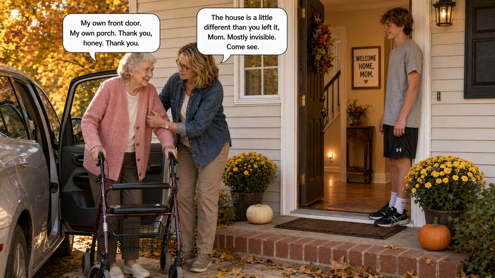 -->

Image Prompt

Contemporary photorealistic illustration, 16:9 wide-landscape format. Monday afternoon, Georgia's front porch. **Sandra** is helping her mother out of the passenger side of a car, holding Georgia's elbow gently as she stands. Georgia is now using a three-wheel walker, her left leg still slightly stiff; she is in her pink cardigan and brown slacks, a small smile of relief on her face at being home. **Tyler** holds the front door open, smiling warmly. Behind the open front door we can see into the hallway — the rugs gone, the new night-light glowing softly at the baseboard, a small framed sign that Sandra made with bold printing: *"WELCOME HOME, MOM."* The autumn yard is full of gold. Color palette: warm golds, the soft pink of Georgia's cardigan, the cream siding of the house. Emotional tone: homecoming to a house made safer with love.

**Speech bubble 1** — tail pointing to **Georgia**, positioned above her, warm and slow: "My own front door. My own porch. Thank you, honey. Thank you."

**Speech bubble 2** — tail pointing to **Sandra**, positioned above her, tender: "The house is a little different than you left it, Mom. Mostly invisible. Come see."

Generate the image immediately without asking clarifying questions.

**Narrative:** On Monday, Sandra and Tyler brought Georgia home. They had washed the windows. They had put fresh flowers on the kitchen table. They had made her bed with her favorite floral sheets. Most of the changes were invisible — a small device under the stove hood, a bar beside the bed, a dot at the top of the stairs. Georgia stood on the porch of her own house leaning on her new walker and looked up at her own front door for the first time in three weeks. "My own porch," she said softly. "Thank you, honey. Thank you."

---

## Panel 12: Two Years Later

<!-- 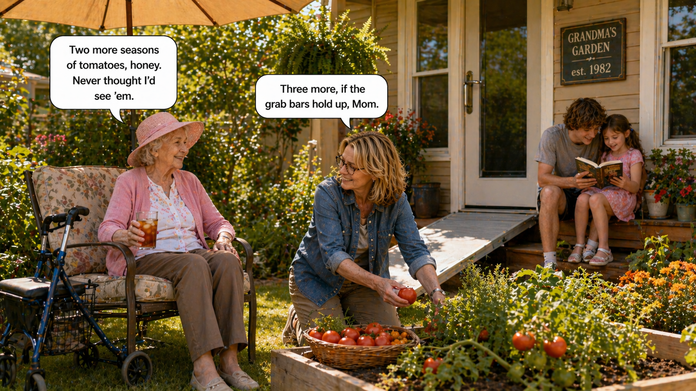 -->

Image Prompt

Contemporary photorealistic illustration, 16:9 wide-landscape format. A warm summer afternoon in Georgia's small backyard, two years after panel 1. **Georgia** sits on a cushioned chair in the shade of a small garden umbrella with a glass of iced tea in one hand, resting peacefully, her walker beside her. **Sandra** is kneeling in a small raised garden bed beside her, picking ripe tomatoes into a shallow basket. **Tyler** (now older, 18, visibly a young man) is sitting on the porch step with a younger niece on his lap, both of them reading a book together. Georgia's back door (visible in the background) has a large single-lever handle that replaced the old doorknob. A wheelchair-ramp board neatly installed over the back step. A sign on the porch reads *"GRANDMA'S GARDEN — est. 1982."* Color palette: bright summer greens, tomato reds, the soft pink of Georgia's sun hat. Emotional tone: the reward of the hard work, years given back.

**Speech bubble 1** — tail pointing to **Georgia**, positioned above her, content: "Two more seasons of tomatoes, honey. Never thought I'd see 'em."

**Speech bubble 2** — tail pointing to **Sandra**, positioned above her, warm: "Three more, if the grab bars hold up, Mom."

Generate the image immediately without asking clarifying questions.

**Narrative:** Two years later, Georgia was still in her own house. Her Alzheimer's continued its slow progression, but the spike of sudden decline that the fall had caused never quite returned to the same level. There were no more falls. The grab bars held. The night-lights kept her steady in the dark. She moved a little slower, with a walker now; she used the shower bench; she took her coffee from the simple kettle. Sandra sat in the garden beside her and picked ripe tomatoes into a basket. "Two more seasons of tomatoes, honey," her mother said. "Never thought I'd see 'em." Sandra smiled. "Three more, if the grab bars hold up, Mom."

---

## Epilogue: What This Family Learned

| Challenge | Response | Lesson for Today |
|---|---|---|
| A home-safety to-do list that stayed on the list | A preventable fall forced the issue | Do not wait for the fall. The weekend of prevention is cheaper than the month of rehab. |
| A fall causing both a broken hip and cognitive decline | Accepted that hospital stays themselves can worsen dementia | One fall can cost years. Prevention is the cheapest medicine. |
| Not knowing where to start | A room-by-room home-safety booklet from the discharge nurse | The Alzheimer's Association and CDC both publish free, specific home-safety checklists. |
| Trying to protect without removing dignity | Labeled drawers, simplified coffee maker, kept the kitchen as *Mom's* | Safety is an *addition,* not a subtraction. Keep the person in the room. |
| The big obvious changes (grab bar, rugs) and the small invisible ones (auto-stove-off, night-lights) | Completed all of them in a single weekend | Most home-safety tools cost under $50 and install in under an hour. |
| Fear that the house would be forever different | Two years later: the house is still Georgia's, just safer | A safer house is a *lived-in* house. Mom still grows her own tomatoes. |

## A Note to the Reader

If you are caring for a parent or spouse with dementia in their
own home, please, please, do not wait for the fall. The single
highest-value weekend of your year as a caregiver is the one
spent on a room-by-room home-safety audit.

**The short version of the checklist:**

- **Bathroom**: two grab bars (inside tub, beside toilet), non-slip mat, raised toilet seat, night-light, shower bench.
- **Floors**: remove every throw rug; no exceptions.
- **Stairs**: two handrails, bright tape on top and bottom steps, a night-light at the foot of the stairs.
- **Kitchen**: stove auto-shutoff, labeled drawers, simpler small appliances, big-print emergency phone list on the wall, lock sharp knives.
- **Bedroom**: motion-activated night-light under the bed, grab bar beside the bed, landline phone with huge buttons, a simple wall clock, a bell on the closet door.

Most of these items cost less than $50 each. All of them can be
installed by a motivated caregiver and a teenager in a single
weekend. The Alzheimer's Association and CDC both publish free
checklists that are more detailed than the one above.

The **Alzheimer's Association 24/7 Helpline (1-800-272-3900)** can
send you resources — and connect you with local groups that
sometimes offer *free volunteer home-safety audits* for families
with a member with dementia.

## Quotes From the Story

> "Mom. I had a grab bar on a list. For two months. I should have just put it up." — *Sandra*

> "Safety is an addition, not a subtraction. Keep the person in the room." — *Yvonne, discharge nurse*

> "Two more seasons of tomatoes, honey. Never thought I'd see 'em." — *Georgia*

## References

1. [Wikipedia: Falls in older adults](https://en.wikipedia.org/wiki/Falling_(accident)#In_older_adults) - Overview of falls as a leading cause of injury in older adults
2. [CDC: STEADI — Older Adult Fall Prevention](https://www.cdc.gov/steadi/index.html) - The CDC's evidence-based falls-prevention program with free checklists
3. [Alzheimer's Association: Home Safety](https://www.alz.org/help-support/caregiving/safety/home-safety) - Plain-language home-safety guide specifically for dementia caregivers
4. [National Institute on Aging: Home Safety Checklist for Alzheimer's Disease](https://www.nia.nih.gov/health/alzheimers-caregiving/home-safety-checklist-alzheimers-disease) - Free room-by-room federal checklist
5. [AARP: Home Safety Audit](https://www.aarp.org/caregiving/home-care/info-2017/home-safety-checklist.html) - Practical caregiver-written checklist for aging at home
