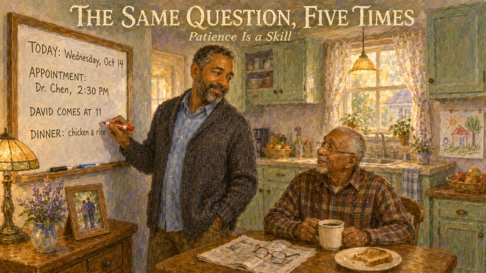
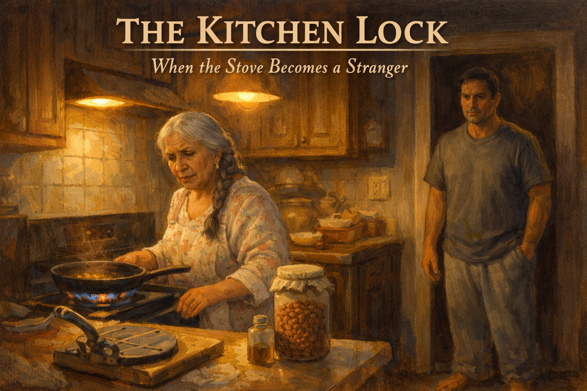
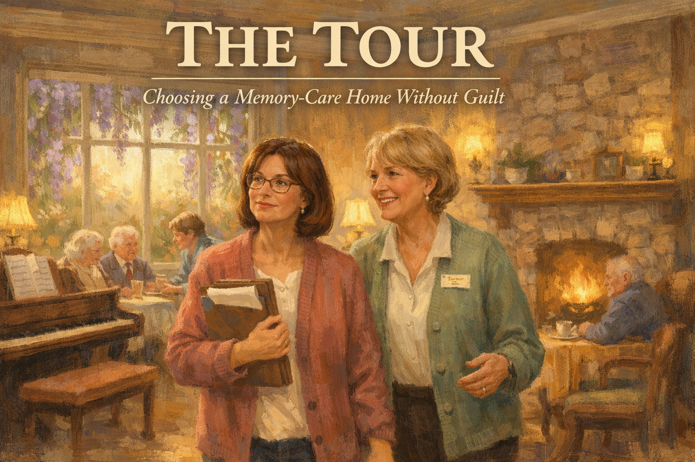

---
hide:
    toc
---
# List of Graphic Novel Stories

These short graphic-novel-style stories bring the textbook's concepts to life through composite caregiver characters. Each story pairs a vivid human moment with the practical lesson a family needs to carry home from it.

-   **[Three Forgotten Keys: When Noticing Becomes Acting](./three-forgotten-keys/index.md)**

    

    Maya watches her mother Gloria search for car keys that are already in her hand. A story about early warning signs, the difference between normal aging and something more, and finding the courage to say the hard sentence: *Mom, we should see a doctor.*

-   **[The Same Question, Five Times: Patience as a Skill](./same-question-five-times/index.md)**

    

    David hears his father ask the same question five times before breakfast. The whiteboard on the kitchen wall, and the shift from annoyance to compassion, is a caregiving skill that can be learned — not a personality trait people either have or don't.

-   **[Car Keys on the Counter: The Hardest Conversation](./car-keys-on-counter/index.md)**

    

    Linda must tell her father Ray, a proud man who has driven for sixty years, that it is time to stop. A story about dignity, risk, and the middle way between silence and confiscation.

-   **[Four O'Clock: A Family's Journey Through Sundowning](./four-oclock/index.md)**

    

    When a gentle grandmother becomes a different person every afternoon at 4 PM, one family learns the name *sundowning* and builds a new ritual of light, tea, and presence to meet the hour with a plan instead of fear.

-   **[The Night He Walked: Wandering and the Layers of Safety](./night-he-walked/index.md)**

    

    Tom wakes at 2 a.m. to find his father Robert missing from the house. A story about wandering, door alarms, medical ID bracelets, and the layered safety net that lets a family sleep again.

-   **[The Morning of Tests: Inside a Dementia Workup](./morning-of-tests/index.md)**

    

    Jasmine takes her grandmother Delphine to a memory-care clinic for a full diagnostic evaluation. A story about what cognitive testing is really like, what the MoCA and MRI actually tell a family, and why a name for the thing can be a relief, not a sentence.

-   **[The Small Orange Pill: What Dementia Medication Can and Can't Do](./small-orange-pill/index.md)**

    

    Elena brings home a bottle of donepezil for her husband Mateo with enormous hope. A story about realistic expectations for Alzheimer's medications, what *slowing decline* actually means, and the side effects a caregiver should know to watch for.

-   **[Patsy Cline on Tuesday: Music That Reaches Past the Fog](./patsy-cline-tuesday/index.md)**

    

    Marcus discovers that his mother Ruth, who barely speaks anymore, can sing every word of a song she loved in 1962. A story about music memory, the brain regions dementia spares last, and the first playlist a son builds for his mother.

-   **[The Grab Bar We Should Have Put Up: A Home Safety Audit](./grab-bar/index.md)**

    

    Sandra's mother Georgia slips in the bathroom. A story about the home-safety audit every dementia family should do — grab bars, night lights, scald-proof faucets, secured rugs — before the fall, not after.

-   **[The Bath: Why Fear, Not Stubbornness, Drives Refusal](./bath/index.md)**

    

    James tries firmness, pleading, and bribery before he understands why his father Arthur refuses to bathe. A story about breaking an overwhelming task into small pieces, offering choice inside routine, and warm towels as the whole thing.

-   **[The Second Breakfast: Correcting vs. Caring](./second-breakfast/index.md)**

    

    Hana learns that correcting her mother Yoko's memory only causes pain. A second bowl of rice, a gentle yes, and a shift from truth-telling to kindness change everything.

-   **[Aunt Rose Is Coming: Stepping Into Her World](./aunt-rose-coming/index.md)**

    

    Barbara keeps waiting for her sister Rose, who died thirty years ago. A story about validation therapy and why it is kinder to join the waiting than to deliver the news of loss again and again.

-   **[The Kitchen Lock: When the Stove Becomes a Stranger](./kitchen-lock/index.md)**

    

    Carlos finds the stove on at 2 a.m. and faces a choice: take the kitchen from his mother Rosa or make it safe. A story about stove-guards, knob covers, and cooking *with* her instead of *instead of* her.

-   **[The Kitchen Table Conversation: Planning Before It's Too Late](./kitchen-table-conversation/index.md)**

    

    Four adult children gather around their mother Eleanor's kitchen table to plan the hard things early — power of attorney, finances, wishes. The conversation saves them years of fighting.

-   **[The Tour: Choosing a Memory Care Home Without Guilt](./the-tour/index.md)**

    

    Denise tours three memory-care communities for her mother Evelyn. A story about what to smell for, what questions to ask, and the truth that moving your loved one is not abandoning them.

-   **[The Last Good Day: Hospice, Music, and Letting Go](./last-good-day/index.md)**

    

    Hospice nurse Joanne guides Bill's family through his final week with music, morphine, permission, and presence. A story of a good ending when there cannot be a cure.

-   **[The Caregiver in the Mirror: Burnout and the Courage to Ask for Help](./caregiver-in-mirror/index.md)**

    

    Rebecca has been caring for her husband Jeff for three years. She has gained twenty pounds, lost two friends, and not laughed in months. A story about recognizing burnout and choosing to survive.

-   **[The Playlist: A Grandmother's Songs Outlive the Diagnosis](./the-playlist/index.md)**

    

    After Grandma Pearl's diagnosis, three grandchildren build her a playlist of the songs she loved at twenty. The songs reach her when words no longer can — and become the family's inheritance.

