# The Kitchen Lock: When the Stove Becomes a Stranger

Cover Image Prompt

Please generate a 16:9 cover image in warm painterly American contemporary realism — soft oil-painting brushwork with visible but refined strokes; muted warm palette of sage green, dusty lavender, cream, honey gold, rose pink, and walnut brown; warm golden afternoon window light as the key and honey-gold interior lamp glow as fill; soft low-contrast shadows; fabric textures (knit, flannel, cotton, lace) clearly visible; in the Rockwell-and-Kinkade tradition of tender domestic illustration. No saturated primaries, no neon, no photorealism, no vector flatness, no film grain, no chromatic aberration. Night scenes keep the same warm vocabulary — indigo and deep walnut in place of saturated cool blue, with honey-gold porch or lamp light as warm accent.

**Title treatment (top ~15% of frame):** Across the top of the image, centered horizontally, render the main title "THE KITCHEN LOCK" in a warm ivory/cream humanist serif — the kind of hand-set lettering you would see on a classic illustrated-novel cover — with a soft painterly drop-shadow so the text integrates into the scene below, never a hard graphic bar. Directly beneath the title, in a smaller italic of the same serif, render the subtitle "When the Stove Becomes a Stranger". The lettering should feel as if the painter lettered it themselves, in the same brush vocabulary as the painting.

**Scene:** A warm, lived-in kitchen at night. Rosa, 81, a Mexican-American grandmother with silver hair in a loose braid, wears a floral apron over a nightgown. She stands at the stove; a burner faintly glows blue-orange; her expression is slightly confused. Her son Carlos, 53, in a T-shirt and sweatpants, stands in the doorway barefoot — his face a mix of fear and tenderness, not anger. On the counter: a tortilla press, a cast-iron skillet, a jar of pinto beans. A single pendant light casts warm amber over the kitchen.

**Emotional tone:** tender alarm — a son realizing his mother's kitchen has become a place that needs protecting.

Generate the image immediately without asking clarifying questions.

Narrative Prompt

This is a graphic novel for family caregivers of people living with dementia. The main character is Carlos, 53, a high-school principal who has moved his mother, Rosa, 81, into his home after her diagnosis of moderate-stage Alzheimer's. Rosa cooked three meals a day for her family for sixty years; the kitchen has always been hers. Now she is turning on the stove and wandering away. She is putting plastic containers on hot burners. She is forgetting what she was cooking. One night Carlos wakes at 2 a.m. to the smell of scorched tortilla and finds a burner on full flame with an empty pan. The story should show the tension between safety and dignity. Taking the kitchen from Rosa feels like stealing the last thing that is hers. Carlos learns about stove auto-shutoff devices, knob covers, and — most importantly — about cooking *with* her instead of *instead of* her. He installs a stove monitor that shuts the gas off after five minutes of inactivity. He begins cooking alongside her every evening. She still rolls tortillas. She still tastes the beans. He handles the flame. No one loses the kitchen. Tone is warm, culturally specific (bilingual phrases in Spanish are welcome), and practical. End with hope. Include Alzheimer's Association 24/7 Helpline (1-800-272-3900). American English spelling throughout.

### Prologue – Two in the Morning

It is 2:07 a.m. on a Tuesday. The smoke alarm has not gone off yet, but it will, in ninety seconds. Carlos is dreaming of a faculty meeting. In the kitchen below, his mother — a woman who has cooked three meals a day, every day, for sixty years — is standing barefoot in front of a lit gas stove, looking at an empty pan and trying to remember what she came in here to make.

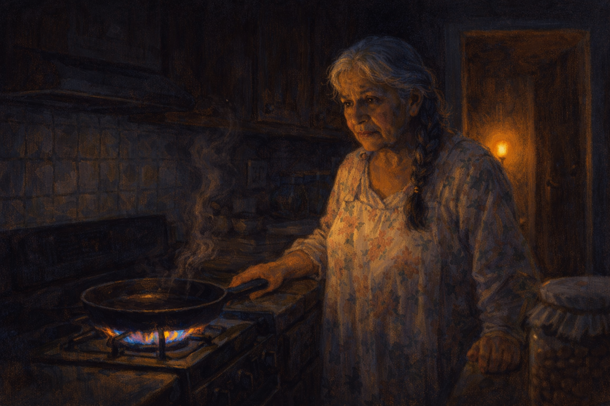

Image Prompt

(This is panel 1. Do not put the panel number in the image.)
Please generate a 16:9 image in warm contemporary realism showing a darkened kitchen lit only by the blue-orange flame of a single gas burner and the glow of a hallway nightlight. Rosa, 81, silver braid, floral nightgown, stands in front of the stove with a confused but calm expression, one hand resting on the counter, looking at an empty cast-iron pan above the flame. A wisp of smoke rises. The color palette is deep indigo, amber, and a sharp blue-orange from the flame. The emotional tone is quiet danger — the peace of someone who does not know she is in danger. No speech bubbles. Generate the image immediately without asking clarifying questions.

Rosa had come downstairs for a glass of water. On the way, she had passed the kitchen and remembered, somehow, that she had not made breakfast for Miguel, her late husband, who had been gone for eleven years. She had taken the cast-iron comal from the hook. She had turned on the front burner. She had put the comal on it. Then, standing there, she had forgotten what came next. The pan was empty. The flame was blue. The clock read 2:07.

## Panel 2 – The Smell of Burning

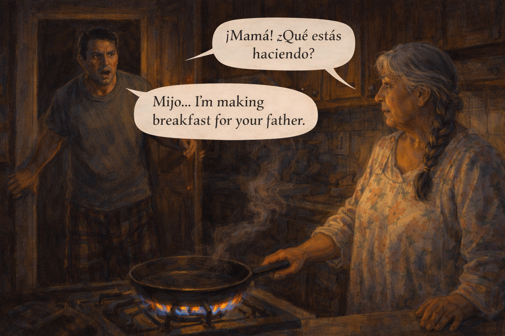

Image Prompt

(This is panel 2. Do not put the panel number in the image.)
Please generate a 16:9 image in warm contemporary realism showing Carlos, 53, bursting through the kitchen doorway in a t-shirt and plaid pajama pants, his face alert and alarmed. Smoke curls from the empty cast-iron pan. Rosa turns slowly to look at him, calm and a little surprised, as if caught doing something ordinary. The color palette is amber, smoke-gray, deep indigo night, and flame orange. The emotional tone is shock and tenderness colliding. Speech bubble from Carlos (urgent, soft): "Mamá! ¿Qué estás haciendo?" Speech bubble from Rosa (mild, puzzled): "Mijo... I'm making breakfast for your father." Generate the image immediately without asking clarifying questions.

Carlos came down the stairs two at a time and rounded the corner into the kitchen. "Mamá! ¿Qué estás haciendo?" His mother turned, calm as if he had interrupted her at the grocery store. "Mijo," she said, "I'm making breakfast for your father." Carlos reached past her and turned off the burner. The flame vanished. His father had been dead for eleven years. His mother looked up at him with the open, trusting face of a woman expecting him to fetch the eggs.

## Panel 3 – Shaking Hands

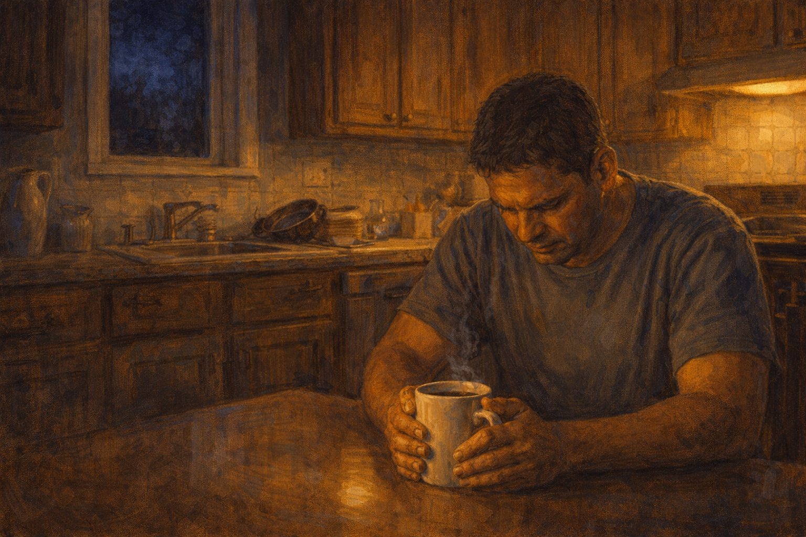

Image Prompt

(This is panel 3. Do not put the panel number in the image.)
Please generate a 16:9 image in warm contemporary realism showing Carlos sitting at the kitchen table at 2:30 a.m., both hands wrapped around a cup of coffee, his head bowed. His hands are visibly shaky. The kitchen light is on now, the stove cold, the pan in the sink. A window above the sink shows deep blue night. The color palette is warm amber, ivory, deep indigo, and brown. The emotional tone is the aftermath of fear, the moment when what-if lands. No speech bubbles. Generate the image immediately without asking clarifying questions.

At 2:30 Carlos sat at the kitchen table with his hands wrapped around a cup of coffee he had not drunk, and his hands would not stop shaking. His mother was upstairs, back in bed, sleeping peacefully. The pan was in the sink. The stove was cold. He could see, without closing his eyes, the house he had grown up in, filled with smoke. He could see the headline: *Son Lost Mother in House Fire.* He could see, worst of all, himself deciding it was time to take her kitchen away.

## Panel 4 – The Talk With His Sister

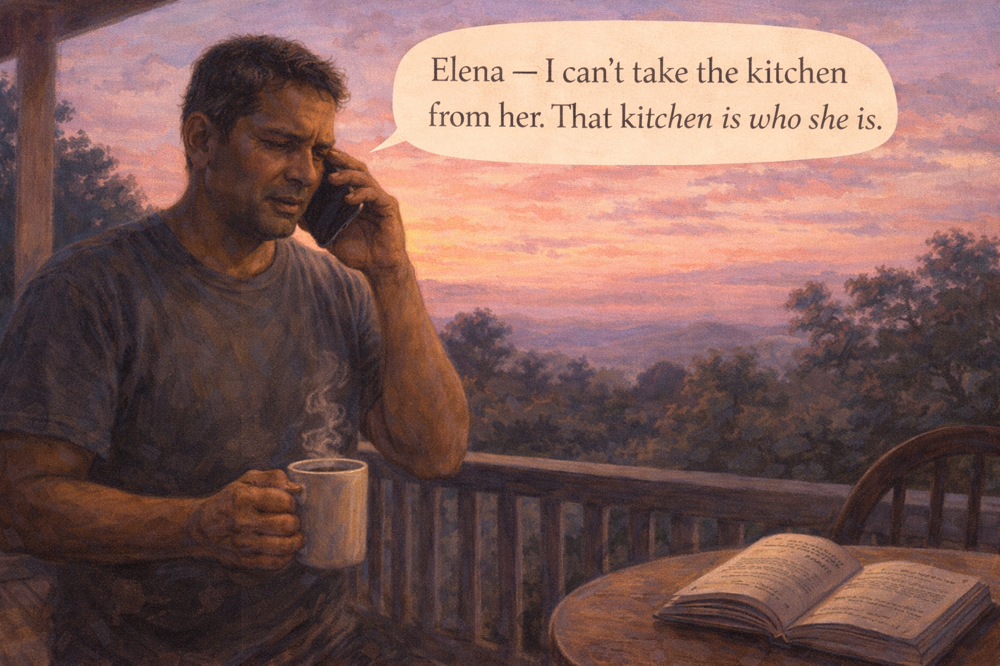

Image Prompt

(This is panel 4. Do not put the panel number in the image.)
Please generate a 16:9 image in warm contemporary realism depicting Carlos on his back porch at dawn, phone in hand, talking to his sister. The sky is deep rose and pale blue. Steam rises from the coffee. A bilingual dementia caregiving book lies open on a nearby chair. The color palette is rose gold, soft periwinkle, cream, and deep green. The emotional tone is a difficult conversation that will need to be had many times. Speech bubble from Carlos (to phone, quietly): "Elena — I can't take the kitchen from her. That kitchen is who she is." Generate the image immediately without asking clarifying questions.

He called his sister Elena at five thirty. She answered on the first ring because she had been up with the baby. He told her everything. There was a long pause. "So we're doing a nursing home," Elena said. Carlos said, "No." He said it before he had thought about it. Then he said, "I can't take the kitchen from her. That kitchen is who she is." Elena was quiet for a while, and then she said, "Okay. Then we find another way."

## Panel 5 – Researching the Problem

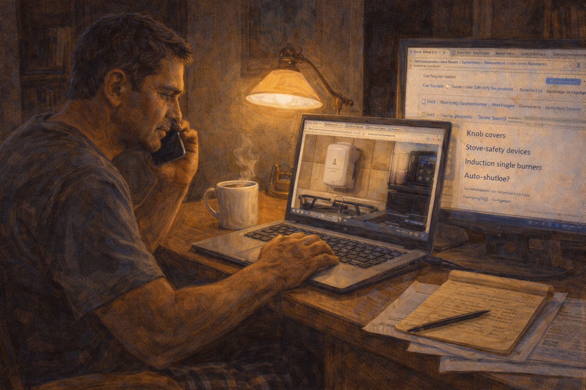

Image Prompt

(This is panel 5. Do not put the panel number in the image.)
Please generate a 16:9 image in warm contemporary realism showing Carlos at his home office desk, laptop open, surrounded by browser tabs and printouts. On one screen, a photo of a small stove-safety monitor. On another, a list with items like "knob covers," "induction single burner," "auto-shutoff." A cup of coffee and a yellow legal pad with handwritten notes sit beside the laptop. The color palette is warm desk lamp gold, ivory, navy blue. The emotional tone is determined problem-solving. No speech bubbles. Generate the image immediately without asking clarifying questions.

By nine he had a yellow legal pad covered in notes. Stove monitors that shut off gas automatically after five minutes of inactivity. Knob covers with a push-and-turn release. Induction hot plates that shut themselves off when a pan is removed. Smoke alarms with flashing lights for hard-of-hearing sleepers. He did not want to take the kitchen from his mother. He wanted to install a safety net underneath the kitchen she still lived in.

## Panel 6 – The Locksmith, the Handyman, the Nephew

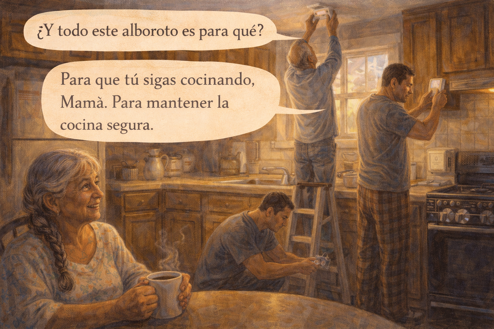

Image Prompt

(This is panel 6. Do not put the panel number in the image.)
Please generate a 16:9 image in warm contemporary realism depicting a Saturday morning in the kitchen. Carlos is on a step ladder, installing a small white electronic device above the stove. His nephew, early 20s, kneels on the floor installing clear plastic knob covers on the oven dials. An older handyman, 60s, is replacing the smoke alarm with a newer model. Rosa sits at the kitchen table with a cup of coffee, smiling a little, watching the activity. Sunlight streams through the kitchen window. The color palette is honey gold, soft blue-gray, terracotta, and cream. The emotional tone is collaborative love — a family securing a kitchen. Speech bubble from Rosa (warm): "¿Y todo este alboroto es para qué?" Speech bubble from Carlos (gentle): "Para que tú sigas cocinando, Mamá. Para mantener la cocina segura." Generate the image immediately without asking clarifying questions.

Saturday morning Carlos, his nephew, and a handyman from down the block spent four hours in the kitchen. They installed a stove-guard that monitored motion and temperature and shut the gas off after five minutes of inactivity. They put knob covers on the stove dials. They replaced the smoke alarm with a newer one. Rosa watched from the table. "¿Y todo este alboroto es para qué?" she asked. Carlos kissed her forehead. "Para que tú sigas cocinando, Mamá. Para mantener la cocina segura."

## Panel 7 – Cooking *With* Her

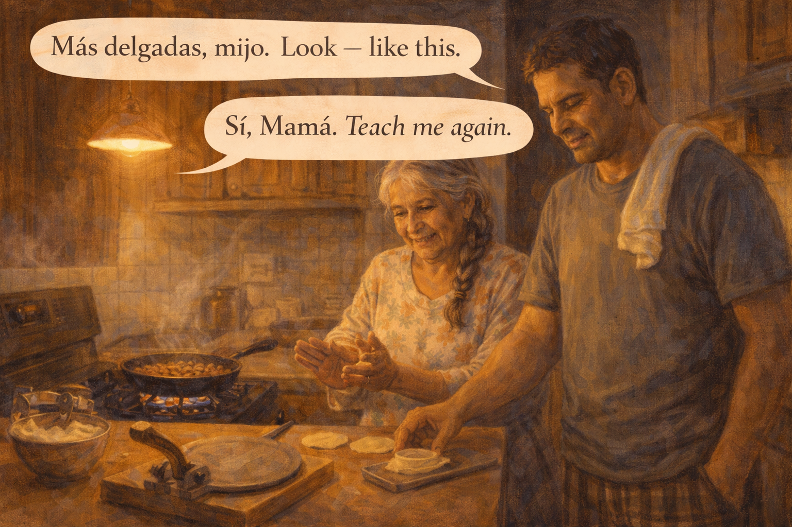

Image Prompt

(This is panel 7. Do not put the panel number in the image.)
Please generate a 16:9 image in warm contemporary realism depicting Rosa and Carlos working together at the kitchen counter. Rosa is rolling masa for tortillas between her palms, her hands sure and practiced. Carlos stands beside her at the stove, watching a pan of beans. A clean kitchen towel over his shoulder. Evening light, warm and amber. The color palette is deep amber, masa-yellow, terracotta, ivory. The emotional tone is quietly joyful partnership. Speech bubble from Rosa (teaching): "Más delgadas, mijo. Look — like this." Speech bubble from Carlos (warm): "Sí, Mamá. Teach me again." Generate the image immediately without asking clarifying questions.

The next change was bigger than the gadgets. Carlos stopped leaving his mother alone in the kitchen. Every evening after school he came home and stood beside her, and she taught him, again, how to roll a tortilla thin enough to see through. She tasted the beans. She told him the salt was wrong. He adjusted it. She was not a patient watching a nurse cook. She was a mother teaching her son, and he was a principal, fifty-three years old, learning with his hands.

## Panel 8 – The Stove Shuts Off

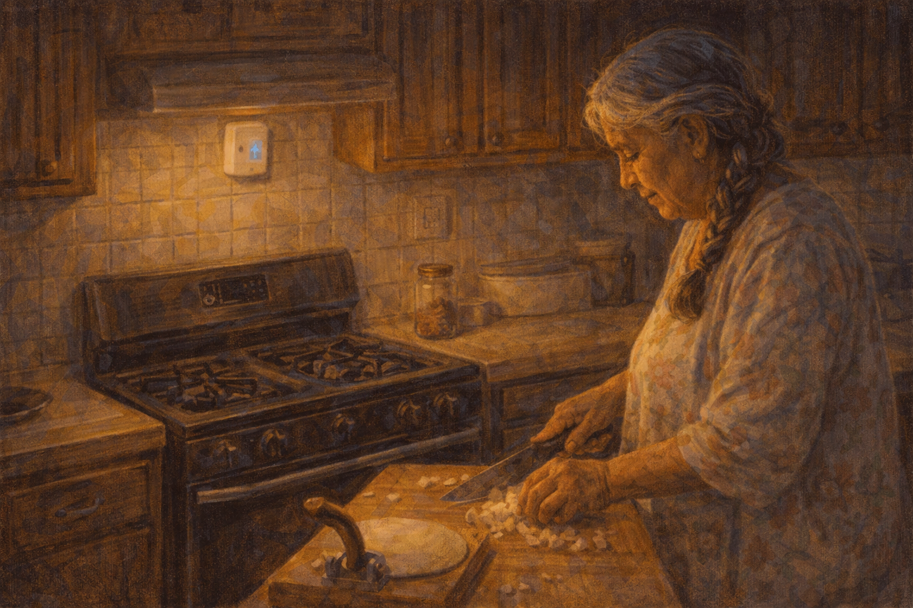

Image Prompt

(This is panel 8. Do not put the panel number in the image.)
Please generate a 16:9 image in warm contemporary realism showing the stove with a faint LED glow from the small safety monitor mounted above it. A burner that had been on is now off. Rosa stands at the counter, chopping onions, unaware that the stove has shut itself off. The color palette is honey gold and deep amber, with a small blue LED on the monitor. The emotional tone is quiet reassurance — technology as a quiet guardian. No speech bubbles. Generate the image immediately without asking clarifying questions.

Two weeks in, Rosa started chopping onions and wandered to the doorway to tell Carlos a story. The stove monitor, sensing no motion or temperature change for five minutes, shut off the gas with a small beep she did not hear. Carlos walked in, smelled nothing burning, saw the monitor's green LED. He said nothing. He turned the burner back on when she returned. The system had done its job, quietly, without embarrassing anyone.

## Panel 9 – The Guilt

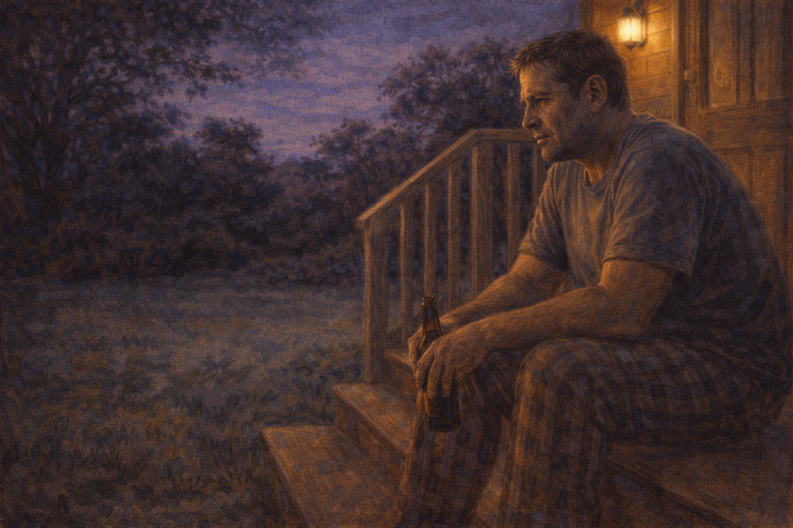

Image Prompt

(This is panel 9. Do not put the panel number in the image.)
Please generate a 16:9 image in warm contemporary realism showing Carlos on the back porch at dusk, sitting on the steps, a beer bottle in his hand, staring at the backyard. His expression is thoughtful and sad. The color palette is deep purple-blue twilight, warm porch light gold, deep green grass. The emotional tone is the quiet grief of a son who is slowly becoming his mother's safety net. No speech bubbles. Generate the image immediately without asking clarifying questions.

Carlos sat on the back porch that Friday evening and let himself feel it. The weight of being the backup brain for a woman who had been his own. The constant, low-grade listening for footsteps at night. The embarrassment that it was easier, some evenings, to cook without her help. He had promised himself he would not resent the cost. The honest thing was to admit, quietly, to the backyard, that sometimes he did.

## Panel 10 – The Sunday Dinner

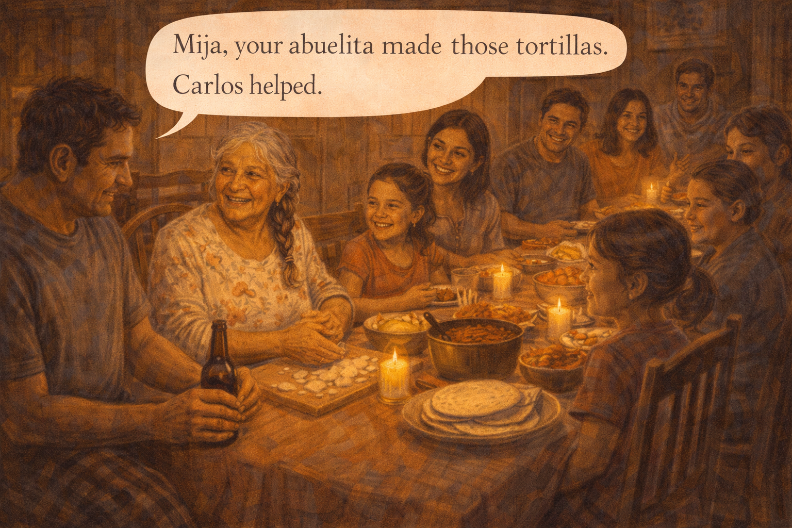

Image Prompt

(This is panel 10. Do not put the panel number in the image.)
Please generate a 16:9 image in warm contemporary realism depicting a large family Sunday dinner. Rosa sits at the head of the table, beaming, surrounded by eleven people across three generations, including Carlos, Elena, grandchildren, great-grandchildren. The table is laden with tortillas, a pot of beans, carne guisada, salsa. Candles flicker. The color palette is warm amber, deep red, golden corn yellow, and terracotta. The emotional tone is joyful abundance — a family still gathered because the kitchen still works. Speech bubble from Rosa (proud, to the youngest grandchild): "Mija, your abuelita made those tortillas. Carlos helped." Generate the image immediately without asking clarifying questions.

On Sunday the whole family came for dinner. Rosa sat at the head of the table and watched her great-granddaughter pick up a tortilla and fold it around a spoonful of beans. "Mija, your abuelita made those tortillas," she said. "Carlos helped." Carlos, passing the salsa, thought: I did not help. She helped me. But he did not correct her. It was true enough. And besides, correction was the problem, not the solution. He had learned that in another kitchen.

## Panel 11 – A Harder Conversation, Later

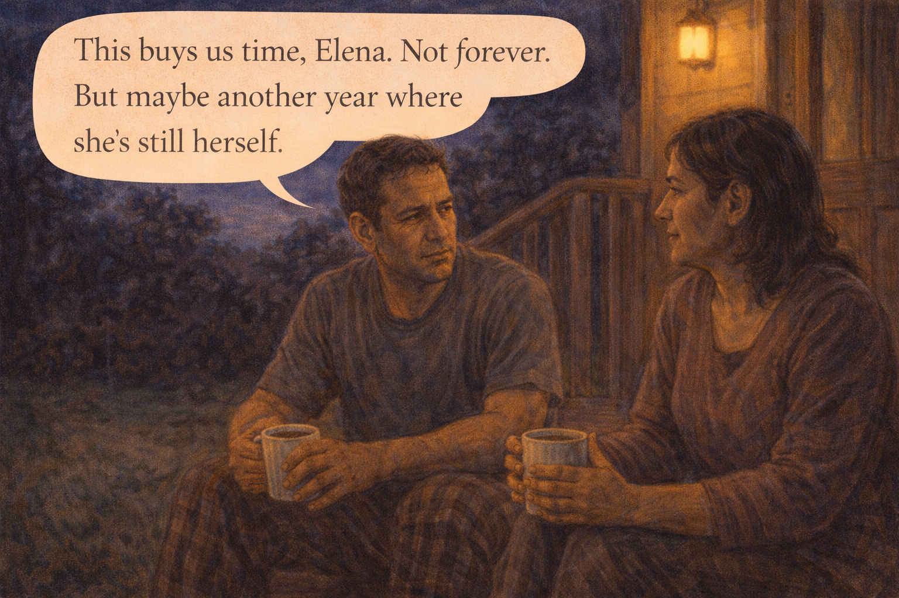

Image Prompt

(This is panel 11. Do not put the panel number in the image.)
Please generate a 16:9 image in warm contemporary realism showing Carlos and Elena, the sister, seated on the back porch in the late evening, both holding coffee cups. Their faces are serious but loving. The color palette is deep indigo night, warm yellow porch light, and soft cream. The emotional tone is honest family planning, no denial. Speech bubble from Carlos (calm, honest): "This buys us time, Elena. Not forever. But maybe another year where she's still herself." Generate the image immediately without asking clarifying questions.

Later that night he and Elena sat on the porch and talked about what they both knew: the safety gadgets and the evening cooking together would not work forever. There would come a day, probably within a year, when Rosa could not safely be near a flame at all. "This buys us time," Carlos said. "Not forever. But maybe another year where she's still herself." Elena nodded. The plan was not to deny the future. The plan was to make the present last as long as it honestly could.

## Panel 12 – Morning, Together

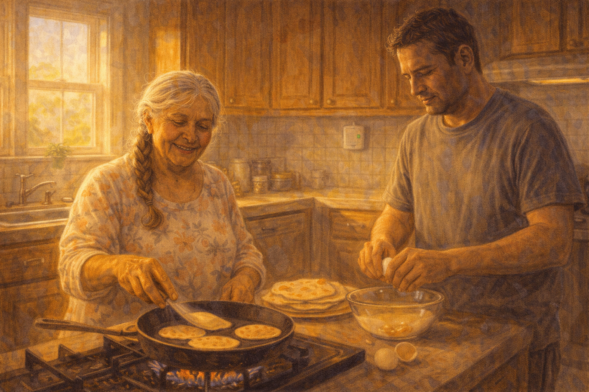

Image Prompt

(This is panel 12. Do not put the panel number in the image.)
Please generate a 16:9 image in warm contemporary realism depicting Rosa and Carlos at the stove on a sunny morning. Rosa stands at the counter flipping tortillas on the comal with her fingers, practiced and content. Carlos is beside her, cracking eggs into a bowl. Morning sunlight streams through the window. Above the stove, barely visible, the small safety monitor with its green LED. The color palette is bright morning gold, soft cream, terracotta, warm green. The emotional tone is peaceful partnership. No speech bubbles. Generate the image immediately without asking clarifying questions.

Monday morning, 7:15 a.m., the kitchen smelled like tortillas and coffee and the slow heat of a cast-iron pan doing what it had been doing in this family for seventy years. Rosa flipped a tortilla with her fingers, not afraid of the heat. Carlos cracked eggs. The small green LED of the stove monitor glowed above them, steady, doing its job. No one had to notice. That was the whole point of doing it right.

### Epilogue – What Carlos Learned

| Challenge | How Carlos Responded | Lesson for Caregivers |
|-----------|----------------------|-----------------------|
| Mother left burner on unattended | Did not remove the kitchen — added a safety net | Safety and dignity are not opposites; design for both |
| Feared house fire | Installed stove monitor with auto-shutoff, knob covers, new smoke alarm | Layered technology lets you manage risk without stripping independence |
| Worried he was stealing her identity | Began cooking *with* her every evening | Presence replaces supervision; partnership replaces control |
| Felt guilt and exhaustion at times | Named it honestly, with his sister, on the porch | Acknowledging the cost of caregiving is how you keep giving care |
| Knew this wouldn't work forever | Planned openly for the next stage | Buying time is a worthy goal, and planning is not betrayal |
| Family asked about a nursing home | Chose a middle path, case by case | "Move her" is not the only answer — it is one answer, for one moment |

### A Note to Readers

If the stove has become dangerous, you have more options than "remove it" or "hope for the best." Consider:

- **Stove-guard devices** that detect inactivity and shut off gas or electricity after a few minutes
- **Knob covers** that require a push-and-turn motion
- **Induction single burners** that shut off when a pan is removed
- **Updated smoke alarms** with interconnected or flashing-light options
- **Cooking together**, so supervision feels like connection, not surveillance

Kitchens are where many families grieve first — because a mother or father cooked in them every day for decades, and watching that stop is a loss before any death. Making the kitchen safer so your loved one can stay in it a while longer is one of the kindest things you can do.

The Alzheimer's Association 24/7 Helpline (**1-800-272-3900**) can connect you with an occupational therapist who will walk the kitchen with you and point out risks you have stopped seeing.

---

*"I did not want to take my mother's kitchen. I wanted to stand next to her in it, for as long as she had one."*
—Carlos, caregiver

*"Safety is not the opposite of dignity. Designed well, they are the same thing."*
—Occupational therapist

*"She taught me to roll a tortilla the year I turned fifty-three. I will be grateful for that for the rest of my life."*
—Carlos

---

## References

1. [Home Safety – Alzheimer's Association](https://www.alz.org/help-support/caregiving/safety/home-safety) - Room-by-room checklist, including kitchen and stove safety.
2. [Home Safety Checklist – National Institute on Aging](https://www.nia.nih.gov/health/alzheimers-changes-behavior-and-communication/home-safety-checklist-alzheimers-disease) - Federal guidance on dementia-specific home modifications.
3. [Aging in Place – Wikipedia](https://en.wikipedia.org/wiki/Aging_in_place) - Overview of technologies and adaptations that support independence at home.
4. [Occupational Therapy – Wikipedia](https://en.wikipedia.org/wiki/Occupational_therapy) - Role of OT in home safety assessment for dementia.
5. [Cooking Safety for Older Adults – NFPA](https://www.nfpa.org/Education-and-Research/Home-Fire-Safety/Cooking-safety) - National Fire Protection Association cooking-safety guidance.
