# The Kitchen Table Conversation: Planning Before It's Too Late

<!-- 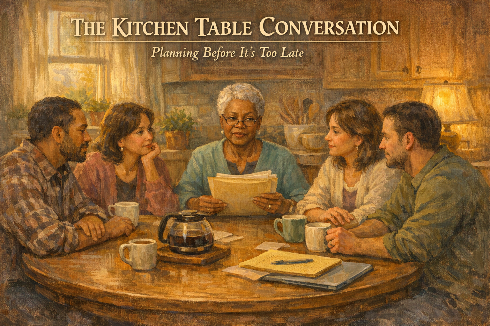 -->

Cover Image Prompt

Please generate a 16:9 cover image in warm painterly American contemporary realism — soft oil-painting brushwork with visible but refined strokes; muted warm palette of sage green, dusty lavender, cream, honey gold, rose pink, and walnut brown; warm golden afternoon window light as the key and honey-gold interior lamp glow as fill; soft low-contrast shadows; fabric textures (knit, flannel, cotton, lace) clearly visible; in the Rockwell-and-Kinkade tradition of tender domestic illustration. No saturated primaries, no neon, no photorealism, no vector flatness, no film grain, no chromatic aberration. Night scenes keep the same warm vocabulary — indigo and deep walnut in place of saturated cool blue, with honey-gold porch or lamp light as warm accent.

**Title treatment (top ~15% of frame):** Across the top of the image, centered horizontally, render the main title "THE KITCHEN TABLE CONVERSATION" in a warm ivory/cream humanist serif — the kind of hand-set lettering you would see on a classic illustrated-novel cover — with a soft painterly drop-shadow so the text integrates into the scene below, never a hard graphic bar. Directly beneath the title, in a smaller italic of the same serif, render the subtitle "Planning Before It's Too Late". The lettering should feel as if the painter lettered it themselves, in the same brush vocabulary as the painting.

**Scene:** A large round oak kitchen table in a homey kitchen. Seated around it: Eleanor, 73, a sharp-eyed Black woman with short natural silver hair, reading glasses, and a soft teal blouse, holding a thick folder; her four adult children — two daughters in their forties and fifties, two sons in their late thirties and early fifties — listening intently. A pot of coffee sits in the center; mugs are in hand; legal pads and a laptop rest on the table. Warm autumn afternoon light streams through a window with potted herbs.

**Emotional tone:** grounded and respectful — a family coming together to plan early.

Generate the image immediately without asking clarifying questions.

Narrative Prompt

This is a graphic novel for family caregivers of people living with dementia. The central character is Eleanor, 73, a retired high-school principal recently diagnosed with early-stage Alzheimer's. She is still sharp, still driving, still independent. She has called her four adult children home for a weekend — Angela (54, oldest, accountant, Atlanta); Derek (51, middle son, physician's assistant, Chicago); Tisha (46, youngest daughter, school counselor, near Eleanor in Memphis); and Marcus (38, youngest, contractor, Texas). Eleanor has read that families who plan early fight less and provide better care. She is going to lead this conversation herself, while she still can. She has prepared a folder: durable power of attorney, health care directive, DNR wishes, financial accounts, house title, long-term care insurance, a letter to each child. The story shows how hard and how necessary the conversation is — the siblings disagree about money, about care, about whether Mom should "really" be doing this now — but Eleanor insists. By the end, every paper is signed, every child has a copy, and the family has a shared plan. Two years later, when Eleanor's dementia progresses, the plan holds. Tone: dignified, strong Black matriarch who knows how to run a room, loving but firm. Include Alzheimer's Association 24/7 Helpline (1-800-272-3900). American English spelling.

### Prologue – The Invitation

It is the Saturday after Thanksgiving. Four airline tickets have been paid for. A folder, three inches thick, sits on the kitchen table next to a fresh pot of coffee. Eleanor stands at the window and watches the first of her children turn into the driveway. She has been a principal for thirty-one years. She has run harder meetings than this. But none, she thinks, has mattered more.

<!-- 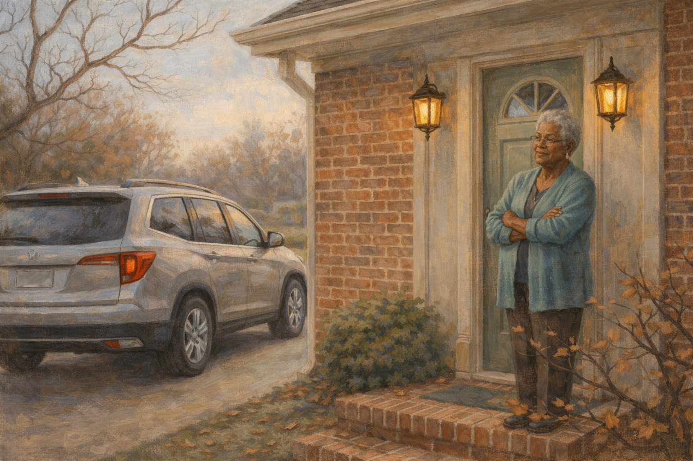 -->

Image Prompt

(This is panel 1. Do not put the panel number in the image.)
Please generate a 16:9 image in warm contemporary realism depicting the exterior of a tidy brick Memphis house on a cool November afternoon. A silver SUV is pulling into the driveway. Eleanor, 73, sharp-eyed, short silver natural hair, teal cardigan, stands on the front porch with her arms folded against the chill, a small, resolved smile on her face. Bare dogwood branches frame the porch. The color palette is warm brick, soft sage, faded amber, cool sky-blue. The emotional tone is resolute welcoming — a woman who has called her children home on purpose. No speech bubbles. Generate the image immediately without asking clarifying questions.

Eleanor watched her oldest daughter pull into the drive and thought, *good, on time.* Angela was always on time. The others would be here within the hour. She had sent them each the same email three weeks ago: *Come home the Saturday after Thanksgiving. We have things to discuss. Bring a pen and an open mind.* None of them had refused. None of them had asked why. That itself, Eleanor thought, told her what she needed to know about how much they had already figured out.

## Panel 2 – The Folder on the Table

<!-- 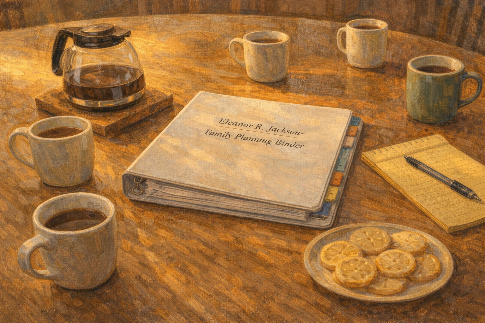 -->

Image Prompt

(This is panel 2. Do not put the panel number in the image.)
Please generate a 16:9 image in warm contemporary realism depicting a close-up of a large round oak kitchen table. In the center sits a thick three-ring binder with tabs, labeled "Eleanor R. Jackson – Family Planning Binder." Next to it, a ceramic pot of coffee, four mugs, a notepad, a pen, and a plate of lemon cookies. Warm afternoon light rakes across the table. The color palette is honey oak, cream, warm brown, pale yellow. The emotional tone is preparation — the quiet authority of a plan laid out. No speech bubbles. Generate the image immediately without asking clarifying questions.

In the center of the table sat the binder. Eleanor had labeled it herself: *Eleanor R. Jackson – Family Planning Binder*. Inside were tabs: *Medical. Financial. Legal. Housing. Wishes. Letters.* She had worked on it every evening for three months, after the neurologist had said the words "mild cognitive impairment likely converting to Alzheimer's." Mild. Likely. She had heard enough language like that in faculty meetings to know it meant *start now.*

## Panel 3 – Everyone Around the Table

<!-- 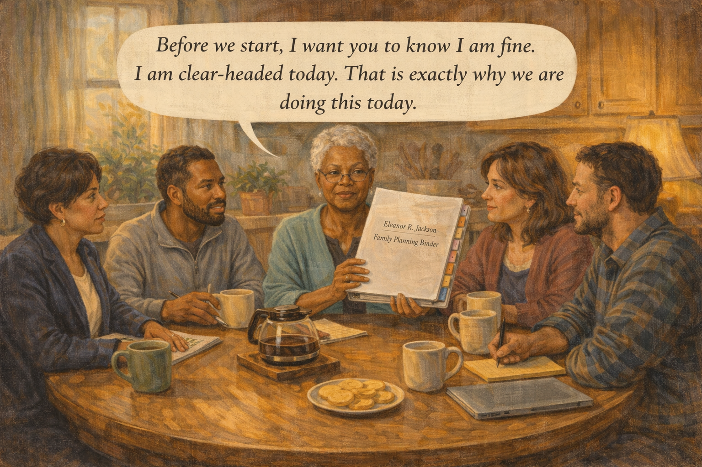 -->

Image Prompt

(This is panel 3. Do not put the panel number in the image.)
Please generate a 16:9 image in warm contemporary realism depicting Eleanor at the head of the round kitchen table, her four adult children seated around her — Angela (54, sharp, in a navy blazer), Derek (51, calm, in a fleece), Tisha (46, soft-faced in a cardigan), and Marcus (38, wiry, in a flannel). All have coffee and notepads. Eleanor holds up the binder. Warm afternoon light. The color palette is honey oak, warm teal, cream, burgundy, denim. The emotional tone is attentive respect — a family listening to a mother. Speech bubble from Eleanor (calm, clear): "Before we start, I want you to know I am fine. I am clear-headed today. That is exactly why we are doing this today." Generate the image immediately without asking clarifying questions.

They were all there by two in the afternoon. Angela from Atlanta. Derek from Chicago. Tisha from across town. Marcus from Texas, still in the clothes he had driven in. Eleanor sat at the head of the table and held up the binder. "Before we start," she said, "I want you to know I am fine. I am clear-headed today. That is exactly why we are doing this today. This is a conversation you have when it's easy, so you don't have to have it when it's hard."

## Panel 4 – The Diagnosis

<!-- 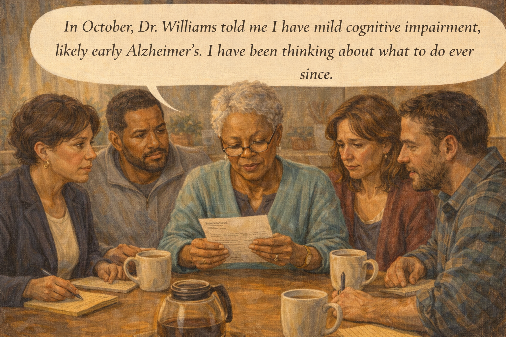 -->

Image Prompt

(This is panel 4. Do not put the panel number in the image.)
Please generate a 16:9 image in warm contemporary realism showing Eleanor at the table, holding a small neurologist's report, reading glasses low on her nose. Her children lean forward, faces various: Angela controlled, Derek analytical, Tisha fighting tears, Marcus stunned. The color palette is honey wood, soft teal, muted gold, and a pale clinical white on the paper. The emotional tone is the landing of a long-feared piece of news. Speech bubble from Eleanor (steady): "In October, Dr. Williams told me I have mild cognitive impairment, likely early Alzheimer's. I have been thinking about what to do ever since." Generate the image immediately without asking clarifying questions.

"In October," she said, "Dr. Williams told me I have mild cognitive impairment, likely early Alzheimer's. I have been thinking about what to do ever since." Tisha's mouth trembled. Marcus looked at his hands. Derek, the physician's assistant, asked the clinical question: "MoCA score?" Eleanor said, "Twenty-four. Down from twenty-seven last year." Angela, who ran a small accounting firm, took out a pen. It was a measure of how well Eleanor had raised them that everyone had a different first reaction, and none of them interrupted her.

## Panel 5 – Power of Attorney

<!-- 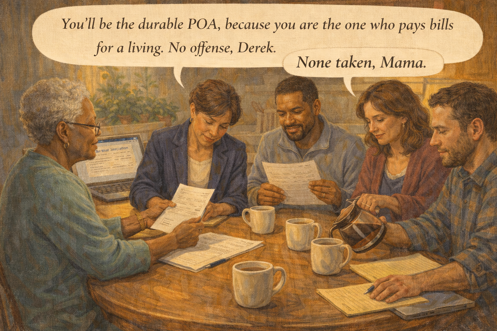 -->

Image Prompt

(This is panel 5. Do not put the panel number in the image.)
Please generate a 16:9 image in warm contemporary realism showing Eleanor and Angela seated across the table, Angela signing a legal document. Derek is reading a second copy. Tisha is pouring coffee. Marcus is looking at a third copy with a thoughtful expression. A laptop open to a state bar-association website sits off to one side. The color palette is warm wood, pale legal paper cream, burgundy, and amber. The emotional tone is formal and loving together. Speech bubble from Eleanor (to Angela): "You'll be the durable POA, because you are the one who pays bills for a living. No offense, Derek." Speech bubble from Derek (warm smile): "None taken, Mama." Generate the image immediately without asking clarifying questions.

The first tab was *Legal*. Eleanor had already met with an elder-law attorney. The durable power of attorney would go to Angela, who paid bills for a living. The health care proxy would go to Derek, who could read a chart. Tisha, who lived the closest, would be the primary caregiving contact. Marcus, the youngest, would be the family communicator — the one who held the group text and kept everyone on the same page. "No one is more important than anyone else," Eleanor said. "You each have a different job."

## Panel 6 – The Hard Money Conversation

<!-- 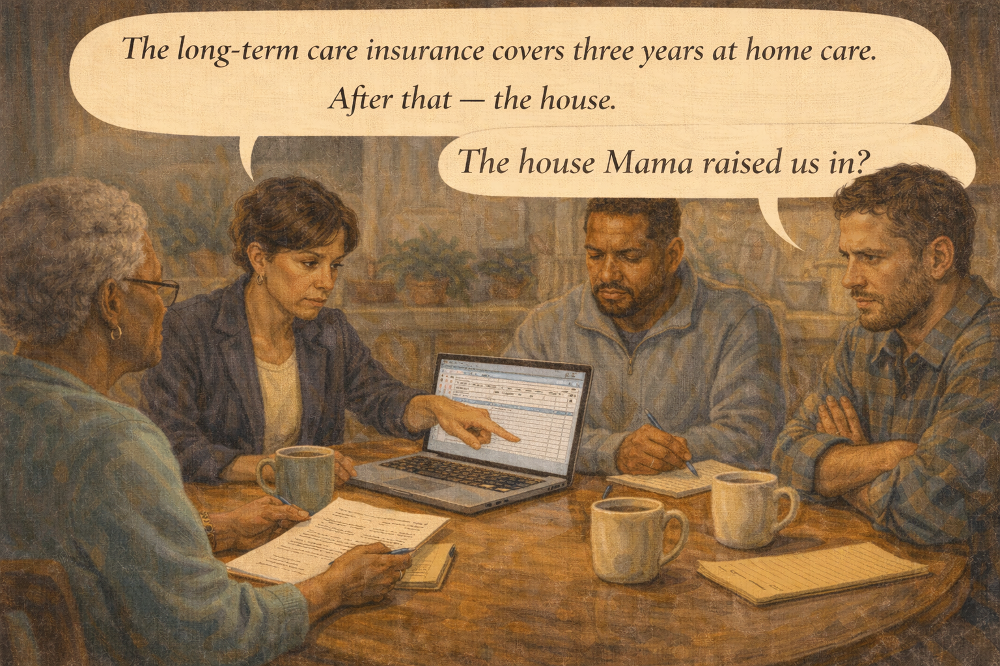 -->

Image Prompt

(This is panel 6. Do not put the panel number in the image.)
Please generate a 16:9 image in warm contemporary realism showing the family around the table, now with a laptop displaying a spreadsheet. Angela is pointing at a row. Marcus has his arms folded, visibly tense. Derek is making a note. The mood is the moment when money enters a family conversation and the room tightens. The color palette is honey wood, warm teal, and pale laptop-glow blue. The emotional tone is tense but not broken. Speech bubble from Angela: "The long-term care insurance covers three years at home care. After that — the house." Speech bubble from Marcus (carefully): "The house Mama raised us in?" Generate the image immediately without asking clarifying questions.

The second tab was *Financial*. Angela walked them through the accounts, the long-term care insurance policy, the projected cost of memory care in 2030 dollars. "The insurance covers three years at home care," Angela said. "After that — the house." Marcus folded his arms. "The house Mama raised us in?" Eleanor answered before Angela could. "That house is a savings account with a porch, Marcus. I am going to spend it on keeping me safe. Your inheritance is not the brick and mortar. Your inheritance is the education I already paid for."

## Panel 7 – A Son's Tears

<!-- 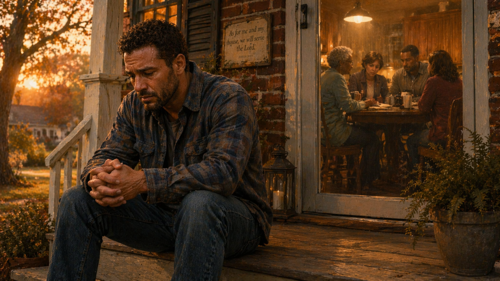 -->

Image Prompt

(This is panel 7. Do not put the panel number in the image.)
Please generate a 16:9 image in warm contemporary realism showing Marcus, the youngest son, on the back porch of the house, alone. He is sitting on the steps, elbows on knees, hands clasped, tears in his eyes. Late afternoon light slants across the yard. Through the screen door behind him, the kitchen is warmly lit and full of his family. The color palette is deep amber, soft green, warm gold, and a hint of rose from the setting sun. The emotional tone is private grief and respect. No speech bubbles. Generate the image immediately without asking clarifying questions.

Marcus went out to the back porch for a while. He sat on the top step and did not hide the fact that he was crying. Tisha, of all of them, knew to leave him alone. After ten minutes he came back inside, washed his face at the kitchen sink, sat back down at the table, and said, "Okay, Mama. Keep going." Nobody said a word about what had just happened. It was a thing a family can do when the family is a good one.

## Panel 8 – End-of-Life Wishes

<!-- 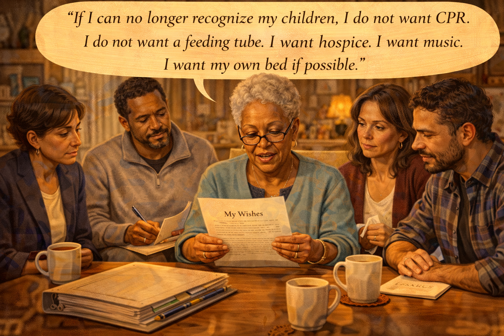 -->

Image Prompt

(This is panel 8. Do not put the panel number in the image.)
Please generate a 16:9 image in warm contemporary realism showing Eleanor reading from a typed document titled "My Wishes." Her children listen intensely. Derek is making notes. Tisha has a tissue in her hand but is composed. The coffee in the pot has gone down. The light has turned golden. The color palette is honey gold, amber, soft burgundy, cream. The emotional tone is gravity mixed with love. Speech bubble from Eleanor (reading): "If I can no longer recognize my children, I do not want CPR. I do not want a feeding tube. I want hospice. I want music. I want my own bed if possible." Generate the image immediately without asking clarifying questions.

The hardest tab was *Wishes*. Eleanor had typed it out herself. She read it aloud because she wanted her voice, not a notary's, to be the one her children remembered. "If I can no longer recognize my children, I do not want CPR. I do not want a feeding tube. I want hospice. I want music. I want my own bed if possible. If I must go to memory care, I want you to visit without guilt. I do not want you to promise me you will never do it. I have released you from that promise tonight."

## Panel 9 – Signing, Notarizing

<!-- 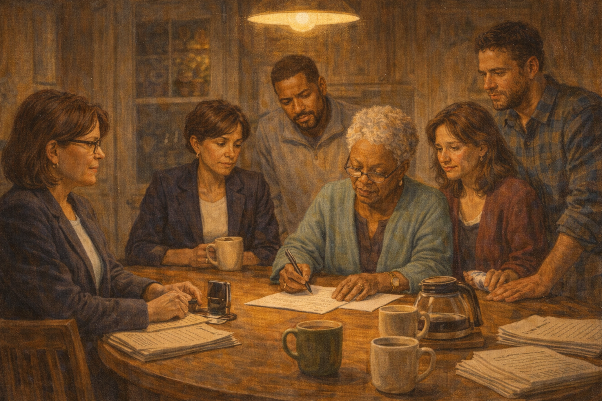 -->

Image Prompt

(This is panel 9. Do not put the panel number in the image.)
Please generate a 16:9 image in warm contemporary realism showing a traveling notary — a middle-aged woman with glasses and a smart blazer — at the kitchen table, her seal and stamp ready. Eleanor is signing a document. Her four children watch as witnesses. The table now has stacks of signed documents. Evening has arrived; a single pendant light warms the scene. The color palette is deep amber, honey wood, warm cream, and rich burgundy. The emotional tone is ceremonial, momentous, and tender. No speech bubbles. Generate the image immediately without asking clarifying questions.

A traveling notary, a woman from her church whom Eleanor had scheduled two weeks in advance, arrived at six and stayed through dinner. Papers were signed. Signatures were witnessed. The seal came down again and again on crisp pages. Angela kept the original in the binder. Each child was given a thumb drive with scanned copies. A second copy went to the attorney. A third to the bank. By nine that night, every document Eleanor had intended to exist, existed. Her hands were steady. She had not cried once.

## Panel 10 – The Letters

<!-- 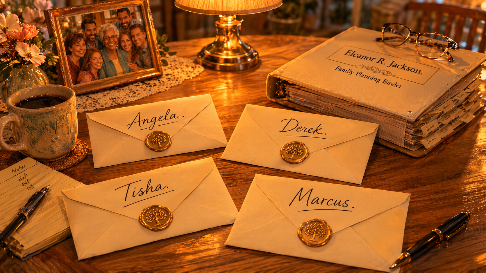 -->

Image Prompt

(This is panel 10. Do not put the panel number in the image.)
Please generate a 16:9 image in warm contemporary realism showing four sealed envelopes on the kitchen table, each hand-addressed with a different name in elegant cursive: "Angela." "Derek." "Tisha." "Marcus." A single lamp glows above them. The binder sits closed to one side. The color palette is soft cream envelope, deep amber lamplight, honey wood. The emotional tone is reverence — a mother's last preserved voice. No speech bubbles. Generate the image immediately without asking clarifying questions.

Before her children left, Eleanor gave each of them an envelope. "Don't open these tonight," she said. "Open them when I don't know your names anymore. I want you to remember what I thought of you while I still thought clearly. Each one is different. Each one is true." Tisha clutched hers with both hands. Angela tucked hers into her planner. Marcus slid his into his back pocket. Derek held his for a long time and then carefully placed it in his medical bag, next to his stethoscope, as if it were a prescription.

## Panel 11 – Two Years Later

<!-- 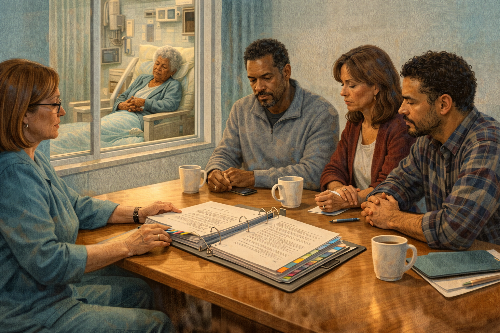 -->

Image Prompt

(This is panel 11. Do not put the panel number in the image.)
Please generate a 16:9 image in warm contemporary realism showing a bright hospital conference room two years later. Angela, Derek, Tisha, and Marcus are around a table with a hospital case manager. The binder — a little thicker now, with added tabs — sits open between them. Through a window, Eleanor is visible in a chair in a quiet hospital room, eyes half-closed, held by Tisha's gentle hand over hers. The color palette is hospital pale blue, soft warm wood, cream, and muted teal. The emotional tone is quietly competent grief — a plan holding up under pressure. No speech bubbles. Generate the image immediately without asking clarifying questions.

Two years later Eleanor had a stroke. She did not recover the words she had lost. The siblings sat in a hospital conference room with a case manager. The binder was on the table, a little thicker now, with added tabs. Every question the case manager asked had a page. The siblings did not fight. There was nothing to fight about. Eleanor had done that work for them while her mind was whole. They had each other, and they had her voice, on paper, in her own cursive, telling them what to do.

## Panel 12 – Reading the Letters

<!-- 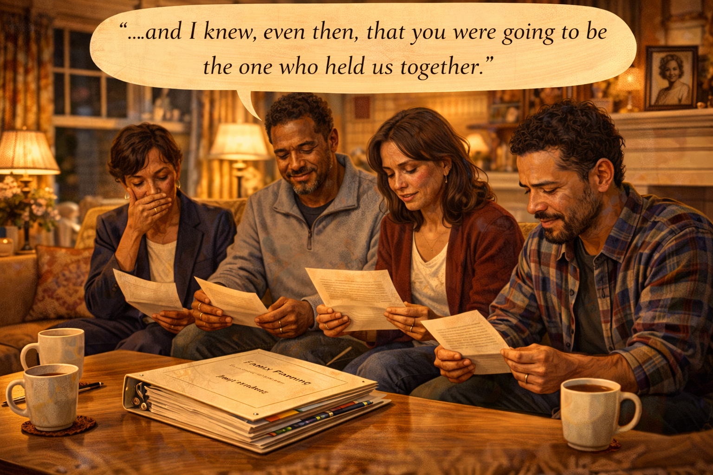 -->

Image Prompt

(This is panel 12. Do not put the panel number in the image.)
Please generate a 16:9 image in warm contemporary realism showing the four siblings seated in their mother's living room, one evening, each holding an open letter. Tisha is reading aloud, Marcus has tears on his cheeks, Angela has a small hand over her mouth, Derek is smiling through wet eyes. The binder sits on the coffee table, closed now. A framed portrait of Eleanor as a young woman rests on the mantel. The color palette is honey gold, warm cream, deep burgundy, and soft amber lamplight. The emotional tone is love arriving on time. Speech bubble from Tisha (reading softly): "...and I knew, even then, that you were going to be the one who held us together." Generate the image immediately without asking clarifying questions.

On the evening Eleanor stopped recognizing their names, the four of them sat in her living room and opened the envelopes. Tisha read hers aloud. Marcus could not read his without crying. Derek read his twice. Angela, who had been the careful one all her life, cried for the first time since the funeral-planning meeting, because her mother had written, in blue ink, *Angela, you have been the keel of this family since you were seven years old, and tonight I am giving you permission to rest.*

### Epilogue – What the Jackson Family Learned

| Challenge | How Eleanor Responded | Lesson for Families |
|-----------|------------------------|---------------------|
| Diagnosis raised many questions at once | Gathered everyone at one table and answered them together | Don't let siblings learn the plan one phone call at a time |
| Money was going to cause a fight | Named it explicitly: the house would pay for her care | Say out loud what the inheritance is and isn't — before grief gets a vote |
| End-of-life wishes are hard to write | Typed them herself and read them aloud | Your voice in your own words is the gift that survives you |
| Siblings had different roles | Assigned specific jobs: legal, medical, local care, communication | "Who's in charge" should be "who does what" — spread the load |
| Future would be painful | Pre-released each child from impossible promises | Saying "you may place me in care without guilt" is an act of love |
| Family might lose her voice | Wrote individual letters sealed until needed | Capture your clear mind on paper while you still have it |

### A Note to Readers

The Jackson family planning meeting is a model, not a requirement. Few families will do it this well. But **the core idea is non-negotiable**: start planning the **day after** a mild cognitive impairment or dementia diagnosis, not the year after. You will need:

- **Durable Power of Attorney** (financial)
- **Health Care Proxy / Medical Power of Attorney**
- **Advance Directive / Living Will** (including DNR wishes if desired)
- **HIPAA release** naming who can speak to doctors
- A **financial inventory** of accounts, insurance, real estate
- A **housing plan** for each stage (home, home care, memory care)
- A **communication plan** so siblings hear the same things at the same time

An elder-law attorney is worth every dollar. Most charge a flat fee for a dementia planning package. The Alzheimer's Association 24/7 Helpline (**1-800-272-3900**) can refer you to one in your state.

Most family fights about dementia care are really fights about something that was never discussed when the diagnosed person was still able to discuss it. Have the conversation now.

---

*"This is a conversation you have when it's easy, so you don't have to have it when it's hard."*
—Eleanor Jackson

*"My mother ran the best meeting of her life after she knew she was losing her mind."*
—Angela

*"The binder saved us. It's that simple."*
—Derek

---

## References

1. [Legal and Financial Planning for People with Dementia – National Institute on Aging](https://www.nia.nih.gov/health/legal-and-financial-planning-people-alzheimers) - Federal guidance on advance planning for dementia.
2. [Legal Planning – Alzheimer's Association](https://www.alz.org/help-support/caregiving/financial-legal-planning) - Practical checklist and attorney referral resources.
3. [Durable Power of Attorney – Wikipedia](https://en.wikipedia.org/wiki/Power_of_attorney) - Legal background on POA documents.
4. [Advance Healthcare Directive – Wikipedia](https://en.wikipedia.org/wiki/Advance_healthcare_directive) - Overview of living wills and medical directives.
5. [National Academy of Elder Law Attorneys](https://www.naela.org/) - Directory of attorneys specializing in elder-law planning.
