# The Last Good Day: Hospice, Music, and Letting Go

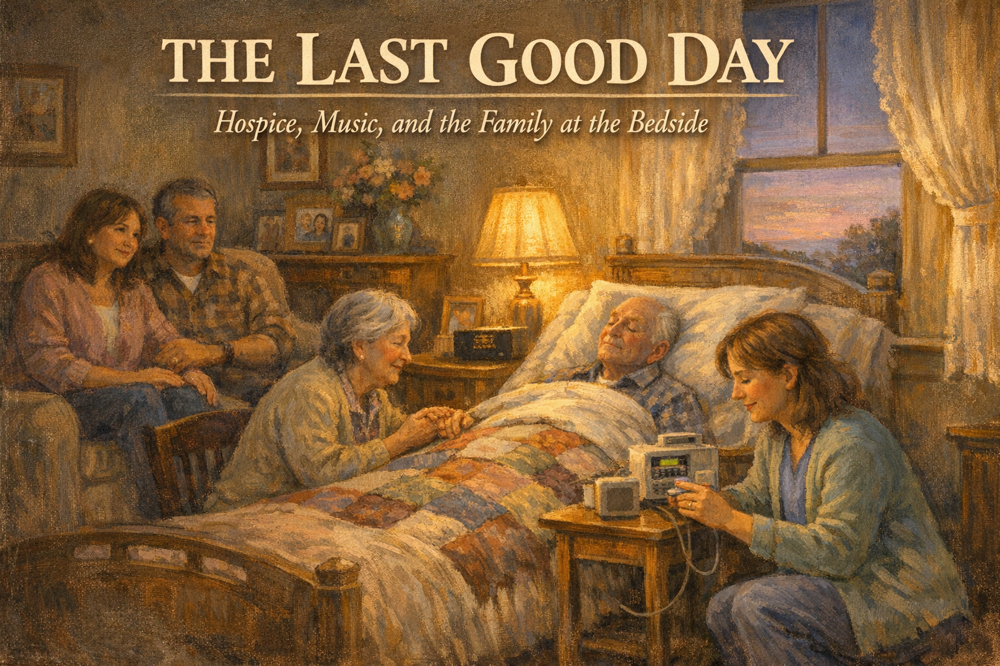

Cover Image Prompt

Please generate a 16:9 cover image in warm painterly American contemporary realism — soft oil-painting brushwork with visible but refined strokes; muted warm palette of sage green, dusty lavender, cream, honey gold, rose pink, and walnut brown; warm golden afternoon window light as the key and honey-gold interior lamp glow as fill; soft low-contrast shadows; fabric textures (knit, flannel, cotton, lace) clearly visible; in the Rockwell-and-Kinkade tradition of tender domestic illustration. No saturated primaries, no neon, no photorealism, no vector flatness, no film grain, no chromatic aberration. Night scenes keep the same warm vocabulary — indigo and deep walnut in place of saturated cool blue, with honey-gold porch or lamp light as warm accent.

**Title treatment (top ~15% of frame):** Across the top of the image, centered horizontally, render the main title "THE LAST GOOD DAY" in a warm ivory/cream humanist serif — the kind of hand-set lettering you would see on a classic illustrated-novel cover — with a soft painterly drop-shadow so the text integrates into the scene below, never a hard graphic bar. Directly beneath the title, in a smaller italic of the same serif, render the subtitle "Hospice, Music, and the Family at the Bedside". The lettering should feel as if the painter lettered it themselves, in the same brush vocabulary as the painting.

**Scene:** A softly lit bedroom at dusk. Bill, 88, a frail older man with thin white hair, lies peacefully in a hospital bed set up in the living room, a quilt tucked to his chest. His wife Marie, 85, holds his hand from a chair beside him. Their daughter and son-in-law sit on a loveseat nearby. Joanne, 52, a hospice nurse in soft blue scrubs and a cardigan, kneels beside the bed adjusting a morphine syringe pump with calm hands. Warm lamplight glows; a small speaker plays softly; a window shows the last lavender light of day.

**Emotional tone:** reverent peace — a family being guided through the last hours by a skilled, compassionate nurse.

Generate the image immediately without asking clarifying questions.

Narrative Prompt

This is a graphic novel for family caregivers of people living with dementia. The central character is Joanne, 52, a hospice nurse who has been caring for Bill, 88, and his wife Marie, 85, for the past three weeks. Bill has end-stage Alzheimer's disease. He has stopped eating, stopped recognizing his children, stopped speaking. He is in the home he has lived in for sixty years. His family — Marie, their two adult children, and three grandchildren — are gathered. The story follows Bill's last week through Joanne's eyes. Joanne teaches the family what to expect at each stage: terminal restlessness, the Cheyne-Stokes breathing pattern, mottled skin, the "death rattle," and the quiet before the last breath. She teaches them what to do: wet sponges for the mouth, music, hand-holding, permission. She dispels myths: no, he is not in pain; no, you are not starving him; no, you do not have to keep talking; yes, it is okay to rest. She helps them say what needs to be said. The tone is tender, unflinching, deeply honoring. Not romantic — real. Music is central: the family plays Bill's favorite big-band records in the final hours. He squeezes Marie's hand once, weakly, during "In the Mood." He dies at 3 a.m. the next morning, quietly, surrounded. Joanne stays through the death and into the next morning, shows the family how to say goodbye to the body, and explains what comes next. End with hope — not of recovery, but of a good death done right. Include Alzheimer's Association 24/7 Helpline (1-800-272-3900). American English spelling.

### Prologue – The Last Week

It is a Sunday evening. Bill has been home from the hospital for three weeks, on hospice. His family is gathered. A nurse named Joanne has just arrived with her leather bag and her kind steady hands. This is the beginning of Bill's last week on earth. Joanne is here to make sure it is a good one.

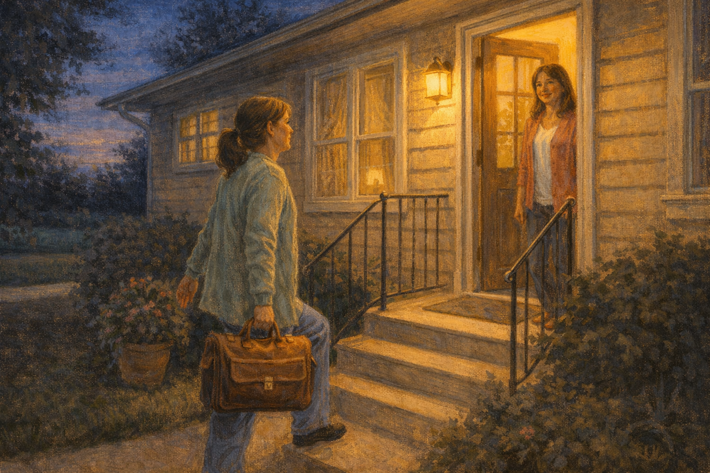

Image Prompt

(This is panel 1. Do not put the panel number in the image.)
Please generate a 16:9 image in warm contemporary realism depicting Joanne, 52, brown hair tied back, in soft blue scrubs and a cardigan, walking up the front steps of a modest ranch-style house at dusk, carrying a leather medical bag. Warm yellow porch light. Front door opening, a grown daughter visible behind it. The color palette is warm amber, deep navy dusk, cream, and golden porch glow. The emotional tone is arrival of steady help. No speech bubbles. Generate the image immediately without asking clarifying questions.

Joanne had been a hospice nurse for twenty-two years and she still felt something in her chest every time a family opened a front door to her. It was not dread. It was the weight of being welcome somewhere almost nobody wanted to be. The daughter who opened the door was named Lisa. Her eyes were red. Joanne said, "Hi, I'm Joanne. Tell me about your dad." And Lisa, before she was ready, began to cry. Joanne hugged her on the porch for a long minute, and then they went inside.

## Panel 2 – Meeting Bill

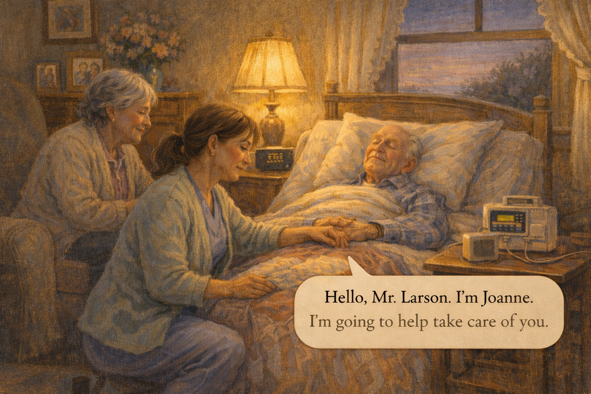

Image Prompt

(This is panel 2. Do not put the panel number in the image.)
Please generate a 16:9 image in warm contemporary realism depicting Joanne kneeling beside a hospital bed set up in a living room. Bill, 88, frail, eyes closed, white hair, lies peacefully under a quilt. Marie, 85, sits in a nearby chair holding his hand. Joanne is gently taking Bill's pulse, her face tender and respectful. Warm lamplight. The color palette is soft honey gold, deep cream, gentle lavender. The emotional tone is first meeting between nurse and patient — reverent professionalism. Speech bubble from Joanne (softly, to Bill): "Hello, Mr. Larson. I'm Joanne. I'm going to help take care of you." Generate the image immediately without asking clarifying questions.

Joanne knelt beside the bed. "Hello, Mr. Larson. I'm Joanne. I'm going to help take care of you." She said it even though he could not answer. She said it because he was a person. His breathing was slow and even. His skin was cool. Marie watched her intently. "He doesn't know us anymore," Marie said, apologetically. Joanne smiled. "He might not know your faces," she said. "But he knows the sound of your voice. That doesn't leave."

## Panel 3 – What to Expect

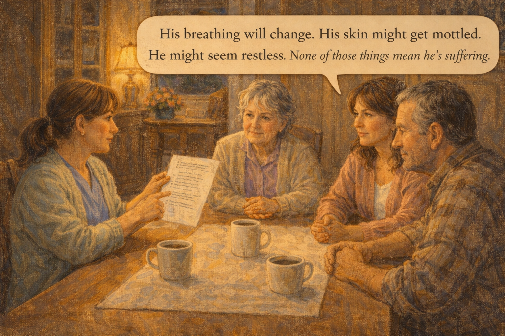

Image Prompt

(This is panel 3. Do not put the panel number in the image.)
Please generate a 16:9 image in warm contemporary realism showing Joanne sitting at the dining room table with Marie, Lisa, and Lisa's brother Dan. Joanne has a simple one-page printed handout. She is pointing gently to a bullet list. Coffee cups on the table. The color palette is warm honey wood, soft amber, cream. The emotional tone is careful teaching. Speech bubble from Joanne: "His breathing will change. His skin might get mottled. He might seem restless. None of those things mean he's suffering." Generate the image immediately without asking clarifying questions.

At the dining room table, Joanne walked the family through what was coming. The breathing changes, the Cheyne-Stokes pattern with its pauses that would make them hold their own breath. The mottled skin on the knees. The cooling hands. The terminal restlessness that was not agitation but the body shifting. The "death rattle" that sounded terrible and did not hurt. She said, over and over: *this is normal. This is not suffering. This is the body knowing how to do this last thing.*

## Panel 4 – The Myths

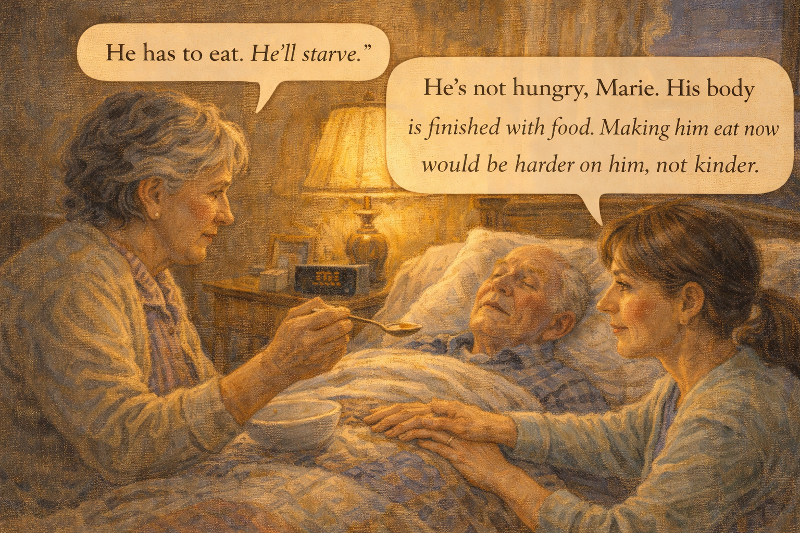

Image Prompt

(This is panel 4. Do not put the panel number in the image.)
Please generate a 16:9 image in warm contemporary realism showing Marie holding a spoon of broth hopefully toward Bill's slightly parted lips, her hand shaking slightly. Joanne is beside her, gently laying a hand on Marie's wrist. The color palette is warm amber, deep cream, soft brown. The emotional tone is the kindness of releasing a caregiver from an impossible task. Speech bubble from Marie (desperate): "He has to eat. He'll starve." Speech bubble from Joanne (warm, certain): "He's not hungry, Marie. His body is finished with food. Making him eat now would be harder on him, not kinder." Generate the image immediately without asking clarifying questions.

"He has to eat," Marie said the next morning, holding a spoon of broth she could not bring herself to put down. "He'll starve." Joanne laid a hand on her wrist. "He's not hungry, Marie. His body is finished with food. Forcing him to eat now would be harder on him, not kinder. We can wet his mouth with a little sponge if it feels dry. That's what he needs." Marie cried. She put the spoon down. The spoon on the table, unused, was a small, hard kindness.

## Panel 5 – Permission

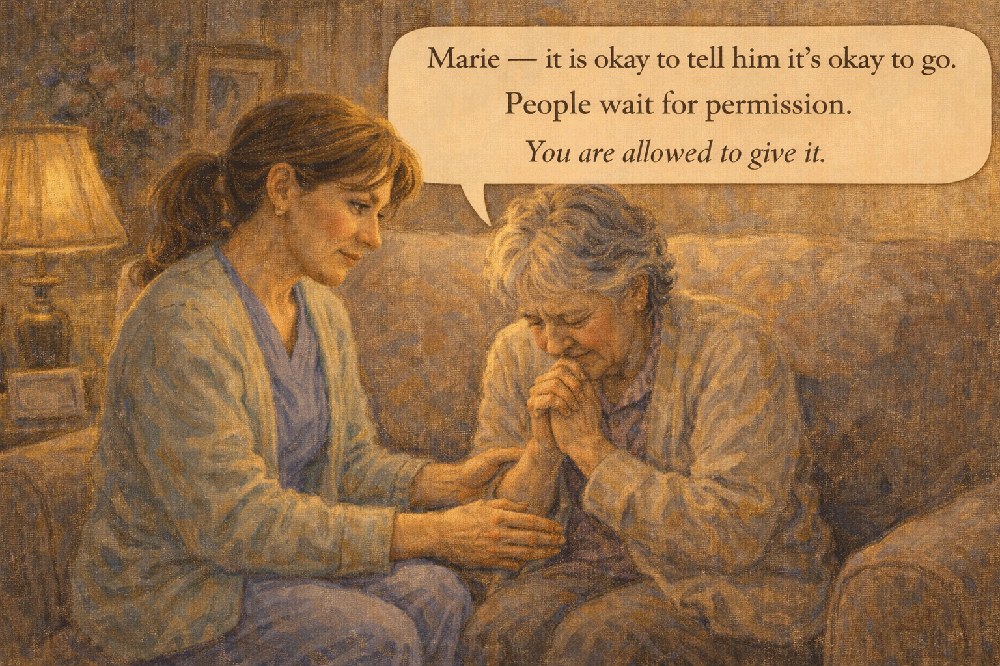

Image Prompt

(This is panel 5. Do not put the panel number in the image.)
Please generate a 16:9 image in warm contemporary realism showing Joanne sitting beside Marie on a loveseat, their hands clasped. Marie is weeping softly. Joanne's face is calm and certain. The color palette is warm amber, soft lavender, cream. The emotional tone is the giving of a permission that only a nurse can give. Speech bubble from Joanne: "Marie — it is okay to tell him it's okay to go. People wait for permission. You are allowed to give it." Generate the image immediately without asking clarifying questions.

Tuesday afternoon Joanne sat Marie down on the loveseat. "Marie," she said. "It is okay to tell him it's okay to go. People sometimes wait for permission." Marie shook her head. "I can't." Joanne said, "You don't have to today. But when you're ready, he is waiting to hear it from you. Nobody else's voice will mean as much." Marie did not answer. That night, late, Joanne heard Marie's voice through the monitor from the living room, low and clear: *It's okay, Bill. You can go. I'll be all right. I promise.*

## Panel 6 – The Grandchildren

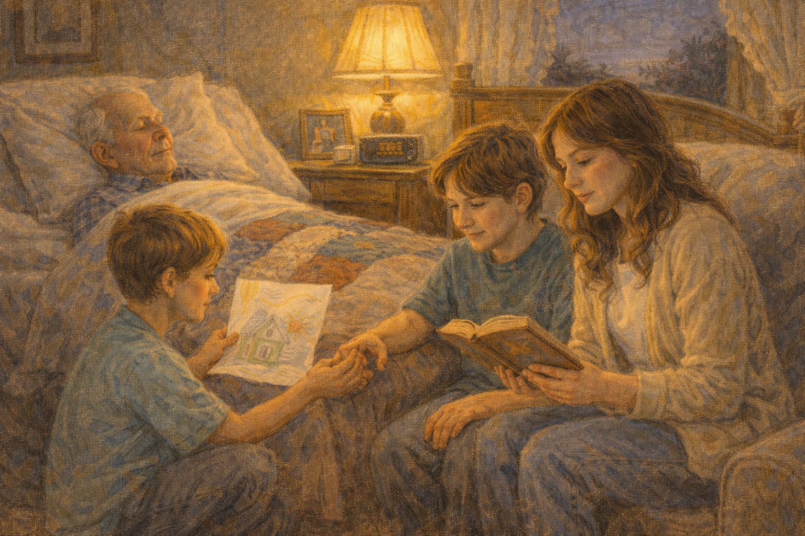

Image Prompt

(This is panel 6. Do not put the panel number in the image.)
Please generate a 16:9 image in warm contemporary realism depicting three grandchildren, ages 9, 14, and 17, sitting on the carpet near Bill's bed. The youngest is carefully showing Bill a drawing. The middle one holds his grandfather's hand. The oldest reads aloud from a worn novel. The color palette is warm gold, soft teal, cream, honey. The emotional tone is tender multigenerational presence. No speech bubbles. Generate the image immediately without asking clarifying questions.

Joanne made sure the grandchildren knew they could visit. The youngest, Sam, age nine, drew a picture of a fishing trip and held it up so Bill, whose eyes did not open, could hear about it. The middle one, Anna, fourteen, held her grandfather's hand and did not speak. The oldest, Ben, seventeen, read aloud from a mystery novel, because Bill had read mystery novels every summer of his adult life. Joanne, from the hallway, did not interrupt a single one of them.

## Panel 7 – Music

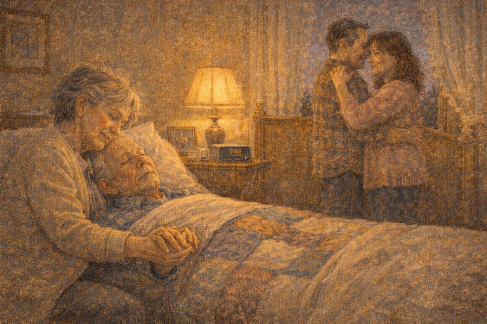

Image Prompt

(This is panel 7. Do not put the panel number in the image.)
Please generate a 16:9 image in warm contemporary realism depicting the living room with big-band music playing from a small portable speaker beside Bill's bed. Marie holds Bill's hand; her eyes are closed, remembering. Lisa and Dan sway gently, arm in arm, near the bed. The color palette is deep amber, warm rose, gold, honey. The emotional tone is memory summoned by music. No speech bubbles. Generate the image immediately without asking clarifying questions.

On Wednesday afternoon, Joanne asked what music Bill had loved. Marie said, "Big bands. Glenn. Benny. Tommy." Joanne nodded. "Play them. Loud enough for him to feel it." The next hour the living room filled with trumpets and clarinets. Marie, holding Bill's hand, closed her eyes. Lisa and her brother Dan danced in a tiny space near the bed, laughing, crying, not saying a word. Bill's fingers moved once, just a little. Marie said, "He's tapping time." Joanne, from the kitchen, blinked hard and put the kettle on.

## Panel 8 – The Squeeze

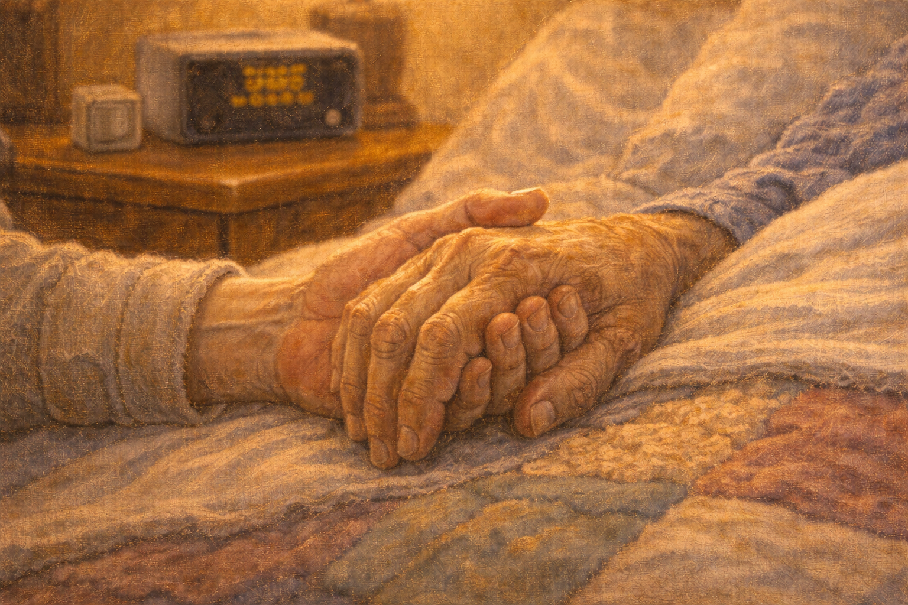

Image Prompt

(This is panel 8. Do not put the panel number in the image.)
Please generate a 16:9 image in warm contemporary realism showing a close-up of Marie's hand holding Bill's, both hands thin and spotted with age. Bill's fingers are curled gently around hers. A faint squeeze is visible. A small speaker plays softly behind. The color palette is warm honey, deep amber, soft cream. The emotional tone is a tiny, enormous moment. No speech bubbles. Generate the image immediately without asking clarifying questions.

During "In the Mood," Bill squeezed Marie's hand once. Weakly. Clearly. Marie inhaled sharply. She looked at Joanne. Joanne smiled and nodded. It was not a miracle. It was not a sign he was getting better. It was a moment of presence, the last one of its kind, and Marie knew it, and took it, and pressed her lips to his hand.

## Panel 9 – The Quiet Before

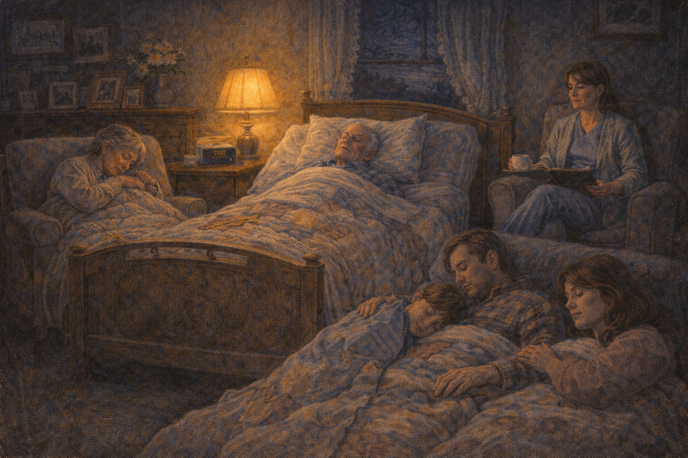

Image Prompt

(This is panel 9. Do not put the panel number in the image.)
Please generate a 16:9 image in warm contemporary realism depicting Bill's bed in the middle of the living room late at night. Marie, Lisa, Dan, and one grandchild are asleep or resting in chairs around the bed, quilts and blankets tucked around them. A small lamp glows. Joanne, still awake, sits in a corner chair with her clipboard and a small cup of coffee, quietly watching, a sentinel. The color palette is deep midnight blue, warm amber lamp, soft cream. The emotional tone is the long sacred watch. No speech bubbles. Generate the image immediately without asking clarifying questions.

Saturday night the family would not leave the house. Joanne, who had been going home at eight and coming back at six, stayed. She drank a cup of coffee in the armchair in the corner and watched the rise and fall of Bill's chest slow. She did not wake anyone. Marie, in her chair, dozed with her head on Bill's mattress, one hand on his. The room was warm. The clock in the hallway ticked. The house held its breath the way houses do.

## Panel 10 – 3 a.m.

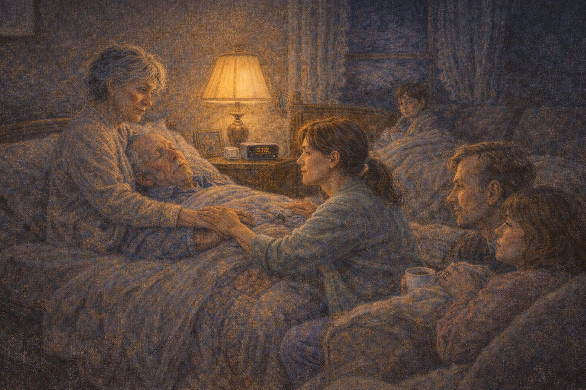

Image Prompt

(This is panel 10. Do not put the panel number in the image.)
Please generate a 16:9 image in warm contemporary realism depicting the moment of Bill's death. Joanne is kneeling on one side of the bed, one hand on Bill's arm, one hand on Marie's shoulder. Marie has startled awake; her face shows a slow, quiet understanding. The family is stirring. The lamp still glows. The color palette is deep cobalt night, warm amber, soft cream, rose. The emotional tone is reverent stillness — the moment a breath does not come again. No speech bubbles. Generate the image immediately without asking clarifying questions.

At 3:07 a.m. Joanne touched Marie's shoulder gently. "Marie," she said. Marie sat up. Bill's chest did not rise. It did not rise again. Joanne said nothing for a long minute. Then, quietly: "He's gone, Marie. He went very peacefully. You were holding his hand." Marie nodded. She did not cry yet. She put her forehead against Bill's forehead and stayed there for a long time, while her children, woken softly by Joanne, came to the bedside.

## Panel 11 – Saying Goodbye to the Body

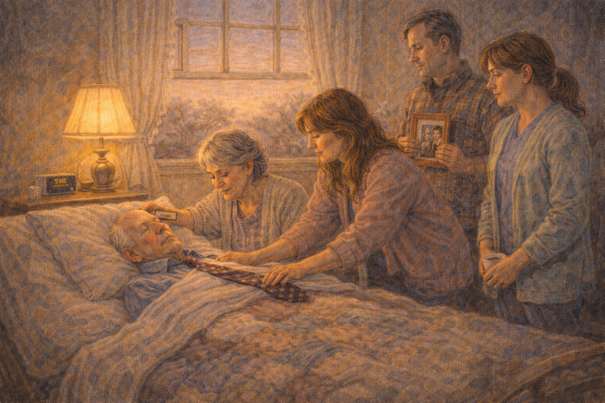

Image Prompt

(This is panel 11. Do not put the panel number in the image.)
Please generate a 16:9 image in warm contemporary realism depicting early morning light beginning to come through the living room windows. Marie is combing Bill's thin white hair gently with a small comb. Lisa is placing a favorite tie across his chest. Dan has brought a framed photo. Joanne stands at a respectful distance, not intruding. The color palette is pale rose dawn, soft cream, warm amber lamp, gentle gold. The emotional tone is the intimate ceremony a family makes when given time. No speech bubbles. Generate the image immediately without asking clarifying questions.

Joanne did not call the funeral home right away. She told the family there was no rush. For two hours, Marie combed Bill's hair. Lisa placed his old tie across his chest. Dan brought a photo of Bill and Marie from their wedding and set it on the nightstand. The grandchildren came down, one at a time, and said goodbye in their own words. Joanne made coffee. When the funeral home came, at nine, Bill was ready, and so was his family. Most families, Joanne knew, did not get this kind of goodbye. Hospice was the difference.

## Panel 12 – What Comes Next

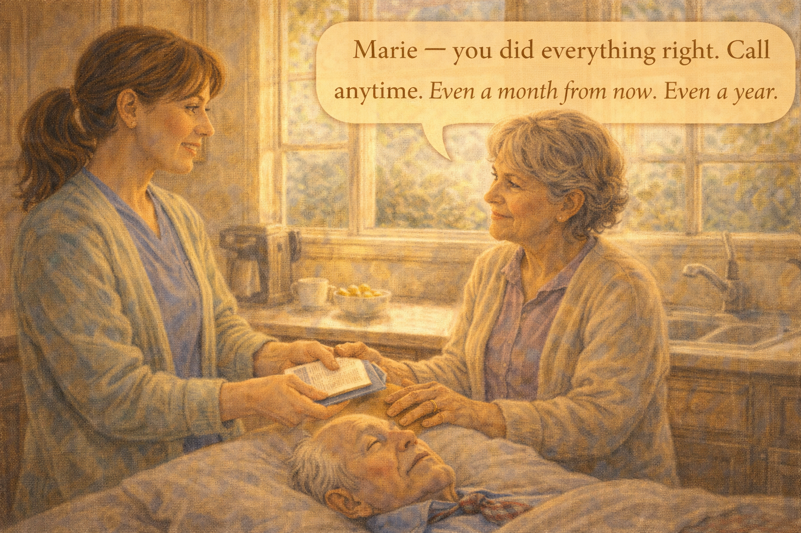

Image Prompt

(This is panel 12. Do not put the panel number in the image.)
Please generate a 16:9 image in warm contemporary realism depicting Joanne in the kitchen the next morning, handing Marie a small folder and a single sheet of bereavement resources. Marie, tired but calm, holds Joanne's hand. Morning sunlight streams in. The color palette is bright gold, warm cream, soft green. The emotional tone is gratitude and the beginning of grief. Speech bubble from Joanne: "Marie — you did everything right. Call anytime. Even a month from now. Even a year." Generate the image immediately without asking clarifying questions.

Before Joanne left, she handed Marie a small folder: bereavement counselor contacts, the local hospice's grief group, a phone number that was answered by a human twenty-four hours a day. "You did everything right, Marie," Joanne said. "Call anytime. Even a month from now. Even a year." Marie held Joanne's hand with both of hers. "Thank you for the music," Marie said. Joanne nodded, and did not trust herself to answer, and walked out into the morning sun.

### Epilogue – What Joanne Taught

| Moment | What Joanne Did | Lesson for Families |
|--------|----------------|--------------------|
| Family feared he was in pain | Explained breathing changes and mottled skin | Dying looks frightening; hospice will tell you what is normal |
| Marie tried to keep feeding him | Gently said his body was finished with food | Stopping food and water at the end is kindness, not starvation |
| Marie could not say goodbye | Gave her permission to say "it's okay to go" | Permission is often what a dying person is waiting for |
| Grandchildren were unsure what to do | Let them visit and speak in their own ways | Children belong at the bedside; they heal through presence |
| Music came up by chance | Asked for Bill's favorites and played them | Music reaches where language no longer can |
| The death itself | Did not rush the funeral home, gave the family hours | Time with the body, unhurried, is sacred — ask for it |

### A Note to Readers

Hospice is not giving up. Hospice is changing the goal from *cure* to *comfort*. For people with end-stage dementia, hospice usually begins when eating and drinking have diminished to almost nothing, when repeated infections have worn the body out, when the Functional Assessment Staging Tool (FAST) reaches stage 7.

Medicare covers hospice care in full for eligible patients. The team usually includes a nurse, a social worker, a chaplain, and a bath aide. Many families say afterward: *I wish we had started hospice sooner.*

Call the Alzheimer's Association 24/7 Helpline (**1-800-272-3900**) to find hospice services in your area. Ask a nurse directly: *does my loved one qualify for hospice yet?* You are allowed to ask.

---

*"Dying looks scary. That doesn't mean it is scary for the person doing it."*
—Joanne, hospice nurse

*"Music reaches where words no longer go. Always bring the music."*
—Hospice chaplain

*"He squeezed my hand. That was the last good day."*
—Marie Larson

---

## References

1. [Hospice Care – Alzheimer's Association](https://www.alz.org/help-support/caregiving/care-options/hospice-care) - Overview of hospice for dementia and when to begin.
2. [Hospice Care – Wikipedia](https://en.wikipedia.org/wiki/Hospice) - Background on the hospice movement and philosophy.
3. [End of Life – National Institute on Aging](https://www.nia.nih.gov/health/end-life) - Federal guidance on end-of-life care.
4. [FAST Scale for Alzheimer's – Wikipedia](https://en.wikipedia.org/wiki/Functional_Assessment_Staging_Test) - Clinical tool used to determine hospice eligibility.
5. [National Hospice and Palliative Care Organization](https://www.nhpco.org/) - National professional organization with family resources.
