# The Morning of the Tests

*A diagnosis is not an ending — it is a map*

<!-- 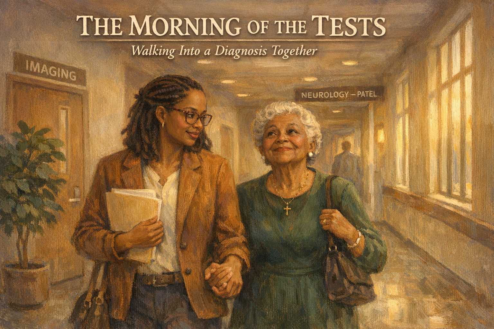 -->

Cover Image Prompt

Please generate a 16:9 cover image in warm painterly American contemporary realism — soft oil-painting brushwork with visible but refined strokes; muted warm palette of sage green, dusty lavender, cream, honey gold, rose pink, and walnut brown; warm golden afternoon window light as the key and honey-gold interior lamp glow as fill; soft low-contrast shadows; fabric textures (knit, flannel, cotton, lace) clearly visible; in the Rockwell-and-Kinkade tradition of tender domestic illustration. No saturated primaries, no neon, no photorealism, no vector flatness, no film grain, no chromatic aberration. Night scenes keep the same warm vocabulary — indigo and deep walnut in place of saturated cool blue, with honey-gold porch or lamp light as warm accent.

**Title treatment (top ~15% of frame):** Across the top of the image, centered horizontally, render the main title "THE MORNING OF THE TESTS" in a warm ivory/cream humanist serif — the kind of hand-set lettering you would see on a classic illustrated-novel cover — with a soft painterly drop-shadow so the text integrates into the scene below, never a hard graphic bar. Directly beneath the title, in a smaller italic of the same serif, render the subtitle "Walking Into a Diagnosis Together". The lettering should feel as if the painter lettered it themselves, in the same brush vocabulary as the painting.

**Scene:** A modern medical-center hallway at mid-morning. Soft daylight pours through tall windows on the right. In the foreground, walking down the corridor hand-in-hand: Jasmine, 35, a warm-brown-skinned young Black woman with shoulder-length braids tied back, tortoise-shell glasses, a caramel corduroy blazer over a cream blouse, holding a folder of paperwork; and her grandmother Delphine, 81, short white-silver curls, warm brown skin, a dignified dark green dress with small pearl earrings and a delicate gold cross necklace, a small handbag over her shoulder. Delphine looks slightly upward with a brave, almost-funny smile. Jasmine looks at her grandmother with a mix of love and protective focus. Down the hallway: doors labeled "IMAGING" and "NEUROLOGY — PATEL," soft directional signage, a potted ficus. The clinical hallway is warmed by the painterly palette rather than rendered cold.

**Emotional tone:** walking toward something hard, together.

Generate the image immediately without asking clarifying questions.

## Narrative Prompt

This is a fictional composite story built from the experience of thousands of families walking a loved one through a full dementia workup. Jasmine and Delphine are invented characters, but every step here — the car ride, the waiting room, the short cognitive screen, the MRI, the results conversation — is drawn from the real sequence of a standard neuropsychological evaluation. The story teaches one clear skill: what actually happens during a dementia workup, what to bring, what to ask, and how to support a loved one through it. Art style: contemporary photorealistic illustration, warm and dignified, present-day urban America.

## Prologue

Dementia is not one disease. It is a family of conditions — Alzheimer's is the most common — and getting the right diagnosis takes more than one office visit. A proper workup usually includes a detailed history, a short cognitive screen, blood work, brain imaging, and sometimes more. For the family member who comes along, the morning of the tests can feel like an eternity in pastel waiting rooms. But a diagnosis is not an ending. It is a map. And without the map, there is no plan. This is the story of one granddaughter and one grandmother who walked that morning together.

---

## Panel 1: The Woman Who Raised Her

<!-- 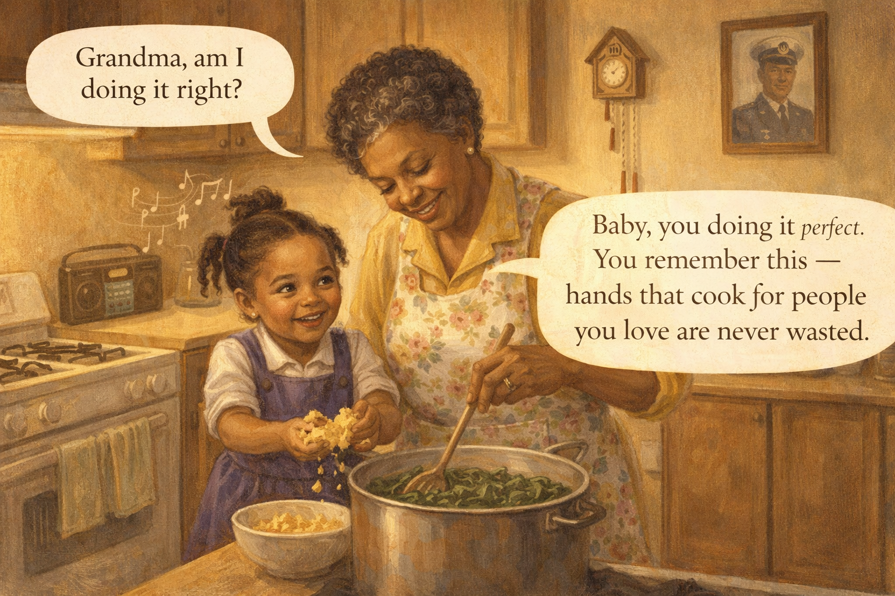 -->

Image Prompt

(This is panel 1. Do not put the panel number in the image.)

Contemporary photorealistic illustration, 16:9 wide-landscape format. Warm sepia-tinged flashback-style panel showing a small row-house kitchen in the late 1990s. A younger **Delphine** (then in her late 50s, hair still partly black, a floral apron over a yellow cotton dress) stands at a stove stirring a large pot of greens. A small pigtailed **Jasmine** (age 7, wearing a purple school uniform jumper, one shoelace untied, a gap-toothed smile) is on a step stool beside her, carefully crumbling cornbread into a bowl with great seriousness. Gospel music on a small radio on the counter (musical notes in the air). A framed photo of a middle-aged man in a Navy uniform hangs on the wall — Delphine's late husband. A wooden cuckoo clock. Color palette: warm honey browns, mustard yellows, soft avocado green. Emotional tone: love, the beginning of a bond.

**Speech bubble 1** — tail pointing to young **Jasmine**, positioned above her, proud: "Grandma, am I doing it right?"

**Speech bubble 2** — tail pointing to young **Delphine**, positioned above her, warm: "Baby, you doing it *perfect.* You remember this — hands that cook for people you love are never wasted."

Generate the image immediately without asking clarifying questions.

**Narrative:** Jasmine's grandmother Delphine had raised her. When Jasmine's mother had died young, Grandma Delphine had taken the girl in at age six and filled the small row-house kitchen with greens and cornbread and the gospel of the living. Delphine had taught her everything: how to crumble cornbread into buttermilk, how to press a blouse, how to tie a tie, how to walk into a room full of people who did not expect to see her and belong there anyway. Now Jasmine was thirty-five, and the roles were beginning to flip.

---

## Panel 2: The Car Ride In

<!-- 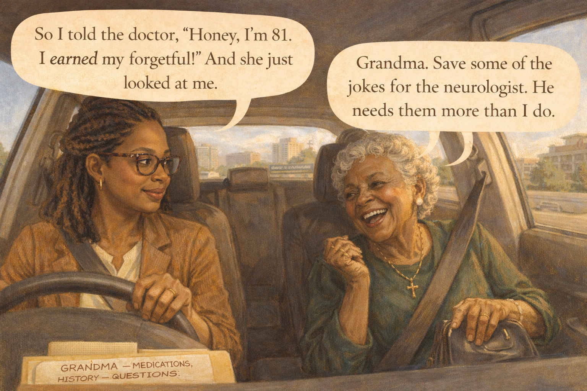 -->

Image Prompt

(This is panel 2. Do not put the panel number in the image.)

Contemporary photorealistic illustration, 16:9 wide-landscape format. Interior of **Jasmine's** small silver hatchback, morning light streaming through the windshield. **Jasmine** is at the wheel in the LEFT of the frame, in her caramel corduroy blazer. Her face is focused but gentle — she is glancing sideways at her grandmother with a worried-affectionate smile. **Delphine** (in the passenger seat on the RIGHT) is in her dark green dress with the gold cross necklace, a small patent-leather handbag in her lap. She is mid-joke, eyes crinkled with laughter, one hand playfully slapping her knee. She is nervous underneath it but she is not showing it. Through the windshield: a clear blue-sky morning, downtown buildings in the distance, a sign for the medical campus. On the dashboard: a folder labeled "GRANDMA — MEDICATIONS, HISTORY, QUESTIONS." Color palette: warm morning golds, clean blues, soft creams. Emotional tone: love moving toward a hard appointment, armored in humor.

**Speech bubble 1** — tail pointing to **Delphine**, positioned above her, laughing: "So I told the doctor, 'Honey, I'm 81. I *earned* my forgetful!' And she just looked at me."

**Speech bubble 2** — tail pointing to **Jasmine**, positioned above her, smiling: "Grandma. Save some of the jokes for the neurologist. He needs them more than I do."

Generate the image immediately without asking clarifying questions.

**Narrative:** On the morning of the tests, Jasmine picked Delphine up at 7:45. Her grandmother was already dressed to the nines — the dark green church dress, pearl earrings, the small gold cross, her Sunday handbag. Delphine had always said a hospital was no excuse to look anything less than your best. On the drive in, she cracked jokes, the way she always did when she was nervous. Jasmine laughed, because she knew the jokes were a kind of armor. In the folder on the dashboard: Delphine's medications, her medical history, a list of the memory changes Jasmine had noticed over eighteen months, and a careful list of questions.

---

## Panel 3: The Waiting Room

<!-- 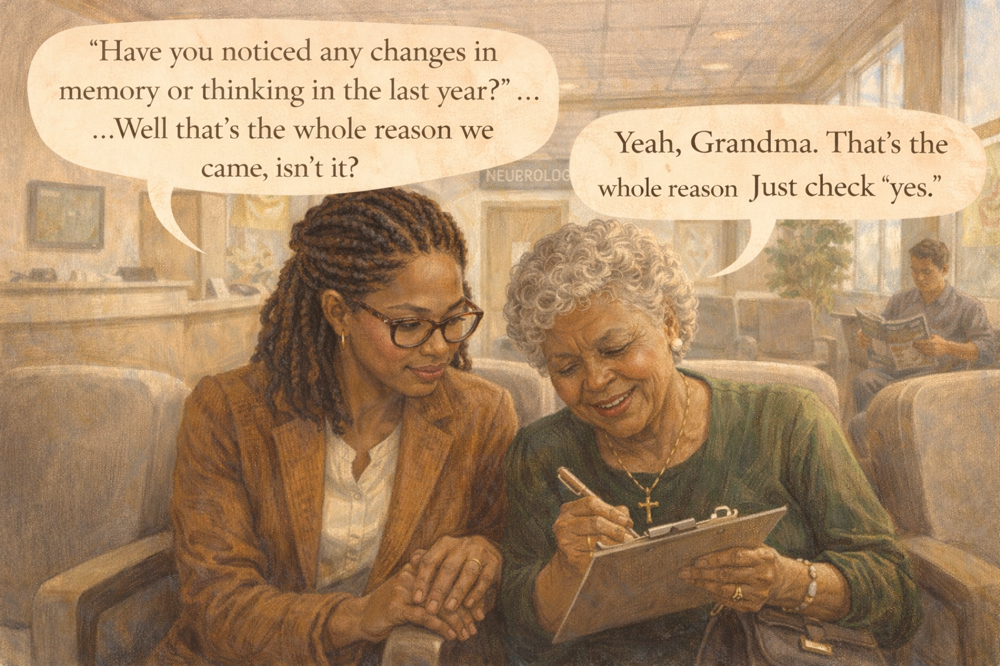 -->

Image Prompt

(This is panel 3. Do not put the panel number in the image.)

Contemporary photorealistic illustration, 16:9 wide-landscape format. A neurology clinic waiting room, modern and warm. Soft gray upholstered chairs against a cream wall. **Jasmine** and **Delphine** sit side by side, hands clasped between them on the chair arm. Delphine is holding a small printed questionnaire clipboard in her free hand and filling it out with a pen — her handwriting small and careful. Jasmine watches her grandmother's hand on the pen with an attentive, protective face. In the background: a reception desk, a soft-focused sign reading "NEUROLOGY," another patient reading a magazine, soft morning light through tall windows, a muted wall TV showing a weather map. Color palette: warm grays, sage green, creamy whites, soft terracotta accents. Emotional tone: nervous patience, grandmother still bright, granddaughter quietly anchoring.

**Speech bubble 1** — tail pointing to **Delphine**, positioned above her, squinting at the clipboard: "'Have you noticed any changes in memory or thinking in the last year?' ...Well that's the whole reason we *came,* isn't it?"

**Speech bubble 2** — tail pointing to **Jasmine**, positioned above her, gentle: "Yeah, Grandma. That's the whole reason. Just check 'yes.'"

Generate the image immediately without asking clarifying questions.

**Narrative:** In the waiting room, Delphine filled out a four-page questionnaire with her careful, small handwriting. Jasmine watched her grandmother's hand. Some of the answers came quickly — her birthday, her husband's name, her address. Some of them paused. When Delphine got to *"have you noticed any changes in memory or thinking in the last year?"* she looked up at Jasmine and said, "Well that's the whole reason we came, isn't it?" Jasmine kissed the top of her grandmother's head. "Yeah, Grandma. That's the whole reason. Just check yes."

---

## Panel 4: The Short Cognitive Screen

<!-- 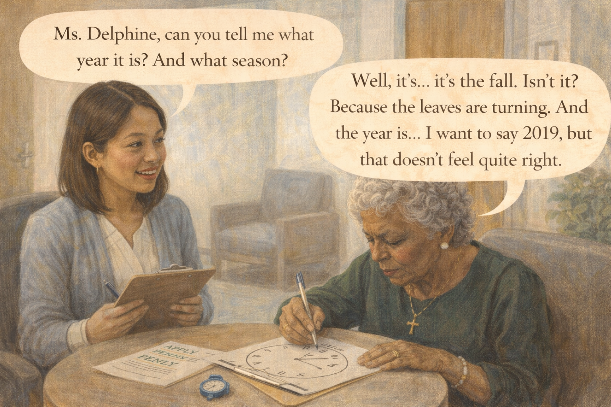 -->

Image Prompt

(This is panel 4. Do not put the panel number in the image.)

Contemporary photorealistic illustration, 16:9 wide-landscape format. A small bright consultation room. **Delphine** sits at a small round table across from a neuropsychology technician — **Dr. Kim** (30s, Asian-American woman, kind face, soft blue cardigan over a white blouse, a clipboard in hand, a small stopwatch visible). On the table between them: a printed sheet showing a simple clock-drawing task — Delphine has just drawn a circle with numbers on it but the clock hands show an incorrect time. A page with a list of words: *APPLE, PENNY, TABLE.* **Delphine** is concentrating hard, brow furrowed, a pen in her hand. **Jasmine** is NOT in the room — the door visible in the background indicates she has been asked to wait outside. Color palette: clean whites, warm blue accents, soft morning light, the gentle yellow of the cognitive-test papers. Emotional tone: focused work, a grandmother doing her best, a kind evaluator.

**Speech bubble 1** — tail pointing to **Dr. Kim**, positioned above her, warm and professional: "Ms. Delphine, can you tell me what year it is? And what season?"

**Speech bubble 2** — tail pointing to **Delphine**, positioned above her, thinking hard: "Well, it's... it's the fall. Isn't it? Because the leaves are turning. And the year is... I want to say 2019, but that doesn't feel quite right."

Generate the image immediately without asking clarifying questions.

**Narrative:** A technician named Dr. Kim brought Delphine into a small bright room for the cognitive screen. Jasmine waited outside. The screen was a standard tool — counting backward by sevens, remembering three words, drawing a clock face, naming simple objects. It took about twenty minutes. Dr. Kim was kind and never rushed. Delphine did some parts beautifully — she knew her children's names, her address, and the name of the sitting president. Other parts were harder. The clock she drew had the twelve at the bottom. The year she named was six years behind. Dr. Kim gently wrote it all down.

---

## Panel 5: The MRI Machine

<!-- 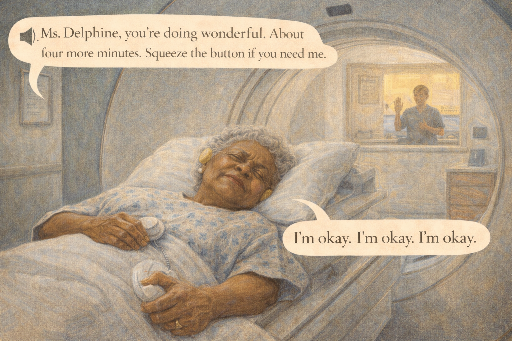 -->

Image Prompt

(This is panel 5. Do not put the panel number in the image.)

Contemporary photorealistic illustration, 16:9 wide-landscape format. An MRI suite. **Delphine** lies on the flat bed of a large circular MRI scanner in a hospital gown printed with tiny blue flowers, a thin white blanket over her legs. She wears foam earplugs and a small plastic button (the MRI call button) gripped in her right hand. Her face is calm but eyes closed tight. She looks very small and very brave. A technician in scrubs is visible through a wide window in the control room behind, making gentle hand signals. The MRI's circular opening is partially behind her head. Soft clinical lights. A small framed inspirational quote on a wall visible through the window. Color palette: cool clinical blues and whites, the soft warm yellow of the reading room window, the pale blue of Delphine's gown. Emotional tone: courage inside a big machine.

**Speech bubble 1** — a loudspeaker-style speech bubble coming from the wall, representing the MRI tech's voice: "Ms. Delphine, you're doing wonderful. About four more minutes. Squeeze the button if you need me."

**Speech bubble 2** — tail pointing to **Delphine**, positioned above her, small and whispered: "I'm okay. I'm okay. I'm okay."

Generate the image immediately without asking clarifying questions.

**Narrative:** Next came the MRI. Delphine changed into a hospital gown, took out her pearl earrings and her gold cross (both had to stay out of the scanner), and lay on her back on the long narrow bed. The technician told her it would be loud — knocks and beeps and strange vibrations. Delphine closed her eyes and whispered to herself, *"I'm okay, I'm okay, I'm okay,"* the way she used to whisper it to Jasmine on the night her mother had died. The machine did its work. The pictures it took would, in their quiet way, tell a story Delphine's own words could not.

---

## Panel 6: The Long Wait

<!-- 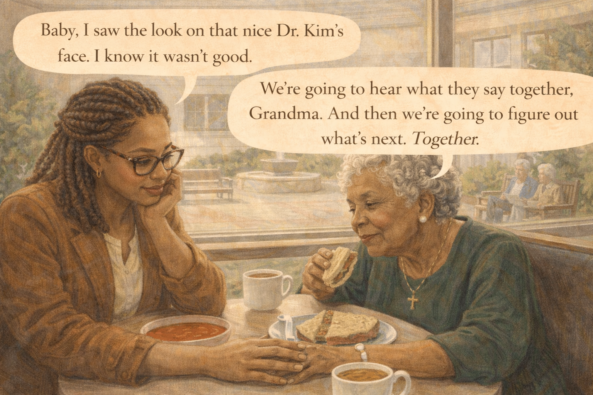 -->

Image Prompt

(This is panel 6. Do not put the panel number in the image.)

Contemporary photorealistic illustration, 16:9 wide-landscape format. A small hospital cafeteria, table by a window. **Jasmine** and **Delphine** sit across from each other sharing a small lunch: a turkey sandwich cut in half, a bowl of tomato soup, two cups of tea. Delphine (back in her green dress, cross necklace back on) is eating slowly but clearly enjoying the sandwich. Jasmine has barely touched her soup; she is leaning on one hand, her other hand covering her grandmother's hand on the table. Through the window behind them: a small hospital courtyard with a fountain and a few benches. An older couple sits on one of the benches. Warm midday light. Color palette: warm browns, cream, the bright orange-red of the tomato soup, the soft green of Delphine's dress. Emotional tone: the exhale after a hard morning, the quiet before results.

**Speech bubble 1** — tail pointing to **Delphine**, positioned above her, gentle and small: "Baby, I saw the look on that nice Dr. Kim's face. I know it wasn't good."

**Speech bubble 2** — tail pointing to **Jasmine**, positioned above her, steady: "We're going to hear what they say together, Grandma. And then we're going to figure out what's next. Together."

Generate the image immediately without asking clarifying questions.

**Narrative:** Between the MRI and the results meeting, there was a two-hour gap. Jasmine and Delphine went to the hospital cafeteria. Jasmine ordered tomato soup she could not eat. Delphine ordered half a turkey sandwich and made the surprisingly serious observation that hospital mustard was not what it used to be. After a while she said, quietly, "Baby. I saw the look on that nice Dr. Kim's face. I know it wasn't good." Jasmine squeezed her grandmother's hand. "We're going to hear what they say together, Grandma. And then we're going to figure out what's next. Together."

---

## Panel 7: The Results Room

<!-- 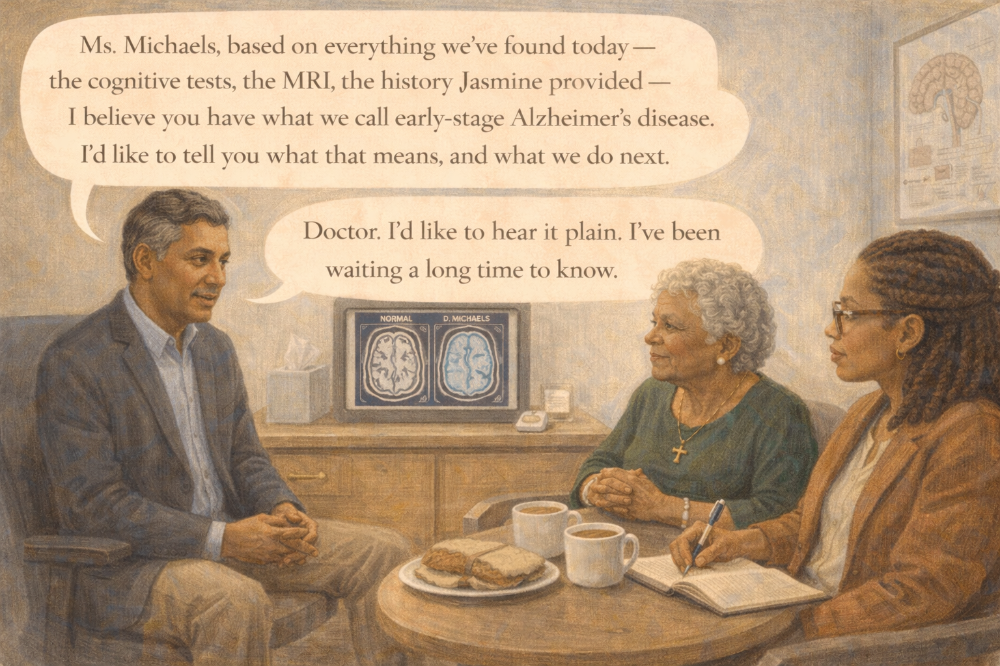 -->

Image Prompt

(This is panel 7. Do not put the panel number in the image.)

Contemporary photorealistic illustration, 16:9 wide-landscape format. A neurologist's consultation room. **Dr. Patel** (50s, a warm-skinned Indian-American man with silver-threaded black hair, navy blazer over a soft blue shirt, no tie, kind professorial face) sits on a rolling stool. Across from him on two padded chairs sit **Delphine** (green dress, cross necklace, hands folded in her lap) and **Jasmine** (caramel blazer, notebook open on her knee, pen in hand). Between them on a low table: a tablet screen showing two MRI brain images side-by-side — one labeled "NORMAL" and one labeled "D. MICHAELS" (Delphine) — with subtle hippocampal atrophy visible in the patient's scan. A diagram of the brain on the wall. A small tissue box on the table. Color palette: warm creams, soft navy, the cool blue of the MRI images on the screen. Emotional tone: serious, dignified, careful — the delivery of a diagnosis with love.

**Speech bubble 1** — tail pointing to **Dr. Patel**, positioned above him, kind and direct: "Ms. Michaels, based on everything we've found today — the cognitive tests, the MRI, the history Jasmine provided — I believe you have what we call early-stage Alzheimer's disease. I'd like to tell you what that means, and what we do next."

**Speech bubble 2** — tail pointing to **Delphine**, positioned above her, quiet and composed: "Doctor. I'd like to hear it plain. I've been waiting a long time to know."

Generate the image immediately without asking clarifying questions.

**Narrative:** At 2:15 PM, Dr. Patel brought them into his office. He did not make them wait for the news. He sat down on his rolling stool, turned a tablet so they could see two brain images, and said: "Ms. Michaels, based on everything we've found today, I believe you have what we call early-stage Alzheimer's disease." He gave the words space to land. Delphine did not look at the screen. She looked at the doctor. "Doctor," she said. "I'd like to hear it plain. I've been waiting a long time to know." Jasmine opened her notebook and began, silently, to write.

---

## Panel 8: The Words Land

<!-- 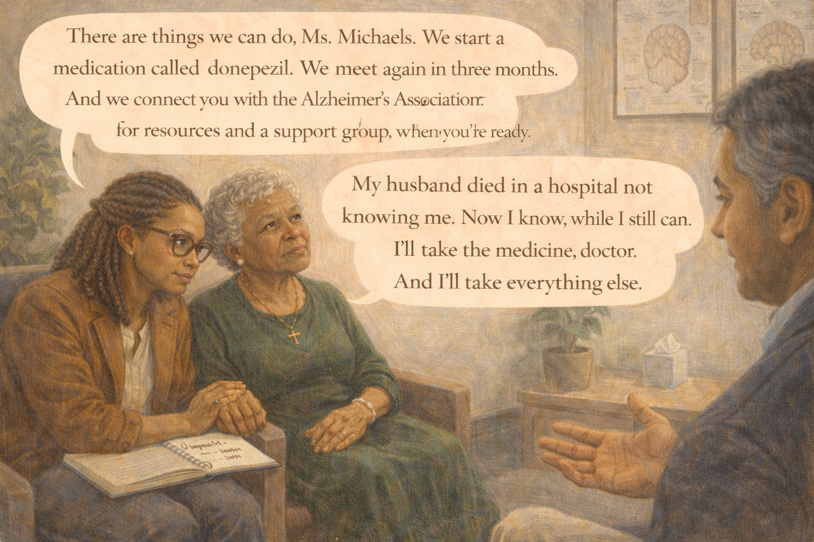 -->

Image Prompt

(This is panel 8. Do not put the panel number in the image.)

Contemporary photorealistic illustration, 16:9 wide-landscape format. Same consultation room, a few minutes later. **Delphine** has quietly reached out and taken **Jasmine's** hand; their joined hands rest on the arm of Delphine's chair. Delphine's face is composed but wet — a single tear has tracked down her cheek, catching the light. Her chin is up. She is listening. **Jasmine** is leaning slightly forward, her notebook on her knee with neat bullet points: *"Alzheimer's – early stage"* / *"donepezil – start 5mg"* / *"MRI confirms"* / *"follow up 3 months."* Dr. Patel is in soft focus on the right, gesturing gently, his voice warm. On the wall, framed anatomical drawings of the brain. A small potted fiddle-leaf fig in a corner. Color palette: warm browns and creams, soft navy blues, the warm amber of the afternoon light. Emotional tone: dignity, grief, the beginning of a plan.

**Speech bubble 1** — tail pointing to **Dr. Patel**, positioned above him, warm: "There are things we can do, Ms. Michaels. We start a medication called donepezil. We meet again in three months. And we connect you with the Alzheimer's Association for resources and a support group, when you're ready."

**Speech bubble 2** — tail pointing to **Delphine**, positioned above her, quiet, clear: "My husband died in a hospital not knowing me. Now I know, while I still can. I'll take the medicine, doctor. And I'll take everything else."

Generate the image immediately without asking clarifying questions.

**Narrative:** Dr. Patel did not rush. He explained that early-stage Alzheimer's does not mean the end of a person — it means a new chapter, with time to plan. He told Delphine about a medication called donepezil that could gently slow the symptoms. He told her about a local Alzheimer's Association support group. Delphine listened with her chin up, tears streaming quietly down. When he was finished, she said, "My husband died in a hospital not knowing me. Now I know, while I still can. I'll take the medicine, doctor. And I'll take everything else."

---

## Panel 9: The Elevator Down

<!-- 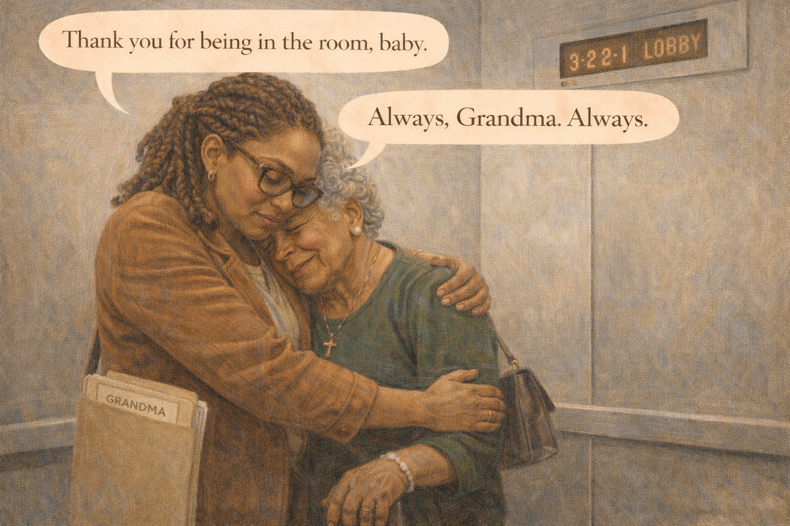 -->

Image Prompt

(This is panel 9. Do not put the panel number in the image.)

Contemporary photorealistic illustration, 16:9 wide-landscape format. Interior of a hospital elevator. The two of them are alone. **Jasmine** is holding her grandmother in a long, full-body hug; Delphine's head rests on Jasmine's shoulder. Delphine's small handbag dangles from her fingers. Jasmine's folder (still labeled "GRANDMA") is tucked under one arm. Neither is speaking. Both have wet eyes. The elevator display above the door shows "3 – 2 – 1 – LOBBY." A soft fluorescent light from the elevator ceiling. Color palette: the soft hospital-neutral gray of the elevator, the warm browns of their skin, the deep green of Delphine's dress, the warm caramel of Jasmine's blazer. Emotional tone: the held breath, the long exhale, love leaning into love.

**Speech bubble 1** — tail pointing to **Delphine** (head on Jasmine's shoulder), positioned above her, muffled and small: "Thank you for being in the room, baby."

**Speech bubble 2** — tail pointing to **Jasmine**, positioned above her, small and tender: "Always, Grandma. Always."

Generate the image immediately without asking clarifying questions.

**Narrative:** They stood in the elevator down to the parking garage holding each other. Jasmine did not try to talk. Delphine did not try to joke. There are moments in a family when the words arrive later and the holding has to be enough. On the third floor, on the second, on the first — they held. "Thank you for being in the room, baby," Delphine said into Jasmine's shoulder. "Always, Grandma. Always."

---

## Panel 10: The Parking-Garage Playlist

<!-- 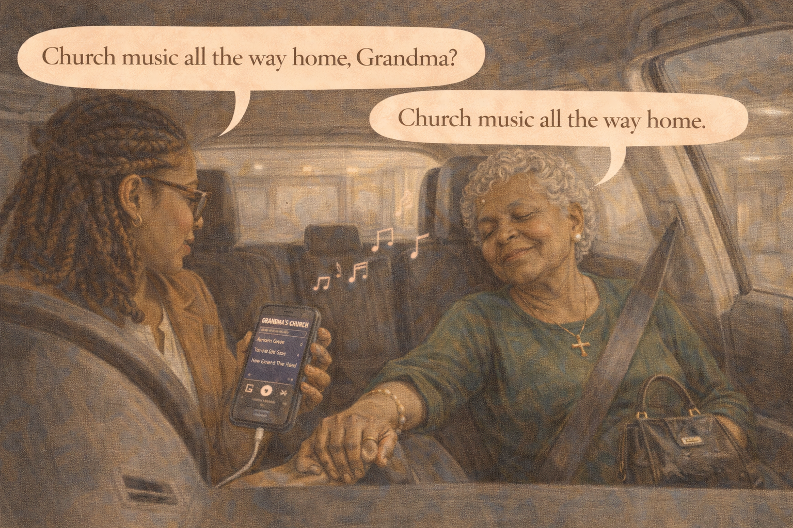 -->

Image Prompt

(This is panel 10. Do not put the panel number in the image.)

Contemporary photorealistic illustration, 16:9 wide-landscape format. **Jasmine's** silver hatchback, in a concrete parking garage, interior shot. **Delphine** has settled into the passenger seat, her seatbelt on, her handbag in her lap, her eyes closed in a small resting smile. **Jasmine** is in the driver's seat, turned toward her phone connected to the car stereo, and we can see the phone screen showing a playlist titled "GRANDMA'S CHURCH" with song titles like "Amazing Grace," "How Great Thou Art," "Precious Lord, Take My Hand." The first song has just started — musical notes in the air. The car is still parked. Color palette: dim concrete grays outside, the warm amber of the car's interior lights, the bright green of Delphine's dress. Emotional tone: the very first minute of a new chapter — met with a song.

**Speech bubble 1** — tail pointing to **Jasmine**, positioned above her, gentle: "Church music all the way home, Grandma?"

**Speech bubble 2** — tail pointing to **Delphine**, positioned above her, eyes still closed, smiling: "Church music all the way home."

Generate the image immediately without asking clarifying questions.

**Narrative:** In the parking garage, before she started the car, Jasmine put on the playlist she had saved for hard days — the gospel her grandmother had raised her on. "Amazing Grace" began. Delphine closed her eyes. She did not sing. She did not cry. She just let the song fill the small silver car. Jasmine drove them home through the long afternoon light, and for the next forty minutes they did not need to talk at all.

---

## Panel 11: The Family Kitchen That Night

<!-- 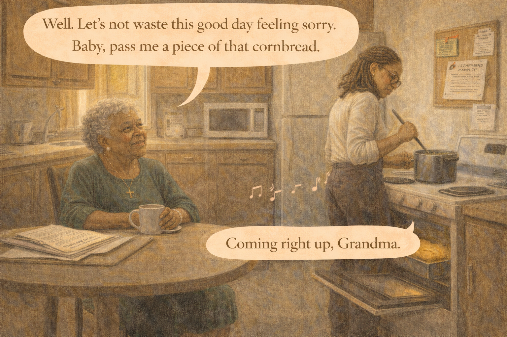 -->

Image Prompt

(This is panel 11. Do not put the panel number in the image.)

Contemporary photorealistic illustration, 16:9 wide-landscape format. Delphine's small warm row-house kitchen, evening. **Delphine** sits at her kitchen table in a soft house dress and slippers, a mug of tea in front of her, the folder of paperwork from Dr. Patel open neatly beside her. **Jasmine** stands at the stove, back partly turned, stirring a pot of greens, her blazer off, sleeves rolled up — she has stayed the night. A pot of cornbread is just coming out of the oven (visible through the open oven door with a golden top). On a small corkboard on the wall: a newly-pinned appointment card for *"3-month neurology follow-up"* and a printed sheet titled *"ALZHEIMER'S ASSOCIATION LOCAL SUPPORT GROUP."* Color palette: honey yellows, warm browns, sage green of Delphine's house dress, the deep green of the greens. Emotional tone: home, food, the ordinary that continues.

**Speech bubble 1** — tail pointing to **Delphine**, positioned above her, thoughtful and content: "Well. Let's not waste this good day feeling sorry. Baby, pass me a piece of that cornbread."

**Speech bubble 2** — tail pointing to **Jasmine**, positioned above her, warm: "Coming right up, Grandma."

Generate the image immediately without asking clarifying questions.

**Narrative:** That evening, Jasmine stayed over. She cooked greens and made the cornbread the way Delphine had taught her, crumbling it just right. Delphine sat at the kitchen table with the folder from Dr. Patel laid out neatly — the appointment card, the medication sheet, the support-group handout. "Well," her grandmother finally said, spreading butter on a hot square of cornbread, "let's not waste this good day feeling sorry. Baby, pass me more." Jasmine laughed once, wetly. She passed the cornbread.

---

## Panel 12: The First Support Group

<!-- 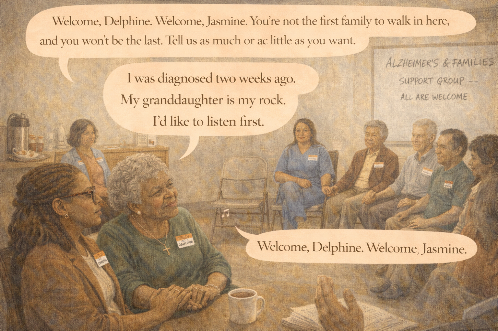 -->

Image Prompt

(This is panel 12. Do not put the panel number in the image.)

Contemporary photorealistic illustration, 16:9 wide-landscape format. A community-center multipurpose room. About twelve folding chairs in a loose circle. **Delphine** sits in a chair on the LEFT side of the circle in her soft green cardigan, an "HELLO MY NAME IS" sticker on her chest that reads "DELPHINE." **Jasmine** sits next to her (a matching sticker on her chest, "JASMINE"), holding her grandmother's hand. Around the circle: a diverse group — an older white couple holding hands, a middle-aged Latino man, a woman in her 70s with a walker, a middle-aged Asian woman, a young caregiver in scrubs. On a whiteboard at the front: "ALZHEIMER'S & FAMILIES SUPPORT GROUP — ALL ARE WELCOME." A coffee urn and a plate of cookies on a side table. Warm fluorescent light. Color palette: warm cream walls, the colors of everyone's soft sweaters, the gentle pop of the name stickers. Emotional tone: arrival, community, not being alone.

**Speech bubble 1** — tail pointing to a **group facilitator** (a kind woman on the far side, out of frame's center but visible): "Welcome, Delphine. Welcome, Jasmine. You're not the first family to walk in here, and you won't be the last. Tell us as much or as little as you want."

**Speech bubble 2** — tail pointing to **Delphine**, positioned above her, gentle and clear: "I was diagnosed two weeks ago. My granddaughter is my rock. I'd like to listen first."

Generate the image immediately without asking clarifying questions.

**Narrative:** Two weeks later, Delphine and Jasmine walked into their first Alzheimer's Association support group at the community center. Delphine wore a "Hello My Name Is" sticker. The facilitator, a warm older woman named Hattie, welcomed them without making a fuss. Around the circle sat an older white couple, a middle-aged Latino man, a woman with a walker, a caregiver still in her hospital scrubs from a shift. Delphine did not tell her story that first week. She listened. But on the drive home, she said to Jasmine: "Baby. I'm not alone." And neither, as it turned out, was Jasmine.

---

## Epilogue: What This Family Learned

| Challenge | Response | Lesson for Today |
|---|---|---|
| Not knowing what the appointment would involve | Jasmine brought a folder — medications, history, observations, questions | The family member's observations are often the most important part of a dementia workup. |
| Fear of the tests themselves | Understood the workup as *a map,* not a judgment | A diagnosis is not an ending. It is the beginning of a plan. |
| Delphine trying to hide her fear with jokes | Jasmine let her, and sat with the jokes as armor | Respect how your loved one copes. You do not have to fix their coping style. |
| Facing the words *early-stage Alzheimer's disease* | Asked to hear it *plain* — and took notes | Clear language beats kind vagueness. Ask for plain words. |
| Leaving the office carrying hard news alone | Held each other in the elevator; gospel on the drive home | The ride home is its own appointment. Plan for it. |
| Needing a community | Went to a local Alzheimer's Association support group | You were never meant to walk this road alone. The room is already full of people who understand. |

## A Note to the Reader

If you are walking a parent, grandparent, or spouse into a full
dementia workup, please know: the process is thorough by design.
Nobody should be given a diagnosis like Alzheimer's without a
proper evaluation that includes history, a cognitive screen,
blood tests to rule out treatable causes (thyroid, B12
deficiency, medications), and usually brain imaging. The morning
is long. It is supposed to be long.

A short checklist for the day of the tests:

- **Bring a folder**: medications, medical history, a list of changes you've seen, your specific questions.
- **Go with them**. The family member's observations are often the single most valuable piece of data.
- **Ask for plain language**. If a word confuses you, stop the doctor and ask.
- **Plan the drive home**: music, silence, food, or someone to meet you.
- **Ask about the local support group** before you leave.

The **Alzheimer's Association 24/7 Helpline (1-800-272-3900)** can
help you prepare for the appointment and find the nearest support
group afterward.

## Quotes From the Story

> "Doctor, I'd like to hear it plain. I've been waiting a long time to know." — *Delphine*

> "Thank you for being in the room, baby." — *Delphine*

> "Well. Let's not waste this good day feeling sorry. Pass me a piece of that cornbread." — *Delphine*

## References

1. [Wikipedia: Alzheimer's disease](https://en.wikipedia.org/wiki/Alzheimer%27s_disease) - Overview of the most common cause of dementia, its stages, and typical workup
2. [Wikipedia: Mini-Mental State Examination](https://en.wikipedia.org/wiki/Mini-Mental_State_Examination) - One common short cognitive screen used during evaluations
3. [Alzheimer's Association: Medical Tests for Diagnosing Alzheimer's](https://www.alz.org/alzheimers-dementia/diagnosis/medical_tests) - Plain-language guide to what happens during a dementia workup
4. [National Institute on Aging: How Is Alzheimer's Disease Diagnosed?](https://www.nia.nih.gov/health/alzheimers-symptoms-and-diagnosis/how-alzheimers-disease-diagnosed) - Federal agency explanation of the diagnostic process
5. [Alzheimer's Association: Finding a Support Group](https://www.alz.org/help-support/community/support-groups) - Locator for in-person and virtual caregiver and early-stage support groups
