# The Night He Walked

*Safety and dignity are not opposites*

<!-- 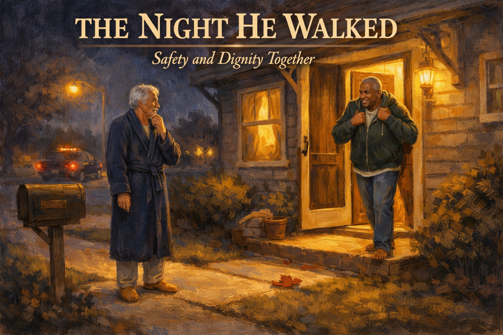 -->

Cover Image Prompt

Please generate a 16:9 cover image in warm painterly American contemporary realism — soft oil-painting brushwork with visible but refined strokes; muted warm palette of sage green, dusty lavender, cream, honey gold, rose pink, and walnut brown; warm golden afternoon window light as the key and honey-gold interior lamp glow as fill; soft low-contrast shadows; fabric textures (knit, flannel, cotton, lace) clearly visible; in the Rockwell-and-Kinkade tradition of tender domestic illustration. No saturated primaries, no neon, no photorealism, no vector flatness, no film grain, no chromatic aberration. Night scenes keep the same warm vocabulary — indigo and deep walnut in place of saturated cool blue, with honey-gold porch or lamp light as warm accent.

**Title treatment (top ~15% of frame):** Across the top of the image, centered horizontally, render the main title "THE NIGHT HE WALKED" in a warm ivory/cream humanist serif — the kind of hand-set lettering you would see on a classic illustrated-novel cover — with a soft painterly drop-shadow so the text integrates into the scene below, never a hard graphic bar. Directly beneath the title, in a smaller italic of the same serif, render the subtitle "Safety and Dignity Together". The lettering should feel as if the painter lettered it themselves, in the same brush vocabulary as the painting.

**Scene:** The nighttime exterior of a modest two-story suburban home. The front door stands slightly ajar, throwing a warm amber rectangle of light onto a dark porch. At the end of the front walkway, on the sidewalk, stands Robert, 74, a tall white man with wispy silver hair and a neat silver mustache, in a dark blue bathrobe and tan slippers, looking back toward the house with a confused but peaceful expression, one hand at his chin. Stepping out barefoot onto the porch and pulling a dark green hoodie over his T-shirt is Tom, 58, Black, close-cropped salt-and-pepper hair, a warm face full of relief and love. A streetlight glows on the opposite corner; a patrol car pulls slowly away down the street, red taillights fading — the officer has just returned Robert home. A small neat yard with a wooden mailbox; a red maple leaf on the walkway. Night is rendered in the painterly warm vocabulary — deep indigo and walnut rather than saturated cool blue, with honey-gold porch light as the warm anchor.

**Emotional tone:** fear passing into relief; love in the dark.

Generate the image immediately without asking clarifying questions.

## Narrative Prompt

This is a fictional composite story built from the experience of thousands of families whose loved ones with dementia have wandered. Tom and Robert are invented characters, but every moment here — the cold draft at 2 AM, the open door, the sound of an approaching patrol car, the layered safety plan that replaces locks with awareness — is drawn from the real lived reality of wandering and caregiver response. The story teaches one clear skill: how to build a layered wandering-prevention plan that keeps a person safe *and* respected. Art style: contemporary photorealistic illustration, warm intimate domestic tone, present-day suburban America.

## Prologue

Six in ten people with dementia will wander at some point. They are not running away. They are looking for something — a house they grew up in, a job they used to hold, a spouse who has been gone for a decade, a sense of purpose that has gone quiet. For the family at home, wandering is one of the most frightening experiences in the whole caregiving journey. But it is also one of the most *plannable.* This is the story of how Tom turned his first, terrible 2 AM into a safety plan his husband could live inside, with dignity, for the next four years.

---

## Panel 1: Twenty-Nine Years of Good Nights

<!-- 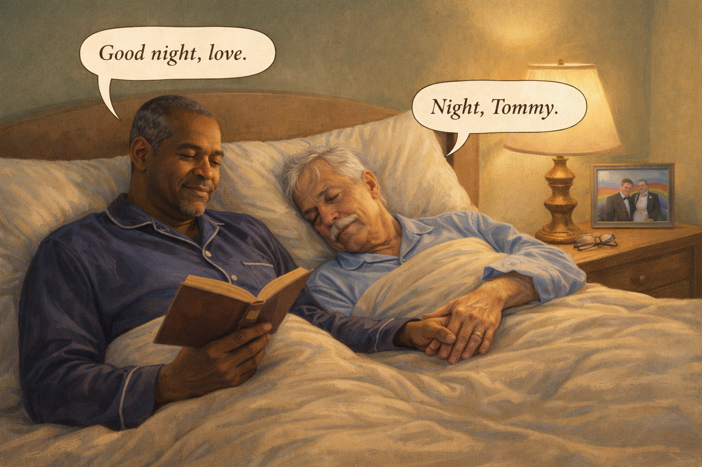 -->

Image Prompt

(This is panel 1. Do not put the panel number in the image.)

Contemporary photorealistic illustration, 16:9 wide-landscape format. A warm bedroom at 10 PM. **Tom** (58, Black, close-cropped salt-and-pepper hair, gentle strong features, navy pajamas) and **Robert** (74, tall, silver hair thin and wispy, silver mustache, white complexion, pale blue pajamas) lie side by side in a queen bed with a cream comforter pulled to their chests. Tom is reading a hardcover book by the warm yellow light of a bedside lamp. Robert is already drifting to sleep, his hand loosely holding Tom's hand on top of the comforter. A framed photo on the dresser shows the two of them at their wedding twenty-nine years ago, a rainbow backdrop in the soft background. A small wooden nightstand with reading glasses. Bedroom walls are soft sage green. Color palette: warm lamp-light ambers, sage green, soft cream bedding. Emotional tone: the quiet love of a long marriage.

**Speech bubble 1** — tail pointing to **Tom**, positioned above him, warm: "Good night, love."

**Speech bubble 2** — tail pointing to **Robert** (nearly asleep), small and sleepy: "Night, Tommy."

Generate the image immediately without asking clarifying questions.

**Narrative:** Tom and Robert had been married twenty-nine years. They had a bedtime routine that had barely changed: lamps on, the small TV in the living room turned off, Robert brushing his teeth while Tom put their reading glasses on the right nightstands. Robert would be asleep first; he always was. Tom would read for another half hour and listen to his husband breathe. It was, and always had been, the best part of his day.

---

## Panel 2: A Cold Draft

<!-- 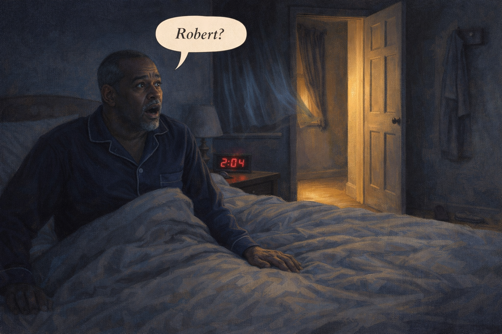 -->

Image Prompt

(This is panel 2. Do not put the panel number in the image.)

Contemporary photorealistic illustration, 16:9 wide-landscape format. Dark bedroom, the digital clock on the nightstand glowing "2:04 AM" in red numerals. **Tom** is sitting bolt upright in bed, one hand on his husband's empty side of the bed — the covers are thrown back, **Robert is gone.** Tom's face is frozen in the first second of panic, eyes wide, mouth open. A cold draft is visibly moving the curtains on a window on the far wall. The bedroom door stands ajar, a pale rectangle of hallway light. Robert's slippers are gone from the floor next to the bed. His pale blue robe is gone from the hook on the door. Color palette: deep midnight blues, the red digital numerals like a small wound, a single strip of warm hall light. Emotional tone: the exact moment a whole life tilts.

**Speech bubble 1** — tail pointing to **Tom** (sitting up in bed), positioned above him, sharp and small: "Robert?"

Generate the image immediately without asking clarifying questions.

**Narrative:** Tom woke at 2:04 in the morning to a cold draft. His hand, reaching for his husband out of thirty years of habit, found only empty sheets. The bedroom door was ajar. Robert's robe was gone from the hook. The slippers were gone from beside the bed. Somewhere in the house, the front door was making a thin, unfamiliar whine as the October wind pushed it against its hinge. Tom sat up. He said the name out loud: "Robert?" There was no answer — and he knew, in the first instant, that he was not in the house.

---

## Panel 3: The Open Door

<!-- 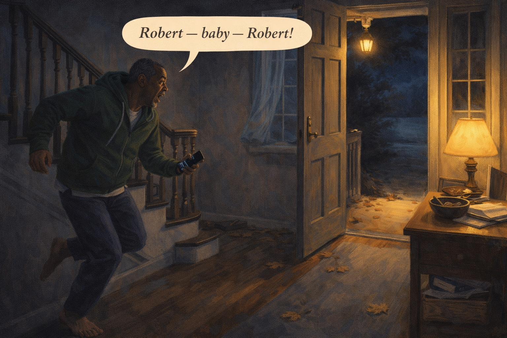 -->

Image Prompt

(This is panel 3. Do not put the panel number in the image.)

Contemporary photorealistic illustration, 16:9 wide-landscape format. A quiet front foyer in the middle of the night. The **front door stands open about two feet**, cold night air pushing inward. Leaves have blown across the threshold. Outside, the porch lamp is on, but the world beyond the door is dark — we can see only the edge of the porch and a sliver of moonlit driveway. **Tom** is running down the staircase on the LEFT side of the frame, half-dressed — green hoodie pulled over his pajama shirt, bare feet, phone in hand. His face is ashen. A small table near the door has a bowl with car keys and mail; Robert's leather wallet is still in the bowl (he did not take it). Color palette: deep navies and charcoals of night, a pool of warm amber from a small hall lamp, the silver of moonlight beyond the door. Emotional tone: the precise moment before one of the longest twenty minutes of a life.

**Speech bubble 1** — tail pointing to **Tom** (running down stairs), positioned above him, breathless: "Robert — baby — *Robert!*"

Generate the image immediately without asking clarifying questions.

**Narrative:** Tom ran down the stairs barefoot. The front door was open. A small drift of leaves had blown in across the hardwood. He stepped onto the porch in his green hoodie and looked up and down the dark street. "Robert!" he shouted. "Robert!" The only answer was a dog barking three houses down and a single car passing on the main road a block away. Tom reached for his phone. His hands were shaking so hard he pressed "91" twice before he got the "1" right.

---

## Panel 4: The Longest Twenty Minutes

<!-- 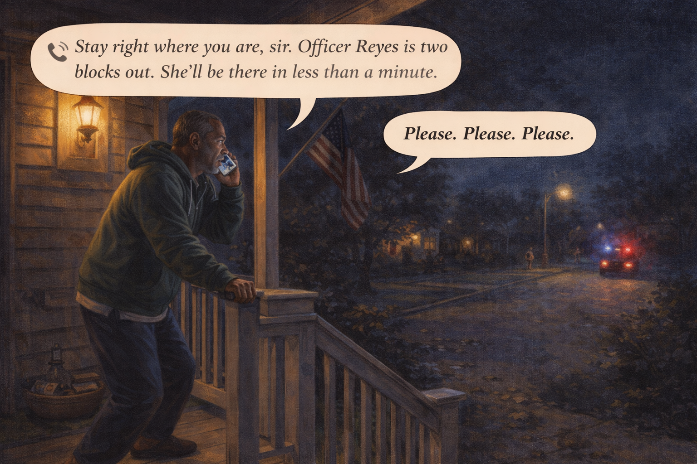 -->

Image Prompt

(This is panel 4. Do not put the panel number in the image.)

Contemporary photorealistic illustration, 16:9 wide-landscape format. Exterior front porch of the house. **Tom** stands at the top of the porch steps in his hoodie and pajama pants, now in slippers he grabbed on the way down, phone pressed to his ear. His posture is rigid; his face lit only by the porch lamp and the glowing phone screen. His free hand is gripping the porch rail so hard his knuckles show. A gentle breeze moves the small American flag on the porch. In the distance at the end of the street, the first blue-and-red strobe lights of a slowly approaching patrol car just visible. A neighbor's porch light two doors down flickers on. Color palette: the deep blue-black of night, the warm amber of the single porch lamp, the approaching blue-red flash far down the street. Emotional tone: fear that has found a target, and help that has begun moving toward him.

**Speech bubble 1** — a phone-style speech bubble with small phone icon, representing the 911 dispatcher, calm and steady: "Stay right where you are, sir. Officer Reyes is two blocks out. She'll be there in less than a minute."

**Speech bubble 2** — tail pointing to **Tom**, positioned above him, a whispered prayer: "Please. Please. Please."

Generate the image immediately without asking clarifying questions.

**Narrative:** The dispatcher kept him on the phone. She was calm and older and she kept saying *sir, sir, you are doing the right thing.* Tom gave her Robert's height, his hair color, the pale blue robe, the tan slippers, the diagnosis — *Alzheimer's, moderate, two years.* He told her about a house Robert had grown up in, two thousand miles and fifty years away, and how Robert had been talking about it at dinner the night before. Officer Reyes was two blocks away. Tom did not know her yet. In twenty minutes she would change his life.

---

## Panel 5: The Patrol Car in the Driveway

<!-- 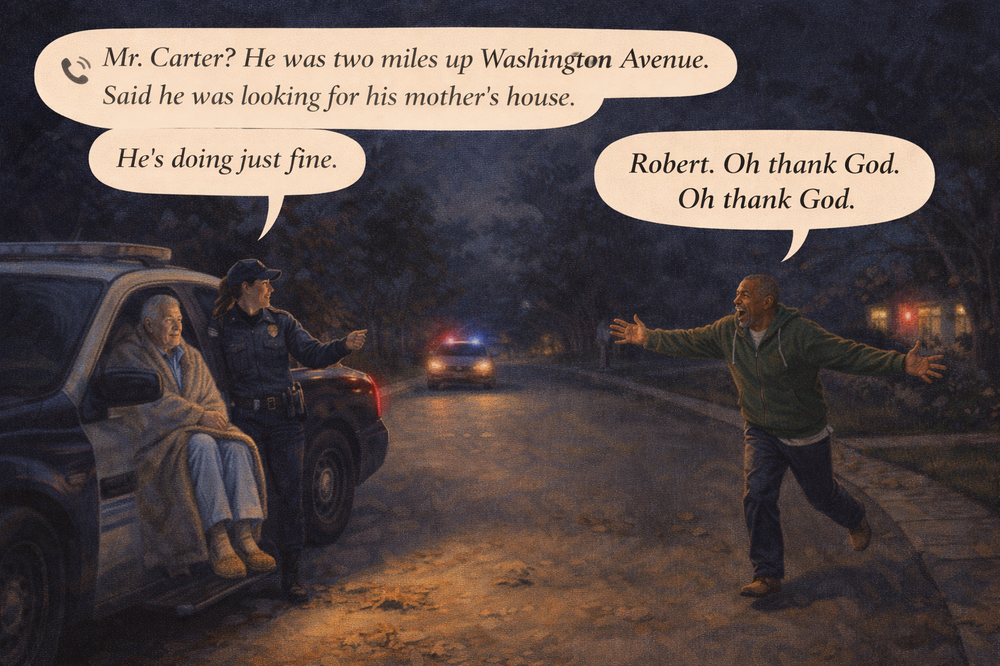 -->

Image Prompt

(This is panel 5. Do not put the panel number in the image.)

Contemporary photorealistic illustration, 16:9 wide-landscape format. The driveway, maybe 2:30 AM. A patrol car has pulled up with headlights on but light-bar off (the officer has deliberately lowered the alarm level). **Robert** is in the passenger seat of the patrol car, a wool blanket draped over his shoulders, his pale blue robe and tan slippers visible. He looks confused but calm, a kind hand resting on his knee. **Officer Reyes** (40s, Latina, warm round face, neat ponytail beneath cap, professional but gentle) has stepped out of the driver's side and is waving **Tom** forward from the porch. **Tom** is already running toward the car, both arms outstretched, tears pouring down his face. Color palette: the warm amber of headlights on the driveway, the deep blue of night behind them, a single red porch light reflection. Emotional tone: a reunion — pure relief — love winning the hand.

**Speech bubble 1** — tail pointing to **Officer Reyes** (stepping out of patrol car), positioned above her, warm and professional: "Mr. Carter? He was two miles up Washington Avenue. Said he was looking for his mother's house. He's doing just fine."

**Speech bubble 2** — tail pointing to **Tom** (running toward car), positioned above him, broken with relief: "*Robert. Oh thank God. Oh thank God.*"

Generate the image immediately without asking clarifying questions.

**Narrative:** At 2:31 AM a patrol car rolled slowly into their driveway, its light-bar deliberately off. Officer Reyes stepped out. Robert was in the passenger seat with a blanket around his shoulders, looking tired and a little puzzled. "He was up on Washington," Reyes said. "Told me he was looking for his mother's house. He's doing just fine, Mr. Carter." Tom opened the passenger door and folded his whole body around his husband. Robert let himself be held. "Tommy," he said, slightly amused, "why are you crying?" Tom laughed once, wetly, and could not find an answer.

---

## Panel 6: The Kitchen Table, 3 AM

<!-- 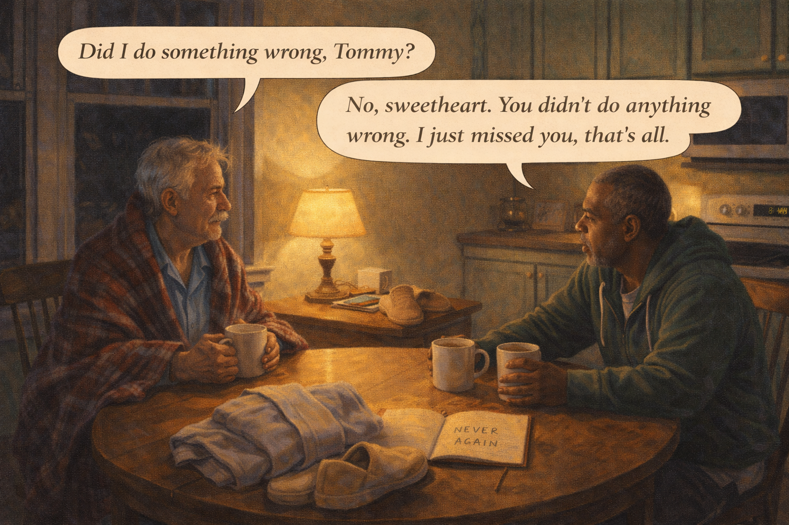 -->

Image Prompt

(This is panel 6. Do not put the panel number in the image.)

Contemporary photorealistic illustration, 16:9 wide-landscape format. A small kitchen, soft warm lamp light, the window showing the dark yard. **Tom** and **Robert** sit at a wooden kitchen table. Robert is wrapped in a flannel blanket, holding a mug of hot chocolate with both hands, back to himself — calm, a little tired, his hair standing up softly. **Tom** sits across from him, his own mug untouched, staring at his husband with a mixture of love and terror he has not yet come down from. On the table between them: the pale blue robe neatly folded, a pair of tan slippers beside it, and an open notebook where Tom has just written *"NEVER AGAIN."* A digital clock on the microwave reads 3:07 AM. Color palette: the deep amber of a single low lamp, sage green walls, the warm brown of the wooden table. Emotional tone: the quiet after the alarm, the moment the planning begins.

**Speech bubble 1** — tail pointing to **Robert**, positioned above him, a little puzzled but gentle: "Did I do something wrong, Tommy?"

**Speech bubble 2** — tail pointing to **Tom**, positioned above him, steady and loving: "No, sweetheart. You didn't do anything wrong. I just missed you, that's all."

Generate the image immediately without asking clarifying questions.

**Narrative:** At 3 AM Tom made Robert a mug of hot chocolate and wrapped him in a flannel blanket. Robert asked, in a small voice, "Did I do something wrong, Tommy?" Tom shook his head. He did not explain the open door, the call, Officer Reyes. "No, sweetheart," he said. "You didn't do anything wrong. I just missed you, that's all." While Robert sipped his cocoa, Tom quietly opened a notebook and wrote, in letters that pressed too hard on the page: **NEVER AGAIN.** He underlined it three times. By morning he would have a list.

---

## Panel 7: The Family Meeting

<!-- 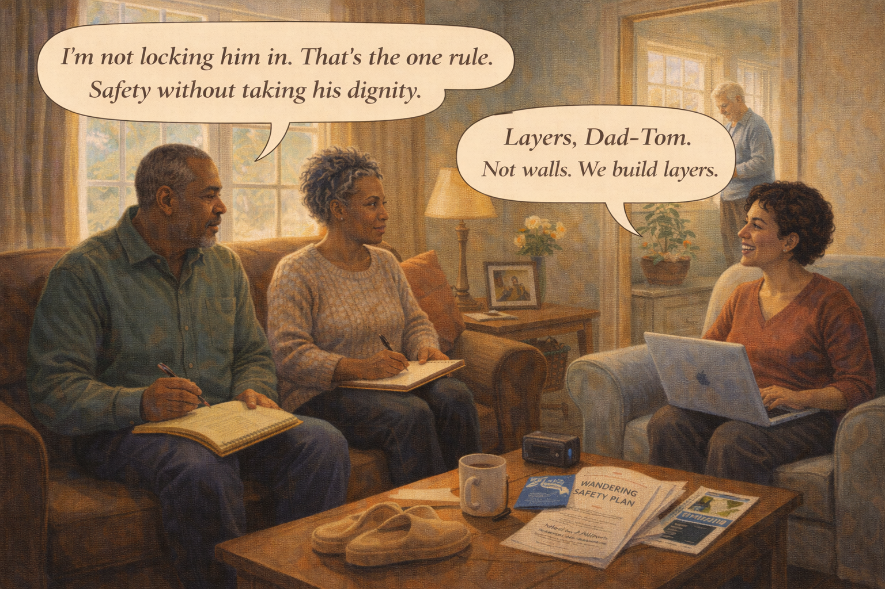 -->

Image Prompt

(This is panel 7. Do not put the panel number in the image.)

Contemporary photorealistic illustration, 16:9 wide-landscape format. A bright Saturday mid-morning in the living room. **Tom** sits on a sofa on the LEFT, a yellow legal pad in his lap. Beside him sits Tom's sister **Michelle** (55, warm brown skin, natural hair in a silver-streaked twist-out, cozy sweater, notepad of her own), who has flown in for the weekend. On the loveseat opposite them sits Robert's adult daughter from his first marriage, **Sarah** (45, warm tan skin, short curly hair, kind face, laptop open). **Robert** is happily NOT in this meeting — a soft focus in the background shows him in the sunroom tending a small tomato plant, humming, content. On the coffee table: printed pages titled *"WANDERING SAFETY PLAN,"* a brochure from MedicAlert, a glossy flyer for GPS watches, a door-chime display box. Color palette: clear morning light, warm browns, a soft bright yellow of the legal pad. Emotional tone: a family becoming a team.

**Speech bubble 1** — tail pointing to **Tom** (left on sofa), positioned above him, focused and energized: "I'm not locking him in. That's the one rule. Safety without taking his dignity."

**Speech bubble 2** — tail pointing to **Sarah** (right on loveseat), positioned above her, supportive: "Layers, Dad-Tom. Not walls. We build layers."

Generate the image immediately without asking clarifying questions.

**Narrative:** The next Saturday, Tom called a family meeting. His sister Michelle flew in. Robert's daughter Sarah from his first marriage drove in from two towns over. Robert was happily not in the meeting — he was in the sunroom tending a tomato plant, humming an old song. Tom opened the legal pad and said the one rule. "I am not locking him in. Not literally, not metaphorically. Safety without taking his dignity. Everything else is up for discussion." Sarah nodded. "Layers," she said. "Not walls. We build layers."

---

## Panel 8: Layer One — Door Chimes and Awareness

<!-- 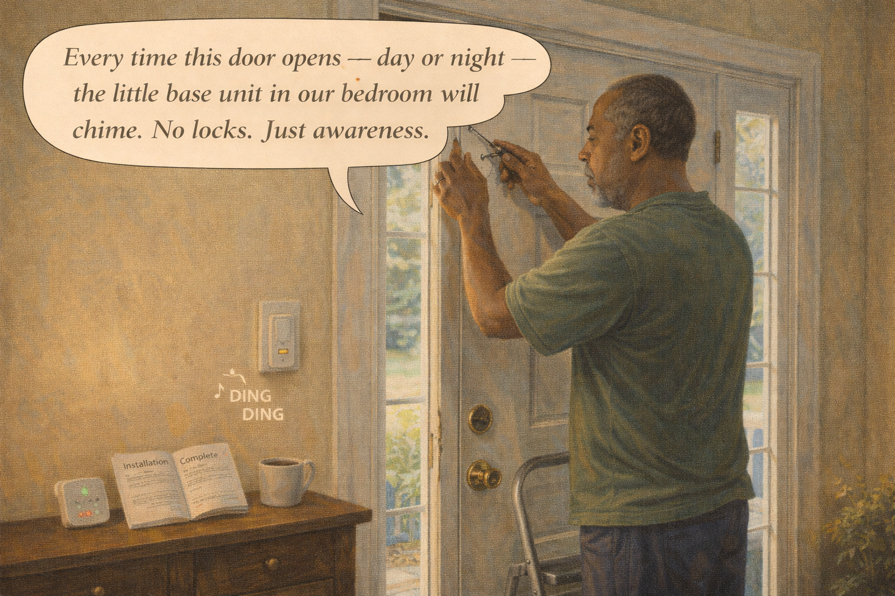 -->

Image Prompt

(This is panel 8. Do not put the panel number in the image.)

Contemporary photorealistic illustration, 16:9 wide-landscape format. The front door of the house, daytime. **Tom** is standing on a step stool beside the front door in a T-shirt, screwing a small white door chime sensor onto the door frame. The matching magnetic piece is attached to the door itself. A small box on the floor shows three more sensors (for the back door, the garage door, and a patio slider). A soft green and orange indicator LED glows on the base unit plugged into a wall outlet. On a nearby console table: a small instruction booklet open to *"Installation Complete."* A mug of coffee on the console. Color palette: warm cream walls, the crisp white of the new door chime, the bright blue morning light through the sidelight windows. Emotional tone: practical hope, a first piece installed.

**Speech bubble 1** — tail pointing to **Tom** (on step stool), positioned above him, satisfied: "Every time this door opens — day or night — the little base unit in our bedroom will chime. No locks. Just awareness."

*(A small sound-effect style label near the base unit says: "♪ DING DING")*

Generate the image immediately without asking clarifying questions.

**Narrative:** The first layer was the cheapest and the most important: door chimes. Tom bought a wireless set for under fifty dollars. A small magnet on each exterior door — front door, back door, garage door, patio slider — would trigger a pleasant two-note chime on a base unit that sat on Tom's nightstand. "Every time this door opens — day or night — I will hear it," he told Sarah. "No locks. Just awareness." Sarah nodded. "A chime is not a cage. A chime is information."

---

## Panel 9: Layer Two — The GPS Watch

<!-- 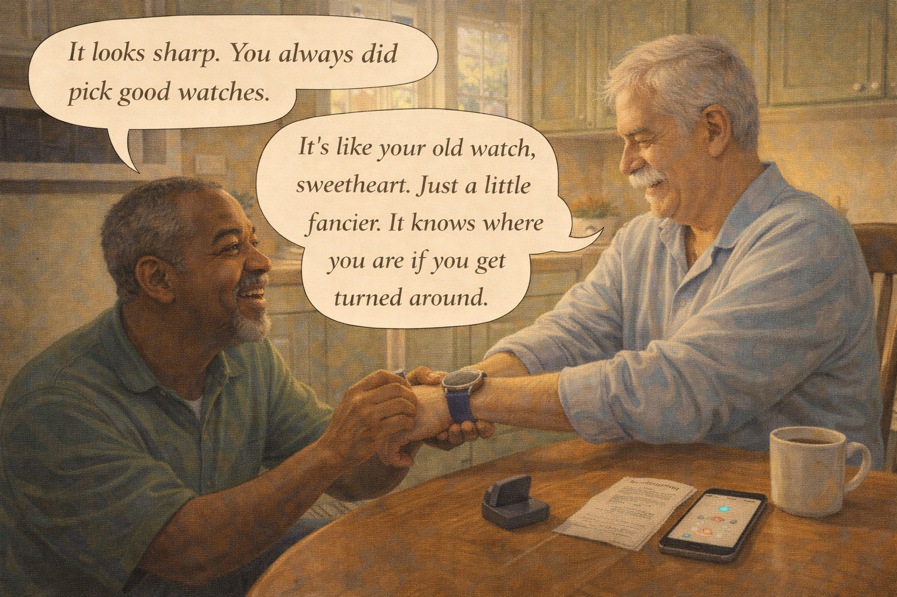 -->

Image Prompt

(This is panel 9. Do not put the panel number in the image.)

Contemporary photorealistic illustration, 16:9 wide-landscape format. Kitchen table, afternoon. **Tom** is gently helping **Robert** put on a handsome-looking **GPS smartwatch** (the watch has a soft navy silicone band and a simple round silver face — no visible brand markings). Robert sits at the table, smiling slightly, looking pleased, his sleeve pushed up. **Tom** is on one knee beside him, fastening the strap with two hands, smiling warmly. On the table: a small charging dock for the watch, a printed instruction card, and Tom's phone open to a generic unbranded map app showing a small blue dot at their home address labeled "R." A warm afternoon light through the window. Color palette: warm ambers of late afternoon, soft navy of the watchband, creamy whites. Emotional tone: partnership, not surveillance; a gift rather than a tether.

**Speech bubble 1** — tail pointing to **Tom** (kneeling beside Robert), positioned above him, warm and matter-of-fact: "It's like your old watch, sweetheart. Just a little fancier. It knows where you are if you get turned around."

**Speech bubble 2** — tail pointing to **Robert**, positioned above him, pleased: "It looks sharp. You always did pick good watches."

Generate the image immediately without asking clarifying questions.

**Narrative:** The second layer was a GPS watch — a small waterproof smartwatch that sent Robert's location to a secure app on Tom's phone. Tom did not explain it as a tracker. He presented it as a gift. "It's like your old watch, sweetheart. Just a little fancier." Robert admired it in the afternoon light. "It looks sharp," he said. "You always did pick good watches." The watch charged every night on a dock next to Robert's side of the bed. It became, in Robert's mind, just something that was his.

---

## Panel 10: Layer Three — The Neighborhood and MedicAlert

<!-- 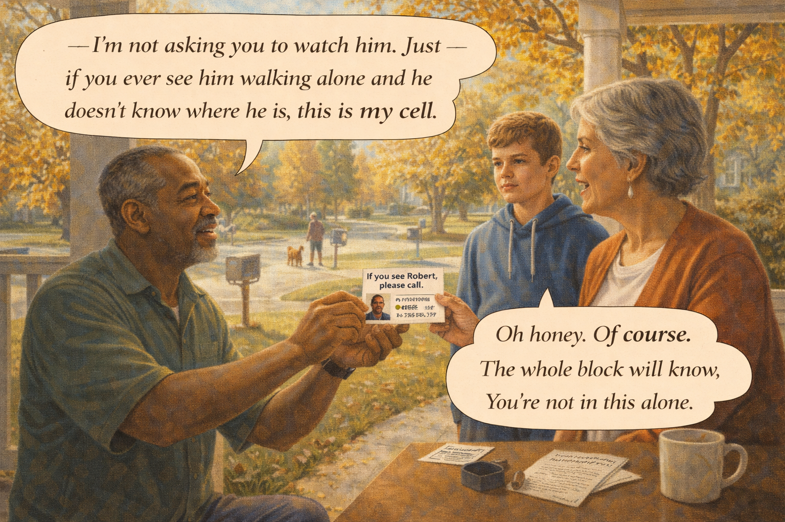 -->

Image Prompt

(This is panel 10. Do not put the panel number in the image.)

Contemporary photorealistic illustration, 16:9 wide-landscape format. Front porch of a neighbor's house, sunny afternoon. **Tom** is standing on the neighbor's front walk handing a small printed card to a friendly white woman in her early 60s, her middle-school-aged grandson standing beside her on the porch. The card he is handing over is clearly a laminated "If you see Robert, please call" card with Robert's photo and Tom's phone number. A small silver pendant on a chain is visible on the corner of the card — a MedicAlert-style ID (generic, no brand markings, just a small red medical cross on a silver disc). In the background, the neighborhood — maple trees turning gold, mailboxes, a couple walking a dog. Color palette: bright autumn gold, warm reds, soft sky blue. Emotional tone: community being built, safety as a neighborhood practice.

**Speech bubble 1** — tail pointing to **Tom**, positioned above him, warm and direct: "I'm not asking you to watch him. Just — if you ever see him walking alone and he doesn't know where he is, this is my cell."

**Speech bubble 2** — tail pointing to the **neighbor**, positioned above her, kind: "Oh honey. Of course. The whole block will know. You're not in this alone."

Generate the image immediately without asking clarifying questions.

**Narrative:** The third layer was human. Tom printed fifty small laminated cards with Robert's photo, their address, and Tom's cell number. He walked the block and handed one to every neighbor who answered the door. He told them he was not asking them to watch — only to recognize. He also enrolled Robert in a national medical-alert registry; Robert wore a small silver pendant engraved with his name, diagnosis, and Tom's number. The third layer was the largest layer and the hardest to measure. It was the layer called *people.*

---

## Panel 11: Layer Four — The Nighttime Bell

<!-- 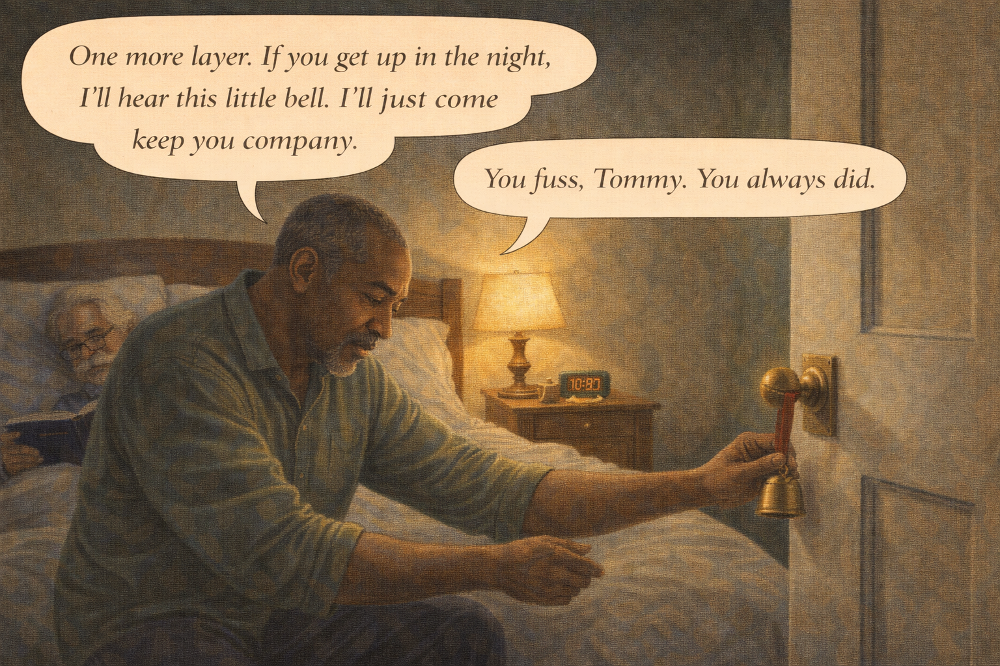 -->

Image Prompt

(This is panel 11. Do not put the panel number in the image.)

Contemporary photorealistic illustration, 16:9 wide-landscape format. Nighttime bedroom, a soft lamp on. **Tom** is in the foreground, seated on the edge of the bed, tying a small brass **bell on a ribbon** to the inside doorknob of the bedroom door. The bell is about the size of a large marble, a warm brass color, hanging from a soft red ribbon — a beautiful small object, not a security device. **Robert** is already tucked under the covers behind him, reading a book, wearing his reading glasses, humming gently. A mug of chamomile tea on the nightstand. The bedside clock reads 10:12 PM. Beside the mug: the base unit for the door chime, a soft green indicator glowing. Color palette: warm amber lamplight, the glint of the brass bell, the deep sage of the bedroom walls. Emotional tone: small beautiful tools of love.

**Speech bubble 1** — tail pointing to **Tom** (seated on bed), positioned above him, matter-of-fact and warm: "One more layer. If you get up in the night, I'll hear this little bell. I'll just come keep you company."

**Speech bubble 2** — tail pointing to **Robert** (in bed with book), positioned above him, fond: "You fuss, Tommy. You always did."

Generate the image immediately without asking clarifying questions.

**Narrative:** The fourth layer was a small brass bell on a red ribbon, tied to the inside knob of the bedroom door. If Robert got up in the night and opened the door, the bell would ring. Tom tied one to the bathroom door too. Small, pretty, almost decorative. "If you get up in the night," Tom told Robert, "I'll hear this little bell. I'll come keep you company." Robert smiled and patted his husband's hand. "You fuss, Tommy. You always did." Four layers: *door chime, GPS watch, neighbor network, bedroom bell.* None of them was a lock. Together they were a net.

---

## Panel 12: A Gentle Four AM

<!-- 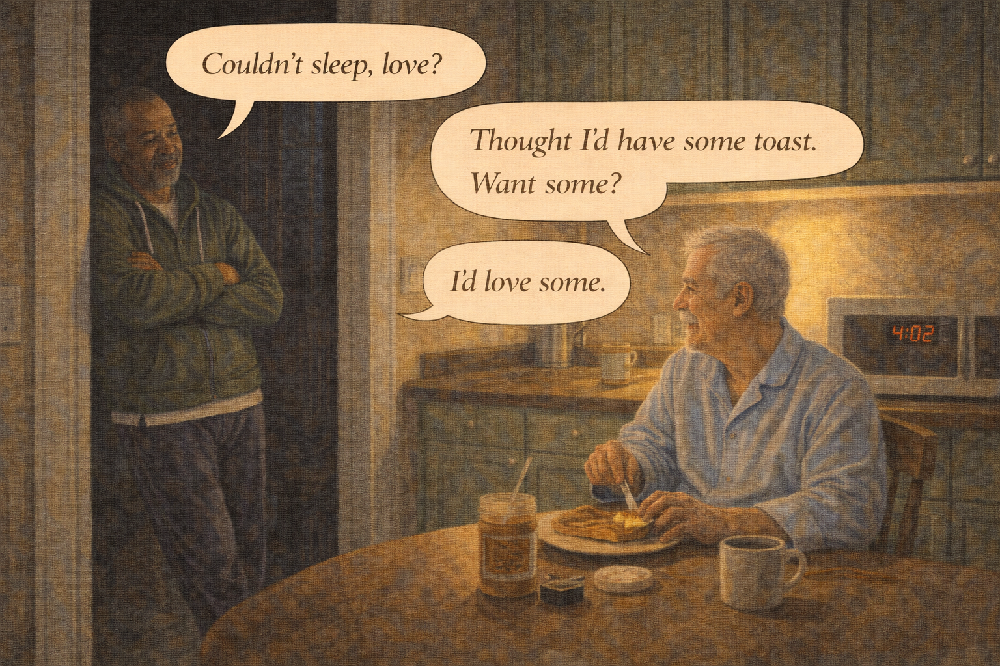 -->

Image Prompt

(This is panel 12. Do not put the panel number in the image.)

Contemporary photorealistic illustration, 16:9 wide-landscape format. A quiet kitchen at 4:02 AM (digital clock on microwave visible). **Robert** is at the kitchen table in his pale blue robe and tan slippers, making a peaceful small project of spreading peanut butter on a piece of toast. **Tom** is standing in the kitchen doorway in his green hoodie and pajama pants, leaning against the frame with his arms crossed, a soft tired smile on his face. He is not panicked. He is not angry. He is just *present* — alerted, arrived, keeping his husband company. The kitchen is lit by a single soft under-cabinet light. Outside the kitchen window: dark night. Color palette: warm ambers of the under-cabinet light, deep midnight blue beyond the window, soft pale blue of Robert's robe. Emotional tone: what the plan bought them — a 4 AM that is gentle, not terrifying.

**Speech bubble 1** — tail pointing to **Tom** (in doorway), positioned above him, warm: "Couldn't sleep, love?"

**Speech bubble 2** — tail pointing to **Robert** (at table with toast), positioned above him, content: "Thought I'd have some toast. Want some?"

**Speech bubble 3** — tail pointing to **Tom**, positioned above him, smiling: "I'd love some."

Generate the image immediately without asking clarifying questions.

**Narrative:** Six months later, at 4:02 on a Tuesday morning, Tom heard a soft ding from the bedroom door bell. Robert had gotten up. Tom pulled on his hoodie and padded downstairs, not frightened, not hurrying — because he knew exactly where his husband was. Robert was in the kitchen, cheerfully spreading peanut butter on a piece of toast. "Couldn't sleep, love?" Tom said from the doorway. "Thought I'd have some toast. Want some?" "I'd love some." They sat together at 4 AM while the kitchen clock quietly ticked, and Tom realized: the plan was working. Robert was still free. Tom was still his husband, not his warden.

---

## Epilogue: What This Family Learned

| Challenge | Response | Lesson for Today |
|---|---|---|
| Spouse walks out of the house at 2 AM | Called 911 immediately, stayed on the line, gave exact description | In wandering emergencies, call 911 first. Every minute of daylight helps searchers. |
| Fear of turning the home into a prison | The explicit rule *"safety without taking his dignity"* | Lead with dignity. Build protection around it, not in place of it. |
| Not knowing the door had opened | Wireless door chimes on every exterior door | Awareness costs $50. Ignorance costs everything. |
| Needing to find him if he got away | A GPS smartwatch, presented as a gift | Tools presented with love become belongings. Tools presented with fear become tethers. |
| Strangers not recognizing him | Laminated neighbor cards and MedicAlert pendant | A whole block of neighbors is the cheapest safety net you can buy. |
| Nighttime wandering | A small brass bell on the bedroom door — beautiful, not clinical | Sometimes the best safety tool is the one that does not look like one. |

## A Note to the Reader

If your loved one has wandered once, they will almost certainly
try to wander again. This is not a failure of willpower or love.
It is a pattern of the disease. The good news is that wandering
is one of the most *prepared-for* risks in dementia caregiving.
The layered safety plan in this story — door chimes, GPS, neighbor
network, bedroom bell, MedicAlert — is the same plan used by
dementia-care specialists across the country.

If your loved one is missing **right now:**

1. **Call 911 first.** Do not wait.
2. **Give exact description**: clothing, slippers vs. shoes, the direction they may be heading.
3. **Check the obvious places**: nearest former home, former workplace, nearest water.
4. **Call the Alzheimer's Association 24/7 Helpline (1-800-272-3900)** which can help coordinate.

Then, when they are home and safe, take a breath and begin
building the four layers. A chime is not a cage.

## Quotes From the Story

> "I am not locking him in. Safety without taking his dignity." — *Tom*

> "Layers. Not walls. We build layers." — *Sarah*

> "A chime is not a cage. A chime is information." — *Sarah*

## References

1. [Wikipedia: Wandering (dementia)](https://en.wikipedia.org/wiki/Wandering_(dementia)) - Overview of wandering behavior in people with dementia and Alzheimer's disease
2. [Alzheimer's Association: Wandering](https://www.alz.org/help-support/caregiving/stages-behaviors/wandering) - Plain-language guidance on prevention and response
3. [MedicAlert Foundation](https://www.medicalert.org/) - National medical-ID registry widely used by dementia families
4. [National Institute on Aging: Home Safety Checklist](https://www.nia.nih.gov/health/alzheimers-caregiving/home-safety-checklist-alzheimers-disease) - Room-by-room guide that includes wandering-related safety measures
5. [CDC: Alzheimer's Disease and Healthy Aging — Caregiving](https://www.cdc.gov/aging/caregiving/index.html) - Federal resources on caregiver support and safety planning
