# Patsy Cline on a Tuesday

*The brain that forgets your name still knows the song*

<!-- 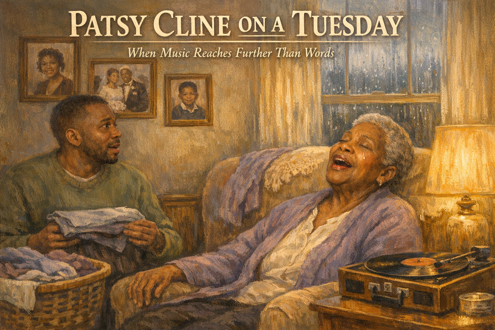 -->

Cover Image Prompt

Please generate a 16:9 cover image in warm painterly American contemporary realism — soft oil-painting brushwork with visible but refined strokes; muted warm palette of sage green, dusty lavender, cream, honey gold, rose pink, and walnut brown; warm golden afternoon window light as the key and honey-gold interior lamp glow as fill; soft low-contrast shadows; fabric textures (knit, flannel, cotton, lace) clearly visible; in the Rockwell-and-Kinkade tradition of tender domestic illustration. No saturated primaries, no neon, no photorealism, no vector flatness, no film grain, no chromatic aberration. Night scenes keep the same warm vocabulary — indigo and deep walnut in place of saturated cool blue, with honey-gold porch or lamp light as warm accent.

**Title treatment (top ~15% of frame):** Across the top of the image, centered horizontally, render the main title "PATSY CLINE ON A TUESDAY" in a warm ivory/cream humanist serif — the kind of hand-set lettering you would see on a classic illustrated-novel cover — with a soft painterly drop-shadow so the text integrates into the scene below, never a hard graphic bar. Directly beneath the title, in a smaller italic of the same serif, render the subtitle "When Music Reaches Further Than Words". The lettering should feel as if the painter lettered it themselves, in the same brush vocabulary as the painting.

**Scene:** A small cozy living room on a rainy afternoon. Ruth, 83, a Black woman with short cropped gray hair, warm brown skin, wearing a soft violet house cardigan over a cream blouse, sits in a cushioned armchair. Her eyes are closed, her head tilted back, a quiet tear tracking down her cheek — but her mouth is open in song, shaping clear words. On a small side table beside her: an old-fashioned record player with a vinyl record spinning. To the left, her son Marcus, 46, warm brown skin, short faded haircut, gentle beard, wearing a soft olive-green sweater, has stopped mid-motion in the middle of folding laundry — a folded shirt frozen in his hands, his mouth slightly open in surprise and awe. A laundry basket beside him. On the walls: framed photos of Ruth as a young woman in the 1960s, a wedding photo, a picture of Marcus as a boy. Rain streaks the window behind them.

**Emotional tone:** the miracle of a song reaching where words cannot.

Generate the image immediately without asking clarifying questions.

## Narrative Prompt

This is a fictional composite story built from the experience of thousands of families with a loved one in late-stage dementia. Ruth and Marcus are invented characters, but every moment here — the months of silence, the miracle of the old song, the song-by-song rebuilding of a connection — is drawn from the real documented phenomenon of music reaching people whose verbal language has been lost. The story teaches one clear skill: how to build a personalized playlist that becomes a new form of communication with a loved one in advanced dementia. Art style: contemporary photorealistic illustration, warm intimate domestic tone, present-day American home.

## Prologue

There is a brain science reason why music survives. The neural circuits that store familiar songs — learned deeply in youth, felt as much as heard — are spread widely through the brain, and many of them outlast the damage that takes names, dates, and faces. So a person who has not spoken a full sentence in three months may, when the right song plays, sing every word in perfect pitch. Doctors call it *musical memory.* Families call it *a miracle.* This is the story of one son, one mother, one old Patsy Cline record, and a Tuesday neither of them would ever quite forget.

---

## Panel 1: The Silence

<!-- 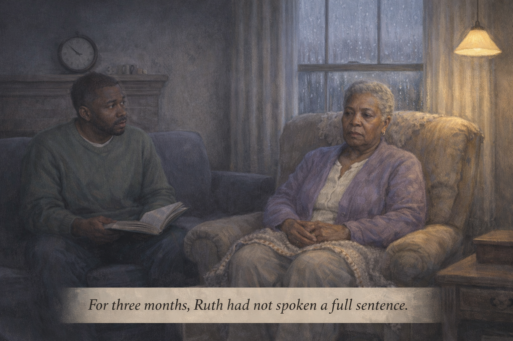 -->

Image Prompt

(This is panel 1. Do not put the panel number in the image.)

Contemporary photorealistic illustration, 16:9 wide-landscape format. A quiet mid-afternoon in a small living room. **Ruth** (83, short cropped gray hair, warm brown skin, soft violet house cardigan, cream slacks) sits in her usual cushioned armchair by a window, her hands folded in her lap, her gaze distant — present in the room but clearly somewhere else inside herself. Her eyes are soft but blank, focused on nothing in particular. A small knit blanket over her knees. **Marcus** (46, olive-green sweater, warm brown skin, short-faded haircut, gentle beard) sits on the nearby sofa with a book open in his lap that he is clearly not reading, watching his mother with quiet sadness. A rain-streaked window behind them. A pendant lamp on. A clock on the mantel reads 3:17 PM. Color palette: cool gray afternoon tones, soft violets, the warm amber of the one lamp. Emotional tone: the long silence, love in the quiet.

**Speech bubble 1** — a narrative caption at the bottom of the panel, in gentle italic: "For three months, Ruth had not spoken a full sentence."

*(No character speech bubbles — the silence is the panel.)*

Generate the image immediately without asking clarifying questions.

**Narrative:** For three months, Ruth had not spoken a full sentence. She made small sounds sometimes — a soft *mm* when Marcus placed a cup of warm milk in her hands, an almost-smile when he kissed her forehead. She was still there. Marcus knew she was still there. But the mother who had talked him through every hard day of his life, the mother who had told stories around a Thanksgiving table loud enough for the whole block to hear, had gone quiet. Her Alzheimer's was now what the doctors called *late stage.* Marcus had moved home six months earlier to care for her. He missed her voice more than he had words to say.

---

## Panel 2: A Rainy Tuesday

<!-- 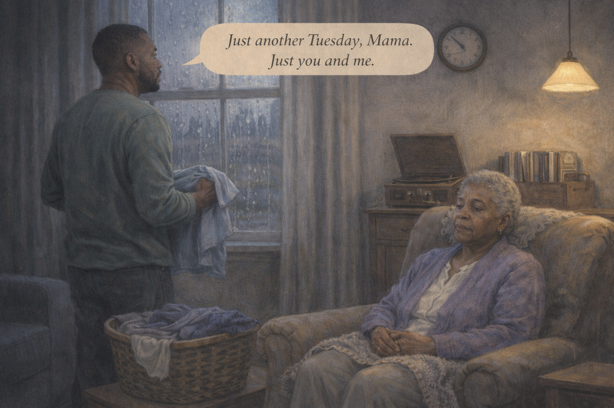 -->

Image Prompt

(This is panel 2. Do not put the panel number in the image.)

Contemporary photorealistic illustration, 16:9 wide-landscape format. Same living room, a small laundry basket on the floor in front of the sofa. **Marcus** stands folding laundry with absent-minded hands — a pale blue T-shirt halfway folded in his grip. He is looking out the rain-streaked window at the gray afternoon, lost in thought. **Ruth** is in her armchair in the same position, eyes gently open but distant, hands folded. A clock on the wall reads 2:40 PM. On a small side table: an old wooden record player cabinet (mid-century modern style), its lid closed. Beside the cabinet, a wooden crate of vinyl records with handwritten labels on some sleeves. Color palette: muted blue-grays of a rainy afternoon, warm browns of the wooden furniture, the soft violet of Ruth's cardigan. Emotional tone: the ordinariness of a Tuesday in grief.

**Speech bubble 1** — tail pointing to **Marcus** (folding laundry), positioned above him as a quiet thought: "Just another Tuesday, Mama. Just you and me."

Generate the image immediately without asking clarifying questions.

**Narrative:** It was raining the Tuesday Marcus found the record. He was folding his mother's laundry by the window, watching the street go slowly gray, and his mother was doing what she did in the afternoons — sitting in the armchair, quiet, present in the way a candle is present in a room. Just another Tuesday, Marcus thought. Just the two of them and the rain. And then he glanced at the old wooden record cabinet in the corner — the one his mother had taught him to drop a needle on when he was eight years old — and something about the rain made him walk over and open the lid.

---

## Panel 3: The Record Cabinet

<!-- 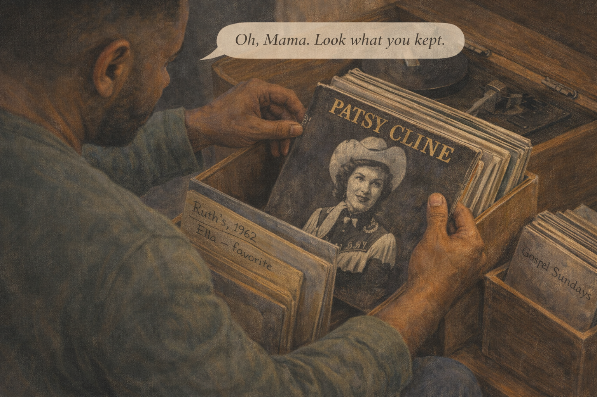 -->

Image Prompt

(This is panel 3. Do not put the panel number in the image.)

Contemporary photorealistic illustration, 16:9 wide-landscape format. Close-up on **Marcus's** hands flipping through a wooden crate of vintage vinyl LPs beside the open record-player cabinet. Each record sleeve visible has handwritten dates and names in his mother's neat cursive — *"Ruth's, 1962,"* *"Ella — favorite,"* *"Gospel Sundays."* His hand has just paused on a record sleeve that shows a stylized black-and-white portrait of a woman in a cowgirl outfit with a Nashville-style typeface across the top — clearly a Patsy Cline album. Marcus is on one knee beside the cabinet. Color palette: warm browns of the wooden cabinet, the faded black-white-and-gold of the vintage record sleeve, soft afternoon light. Emotional tone: the small accidental discovery that changes a day.

**Speech bubble 1** — tail pointing to **Marcus** (on one knee), positioned above him, quiet and surprised: "Oh, Mama. Look what you kept."

Generate the image immediately without asking clarifying questions.

**Narrative:** The records were exactly where his mother had left them, in the crate beside the cabinet. She had labeled each sleeve in her neat cursive: *"Ruth's, 1962. Ella — favorite. Gospel Sundays. Church Choir, Easter '68."* And there, halfway through the stack, a record he had not thought about in thirty-five years — his mother's Patsy Cline album, the one she had played on slow Sunday evenings when he was a boy, slow-dancing with his father in the kitchen while the pot roast finished. He slid the record out, careful not to scratch it, and set it on the turntable.

---

## Panel 4: The First Notes

<!-- 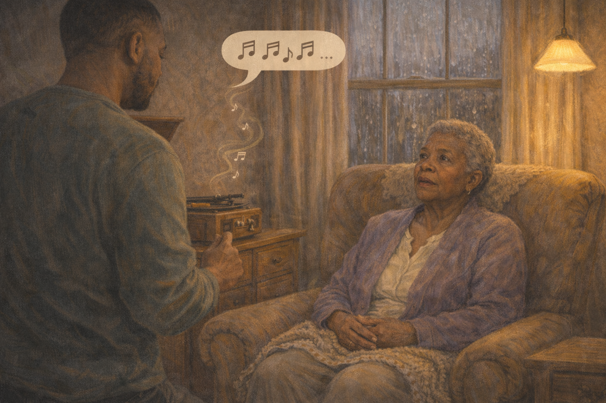 -->

Image Prompt

(This is panel 4. Do not put the panel number in the image.)

Contemporary photorealistic illustration, 16:9 wide-landscape format. The living room. **Marcus** stands beside the now-playing record player, his finger having just lifted the tone arm into place. The vinyl spins. Faint musical notes are visible in the air rising from the speaker cabinet. **Ruth** — still in the armchair in the MIDDLE of the frame — has lifted her head just slightly. Her eyes are open a fraction wider than they were two panels ago. Something is happening in her face that was not happening before. **Marcus** has not yet noticed this; he is turned toward the record player. A soft warmth has entered the color palette. Rain still on the window. Color palette: slightly warmed up from the previous panels, the amber of the lamp now noticeably richer. Emotional tone: the first second of a miracle beginning.

**Speech bubble 1** — a small musical notes speech bubble rising from the record player: "♪ ♫ ♪ ♫..."

*(No character speech bubbles — the music is the character.)*

Generate the image immediately without asking clarifying questions.

**Narrative:** He set the needle down gently. The first note of *"Crazy"* slid out of the speaker — that familiar slow waltz, the slight crackle of the vinyl, the warm voice starting. He did not know yet that his mother had lifted her head. He turned the volume down a little so it would not be too loud. He picked up the laundry shirt again. And then he heard something behind him that stopped him completely.

---

## Panel 5: The Impossible Voice

<!-- 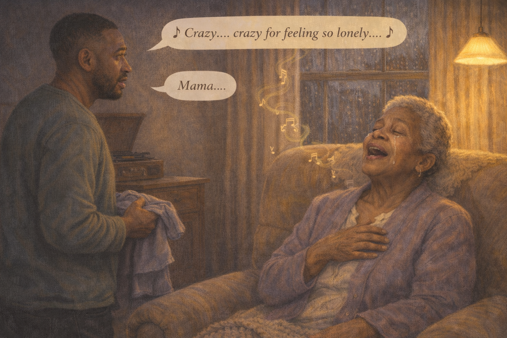 -->

Image Prompt

(This is panel 5. Do not put the panel number in the image.)

Contemporary photorealistic illustration, 16:9 wide-landscape format. Wide dramatic panel. **Marcus** stands frozen in the middle of the living room, a folded shirt still half-held in his hands, his mouth slightly open, his eyes full of tears, staring at his mother. **Ruth** is in her armchair — but she is *transformed.* Her eyes are closed. Her head is tilted back slightly against the chair. Her mouth is open in clear singing — the words of the chorus shaping on her lips. Soft musical notes rise around her in the air. A single tear traces down her cheek. Her hand, for the first time in months, has raised gently to rest over her heart. The record player spins in the background. Rain outside. The lamplight catches her face warmly. Color palette: warm violet and amber, the soft gold of the music in the air, the deep warmth of love in the room. Emotional tone: a miracle, witnessed by one son.

**Speech bubble 1** — tail pointing to **Ruth**, positioned above her in a lilting musical-note style bubble: "♪ Crazy... crazy for feeling so lonely... ♪"

**Speech bubble 2** — tail pointing to **Marcus** (frozen), positioned above him as a choked whisper: "Mama..."

Generate the image immediately without asking clarifying questions.

**Narrative:** His mother was singing. Eyes closed, face lifted slightly, her mouth shaping every word of the chorus. Her voice was softer than he remembered, but the pitch was perfect. Her hand had risen of its own accord and come to rest over her heart. Marcus felt the shirt in his hands slip to the floor. He did not move. He did not breathe. His mother, who had not spoken a full sentence in three months, was singing *"Crazy"* word for word, pitch for pitch, the way she had sung it in a yellow kitchen in 1986 while his father laughed and twirled her. Marcus stood in the middle of the rug and let the tears come.

---

## Panel 6: The Last Word

<!-- 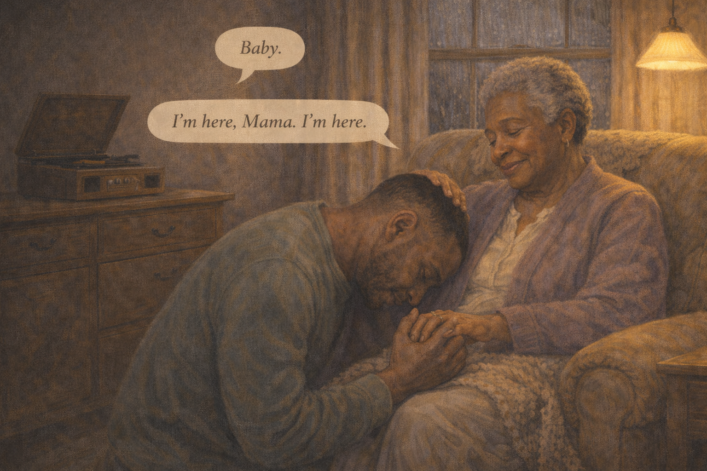 -->

Image Prompt

(This is panel 6. Do not put the panel number in the image.)

Contemporary photorealistic illustration, 16:9 wide-landscape format. The record has finished. The tone arm has clicked back to its rest position. The living room is softly silent. **Ruth** sits quietly in her armchair, her eyes closed, a small peaceful smile on her lips — she has drifted back into the quiet but the quiet is different now, warmer. **Marcus** is kneeling on the floor in front of her armchair, both of his hands holding one of her hands, his face wet, his forehead lowered against her knee. She has gently rested her free hand on top of his head — a small motherly gesture she has not made in months. Rain still on the window, but the light inside feels warmer. Color palette: deep warm ambers, violet, cream, the golden glow of the lamp. Emotional tone: after-the-miracle tenderness, a mother and son found inside a song.

**Speech bubble 1** — tail pointing to **Ruth**, positioned above her, one small clear word she has not said in three months: "Baby."

**Speech bubble 2** — tail pointing to **Marcus** (kneeling, face against her knee), positioned above him, broken and whole at once: "I'm here, Mama. I'm here."

Generate the image immediately without asking clarifying questions.

**Narrative:** When the song ended, Marcus knelt on the rug in front of his mother's chair and buried his face against her knee. And very softly, in a voice that had been somewhere far away for months, she said one word. "Baby." It was the first clear word she had spoken in a long time. Marcus could not answer without his voice shattering. "I'm here, Mama," he finally whispered. "I'm here." She laid her hand on top of his head. They stayed that way for a long time. Outside, the rain kept falling.

---

## Panel 7: Reading About Musical Memory

<!-- 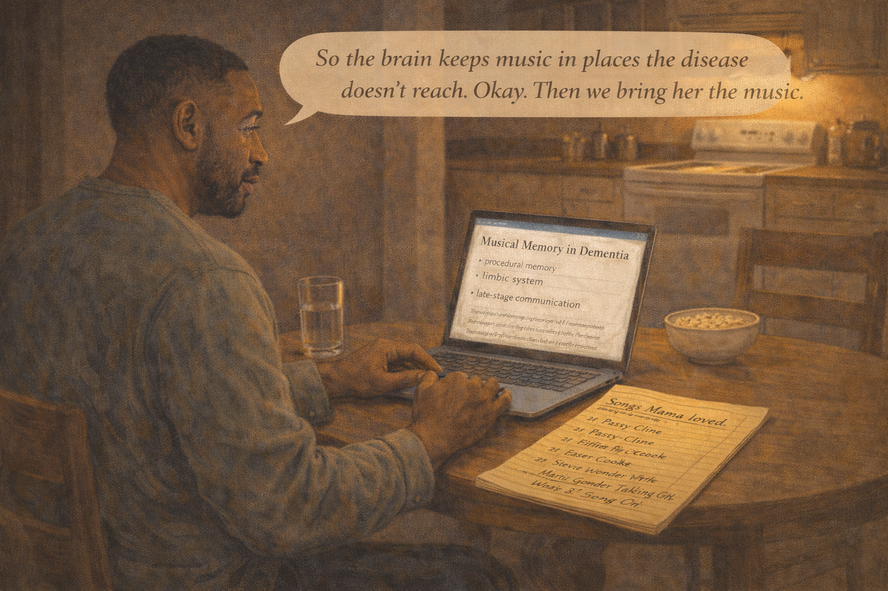 -->

Image Prompt

(This is panel 7. Do not put the panel number in the image.)

Contemporary photorealistic illustration, 16:9 wide-landscape format. A kitchen table that evening. **Marcus** sits with a laptop open in front of him, a yellow legal pad beside it, a glass of water, a small bowl of popcorn untouched. On his laptop screen, in stylized visibility: a research-article-style page with the title "Musical Memory in Dementia" and subtitles like *"procedural memory,"* *"limbic system,"* *"late-stage communication."* Marcus has been writing on the yellow legal pad in careful handwriting: *"Songs Mama loved"* as a heading, and underneath: *"Patsy Cline," "Ella Fitzgerald," "Sam Cooke," "gospel — church choir Easter '68," "Stevie Wonder Talking Book," "Marvin Gaye What's Going On."* Color palette: warm kitchen ambers, the cool blue of the laptop, the yellow of the legal pad. Emotional tone: love organizing itself into a project.

**Speech bubble 1** — tail pointing to **Marcus**, positioned above him as a quiet focused thought: "So the brain keeps music in places the disease doesn't reach. Okay. Then we bring her the music."

Generate the image immediately without asking clarifying questions.

**Narrative:** That night Marcus stayed up reading. He learned that the brain stores deeply-learned music in neural pathways that are spread widely — and that these pathways, unlike the name-and-face pathways of the hippocampus, are often preserved well into late-stage Alzheimer's. He learned about procedural memory, about musical memory, about a nonprofit called *Music & Memory* that had built whole programs around personalized playlists in memory-care homes. He opened a fresh page on his legal pad. At the top he wrote: *"Songs Mama loved."* Below it, he began to list.

---

## Panel 8: The Old Albums

<!-- 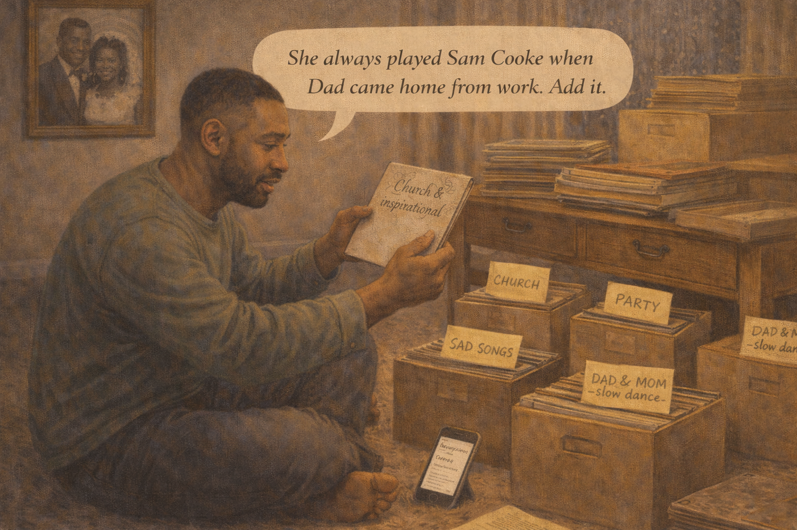 -->

Image Prompt

(This is panel 8. Do not put the panel number in the image.)

Contemporary photorealistic illustration, 16:9 wide-landscape format. Living-room floor, the next day. **Marcus** sits cross-legged on the rug surrounded by stacks of his mother's old vinyl records, photo albums, and boxes. He is holding up a record sleeve and inspecting the handwritten label his mother wrote decades ago. On the floor around him in neat piles: one pile labeled with a sticky note "CHURCH," one "PARTY," one "SAD SONGS," one "DAD & MOM — slow dance." His phone is propped against a coffee-table leg, a note-taking app open. On the wall behind him, a framed black-and-white photo of his parents at their wedding — a handsome young Black couple in 1965 wedding attire. Color palette: warm browns of the vinyl, the cream of the sticky notes, amber afternoon light. Emotional tone: a son becoming an archivist of his mother's joy.

**Speech bubble 1** — tail pointing to **Marcus**, positioned above him, thoughtful: "She always played Sam Cooke when Dad came home from work. Add it."

Generate the image immediately without asking clarifying questions.

**Narrative:** Marcus spent the next week building his mother a memory. He went through every record, every photo album, every mixtape label. He called his aunts and asked what Ruth had danced to at her wedding. He asked the old choir director at his mother's church what the choir had sung for Easter in 1968. He wrote it all down. Sam Cooke for when Dad used to come home from work. Aretha Franklin for the kitchen. Mahalia Jackson for Sunday mornings. Patsy Cline for the slow quiet evenings when the house was empty. By Sunday he had seventy-three songs.

---

## Panel 9: The Playlist

<!-- 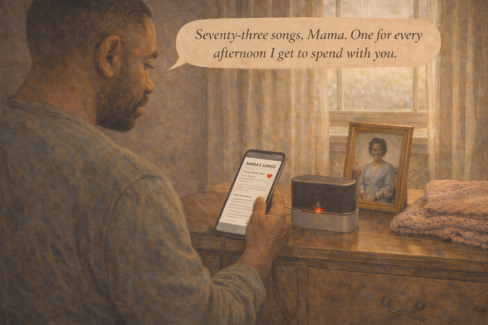 -->

Image Prompt

(This is panel 9. Do not put the panel number in the image.)

Contemporary photorealistic illustration, 16:9 wide-landscape format. **Marcus** standing at a small charging dock on a dresser, connecting a small modern bluetooth speaker to his phone. On his phone screen, visible: a simple music app with a playlist titled **"MAMA'S SONGS"** and seventy-three track titles listed beneath. A small red heart icon by his fingertip. The dresser also has a framed photo of Ruth in her 1960s Sunday dress, standing on church steps, smiling. A small soft pink afghan folded on the dresser. Morning light through the window. Color palette: warm creams, the soft red of the heart on the phone, the muted pinks and blues of the afghan. Emotional tone: a small modern tool loaded with a lifetime.

**Speech bubble 1** — tail pointing to **Marcus**, positioned above him, quiet and determined: "Seventy-three songs, Mama. One for every afternoon I get to spend with you."

Generate the image immediately without asking clarifying questions.

**Narrative:** Marcus built the playlist on his phone and named it *"Mama's Songs."* He bought a small bluetooth speaker and set it on the dresser in his mother's room. He printed the song list and tucked it into the front page of her care notebook, so any aide who came to the house would know what to play, and when. Seventy-three songs. He calculated out loud, to nobody: that was a little over four hours of music. An afternoon. A whole afternoon with his mother, every afternoon, for as long as they had.

---

## Panel 10: Tuesday, Every Tuesday

<!-- 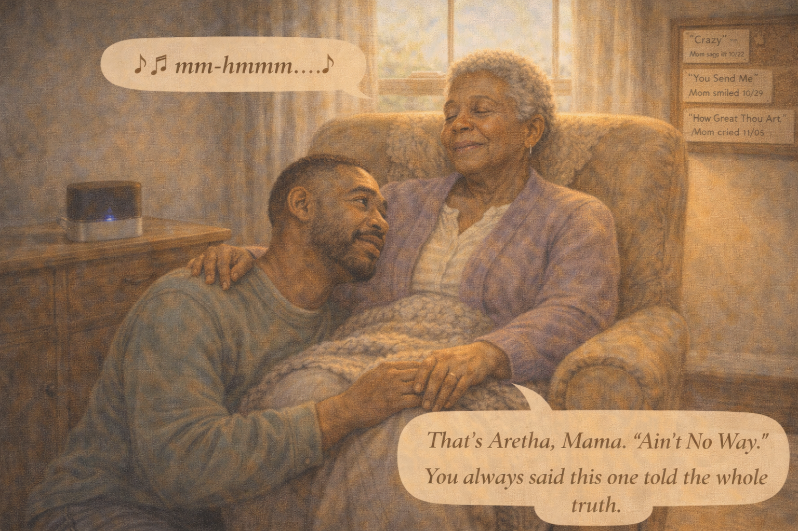 -->

Image Prompt

(This is panel 10. Do not put the panel number in the image.)

Contemporary photorealistic illustration, 16:9 wide-landscape format. Several weeks later. The living room, a sunny afternoon now. **Ruth** sits in her armchair with a soft knit blanket over her lap. She is not singing — she is gently humming, her eyes half-closed, a small peaceful smile. **Marcus** is seated on the rug at her feet, leaning against the side of her chair, one of her hands resting on his shoulder. The small bluetooth speaker is on the side table, a visible blue LED lit. A soft afternoon sunbeam comes through the window onto them both. On the wall, a new addition since earlier panels: a cork board pinned with song titles handwritten on index cards, dates beside some of them — *"'Crazy' — Mom sang it 10/22,"* *"'You Send Me' — Mom smiled 10/29,"* *"'How Great Thou Art' — Mom cried 11/05."* Color palette: warm golden sunlight, sage greens, soft peach. Emotional tone: love has built a new language.

**Speech bubble 1** — tail pointing to **Ruth** (hand on Marcus's shoulder), positioned above her, small musical hum: "♪ mm-hmmm... ♪"

**Speech bubble 2** — tail pointing to **Marcus**, positioned above him, quiet and content: "That's Aretha, Mama. 'Ain't No Way.' You always said this one told the whole truth."

Generate the image immediately without asking clarifying questions.

**Narrative:** Marcus began a new Tuesday ritual: rain or sun, after lunch, a two-hour listening session in the living room. He learned to watch his mother's face like a careful gardener watches soil. Some songs brought tears. Some songs brought a half-smile. Some songs, magically, still brought full lyrics — especially the ones she had sung in church. He kept a small log on a corkboard in the hall: what song had done what, on which date. It was not a treatment plan. It was not medicine. It was something older and stranger: a language she still knew how to speak.

---

## Panel 11: The Aide Learns the Playlist

<!-- 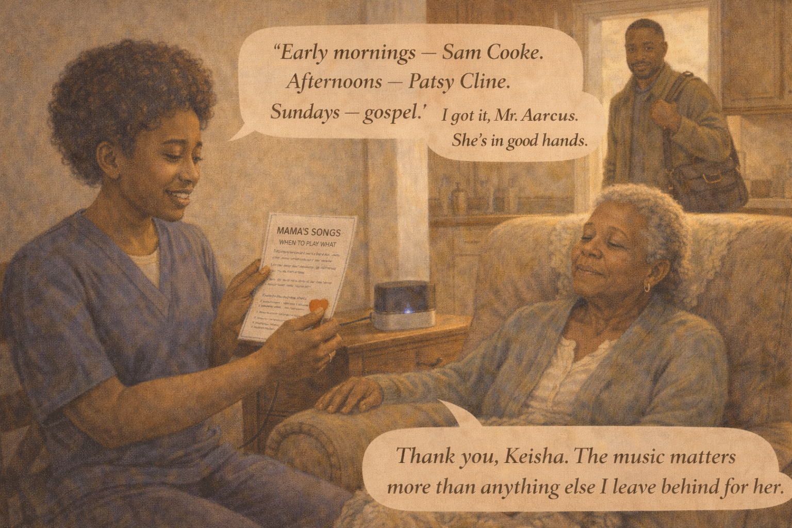 -->

Image Prompt

(This is panel 11. Do not put the panel number in the image.)

Contemporary photorealistic illustration, 16:9 wide-landscape format. A mid-morning scene. A kind young home-health aide — **Keisha** (late 20s, warm brown skin, natural hair in a soft afro, navy scrubs, a warm open face) — sits in a kitchen chair beside Ruth's armchair. She is holding a laminated card labeled *"MAMA'S SONGS — WHEN TO PLAY WHAT"* that Marcus has prepared for her, reading it carefully. A small bluetooth speaker is on the table, playing. **Ruth** is peacefully bobbing her head slightly to the music, eyes half-closed. **Marcus** is visible in the background in the kitchen doorway, with his coat on and a work bag slung over his shoulder, pausing before he leaves — warm grateful expression. Color palette: warm creams, the navy of Keisha's scrubs, the soft sage of Ruth's cardigan. Emotional tone: handing off a small treasure into good hands.

**Speech bubble 1** — tail pointing to **Keisha**, positioned above her, warm: "'Early mornings — Sam Cooke. Afternoons — Patsy Cline. Sundays — gospel.' I got it, Mr. Marcus. She's in good hands."

**Speech bubble 2** — tail pointing to **Marcus** (in doorway), positioned above him, quiet and trusting: "Thank you, Keisha. The music matters more than anything else I leave behind for her."

Generate the image immediately without asking clarifying questions.

**Narrative:** Marcus went back to part-time work after two months. His home-health aide Keisha became his partner in the ritual. He prepared her a laminated card: *"Early mornings — Sam Cooke. Afternoons — Patsy Cline. Sundays — gospel. If Mom seems agitated — 'How Great Thou Art.' If she seems sad — 'You Send Me.' If her eyes are closing — any Ella."* "I got it, Mr. Marcus," Keisha said, reading it carefully. "She's in good hands." He kissed his mother's forehead and left for the office, the first easy goodbye he had had in a year.

---

## Panel 12: The Last Song

<!-- 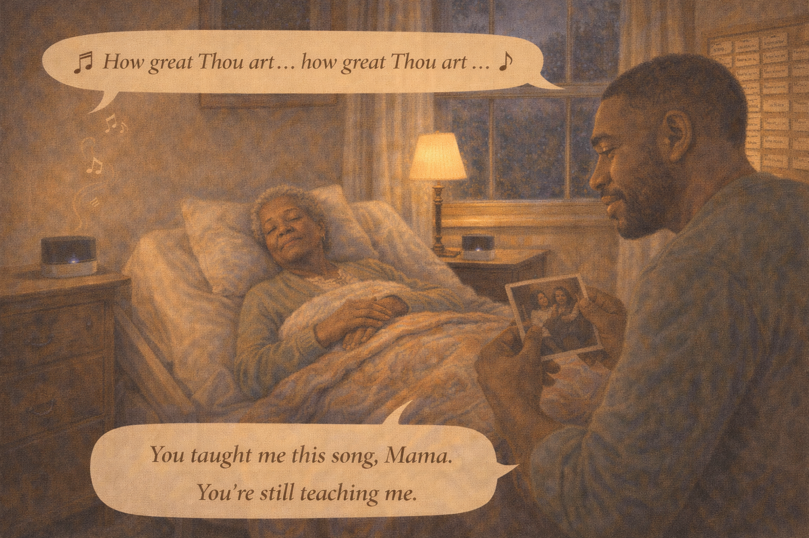 -->

Image Prompt

(This is panel 12. Do not put the panel number in the image.)

Contemporary photorealistic illustration, 16:9 wide-landscape format. An evening scene many months later. The small living room, lamps low and warm. **Ruth** lies peacefully on a soft hospital-style bed that has been set up in the living room (a subtle detail suggesting late-stage care at home). A warm quilt over her. Her eyes closed, face serene. Quiet. The small bluetooth speaker plays softly on a nearby table. **Marcus** sits in a chair beside the bed, his hand wrapped around his mother's hand on the quilt. His face is quiet, full of love, tears on his cheeks but not despair. In his free hand: an old photograph of Ruth as a young woman singing in a choir. On a corkboard on the wall, the song-log now filled with dozens of index cards — a whole archive. A soft soft musical note rising faintly from the speaker. Color palette: deep warm ambers, cream and peach, the soft indigo of the evening outside the window. Emotional tone: a loving vigil, a song as company at the close.

**Speech bubble 1** — a quiet musical notes speech bubble from the speaker: "♪ How great Thou art... how great Thou art... ♪"

**Speech bubble 2** — tail pointing to **Marcus**, positioned above him, a quiet loving whisper: "You taught me this song, Mama. You're still teaching me."

Generate the image immediately without asking clarifying questions.

**Narrative:** Ruth lived another year and a half. On the last evening, she did not open her eyes again. Marcus sat by her bedside with the little bluetooth speaker playing "How Great Thou Art" on low volume — the hymn she had sung in the church choir at Easter 1968, the song she had hummed to him when he was small and sick, the song he had put at the top of the playlist. He held her hand. He cried. He did not try to make her wake up. The song played softly, then another, then another. Outside the window, the evening turned deep blue. "You taught me this song, Mama," he whispered. "You're still teaching me."

---

## Epilogue: What This Family Learned

| Challenge | Response | Lesson for Today |
|---|---|---|
| A mother gone silent in late-stage Alzheimer's | A record pulled from a crate on a rainy Tuesday | Music reaches where words cannot. Try the old songs. |
| No idea why the song worked | Marcus read the research on musical memory | Deeply-learned songs live in brain regions the disease reaches later or less. |
| A one-song miracle that might have been lost | Marcus built a personalized playlist of 73 songs | A playlist is an heirloom. Build it while you can and share it widely. |
| A home-health aide who didn't know what to play | A laminated "when to play what" card | Caregiving knowledge does not live in one head. Write it down; leave it behind. |
| Grief that the old mother was gone | Learning a new language — music — with the mother who was still here | Connection in late-stage dementia does not have to be in words. |
| A final vigil | Soft gospel on a small speaker by the bed | Music can be a companion all the way to the last breath. |

## A Note to the Reader

If your loved one has gone quiet in the late stages of Alzheimer's
or another dementia, please know: they are still in there. The
research is clear — deeply-learned songs, especially those
learned between ages 10 and 25, are often preserved and
accessible even when names, faces, and language have gone. A
personalized playlist can become one of your most powerful tools
for connection, comfort, and moments of genuine joy.

**How to build a playlist:**

- **Start with youth.** Songs learned in adolescence and young adulthood are often the strongest.
- **Ask the family.** Siblings, cousins, childhood friends often remember songs the caregiving child doesn't.
- **Include sacred music.** Church hymns, religious songs, and lullabies are some of the most deeply embedded.
- **Cover the day.** Morning songs, afternoon songs, evening songs, and specific "in agitation" songs.
- **Keep it accessible.** A small bluetooth speaker and a printed "when to play what" card let any caregiver use it.

The **Music & Memory** nonprofit and the **Alzheimer's Association
24/7 Helpline (1-800-272-3900)** can help you get started.

## Quotes From the Story

> "The brain that forgets your name still knows the song."

> "Seventy-three songs, Mama. One for every afternoon I get to spend with you." — *Marcus*

> "You taught me this song, Mama. You're still teaching me." — *Marcus*

## References

1. [Wikipedia: Music-related memory](https://en.wikipedia.org/wiki/Music-related_memory) - Overview of how musical memory is stored and preserved in the brain
2. [Wikipedia: Procedural memory](https://en.wikipedia.org/wiki/Procedural_memory) - The "how-to" memory system that often survives late into dementia
3. [Music & Memory Nonprofit](https://musicandmemory.org/) - National program that builds personalized playlists for people with dementia
4. [Alzheimer's Association: Art and Music](https://www.alz.org/help-support/caregiving/daily-care/art-music) - Practical guide to using music in dementia caregiving
5. [NIH: Music Therapy and Dementia](https://www.ncbi.nlm.nih.gov/pmc/articles/PMC6475894/) - Peer-reviewed research on the cognitive and emotional benefits of music for people with dementia
