# The Same Question, Five Times

*Patience is a skill, not a personality trait*

<!--  -->

Cover Image Prompt

Please generate a 16:9 cover image in warm painterly American contemporary realism — soft oil-painting brushwork with visible but refined strokes; muted warm palette of sage green, dusty lavender, cream, honey gold, rose pink, and walnut brown; warm golden afternoon window light as the key and honey-gold interior lamp glow as fill; soft low-contrast shadows; fabric textures (knit, flannel, cotton, lace) clearly visible; in the Rockwell-and-Kinkade tradition of tender domestic illustration. No saturated primaries, no neon, no photorealism, no vector flatness, no film grain, no chromatic aberration. Night scenes keep the same warm vocabulary — indigo and deep walnut in place of saturated cool blue, with honey-gold porch or lamp light as warm accent.

**Title treatment (top ~15% of frame):** Across the top of the image, centered horizontally, render the main title "THE SAME QUESTION, FIVE TIMES" in a warm ivory/cream humanist serif — the kind of hand-set lettering you would see on a classic illustrated-novel cover — with a soft painterly drop-shadow so the text integrates into the scene below, never a hard graphic bar. Directly beneath the title, in a smaller italic of the same serif, render the subtitle "Patience Is a Skill". The lettering should feel as if the painter lettered it themselves, in the same brush vocabulary as the painting.

**Scene:** A cozy suburban kitchen in late afternoon. On the left wall hangs a large dry-erase whiteboard in a wood frame, neatly marked in block letters: "TODAY: Wednesday, Oct 14" / "APPOINTMENT: Dr. Chen, 2:30 PM" / "DAVID COMES AT 11" / "DINNER: chicken & rice." In the center of the frame, David, 55, warm brown skin, short salt-and-pepper hair and beard, wearing a soft charcoal cardigan over a light blue shirt, stands with a friendly steady posture holding a red dry-erase marker as if having just finished writing on the board. To his right, sitting at the kitchen table with a cup of coffee: Walter, 78, his father — medium-brown skin, close-cut silver hair, brown flannel shirt and reading glasses — looking up at the board with a peaceful, slightly amused expression. On the table: a coffee mug, a folded newspaper, reading glasses, a plate with a partially eaten slice of toast.

**Emotional tone:** calm, loving competence after hard-won patience.

Generate the image immediately without asking clarifying questions.

## Narrative Prompt

This is a fictional composite story built from the experience of thousands of adult children caring for a parent with dementia. David and Walter are invented characters, but every moment here — the repeated question, the clenched jaw, the snapped response, the parent's wounded face — is drawn from the everyday reality of memory-loss caregiving. The story teaches one clear skill: why repetition happens, how to answer it without harm, and how a simple whiteboard can transform a house. Art style: contemporary photorealistic illustration, warm intimate domestic tone, present-day suburban America.

## Prologue

Everyone who loves a person with dementia eventually learns the rhythm of the repeated question. "What time is the appointment?" "What day is it?" "Has your sister called?" Each time, for the person asking, it is the first time. Each time, for the person answering, it is the fourth, the ninth, the fortieth. What looks like patience in a good caregiver is not a personality trait. It is a skill. It can be learned. It can be lost. And it can be supported by a single piece of posterboard on a kitchen wall.

---

## Panel 1: A Good Son

<!-- 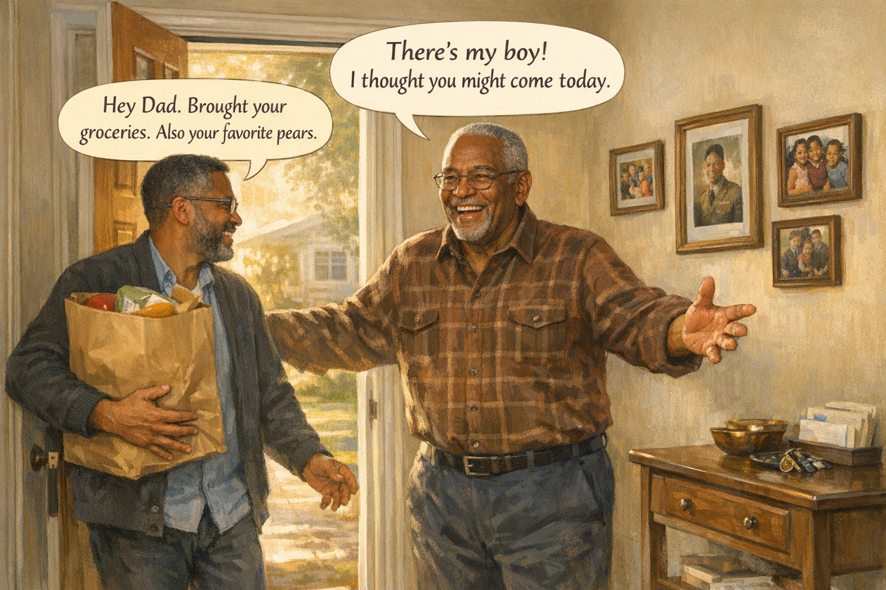 -->

Image Prompt

(This is panel 1. Do not put the panel number in the image.)

Contemporary photorealistic illustration, 16:9 wide-landscape format. **David** (55, warm brown skin, short salt-and-pepper hair and beard, charcoal cardigan, reading glasses) walks through the front doorway of his father's small suburban ranch home carrying a brown paper grocery bag. Morning light spills in behind him from the front yard. He has a warm, attentive expression. In the CENTER of the frame, **Walter** (78, medium-brown skin, close-cut silver hair, brown flannel shirt, navy slacks) is coming down the hallway to greet him with a broad open smile and outstretched arms. The small foyer has framed family photos on the walls: a wedding, grandchildren, a young Walter in Army uniform. A console table holds keys, mail, and a small brass bowl. Color palette: warm golden morning light, cream walls, soft browns, the bright pop of the brown paper bag. Emotional tone: love, the small ritual of visiting a parent.

**Speech bubble 1** — tail pointing to **Walter** (center), positioned above him, warm and bright: "There's my boy! I thought you might come today."

**Speech bubble 2** — tail pointing to **David** (entering from the left), positioned above him: "Hey Dad. Brought your groceries. Also your favorite pears."

Generate the image immediately without asking clarifying questions.

**Narrative:** David had always been a good son. Every Wednesday morning he drove the forty minutes to his father's small ranch house, carrying the grocery list they had worked out together years ago: milk, bread, bananas, the pears Walter had loved since David was a boy. Walter had been widowed for six years and diagnosed with Alzheimer's a year ago. David was proud of how well his father was doing. David was proud, too, of how well *he* was doing. Patient. Steady. A good son.

---

## Panel 2: The First Time

<!-- 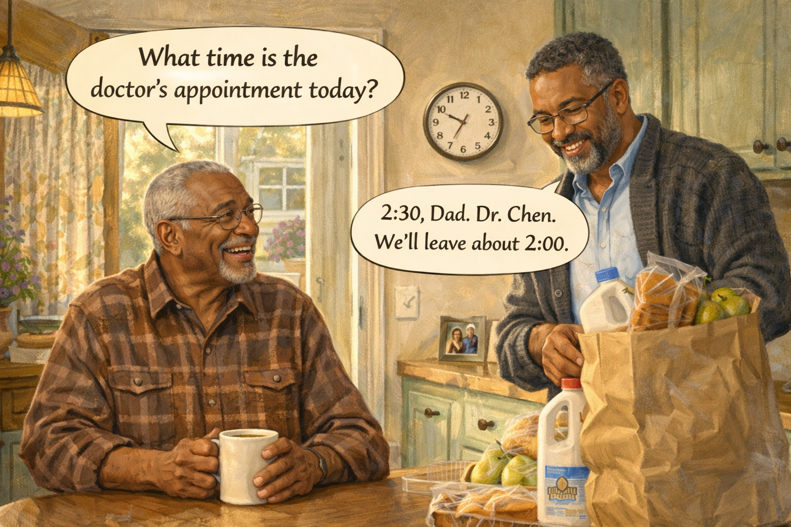 -->

Image Prompt

(This is panel 2. Do not put the panel number in the image.)

Contemporary photorealistic illustration, 16:9 wide-landscape format. Same kitchen interior. **David** (on the RIGHT) is at the counter unpacking groceries from the brown paper bag — a loaf of bread, a gallon of milk, a bag of pears visible. **Walter** (on the LEFT) sits at the kitchen table in his flannel shirt, holding a coffee mug in both hands, looking up at his son with mild curiosity. A kitchen clock on the wall reads 10:15 AM. A small family photo on the counter of Walter with his late wife. Color palette: buttery morning yellows, warm browns, cream walls. Emotional tone: ordinary, calm, the good opening of a normal Wednesday.

**Speech bubble 1** — tail pointing to **Walter** (left, at table), positioned above him, friendly: "What time is the doctor's appointment today?"

**Speech bubble 2** — tail pointing to **David** (right, unpacking groceries), positioned above him, patient and warm: "2:30, Dad. Dr. Chen. We'll leave about 2:00."

Generate the image immediately without asking clarifying questions.

**Narrative:** Walter had a cardiology follow-up at 2:30 that afternoon. They had gone over it twice on the phone the day before. At 10:15 Walter asked, cheerfully, "What time is the doctor's appointment today?" David answered with a smile. "2:30, Dad. Dr. Chen. We'll leave about 2:00." Walter nodded, said "good, good," and took a sip of his coffee. David kept unpacking the pears. Easy.

---

## Panel 3: The Second Time

<!-- 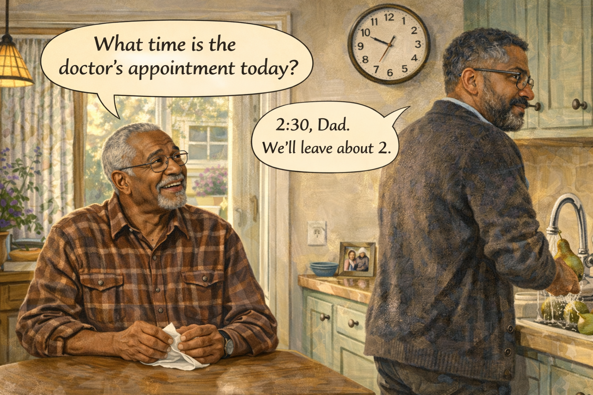 -->

Image Prompt

(This is panel 3. Do not put the panel number in the image.)

Contemporary photorealistic illustration, 16:9 wide-landscape format. Same kitchen, a few minutes later, 10:22 AM (clock visible). **David** is now at the sink, washing the pears under running water, his back mostly to us but his face visible in profile. His expression is still calm, though a faint tightness has appeared in his jaw. **Walter** is in the same chair at the table, but now he is folding and unfolding a paper napkin in his hands — an anxious small movement. His face is pleasantly curious, unaware that the question he is about to ask has been asked seven minutes ago. Color palette: same buttery yellows, slightly cooler undertones. Emotional tone: something has just shifted, but only a little.

**Speech bubble 1** — tail pointing to **Walter** (left, at table), positioned above him, in exactly the same friendly tone: "What time is the doctor's appointment today?"

**Speech bubble 2** — tail pointing to **David** (right, at sink), positioned above him, slightly slower but still warm: "2:30, Dad. We'll leave about 2."

Generate the image immediately without asking clarifying questions.

**Narrative:** Seven minutes later, Walter asked again. "What time is the doctor's appointment today?" David turned off the water and smiled. "2:30, Dad. We'll leave about 2." He did not feel impatient. He felt tender. He remembered a book he had read about dementia, and the line that said *for the person asking, every time is the first time.* He held onto that line like a good son holds onto a railing.

---

## Panel 4: The Third Time

<!-- 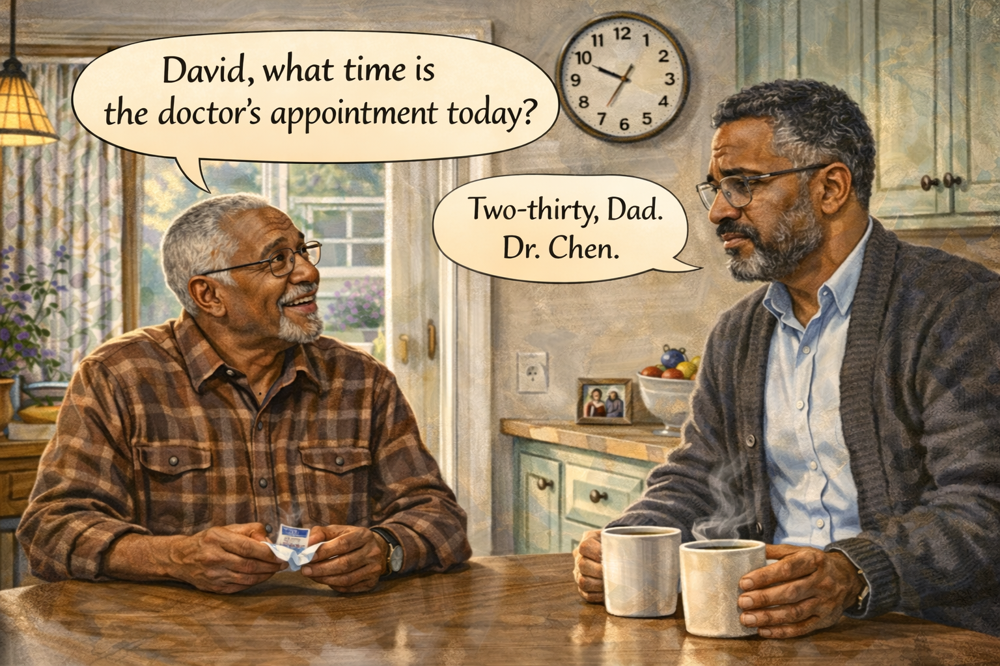 -->

Image Prompt

(This is panel 4. Do not put the panel number in the image.)

Contemporary photorealistic illustration, 16:9 wide-landscape format. Same kitchen. David has moved to the kitchen table and is now sitting across from Walter, his own cup of coffee in front of him. The clock reads 10:34. **David's** expression is beginning to change — a small line has appeared between his eyebrows, a micro-tension in his shoulders — but his face is still composed. He is forcing a patient smile that doesn't quite reach his eyes. **Walter** is unchanged, still pleasant, still turning a sugar packet between his fingers. The coffee mugs between them steam gently. Color palette: warm browns, but with just a whisper of cool light creeping in, a subtle mood shift. Emotional tone: the first small hairline crack.

**Speech bubble 1** — tail pointing to **Walter**, positioned above him, same easy tone: "David, what time is the doctor's appointment today?"

**Speech bubble 2** — tail pointing to **David**, positioned above him, slightly flatter now: "Two-thirty, Dad. Dr. Chen."

Generate the image immediately without asking clarifying questions.

**Narrative:** At 10:34, Walter asked for the third time. "David, what time is the doctor's appointment today?" David answered. His voice was slightly flatter now. "Two-thirty, Dad. Dr. Chen." He felt a small muscle in his jaw tighten. He took a deliberate breath. He reminded himself: *every time is the first time for him.* He was a good son.

---

## Panel 5: The Fourth Time

<!-- 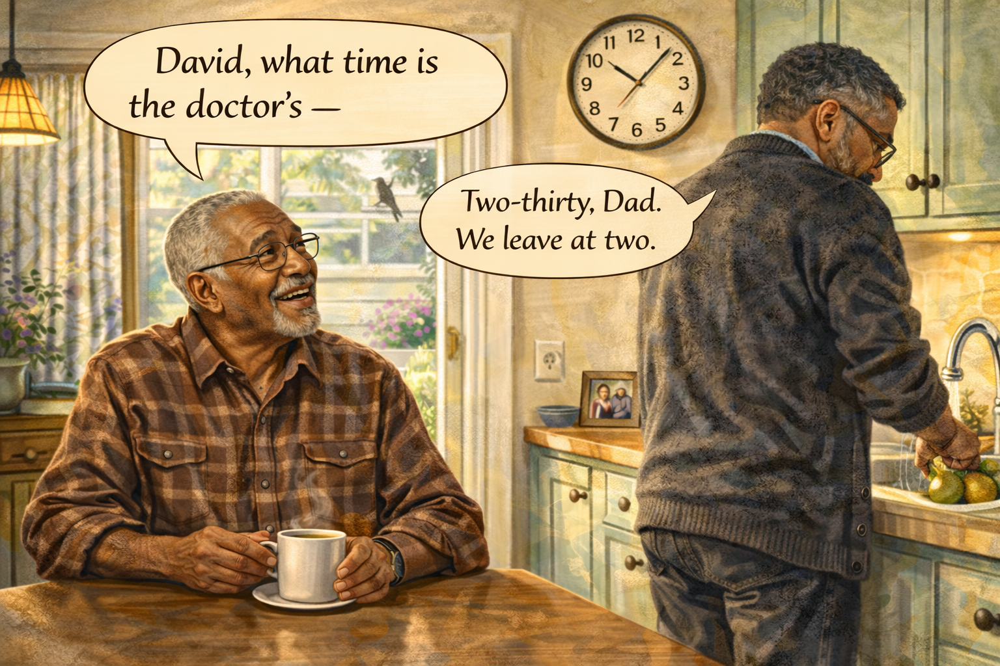 -->

Image Prompt

(This is panel 5. Do not put the panel number in the image.)

Contemporary photorealistic illustration, 16:9 wide-landscape format. Same kitchen, 10:49 AM. **David** has stood up and is now at the sink, his back to Walter, scrubbing a plate with unnecessary vigor — his knuckles have gone white around the sponge. The tension in his shoulders is now visible. His reading glasses have slipped down his nose. He is not looking at his father. **Walter** is at the table, entirely unaware, gently turning his coffee mug in its saucer, his expression open and friendly. A single bird is visible through the kitchen window behind David. The light is brighter now as the morning has advanced. Color palette: same yellows, but a slight drain of warmth — the bright overhead light feels a little harsher. Emotional tone: the strain is visible now, though Walter cannot see it.

**Speech bubble 1** — tail pointing to **Walter**, positioned above him, unchanged: "David, what time is the doctor's —"

**Speech bubble 2** — tail pointing to **David** (at sink, back to Walter), positioned above him, the words clipped: "Two-thirty. Dad. We leave at two."

Generate the image immediately without asking clarifying questions.

**Narrative:** At 10:49 Walter began the question again. "David, what time is —" "Two-thirty," David cut in. "Dad. We leave at two." His voice had gone clipped. The sponge in his hand was being squeezed too hard. He turned on the water louder than he needed to. Somewhere in the back of his chest, a small hot coal had begun to glow, and he did not yet know what to do with it.

---

## Panel 6: The Fifth Time — and the Snap

<!-- 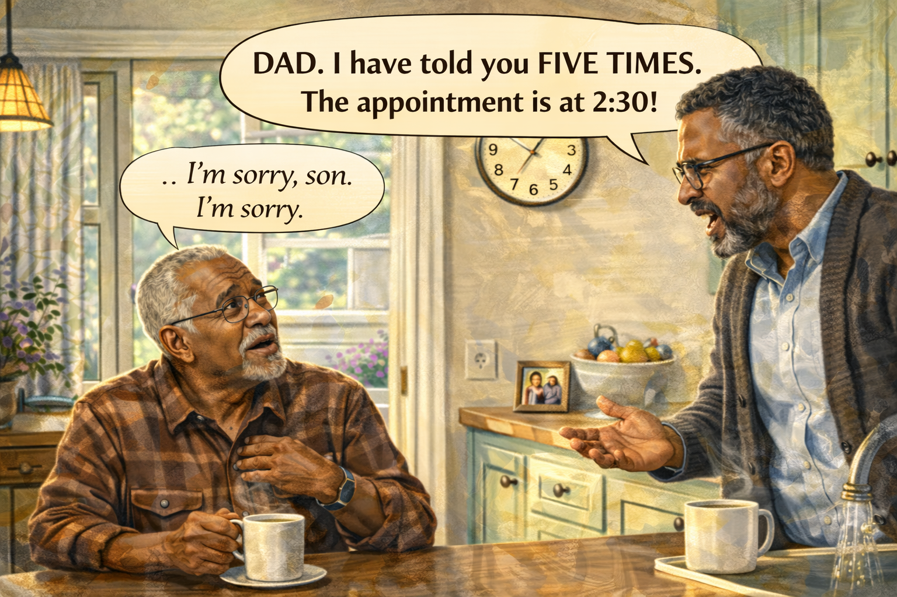 -->

Image Prompt

(This is panel 6. Do not put the panel number in the image.)

Contemporary photorealistic illustration, 16:9 wide-landscape format. Same kitchen, 11:06 AM. **David** has turned away from the sink and is facing **Walter** directly across the kitchen. His face is taut; his eyes have a bright, angry shine; his jaw is visibly clenched. His hand is raised slightly in an involuntary gesture — not threatening, but exasperated, palm up. His voice has risen. **Walter** is frozen at the table, his friendly expression crumpling — his mouth open slightly, his brow wrinkling, a hand half-raised to his chest. He looks like a child who has been scolded without understanding why. His coffee mug is halfway to his lips; a drop has spilled. The kitchen light feels sharper. A silence hangs. Color palette: yellows with a cold edge now, the tension draining warmth from the scene. Emotional tone: the moment the caregiver breaks — and the moment the parent sees it.

**Speech bubble 1** — tail pointing to **David** (right, standing, facing his father), positioned above him, sharp and too loud: "DAD. I have told you FIVE TIMES. The appointment is at 2:30!"

**Speech bubble 2** — tail pointing to **Walter** (left, at table), positioned above him, small, shaky, almost in a whisper: "...I'm sorry, son. I'm sorry."

Generate the image immediately without asking clarifying questions.

**Narrative:** At 11:06 Walter asked for the fifth time. David heard himself say — too loud, too sharp, a voice he barely recognized — "DAD. I have told you FIVE TIMES. The appointment is at 2:30." His father's face crumpled. "I'm sorry, son," Walter said, very quietly. "I'm sorry." The two small words went into David like glass. He stood there, still holding the dish towel, and his shame rose up so fast he could not breathe.

---

## Panel 7: The Quiet Hallway

<!-- 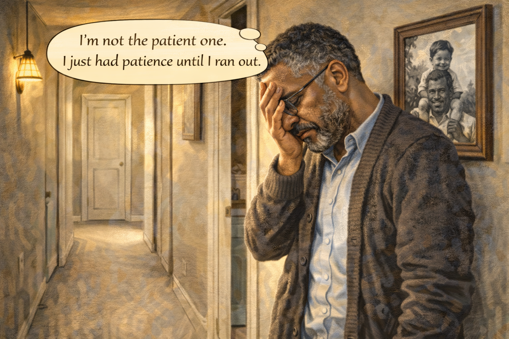 -->

Image Prompt

(This is panel 7. Do not put the panel number in the image.)

Contemporary photorealistic illustration, 16:9 wide-landscape format. Interior shot of the narrow hallway that runs from the kitchen toward the bedrooms. **David** stands alone in the middle of the hallway, his back against the wall, his head tilted upward toward the ceiling, eyes closed, one hand covering his face. A single tear traces down his cheek. He is wearing the cardigan, but his shoulders are slumped. Behind him on the wall, a black-and-white photograph of a much-younger Walter holding a small boy on his shoulders — clearly David as a child. The hallway lamp is warm and dim. Carpet is a soft beige. A closed bedroom door at the end. Color palette: soft warm browns, a gentle amber light, the muted blues and grays of the old photograph. Emotional tone: a son crushed by his own impatience, and by the love standing behind him on the wall.

**Speech bubble 1** — tail pointing to **David**, positioned above him as a quiet thought bubble: "I'm not the patient one. I just had patience until I ran out."

Generate the image immediately without asking clarifying questions.

**Narrative:** David stepped into the hallway and put his back against the wall. He closed his eyes. He had always thought of himself as the patient one in the family. Now he understood: he had not been patient. He had been lucky. And luck had just run out at 11:06 on a Wednesday morning, in the middle of a kitchen, in front of the man who had once carried him on his shoulders. Patience, he realized, was not a thing you *were*. It was a thing you *built*.

---

## Panel 8: Calling the Helpline

<!-- 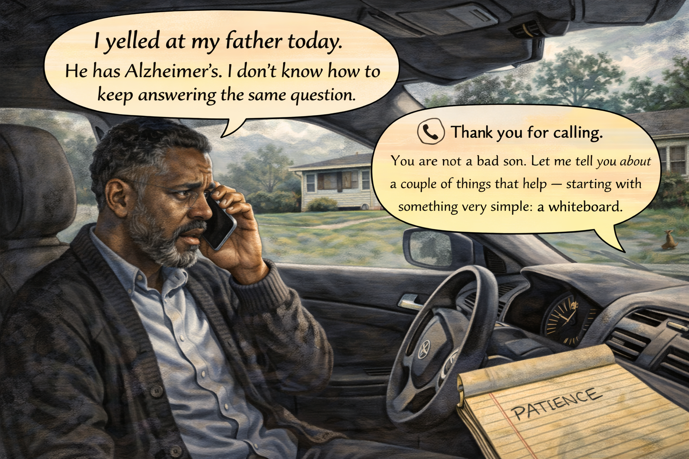 -->

Image Prompt

(This is panel 8. Do not put the panel number in the image.)

Contemporary photorealistic illustration, 16:9 wide-landscape format. **David** sits in his parked car in Walter's driveway, driver's door closed, phone pressed to his ear. The car interior is dim; the windshield shows a cloudy afternoon. David's expression is raw — eyes red-rimmed, but his posture is erect, listening carefully. A yellow legal pad on the passenger seat has the word "PATIENCE" written on it in quick handwriting. In the distance through the windshield, Walter's small ranch house is visible. A squirrel scampers across the lawn. Color palette: cool gray-blues of the car interior, the warm yellow of the legal pad, soft shadows. Emotional tone: a man reaching for help, and receiving it.

**Speech bubble 1** — tail pointing to **David** (inside car with phone), positioned above him, quiet and broken: "I yelled at my father today. He has Alzheimer's. I don't know how to keep answering the same question."

**Speech bubble 2** — a phone-style speech bubble (with small phone icon) on the right, representing the helpline counselor, warm and practical: "Thank you for calling. You are not a bad son. Let me tell you about a couple of things that help — starting with something very simple: a whiteboard."

Generate the image immediately without asking clarifying questions.

**Narrative:** David sat in his car in Walter's driveway and called the Alzheimer's Association 24/7 helpline. A woman named Rosa answered. He told her what had happened. He expected her to be polite. Instead she said, "Thank you for calling. You are not a bad son." He cried a little. Then Rosa told him three things: answer the repeated question as if it is the first time; use a whiteboard for the answers the person keeps wanting; and do not carry this alone. He wrote it all down on a yellow legal pad.

---

## Panel 9: The Whiteboard Arrives

<!-- 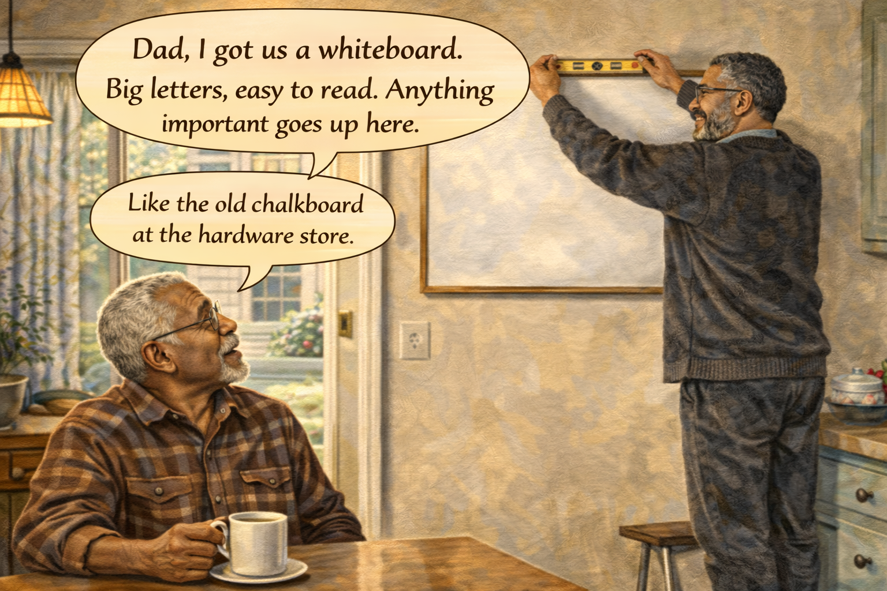 -->

Image Prompt

(This is panel 9. Do not put the panel number in the image.)

Contemporary photorealistic illustration, 16:9 wide-landscape format. Kitchen scene, warm morning light, a few days later. **David** is hanging a large **dry-erase whiteboard** (about 24" x 36", simple pine frame) on the wall opposite the kitchen table — clearly a prominent, high-visibility spot where someone sitting at the table would easily see it. He is on a small step stool, level in hand, smiling softly. **Walter** sits at the table watching with mild curiosity, a coffee mug beside him. On the counter, a package of colored dry-erase markers (red, blue, black, green) still in the plastic. Color palette: warm morning yellows, cream walls, the fresh bright white of the blank board. Emotional tone: small practical hope, a tool arriving.

**Speech bubble 1** — tail pointing to **David** (on stool, hanging board), positioned above him, warm and energetic: "Dad, I got us a whiteboard. Big letters, easy to read. Anything important goes up here."

**Speech bubble 2** — tail pointing to **Walter** (at table), positioned above him, pleased: "Like the old chalkboard at the hardware store."

Generate the image immediately without asking clarifying questions.

**Narrative:** David drove to the office store the next day and bought a large dry-erase whiteboard, a set of colored markers, and a pack of magnetic clips. He hung the board on the kitchen wall opposite his father's usual chair, where Walter could not miss it. He bought a small desk-style clock for the wall too, with extra-large numbers. "Anything important goes up here, Dad," he said. Walter considered it thoughtfully and then said, "Like the old chalkboard at the hardware store." They both smiled. It was the first good moment of the week.

---

## Panel 10: The Board in Action

<!-- 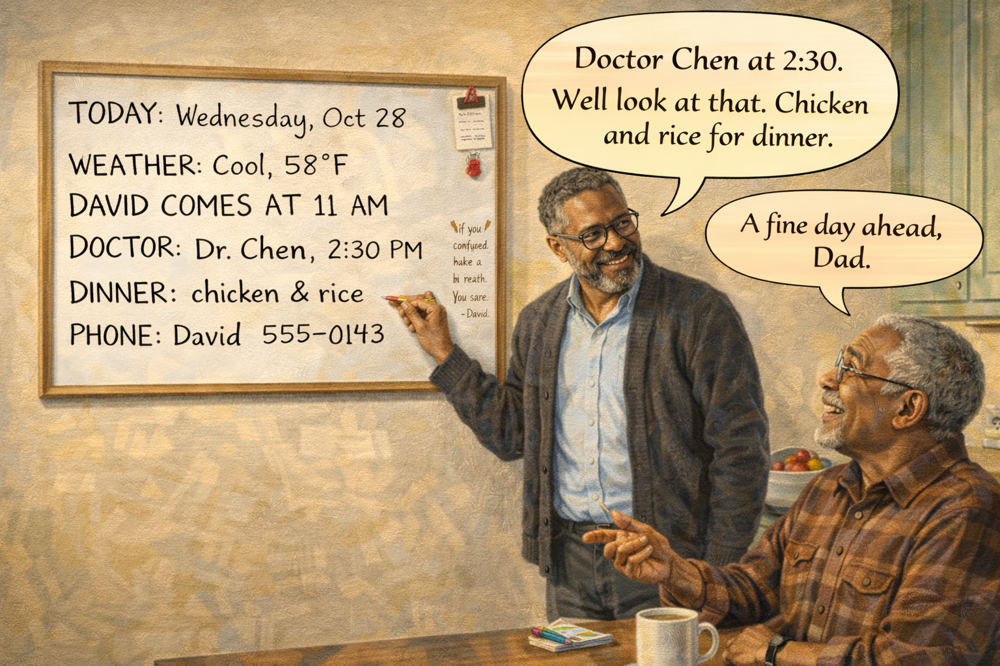 -->

Image Prompt

(This is panel 10. Do not put the panel number in the image.)

Contemporary photorealistic illustration, 16:9 wide-landscape format. Warm kitchen, a different day, another morning. The **whiteboard** now fills a prominent portion of the LEFT side of the frame and has clear content on it in bold, neat handwriting:

*"TODAY: Wednesday, Oct 28"*
*"WEATHER: Cool, 58°F"*
*"DAVID COMES AT 11 AM"*
*"DOCTOR: Dr. Chen, 2:30 PM"*
*"DINNER: chicken & rice"*
*"PHONE: David 555-0143"*

A red magnetic clip holds up a small appointment card. A smaller side column reads *"If you feel confused, take a breath. You are safe. — David"*. On the RIGHT side of the frame, **Walter** sits at the kitchen table in his flannel shirt, looking up at the board with genuine delight — mouth slightly open, eyes crinkled with quiet pleasure. He has a hand on the table, pointing at the board. **David** stands beside the board with a gentle, proud smile, a red marker in his hand. Color palette: warm buttery yellow light, cream walls, the crisp white and bold black of the whiteboard, the warm brown of Walter's flannel. Emotional tone: the tool is working, the son has returned to himself.

**Speech bubble 1** — tail pointing to **Walter** (right, at table), positioned above him, delighted: "Doctor Chen at 2:30. Well look at that. Chicken and rice for dinner. A fine day ahead."

**Speech bubble 2** — tail pointing to **David** (left, beside board), positioned above him, soft: "A fine day ahead, Dad."

Generate the image immediately without asking clarifying questions.

**Narrative:** The next Wednesday morning, David walked in with the groceries. The whiteboard read: *TODAY: Wednesday, Oct 28. DAVID COMES AT 11. DOCTOR CHEN, 2:30.* Walter looked up at the board the way he used to look up at a headline in the newspaper. "Doctor Chen at 2:30," he announced. "Chicken and rice for dinner. A fine day ahead." He sipped his coffee. For the next four hours, he did not ask David about the appointment a single time. When he glanced toward the wall, the answer was already there.

---

## Panel 11: The Same Question, Answered Gently

<!-- 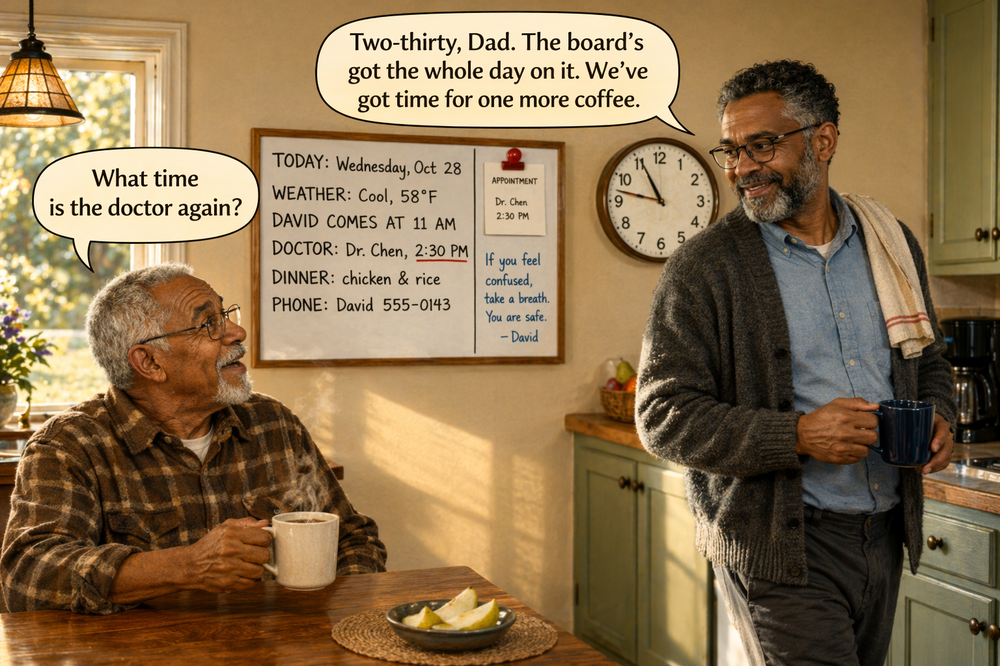 -->

Image Prompt

(This is panel 11. Do not put the panel number in the image.)

Contemporary photorealistic illustration, 16:9 wide-landscape format. Same kitchen. **Walter** at the table, coffee mug in hand, asking something. **David** is crossing the kitchen with a dish towel over his shoulder, turning toward his father with a calm steady smile — not strained, genuine. Behind them on the wall, the whiteboard is still visible with its neat columns. The kitchen clock now reads 11:47 AM. On the counter: a small bowl of pear slices Walter has been nibbling. Color palette: warm amber light, cream walls, the soft red of the magnetic clip on the board. Emotional tone: the repeated question is still happening — but now the caregiver has what he needs to answer it well.

**Speech bubble 1** — tail pointing to **Walter** (left, at table), positioned above him, curious: "What time is the doctor again?"

**Speech bubble 2** — tail pointing to **David** (right, crossing kitchen), positioned above him, calm and warm: "Two-thirty, Dad. The board's got the whole day on it. We've got time for one more coffee."

Generate the image immediately without asking clarifying questions.

**Narrative:** Walter still asked the same question sometimes. But now, when he did, David had tools instead of nerves. He would answer in an easy voice, point gently toward the whiteboard, and offer another cup of coffee. He stopped trying to *fix* the forgetting. He started *meeting* it. When Rosa had said that every time was the first time for Walter, David finally understood that every answer could also be the first time for himself — if he decided, before the question, not to carry anger into it.

---

## Panel 12: The Drive Home

<!-- 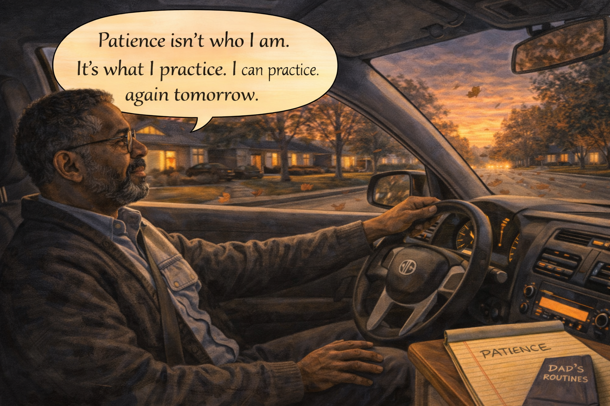 -->

Image Prompt

(This is panel 12. Do not put the panel number in the image.)

Contemporary photorealistic illustration, 16:9 wide-landscape format. Evening shot from inside **David's** car as he drives home down a tree-lined suburban street. Through the windshield, a fall sunset in soft oranges and violets, leaves swirling on the road ahead. David is behind the wheel, one hand on the steering wheel, one hand resting on his knee. His face is tired but serene — a man who has spent a long day with love and handled it well. The radio is playing softly (a low-volume glow of the dashboard). On the passenger seat: the now-dog-eared yellow legal pad with "PATIENCE" written on it, plus a small notebook titled "DAD'S ROUTINES." Through the side window, the blur of houses with warm lit windows. Color palette: rich sunset oranges, violet shadow, the amber glow of dashboard lights. Emotional tone: the quiet pride of a good day.

**Speech bubble 1** — tail pointing to **David** (behind wheel), positioned above him as a soft thought: "Patience isn't who I am. It's what I practice. I can practice again tomorrow."

Generate the image immediately without asking clarifying questions.

**Narrative:** On the drive home that evening, David passed the same houses he always passed, the same soft-lit windows. He thought about his father, safe at home, the whiteboard on the wall holding the shape of tomorrow already: *Thursday. Lunch at noon. David calls at 6 PM. A fine day ahead.* Patience, David realized, was a piece of equipment. You bought it and you hung it on the wall and you refilled it every day. The anger in the kitchen still hurt when he thought of it. But it had also been the thing that taught him to build what he should have built sooner.

---

## Epilogue: What This Family Learned

| Challenge | Response | Lesson for Today |
|---|---|---|
| A repeated question five times in one morning | David called the helpline instead of carrying the shame alone | Caregivers need a helpline as much as patients need a doctor. |
| A snapped response that wounded a parent | Apology, reset, and the decision to build a system | One hard moment does not make you a bad caregiver. What you build next is what matters. |
| The exhaustion of answering the same thing all day | A large kitchen whiteboard with the day's anchors | Do not make a memory-impaired person store what a wall can store for them. |
| Feeling like patience was a personality trait that had failed | Reframing patience as a *skill* and an *environment* | Patience is not who you are. It is what you build and what you practice. |
| The pain of a parent apologizing for his disease | Answering the next question as if it is the first | Every time is the first time for them. Let every time be a fresh answer from you. |
| The isolation of being the only family caregiver | A notebook of routines, a helpline in his phone | You cannot do this alone. You were never meant to. |

## A Note to the Reader

If you have ever snapped at a parent, a spouse, a brother, a
friend with dementia — please know: you did not fail. You ran
out of a resource you were never taught to protect. The good
news is that the tools exist, and most of them cost less than
twenty dollars: a whiteboard, a giant clock, a package of colored
markers, a short list of daily anchors.

Every repeated question is, for the person asking, the first
time. Let every answer from you be the first answer, too. When
you feel the jaw start to clench, look for the whiteboard on your
wall — and if there is no whiteboard yet, today is a good day
to hang one.

The **Alzheimer's Association 24/7 Helpline (1-800-272-3900)**
is free. The voice on the other end has heard your story before.

## Quotes From the Story

> "Patience isn't who I am. It's what I practice." — *David*

> "Every time is the first time for him. Let every time be a fresh answer from you." — *Rosa, helpline counselor*

> "A fine day ahead." — *Walter*

## References

1. [Wikipedia: Alzheimer's disease](https://en.wikipedia.org/wiki/Alzheimer%27s_disease) - Overview of the most common cause of dementia and the repetitive-questioning behavior that commonly accompanies it
2. [Wikipedia: Memory aids](https://en.wikipedia.org/wiki/Memory_aid) - External memory supports (whiteboards, calendars, notebooks) used in cognitive rehabilitation
3. [Alzheimer's Association: Communication Tips](https://www.alz.org/help-support/caregiving/daily-care/communications) - Practical guidance on responding to repeated questions and other communication challenges
4. [National Institute on Aging: Tips for Caregivers and Families of People with Dementia](https://www.nia.nih.gov/health/alzheimers-caregiving/tips-caregivers-and-families-people-dementia) - Practical caregiving strategies including environmental aids
5. [Mayo Clinic: Alzheimer's: Dealing with Repetition](https://www.mayoclinic.org/healthy-lifestyle/caregivers/in-depth/alzheimers/art-20047438) - Clinical guidance on managing repetitive behaviors with compassion
