# The Second Breakfast: Correcting vs. Caring

<!-- 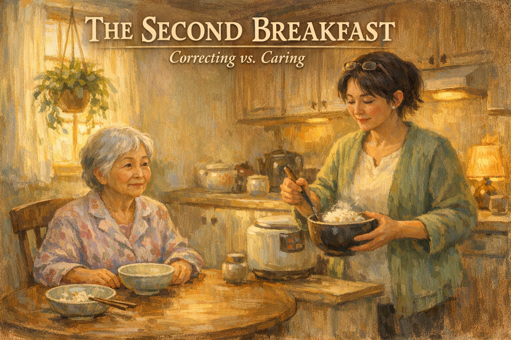 -->

Cover Image Prompt

Please generate a 16:9 image in warm, painterly contemporary realism depicting a bright kitchen in morning light. Yoko, 76, a small Japanese-American woman with short silver hair and gentle wrinkles, sits at a round wooden table in a floral housecoat, looking expectantly at an empty bowl in front of her. Her daughter Hana, 41, with a dark bob and reading glasses pushed up on her head, stands at the counter ladling steaming rice from a rice cooker into a second bowl. On the table, an already-used bowl sits to one side with a few grains of rice and a pair of chopsticks resting across it. Soft yellow sunlight streams through a window with a hanging plant. The color palette is warm buttercream, honey gold, soft green, and pale bamboo. The emotional tone is tender and peaceful — a daughter learning to choose love over correction. Generate the image immediately without asking clarifying questions.

Narrative Prompt

This is a graphic novel for family caregivers of people living with dementia. The main character is Hana, 41, a hospital pharmacist who has moved her mother, Yoko, 76, into her home after Yoko's diagnosis of moderate-stage Alzheimer's. Yoko eats breakfast, forgets she has eaten, and asks for breakfast again. At first, Hana corrects her: "Mom, you already ate." Each correction upsets Yoko, who insists she hasn't, becomes embarrassed, becomes quietly afraid, and sometimes cries. The story should show Hana's gradual shift from "correcting the memory" to "meeting the need." She learns, through a support group and through watching her own mother's face, that what Yoko is asking for is not calories — it is the comfort of a familiar morning routine. The solution isn't to lie; it's to stop treating memory loss as a factual problem and start treating it as a feeling problem. The tone is gentle, honest, and culturally specific — Yoko is Japanese-American, and breakfast is often miso soup, rice, a small piece of grilled fish. End with hope: Hana discovers that a second small bowl of rice, offered with love, is a kindness, not a dishonesty. Include the Alzheimer's Association 24/7 Helpline (1-800-272-3900). American English spelling throughout.

### Prologue – Two Bowls of Rice

It is a Tuesday morning. The rice cooker hums on the counter. Hana's mother has already eaten, an hour ago. She has already complimented the fish. She has already folded her napkin into a small triangle, the way she has folded napkins her whole adult life. Now she is sitting at the table again, looking expectantly at Hana, waiting for breakfast. Hana has a choice to make, and she does not yet know it will be the most important choice of her week.

<!-- 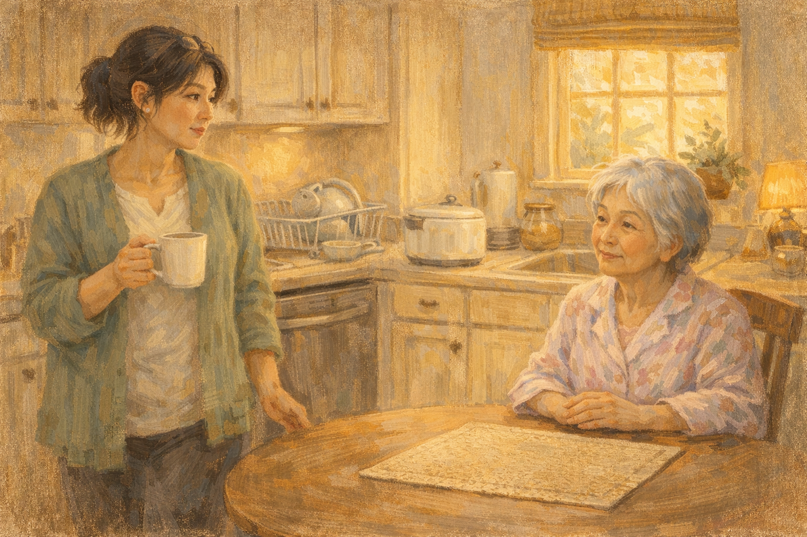 -->

Image Prompt

Please generate a 16:9 image in warm contemporary realism depicting a small bright kitchen. Hana, 41, stands at the counter mid-stride, a coffee mug in her hand, caught between the rice cooker and the dishwasher. She looks toward the table, where her mother Yoko, 76, small, in a pale pink housecoat, sits with her hands folded politely, looking expectantly at an empty placemat. On the counter behind Hana, a used breakfast bowl is rinsed in the sink. Soft morning light comes through a window with a bamboo shade. The color palette is pale peach, warm cream, soft green, and honey. The emotional tone is the pause before a small, important decision. No speech bubbles. Generate the image immediately without asking clarifying questions.

Hana stood at the counter with a half-empty coffee mug and watched her mother wait for breakfast. In the sink, the bowl her mother had used fifty minutes ago was rinsed and drying. Her mother had eaten two cups of rice, a small piece of salmon, and half a bowl of miso soup. Her mother had said, "This is delicious, Hana-chan." Her mother had folded her napkin. And now her mother was waiting, politely and patiently, for breakfast.

## Panel 2 – The First Correction

<!-- 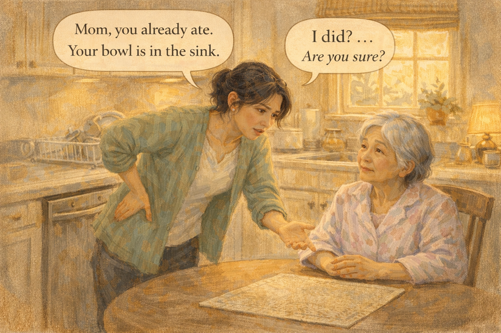 -->

Image Prompt

Please generate a 16:9 image in warm contemporary realism showing Hana leaning over the kitchen table, one hand on her hip, the other gesturing toward the sink. Her face is explaining, a little tense. Yoko sits with her hands folded, looking up with confused, slightly embarrassed eyes. The color palette is pale peach, soft gray-green, and honey wood tones. The emotional tone is well-meaning but wrong — a daughter correcting a mother, not yet understanding the cost. Speech bubble from Hana: "Mom, you already ate. Your bowl is in the sink." Speech bubble from Yoko: "I did? ...Are you sure?" Generate the image immediately without asking clarifying questions.

"Mom, you already ate," Hana said. "Your bowl is in the sink, see?" She gestured at it. Her mother looked at the sink. Her mother looked at the placemat. Her mother said, quietly, "I did? Are you sure?" And Hana, who had been a pharmacist for seventeen years and prided herself on accuracy, said, "I'm sure, Mom. About an hour ago." She thought she was being helpful. She was wrong.

## Panel 3 – The Look

<!-- 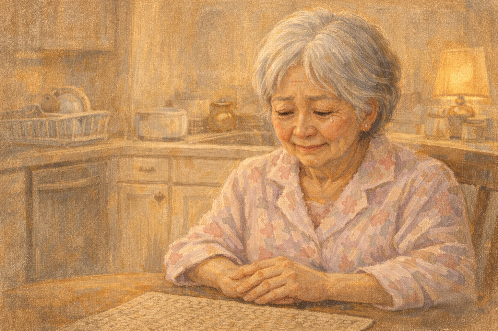 -->

Image Prompt

Please generate a 16:9 image in warm contemporary realism showing a close-up of Yoko at the kitchen table, alone in the frame. Her hands are still folded, but her eyes are looking down at the placemat, her mouth tight. She is making a small, polite, mortified smile. A small tear glints in the corner of one eye. The color palette is soft pale pink, dusty rose, and gentle cream. The emotional tone is quiet shame and loss — the look of someone who has just been reminded she is failing. No speech bubbles. Generate the image immediately without asking clarifying questions.

Hana watched her mother's face change. It was not anger. It was not defiance. It was the small, polite, mortified smile of a woman who had raised two daughters and thirty years of hospital volunteers and who now could not remember if she had eaten her own breakfast. A tear sat in the corner of Yoko's eye and refused, out of dignity, to fall. Hana felt her own chest tighten. She had won an argument she had not known she was having.

## Panel 4 – The Apology That Wasn't Enough

<!-- 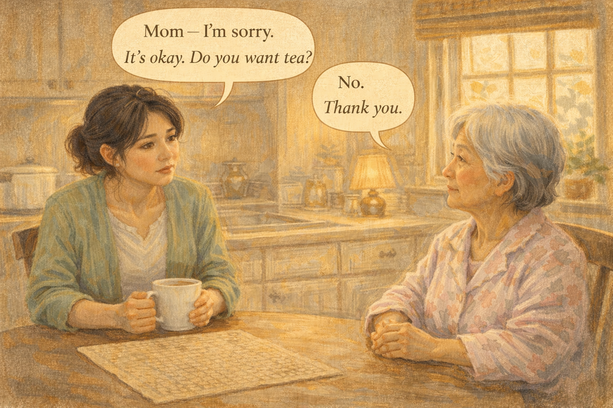 -->

Image Prompt

Please generate a 16:9 image in warm contemporary realism showing Hana sitting across from her mother at the table, leaning forward with both hands around her coffee mug. Yoko has turned slightly away, looking out the window. Hana's expression is softer now, apologetic. The color palette is warm peach, sage green, and pale gold. The emotional tone is regret and the beginning of a change. Speech bubble from Hana: "Mom — I'm sorry. It's okay. Do you want tea?" Speech bubble from Yoko (small, quiet): "No. Thank you." Generate the image immediately without asking clarifying questions.

"Mom, I'm sorry," Hana said. "It's okay. Do you want tea?" Her mother looked out the window at the maple tree. "No," she said. "Thank you." And Hana understood that her mother was not refusing tea. Her mother was refusing to be seen as someone who needed to be corrected. It was the same small, dignified "no, thank you" she had used for decades when someone at church was being condescending. Hana had become that person.

## Panel 5 – The Support Group

<!-- 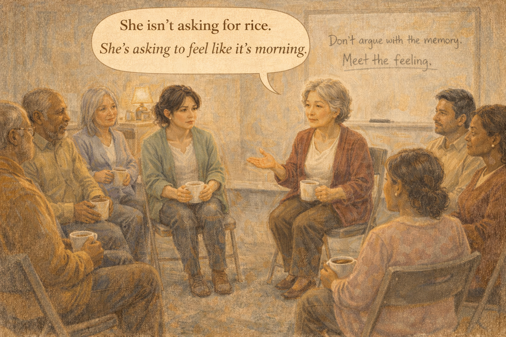 -->

Image Prompt

Please generate a 16:9 image in warm contemporary realism depicting a community center meeting room on a Wednesday evening. A circle of eight adults of various ages and ethnicities sits in folding chairs, coffee cups in hand. Hana sits in the circle, leaning forward. An older woman with a kind face, possibly a facilitator, is mid-sentence, gesturing gently. On a whiteboard behind them, handwritten in marker: "Don't argue with the memory. Meet the feeling." The color palette is warm beige, soft teal, and muted burgundy. The emotional tone is reflective and communal. Speech bubble from facilitator: "She isn't asking for rice. She's asking to feel like it's morning." Generate the image immediately without asking clarifying questions.

On Wednesday, Hana drove to a caregiver support group in the basement of a church. A woman named Eileen led it, and on the whiteboard behind her she had written, in red marker: **Don't argue with the memory. Meet the feeling.** Hana wrote it down in her phone. Eileen looked at her kindly. "She isn't asking for rice," Eileen said. "She's asking to feel like it's morning. She's asking to feel like a mother who still knows what time it is. Give her that, and the rice is almost beside the point."

## Panel 6 – Rewriting the Rule

<!-- 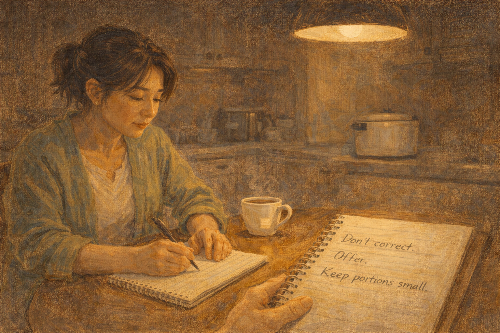 -->

Image Prompt

Please generate a 16:9 image in warm contemporary realism showing Hana seated at her kitchen table late at night under a single pendant light. She is writing in a spiral notebook. An empty rice cooker sits in the background. A cup of tea steams beside her. The page of the notebook is visible, with three short handwritten lines: "Don't correct. Offer. Keep portions small." The color palette is warm amber, deep brown, and ivory. The emotional tone is quiet, thoughtful, almost reverent — a caregiver rewriting her own rulebook. No speech bubbles. Generate the image immediately without asking clarifying questions.

That night Hana sat at the kitchen table with a notebook and wrote three lines. "Don't correct. Offer. Keep portions small." She stared at them. She was a pharmacist. She believed in truth. She had argued, briefly, with Eileen in her own head about whether this counted as lying. And then she thought of her mother's face that morning, and she understood that the lie was not the second bowl of rice. The lie was pretending the first bowl could protect her mother from the fear of a missing hour.

## Panel 7 – Small Portions

<!-- 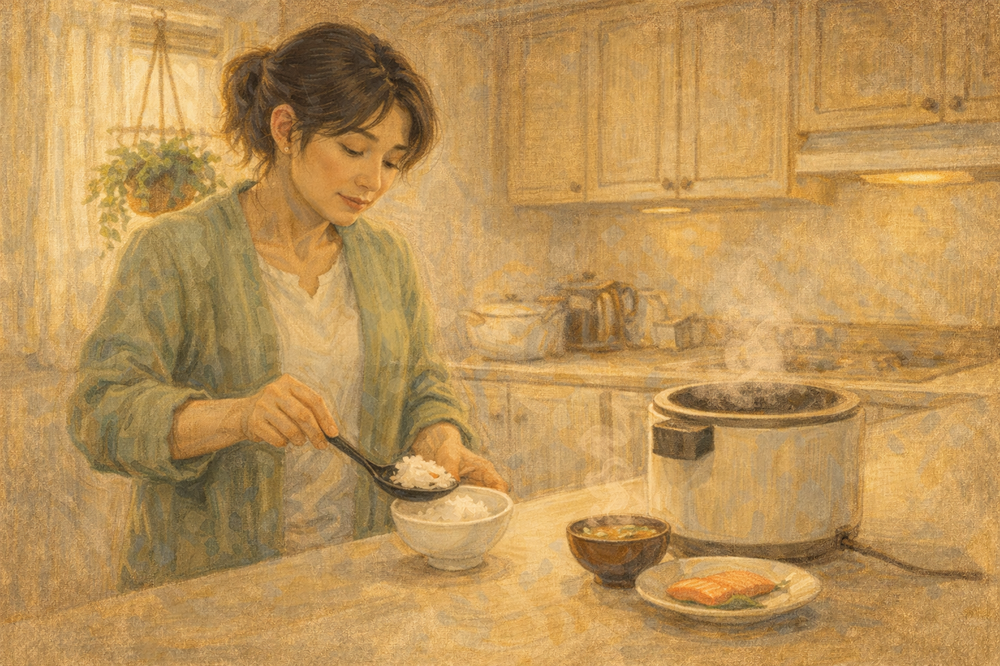 -->

Image Prompt

Please generate a 16:9 image in warm contemporary realism showing Hana at the kitchen counter the next morning, carefully ladling a very small portion of rice — perhaps one-third of a normal serving — into a small ceramic bowl. Beside her on the counter, a small piece of salmon on a plate, a tiny bowl of miso soup. Everything is deliberately small. The color palette is warm cream, soft salmon pink, pale green, and honey. The emotional tone is careful love. No speech bubbles. Generate the image immediately without asking clarifying questions.

Thursday morning, Hana made breakfast smaller. A third of a cup of rice. Two small bites of salmon. A teacup of miso soup. Not because her mother wouldn't finish a full portion — she always did — but because Hana had learned that her mother would, in an hour, ask for breakfast again, and Hana wanted the second breakfast to be possible without making her mother sick. Small portions were not stingy. Small portions were preparation.

## Panel 8 – The Second Ask

<!-- 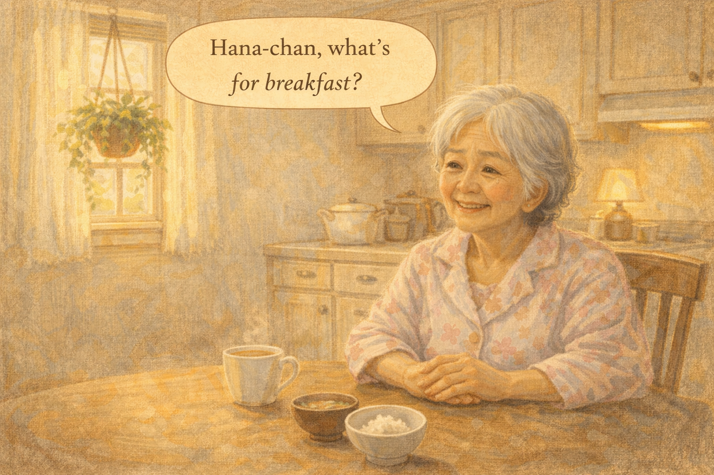 -->

Image Prompt

Please generate a 16:9 image in warm contemporary realism showing Yoko at the table, hands folded, looking expectantly at her daughter. The table is clean. An hour has passed since the first breakfast. Morning light is a little higher now. The color palette is honey, cream, and soft bamboo green. The emotional tone is gentle expectation. Speech bubble from Yoko (bright, unembarrassed): "Hana-chan, what's for breakfast?" Generate the image immediately without asking clarifying questions.

An hour later her mother said, brightly, "Hana-chan, what's for breakfast?" Hana did not look at the sink. She did not say, "You already ate." She did not correct a single thing. She smiled at her mother the way her mother had smiled at her a thousand times over cereal, and she said, "Rice and salmon today, Mom. I'll bring you some." And her mother, relieved and proud, said, "That sounds lovely."

## Panel 9 – The Second Bowl

<!-- 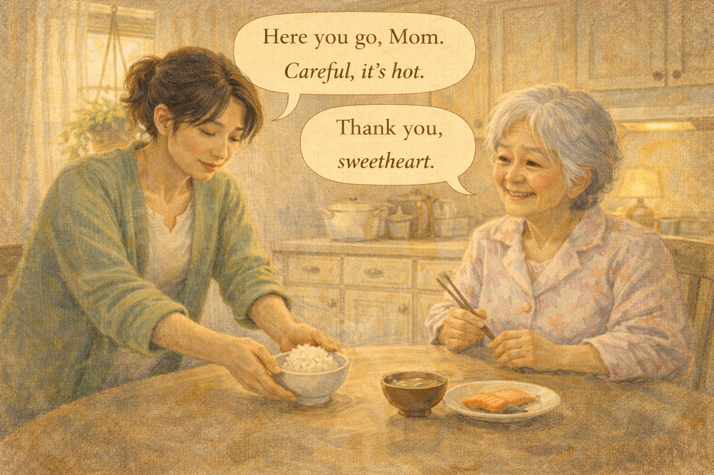 -->

Image Prompt

Please generate a 16:9 image in warm contemporary realism showing Hana setting a small bowl of rice down in front of her mother with both hands. Yoko is smiling, bright and alive, holding her chopsticks ready. The morning window behind her glows. The color palette is warm cream, honey, gentle green, and butter yellow. The emotional tone is deeply peaceful — the ordinary grace of being fed by someone who loves you. Speech bubble from Hana (warm, steady): "Here you go, Mom. Careful, it's hot." Speech bubble from Yoko: "Thank you, sweetheart." Generate the image immediately without asking clarifying questions.

Hana set a small bowl of rice in front of her mother. A small piece of salmon. A sip of miso. Her mother picked up the chopsticks and said, "Thank you, sweetheart." It was exactly what her mother had always said. It was the same sentence Hana had heard in 1988 and 1995 and 2010, across a thousand bowls of rice. It had not changed. The bowl in front of her was the second of the morning. It was also the first, for her mother, which was the only morning that mattered.

## Panel 10 – Not a Lie, a Kindness

<!-- 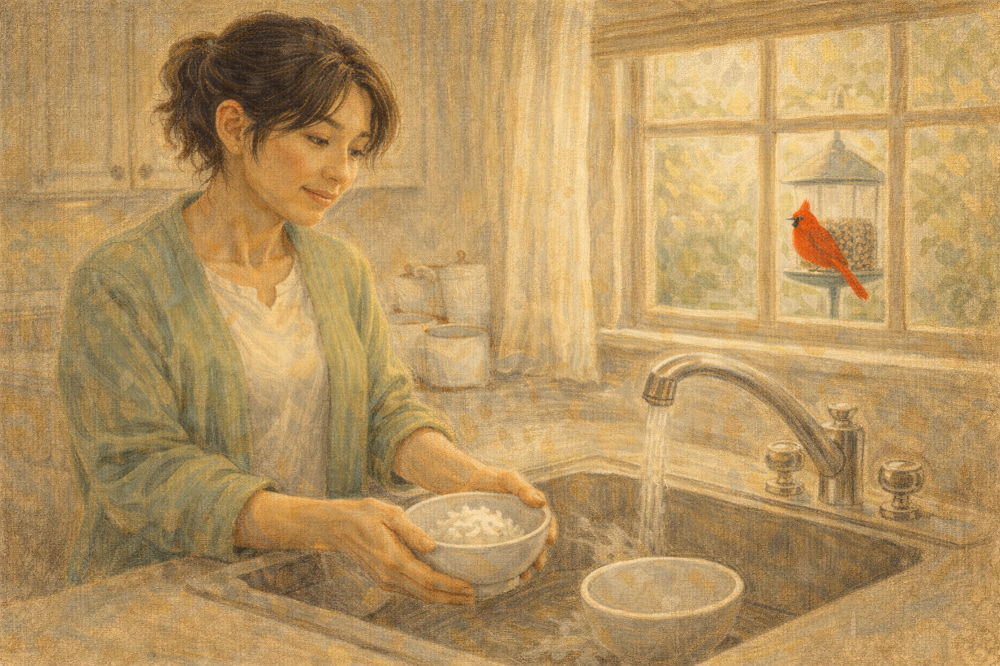 -->

Image Prompt

Please generate a 16:9 image in warm contemporary realism showing Hana standing at the sink, washing the two breakfast bowls side by side. A morning cardinal sits on the bird feeder outside the window. Hana's face is calm, thoughtful, slightly smiling. The color palette is soft teal, warm cream, and a bright flash of cardinal red. The emotional tone is resolved and gentle. No speech bubbles. Generate the image immediately without asking clarifying questions.

Hana washed two small bowls side by side at the sink. She watched the cardinal at the feeder. She thought, a pharmacist thinks, about the correct word for what she had just done. It was not a lie. A lie costs someone something. What she had done had cost her mother nothing and had given her mother a good morning. The old rule — always tell the truth — had been written for a world in which truth was the thing that helped. That world was not this kitchen.

## Panel 11 – When to Tell the Truth

<!-- 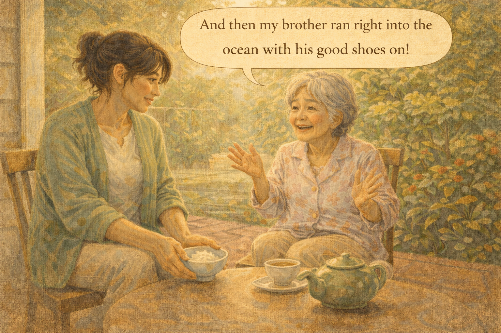 -->

Image Prompt

Please generate a 16:9 image in warm contemporary realism depicting Hana and her mother sitting together on a small back porch in the afternoon. A pot of tea is between them. Hana is listening, her mother is talking animatedly with both hands about something from her childhood in Hawaii. The color palette is late afternoon gold, deep green of garden plants, and soft terra-cotta from the porch tile. The emotional tone is connection — the truth that still works. Speech bubble from Yoko: "And then my brother ran right into the ocean with his good shoes on!" Generate the image immediately without asking clarifying questions.

On Thursday afternoon, over tea on the porch, her mother told a story about her brother and the ocean and a pair of good shoes, a story Hana had heard forty times. Hana did not correct any of the details. She did not say, "Mom, it was the sandals, not the good shoes." She listened. She laughed where her mother laughed. This, too, was a kind of truth — the truth that her mother was still a person with a past and a voice. Correcting would have stolen that. So Hana did not correct.

## Panel 12 – The Text to Her Sister

<!-- 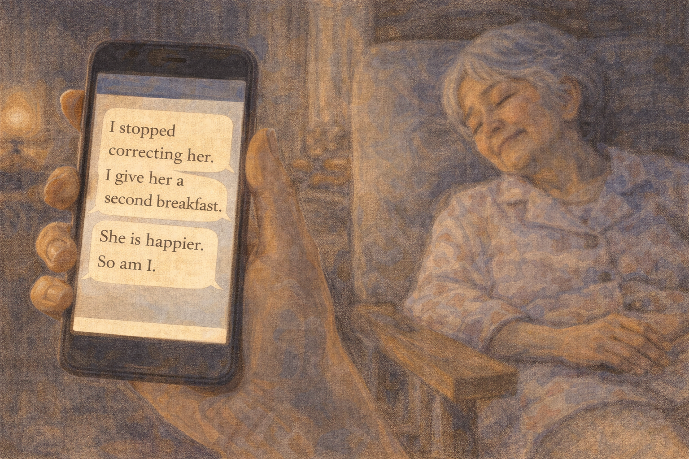 -->

Image Prompt

Please generate a 16:9 image in warm contemporary realism showing a close-up of a phone screen in Hana's hand, a text conversation visible. Above the phone, blurred in soft focus, is Yoko sleeping peacefully in a chair. The color palette is warm indigo evening, cream, and a soft glow from the phone screen. The emotional tone is resolved, quiet, and wise. Visible text on phone: "I stopped correcting her. I give her a second breakfast. She is happier. So am I." Generate the image immediately without asking clarifying questions.

That evening, while her mother dozed in the armchair, Hana texted her sister in Portland. "I stopped correcting her," she wrote. "I give her a second breakfast. She is happier. So am I." Her sister wrote back: "You finally figured it out." Hana put the phone down and watched her mother sleep, and she thought about all the corrections she had made in her life, and she understood, for the first time, that being right and being kind were sometimes different countries.

### Epilogue – What Hana Learned

| Challenge | How Hana Responded | Lesson for Caregivers |
|-----------|--------------------|-----------------------|
| Mother asked for breakfast twice | First corrected her; made her ashamed | Correcting memory feels like truth but lands like punishment |
| Second ask felt like a lie to honor | Reframed it: the ask was for comfort, not calories | Meet the feeling, not the fact |
| Worried about overfeeding | Made breakfast smaller so a second one was safe | Small portions leave room for a second round |
| Tempted to say "you already ate" | Said instead, "Rice today, Mom. I'll bring you some." | You can be honest without being correcting |
| Felt guilty for not telling the truth | Learned truth-for-its-own-sake can wound | Truth is a tool; use it when it helps, set it down when it hurts |
| Felt alone in the decision | Joined a caregiver support group | Other caregivers have walked this exact path — go find them |

### A Note to Readers

When someone with dementia asks for something they have already had — breakfast, a coat, a conversation — try this: **don't correct, just offer**. Keep portions small so you can safely offer again. Agree with the feeling underneath the question. Your loved one isn't testing you, and they aren't lying to you. They're asking to feel normal, and you can give them that with a small bowl of rice and a warm voice.

If this feels like lying, remember: telling a frightened person "you already ate" does not restore their memory. It only reminds them they are losing one. The Alzheimer's Association 24/7 Helpline (**1-800-272-3900**) can help you think through "therapeutic fibs" and when they are an act of love.

---

*"I used to think being right was the same thing as being good. My mother's memory loss taught me those are two different things."*
—Hana, caregiver

*"Meet the feeling. The facts will forgive you."*
—Dementia support group facilitator

*"A second bowl of rice is not a lie. It is breakfast, offered twice, because someone you love is hungry twice."*
—Caregiver's notebook

---

## References

1. [Communicating with a Person with Dementia – Alzheimer's Association](https://www.alz.org/help-support/caregiving/daily-care/communications) - Evidence-based guidance on communication, including when to avoid correction.
2. [Therapeutic Lying in Dementia Care – Wikipedia](https://en.wikipedia.org/wiki/Validation_therapy) - Background on validation therapy and the ethics of "therapeutic fibs."
3. [Alzheimer's Caregiving: Changes in Communication Skills – National Institute on Aging](https://www.nia.nih.gov/health/alzheimers-changes-behavior-and-communication/alzheimers-caregiving-changes-communication) - Federal caregiver guidance on language and memory loss.
4. [Eating and Nutrition – Alzheimer's Association](https://www.alz.org/help-support/caregiving/daily-care/food-eating) - Practical approaches to meals and overeating in dementia.
5. [Validation Therapy – Naomi Feil](https://en.wikipedia.org/wiki/Naomi_Feil) - Origin of the validation approach to dementia communication.
