# The Small Orange Pill

*A hand on the slope, not a cure*

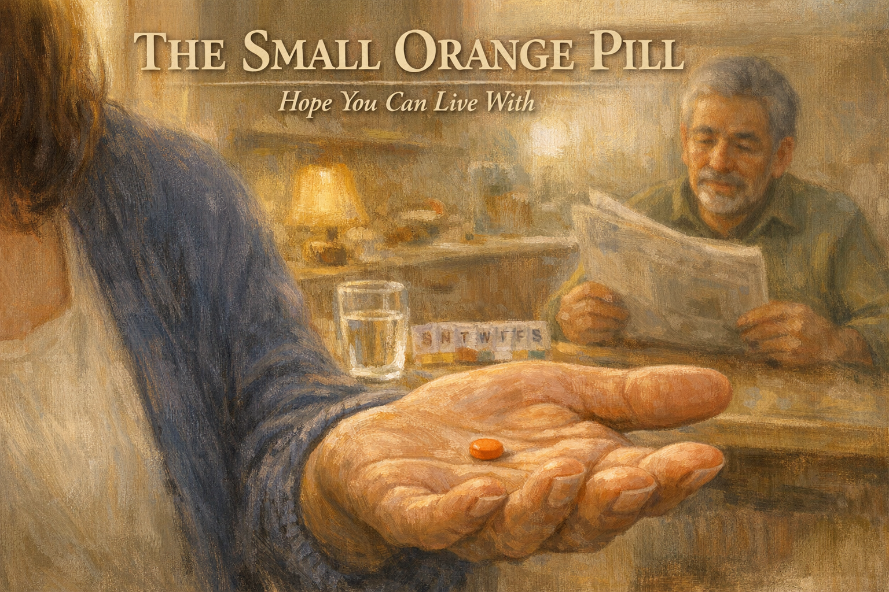

Cover Image Prompt

Please generate a 16:9 cover image in warm painterly American contemporary realism — soft oil-painting brushwork with visible but refined strokes; muted warm palette of sage green, dusty lavender, cream, honey gold, rose pink, and walnut brown; warm golden afternoon window light as the key and honey-gold interior lamp glow as fill; soft low-contrast shadows; fabric textures (knit, flannel, cotton, lace) clearly visible; in the Rockwell-and-Kinkade tradition of tender domestic illustration. No saturated primaries, no neon, no photorealism, no vector flatness, no film grain, no chromatic aberration. Night scenes keep the same warm vocabulary — indigo and deep walnut in place of saturated cool blue, with honey-gold porch or lamp light as warm accent.

**Title treatment (top ~15% of frame):** Across the top of the image, centered horizontally, render the main title "THE SMALL ORANGE PILL" in a warm ivory/cream humanist serif — the kind of hand-set lettering you would see on a classic illustrated-novel cover — with a soft painterly drop-shadow so the text integrates into the scene below, never a hard graphic bar. Directly beneath the title, in a smaller italic of the same serif, render the subtitle "Hope You Can Live With". The lettering should feel as if the painter lettered it themselves, in the same brush vocabulary as the painting.

**Scene:** An extreme close-up of a small round orange pill (about the size of an aspirin) resting in the center of an open palm. The palm belongs to Elena, 52, a warm tan-skinned Latina woman with shoulder-length dark hair, a gentle worried expression, wearing a soft navy cardigan over a cream shell. Her hand is steady, fingers slightly curled. In the soft out-of-focus background: a sunlit kitchen counter, a glass of water, a pill organizer with days-of-the-week labels, and further back, Mateo, 69, Elena's husband — warm tan skin, salt-and-pepper hair, kind eyes, a soft olive long-sleeve shirt — sitting at the kitchen table reading a newspaper, blurred. Morning light streams in from a window.

**Emotional tone:** tender hope that knows its limits.

Generate the image immediately without asking clarifying questions.

## Narrative Prompt

This is a fictional composite story built from the experience of thousands of spouses caring for a partner with Alzheimer's disease. Elena and Mateo are invented characters, but every moment here — the online research at 3 AM, the weeks of watching for any change, the grief of a name still forgotten, the gentle conversation with the doctor — is drawn from the real journey of starting a dementia medication. The story teaches one clear skill: how to set honest, hopeful expectations for what current medications can and cannot do. Art style: contemporary photorealistic illustration, warm intimate domestic tone, present-day American home.

## Prologue

The first dementia medication almost always comes as a small pill in a small bottle. It does not stop the disease. It does not reverse it. But for many people it does something that looks, from the outside, like a gentle hand on a sliding door — holding the door open just a little longer than it would have stayed open on its own. Hope, in this stage, is a quiet thing. You have to learn to see it without mistaking it for a cure. This is the story of how one wife learned to live with hope the right size.

---

## Panel 1: The Prescription Bottle

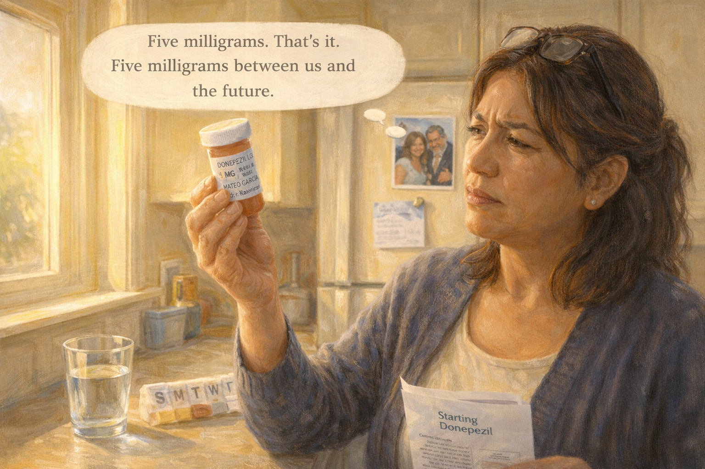

Image Prompt

(This is panel 1. Do not put the panel number in the image.)

Contemporary photorealistic illustration, 16:9 wide-landscape format. A small kitchen countertop scene. **Elena** (52, warm tan skin, shoulder-length dark hair pulled loosely back, glasses pushed up on her head, navy cardigan) stands at her kitchen island holding a small white **prescription bottle** up to the window light, squinting at the label. The label reads, in clear text: *"DONEPEZIL 5 MG / Take one tablet by mouth nightly / MATEO GARCIA / Dr. Ramirez."* Beside her on the counter: a glass of water, a seven-day pill organizer, a doctor's information pamphlet titled *"Starting Donepezil."* On the fridge behind her, a magnet-held photo of Elena and Mateo on their 30th anniversary. Morning light pours through the window. Color palette: warm buttery yellows, cream walls, the soft white of the pill bottle, the bright blue of the glass of water. Emotional tone: a small object, a big moment.

**Speech bubble 1** — tail pointing to **Elena**, positioned above her as a quiet thought: "Five milligrams. That's it. Five milligrams between us and the future."

Generate the image immediately without asking clarifying questions.

**Narrative:** The prescription arrived in a plain white bottle from the pharmacy. *Donepezil, 5 mg, take one tablet nightly.* Elena stood at the kitchen counter and held it up to the window light. It did not look like much. Thirty small pale pills in a bottle the size of a child's fist. Yet this small bottle carried the whole weight of everything she had read online for weeks, and everything she had been afraid to hope for. Five milligrams, she thought. That's it. Five milligrams between us and the future.

---

## Panel 2: The Google Spiral

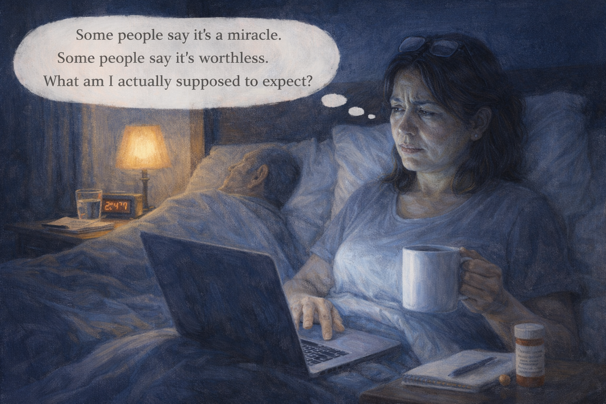

Image Prompt

(This is panel 2. Do not put the panel number in the image.)

Contemporary photorealistic illustration, 16:9 wide-landscape format. A bedroom at 2:47 AM (clock on the nightstand visible). **Elena** sits propped up in bed against pillows in a soft gray T-shirt, laptop on her lap, the cool blue-white screen lighting her face from below. Dark circles under her eyes. On her laptop screen: multiple browser tabs visible along the top with labels like *"donepezil reviews,"* *"does donepezil really work,"* *"miracle cure Alzheimer's,"* *"side effects donepezil nightmares,"* *"Alzheimer's Association."* One hand is on the mouse pad; the other holds a mug of tea that has gone cold. **Mateo** sleeps beside her, turned away, a peaceful silhouette under the covers. On her nightstand: a glass of water, a notebook, the small orange pill bottle. Color palette: the deep indigo of the bedroom, the cold blue glow of the screen, the warm amber of a small lamp. Emotional tone: the dangerous rabbit hole of love and 3 AM.

**Speech bubble 1** — tail pointing to **Elena** (in bed with laptop), positioned above her as a frantic thought bubble: "Some people say it's a miracle. Some people say it's worthless. What am I actually supposed to expect?"

Generate the image immediately without asking clarifying questions.

**Narrative:** That night, Elena did what almost every spouse of a newly-diagnosed person does. She stayed up reading. At 2:47 AM she had eleven browser tabs open. One website promised that donepezil had restored a patient's memory completely. Another website said it was an expensive placebo that ruined people's stomachs. A Reddit thread had a six-hundred-comment argument about whether the side effects were worth it. She closed the laptop at 3:30, not wiser — only more exhausted. Her tea had gone cold an hour ago. Her husband slept quietly beside her, unaware that she was fighting shadows in the dark.

---

## Panel 3: The First Dose

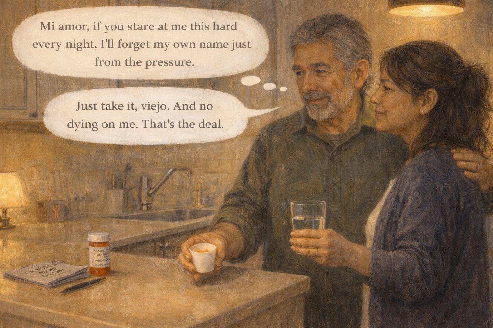

Image Prompt

(This is panel 3. Do not put the panel number in the image.)

Contemporary photorealistic illustration, 16:9 wide-landscape format. Kitchen scene, evening, around 8:30 PM. **Mateo** (69, warm tan skin, kind eyes, salt-and-pepper hair, olive long-sleeve shirt, a gentle smile) stands at the kitchen sink with a small paper cup in one hand (containing a single pale orange pill) and a glass of water in the other. **Elena** stands beside him, one hand lightly on his back, looking at him with a mix of love and watchful attention — studying his face as if for a sign. **Mateo** meets her eyes with a wry, warm, slightly amused expression. On the counter: the pill bottle, a small notepad labeled "NOTES ON MATEO." A pendant light overhead casts a soft pool of warmth. Color palette: warm ambers of kitchen light, the cream of the cabinets, soft navy of Elena's cardigan. Emotional tone: a small ceremony, love under the lamp.

**Speech bubble 1** — tail pointing to **Mateo**, positioned above him, gently teasing: "Mi amor, if you stare at me this hard every night, I'll forget my own name just from the pressure."

**Speech bubble 2** — tail pointing to **Elena**, positioned above her, smiling despite herself: "Just take it, viejo. And no dying on me. That's the deal."

Generate the image immediately without asking clarifying questions.

**Narrative:** That first evening, Elena stood beside Mateo at the kitchen sink while he took the pill. She watched him the way new parents watch a baby's chest to make sure it is still moving. Mateo caught her eye and laughed softly. "Mi amor, if you stare at me this hard every night, I'll forget my own name just from the pressure." Elena laughed too, a real laugh for the first time in a week. She kissed his shoulder. On her notepad, labeled "Notes on Mateo," she wrote the date and the words *"dose 1 – no side effects yet."* She felt, for the first time since the diagnosis, that she was *doing* something.

---

## Panel 4: The Queasy Week

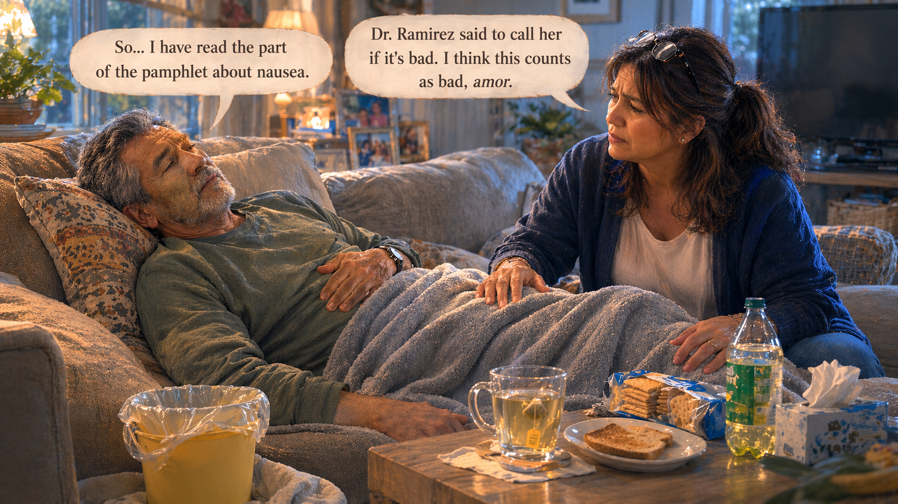

Image Prompt

(This is panel 4. Do not put the panel number in the image.)

Contemporary photorealistic illustration, 16:9 wide-landscape format. **Mateo** is lying on the living-room sofa with a soft gray throw blanket over his legs, a slight green-gray tint to his complexion, one hand pressed gently to his stomach. A small yellow bucket with a plastic bag lining it sits on the floor beside him (an unsentimental real-life detail of nausea). On the coffee table: a mug of chamomile tea, a package of saltine crackers, a half-eaten piece of dry toast, a bottle of ginger-ale-style soda. **Elena** sits on the edge of the sofa beside his feet, her hand gently resting on his shin through the blanket. Her face is concerned, a little frightened. The TV in the background is off. Color palette: muted blue-grays of afternoon, warm beige of the sofa, a slightly green undertone on Mateo's skin to suggest nausea. Emotional tone: the hard reality of side effects.

**Speech bubble 1** — tail pointing to **Mateo**, positioned above him, weak and wry: "So... I have read the part of the pamphlet about nausea."

**Speech bubble 2** — tail pointing to **Elena**, positioned above her, concerned: "Dr. Ramirez said to call her if it's bad. I think this counts as bad, amor."

Generate the image immediately without asking clarifying questions.

**Narrative:** The first week was hard. Donepezil commonly causes nausea, and Mateo got it. He could not keep his morning coffee down. He lay on the sofa under a blanket looking a little green. Elena kept close. She called Dr. Ramirez's office, and the nurse told her that this was expected and usually passed; she could give Mateo the pill at night rather than in the morning and have him take it with a small amount of food. They switched. Within another few days, the nausea eased. But the week reminded Elena that medicine is never free. Hope had a price.

---

## Panel 5: The First Week Complete

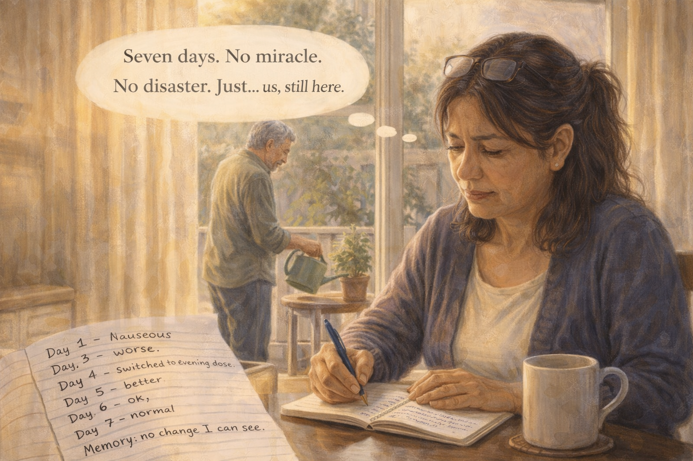

Image Prompt

(This is panel 5. Do not put the panel number in the image.)

Contemporary photorealistic illustration, 16:9 wide-landscape format. Kitchen scene, Sunday morning, one week after panel 3. **Elena** sits at the kitchen table with a small notebook open in front of her, a coffee mug at her elbow, a pen in hand. On the notebook page she has written entries — Day 1 through Day 7 — with short observations: *"Day 2 – nauseous. Day 3 – worse. Day 4 – switched to evening dose. Day 5 – better. Day 6 – ok. Day 7 – normal."* At the bottom of the page: *"Memory: no change I can see."* **Mateo** is visible in the background at the sliding-glass door watering a small potted herb on the patio, back in good color. Color palette: warm morning golds, soft creams, the subtle green of the patio plants. Emotional tone: the quiet discipline of watching and recording.

**Speech bubble 1** — tail pointing to **Elena** (at table with notebook), positioned above her as a gentle thought bubble: "Seven days. No miracle. No disaster. Just... us, still here."

Generate the image immediately without asking clarifying questions.

**Narrative:** By the end of the first week, Mateo's nausea had passed and his appetite returned. Elena kept her "Notes on Mateo" notebook every day. *Day 5 – better. Day 6 – ok. Day 7 – normal.* At the bottom of the page she wrote: *"Memory: no change I can see."* Of course there was no change. One week of a medication that works slowly, over months, does not produce a change that a wife can see across a kitchen. But she had expected to feel it anyway. She realized, looking at her own handwriting, that she had been secretly hoping for a miracle. She closed the notebook gently and went to water the mint with her husband.

---

## Panel 6: The Birthday Dinner

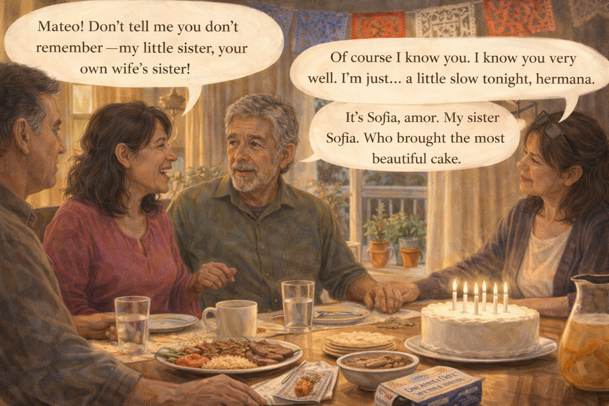

Image Prompt

(This is panel 6. Do not put the panel number in the image.)

Contemporary photorealistic illustration, 16:9 wide-landscape format. A warm family dinner scene. A dining room table set nicely — a platter of carne asada, a bowl of rice and beans, a small stack of warm tortillas, a pitcher of agua fresca, a simple cake with candles waiting to be lit. Around the table: Elena, Mateo, Elena's sister **Sofia** (50s, similar features, bright pink blouse), Sofia's husband, and a teenage nephew. Everyone is mid-conversation. **Mateo** is smiling kindly across the table at Sofia, but a small hesitation is visible in his expression — his mouth slightly open as if reaching for a word. **Elena** (next to Mateo) watches him with a careful, helpful attention. The candles on the cake are unlit yet. A strand of Papel picado hangs across the top of the frame. Color palette: warm ambers, festive reds and blues of the picado, the bright greens and oranges of the food. Emotional tone: joy with a small shadow.

**Speech bubble 1** — tail pointing to **Sofia** (across the table), positioned above her, warm and unaware: "Mateo! Don't tell me you don't remember — my little sister, your own wife's sister!"

**Speech bubble 2** — tail pointing to **Mateo**, positioned above him, grasping: "Of course I know you. I know you very well. I'm just... a little slow tonight, hermana."

**Speech bubble 3** — tail pointing to **Elena**, positioned above her, smoothing gently: "It's Sofia, amor. My sister Sofia. Who brought the most beautiful cake."

Generate the image immediately without asking clarifying questions.

**Narrative:** Three weeks in, Elena's sister Sofia came for dinner. Mateo had known Sofia for thirty years. Halfway through the meal, when Sofia reached across the table for the agua fresca, Mateo looked at her for one long half-second as if searching for her name. He covered beautifully. "I'm just a little slow tonight, hermana." Elena smoothed the moment. Later, in bed, she cried quietly for thirty seconds and then turned on her pillow and went to sleep. Three weeks of donepezil, and Mateo had still almost forgotten her sister's name. Miracles, she was learning, were not what medicine did.

---

## Panel 7: The Doctor's Office — Setting Expectations

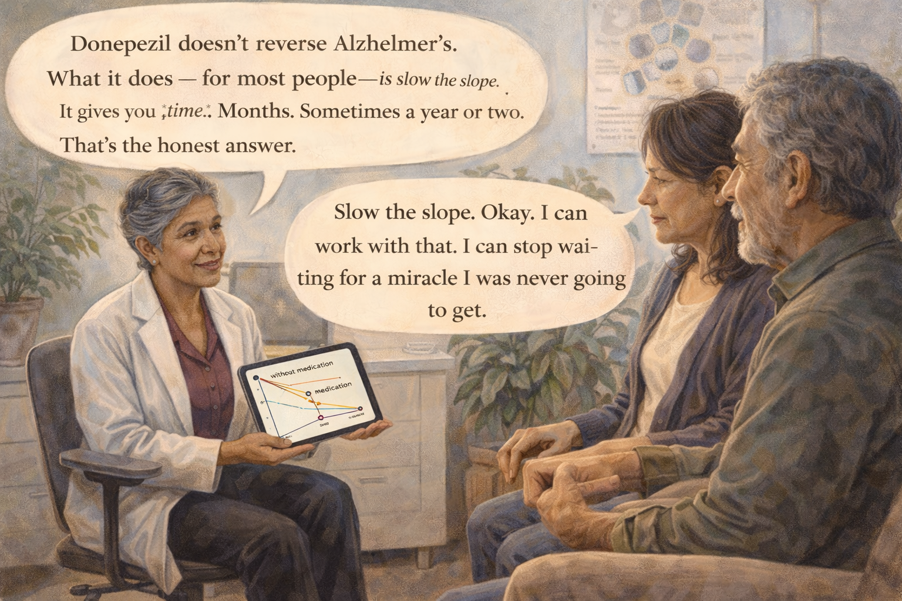

Image Prompt

(This is panel 7. Do not put the panel number in the image.)

Contemporary photorealistic illustration, 16:9 wide-landscape format. A neurologist's small bright office. **Dr. Ramirez** (50s, warm brown-skinned Latina, short silver-streaked hair, a white coat over a burgundy blouse, warm kind face) sits on a rolling stool facing the couple. **Mateo** and **Elena** sit side by side on two comfortable chairs. On Dr. Ramirez's tablet screen, turned so they can see it: a simple line graph showing two lines — one steeper line labeled *"without medication,"* one gentler line labeled *"with medication,"* both trending downward over time but the second clearly gentler. The graph is stylized and easy to read. On the wall: a diagram of neurotransmitters. A potted plant. Color palette: soft blues and warm creams, the clean white of the tablet, the gentle red of the graph line. Emotional tone: a kind doctor reframing hope.

**Speech bubble 1** — tail pointing to **Dr. Ramirez**, positioned above her, warm and clear: "Donepezil doesn't reverse Alzheimer's. What it does — for most people — is slow the slope. It gives you *time.* Months. Sometimes a year or two. That's the honest answer."

**Speech bubble 2** — tail pointing to **Elena**, positioned above her, quiet and processing: "Slow the slope. Okay. I can work with that. I can stop waiting for a miracle I was never going to get."

Generate the image immediately without asking clarifying questions.

**Narrative:** At the one-month follow-up, Elena did something she had not done before. She asked, plainly, "Doctor, what am I actually supposed to expect from this medicine?" Dr. Ramirez smiled and turned her tablet so they could both see. She drew a simple graph — a slope, going down. Then a gentler slope, going down less steeply. "Donepezil doesn't reverse the disease," she said. "What it does — for most people — is slow the slope. A few months. Sometimes a year or two of time you might not otherwise have had." Elena nodded slowly. "Slow the slope. Okay. I can work with that."

---

## Panel 8: The Reframe

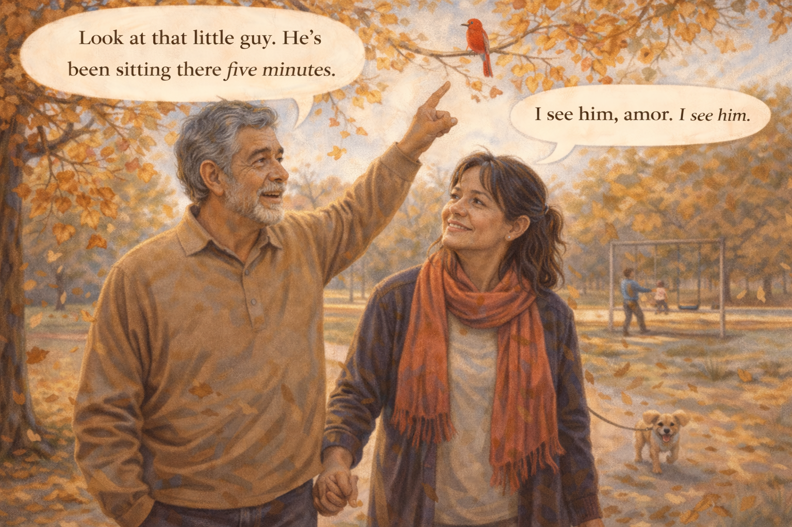

Image Prompt

(This is panel 8. Do not put the panel number in the image.)

Contemporary photorealistic illustration, 16:9 wide-landscape format. **Elena** and **Mateo** walk together in a small neighborhood park on a Sunday afternoon. They are holding hands. Mateo is in a soft tan sweater; Elena is in a warm coral scarf. Autumn leaves drift around them. A small dog on a leash trots happily ahead on a walk with an unseen owner. In the distance, a young father pushes a child on a swing. **Elena's** expression is different than in earlier panels — less pinched, more present. Her eyes are on her husband's face, not on the future. **Mateo** is relaxed, pointing out something in a tree — a red cardinal. Color palette: warm autumn golds and reds, soft blue sky, a single pop of scarlet from the cardinal and Elena's scarf. Emotional tone: the afternoon of a person who has decided to live in the afternoon.

**Speech bubble 1** — tail pointing to **Mateo**, positioned above him, pointing up: "Look at that little guy. He's been sitting there five minutes."

**Speech bubble 2** — tail pointing to **Elena**, positioned above her, soft: "I see him, amor. I see him."

Generate the image immediately without asking clarifying questions.

**Narrative:** On the drive home from that appointment, Elena stopped looking at Mateo the way one looks at a patient. She started looking at him the way she had looked at him for thirty-three years. They went for a walk in the park. Mateo pointed out a red cardinal on a low branch. Elena saw her husband, not a diagnosis. The medication was doing its slow invisible work in the background — a gentle hand on the slope. Her job, she realized, was not to measure its effect hour by hour. Her job was to live beside this man inside the time it was buying them.

---

## Panel 9: The Dose Increase

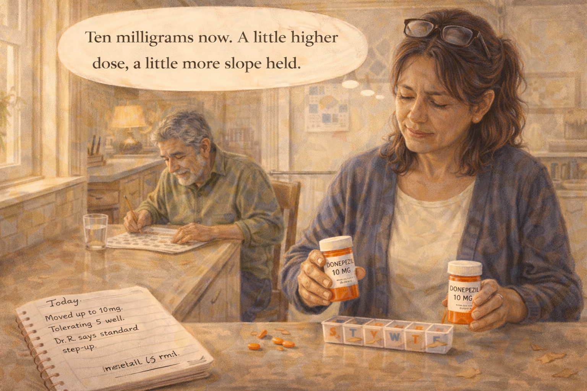

Image Prompt

(This is panel 9. Do not put the panel number in the image.)

Contemporary photorealistic illustration, 16:9 wide-landscape format. Kitchen scene, six weeks later. **Elena** is filling the pill organizer on the counter. The small pills are now a slightly larger, deeper orange color. She has the new bottle labeled "DONEPEZIL 10 MG" in one hand, the old bottle labeled "DONEPEZIL 5 MG" set aside. On her notebook beside her: a page dated today with the entry *"Moved up to 10mg. Tolerating 5 well. Dr. R says standard step-up."* **Mateo** is at the kitchen table in the background with a crossword puzzle, pencil in hand, concentrating peacefully. Morning light through the window. Color palette: clear warm yellows, cream, a deeper orange pop from the new pill bottle. Emotional tone: calm routine, hope at a steady temperature.

**Speech bubble 1** — tail pointing to **Elena** (at counter), positioned above her as a thought: "Ten milligrams now. A little higher dose, a little more slope held."

Generate the image immediately without asking clarifying questions.

**Narrative:** At the six-week follow-up, Dr. Ramirez increased Mateo's donepezil from 5 mg to 10 mg — the standard step-up once a patient has tolerated the starting dose. The new pill was a slightly different shape, a deeper orange. Elena refilled the pill organizer on Sunday afternoons now, a small gentle ritual she did while humming to an old album Mateo loved. The medicine was not dramatic. It was simply part of their week, the way vitamins might have been, or the evening decaf. Hope, she was learning, looked like a refilled pill organizer on a Sunday afternoon.

---

## Panel 10: The Crossword at Breakfast

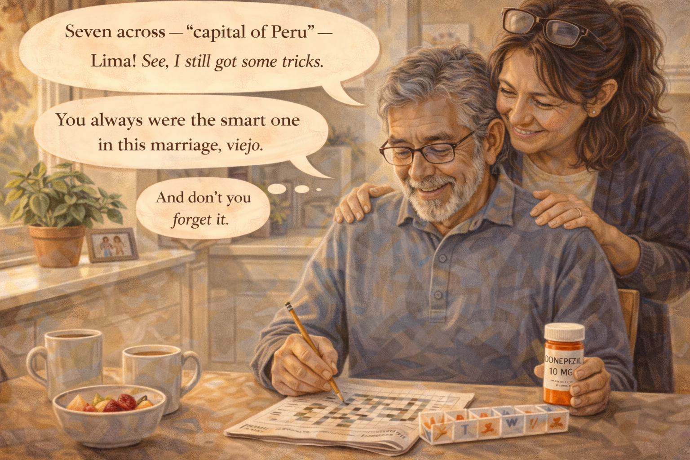

Image Prompt

(This is panel 10. Do not put the panel number in the image.)

Contemporary photorealistic illustration, 16:9 wide-landscape format. Bright breakfast scene. **Mateo** at the kitchen table in a soft blue sweater, glasses on, pencil in hand, concentrating on a newspaper crossword with a smile of focused pleasure. **Elena** leans over his shoulder from behind, one hand resting on his shoulder, looking at the puzzle with him. A small bowl of cut fruit, two mugs of coffee. On the kitchen windowsill: a potted basil plant, a small framed photo of their adult children. Color palette: warm morning golds, sage green, buttery cream. Emotional tone: an ordinary small moment, quietly precious.

**Speech bubble 1** — tail pointing to **Mateo**, positioned above him, delighted: "Seven across — 'capital of Peru' — Lima! See, I still got some tricks."

**Speech bubble 2** — tail pointing to **Elena**, positioned above her, warm: "You always were the smart one in this marriage, viejo."

**Speech bubble 3** — tail pointing to **Mateo**, small and teasing: "And don't you forget it."

Generate the image immediately without asking clarifying questions.

**Narrative:** On a Thursday morning two months in, Mateo was doing the newspaper crossword at breakfast when he got seven across on the first try. *Capital of Peru.* Lima. He beamed. "See, I still got some tricks." Elena kissed the top of his head. It was not a miracle. He had always known the capital of Peru. But the brain that knew it today had started on 10 mg of donepezil a few weeks ago, and maybe the slope was a tiny bit gentler, and maybe it wasn't, and either way, this morning, Mateo knew the answer. That was enough.

---

## Panel 11: The Hard Day

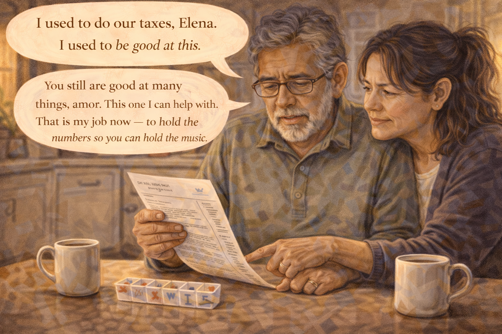

Image Prompt

(This is panel 11. Do not put the panel number in the image.)

Contemporary photorealistic illustration, 16:9 wide-landscape format. Evening scene, three months later. **Mateo** sits at the kitchen table holding a bank statement, his brow deeply furrowed, confused, the statement trembling slightly in his hand. He is trying to understand what he is reading. **Elena** is seated beside him, her chair pulled close, one hand gently over his free hand, the other pointing at a line on the statement. Her face is calm, patient, steady — a different face than she wore in panel 2 at 3 AM. A cup of tea in front of each of them. The kitchen light is warm but the mood is quieter. Color palette: warm ambers dimming into evening tones, softer and more muted. Emotional tone: the disease is still progressing, and the love is still moving with it.

**Speech bubble 1** — tail pointing to **Mateo**, positioned above him, quiet and frustrated: "I used to do our taxes, Elena. I used to be good at this."

**Speech bubble 2** — tail pointing to **Elena**, positioned above her, warm and steady: "You still are good at many things, amor. This one I can help with. That is my job now — to hold the numbers so you can hold the music."

Generate the image immediately without asking clarifying questions.

**Narrative:** Alzheimer's did not stop progressing just because a medication had joined them. Three months in, Mateo sat at the kitchen table struggling to read his own bank statement. His face grew frustrated and small. "I used to do our taxes," he said. "I used to be good at this." Elena sat beside him without rushing. "You still are good at many things, amor. This one I can help with. That is my job now — to hold the numbers so you can hold the music." Her voice did not shake. The medicine had not cured anything. But it had given them time to *arrive* at this moment gently — together, ready, not ambushed.

---

## Panel 12: Hope You Can Live With

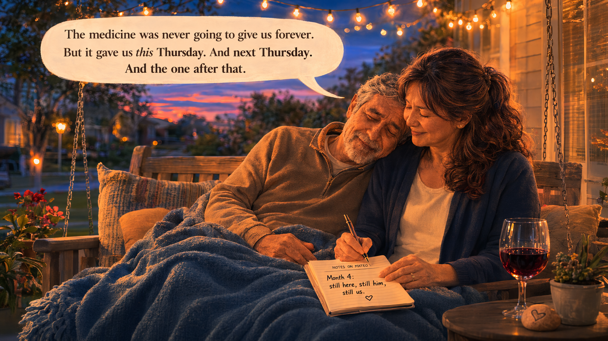

Image Prompt

(This is panel 12. Do not put the panel number in the image.)

Contemporary photorealistic illustration, 16:9 wide-landscape format. Evening porch scene. **Elena** and **Mateo** sit side-by-side on a small wooden porch swing, a soft blue blanket over both their laps. Mateo's head is gently resting on Elena's shoulder; he looks peaceful, a soft smile, eyes almost closed. Elena's free hand holds a small notebook open in her lap — the "Notes on Mateo" notebook — and she is writing one short line: *"Month 4: still here, still him, still us."* A glass of red wine on a small table beside them. A string of warm white bistro lights over the porch. The suburban yard beyond is darkening into twilight. Color palette: deep indigo sky softening to pink at the horizon, warm amber of the string lights, the soft navy of the blanket. Emotional tone: peace, love, the right size of hope.

**Speech bubble 1** — tail pointing to **Elena**, positioned above her as a gentle voiceover caption: "The medicine was never going to give us forever. But it gave us this Thursday. And next Thursday. And the one after that."

Generate the image immediately without asking clarifying questions.

**Narrative:** On an ordinary Thursday evening, Elena and Mateo sat on the front porch swing with a soft blue blanket over their laps. Mateo rested his head on her shoulder. Elena opened her "Notes on Mateo" notebook and wrote, in her careful handwriting, *Month 4: still here, still him, still us.* The small orange pill was never going to give them forever. She had stopped asking it to. What it was giving them was this Thursday — this porch, this blanket, this husband. And next Thursday. And the one after that. Hope, she had learned, was not a cure. Hope was a size. And the size she could carry was the one she could live with.

---

## Epilogue: What This Family Learned

| Challenge | Response | Lesson for Today |
|---|---|---|
| Panic-researching online at 3 AM | Stopped, and brought the questions to the doctor instead | The internet is a place for research, not for medical decisions. Bring your list to the doctor. |
| First-week nausea and side effects | Called the doctor, switched to evening dosing with food | Almost all medicines have a start-up cost. Most start-up side effects pass with small adjustments. |
| Watching for an overnight miracle | A simple notebook and honest weekly observations | Medicine for dementia works slowly. Judge it in weeks and months, not hours. |
| Feeling deceived by marketing and forums | Asked the doctor plainly: *"what am I supposed to expect?"* | Most current dementia medications *slow the slope.* They do not reverse the disease. |
| Grief when a name was almost forgotten | Accepted that progression continues and refocused on the time bought | Medication buys time. Time is what we spend on love. |
| The long tiring weight of being the spouse-caregiver | Built small daily rituals — a Sunday pill-organizer, a porch swing at night | Ritual is a caregiver's best medicine. It shapes the days the disease would otherwise steal. |

## A Note to the Reader

If your loved one has just been prescribed their first medication
for Alzheimer's or another dementia — or if you are wondering
whether to ask for one — please know:

- **Most current medications for Alzheimer's slow the slope; they do not reverse it.** The honest benefit is typically a modest slowing of symptom progression — often months, sometimes a year or two of additional function.
- **Side effects are common and usually manageable.** Nausea, vomiting, diarrhea, and vivid dreams are the most common; many resolve with small adjustments like taking the pill at night or with food.
- **Newer medications exist** for some people with early-stage Alzheimer's (such as monoclonal antibody infusions). These have their own benefits, risks, costs, and eligibility rules. Ask your doctor whether they are appropriate for your loved one.
- **The question to ask your doctor is not "will this work?" but "what am I supposed to expect?"** Plain, specific, honest answers are the ones you can plan around.

The **Alzheimer's Association 24/7 Helpline (1-800-272-3900)** can
help you understand treatment options and prepare for the next
conversation with your doctor.

## Quotes From the Story

> "Just take it, viejo. And no dying on me. That's the deal." — *Elena*

> "Slow the slope. Okay. I can work with that." — *Elena*

> "That is my job now — to hold the numbers so you can hold the music." — *Elena*

## References

1. [Wikipedia: Donepezil](https://en.wikipedia.org/wiki/Donepezil) - The most commonly prescribed cholinesterase inhibitor for Alzheimer's disease
2. [Wikipedia: Alzheimer's disease](https://en.wikipedia.org/wiki/Alzheimer%27s_disease) - Overview of the disease and treatment options
3. [Alzheimer's Association: Medications for Memory, Cognition and Dementia-Related Behaviors](https://www.alz.org/alzheimers-dementia/treatments/medications-for-memory) - Plain-language guide to current Alzheimer's medications
4. [National Institute on Aging: How Is Alzheimer's Disease Treated?](https://www.nia.nih.gov/health/alzheimers-treatment/how-alzheimers-disease-treated) - Federal overview of current treatments and their expected benefits
5. [FDA: Drug Information Portal](https://www.accessdata.fda.gov/scripts/cder/daf/) - Official prescribing information and patient guides for approved Alzheimer's medications
