# The Playlist: A Grandmother's Songs Outlive the Diagnosis

<!-- 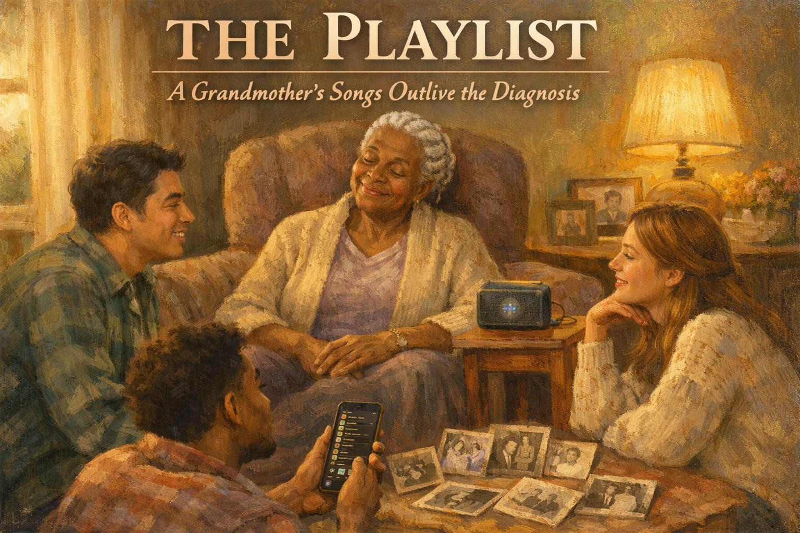 -->

Cover Image Prompt

Please generate a 16:9 cover image in warm painterly American contemporary realism — soft oil-painting brushwork with visible but refined strokes; muted warm palette of sage green, dusty lavender, cream, honey gold, rose pink, and walnut brown; warm golden afternoon window light as the key and honey-gold interior lamp glow as fill; soft low-contrast shadows; fabric textures (knit, flannel, cotton, lace) clearly visible; in the Rockwell-and-Kinkade tradition of tender domestic illustration. No saturated primaries, no neon, no photorealism, no vector flatness, no film grain, no chromatic aberration. Night scenes keep the same warm vocabulary — indigo and deep walnut in place of saturated cool blue, with honey-gold porch or lamp light as warm accent.

**Title treatment (top ~15% of frame):** Across the top of the image, centered horizontally, render the main title "THE PLAYLIST" in a warm ivory/cream humanist serif — the kind of hand-set lettering you would see on a classic illustrated-novel cover — with a soft painterly drop-shadow so the text integrates into the scene below, never a hard graphic bar. Directly beneath the title, in a smaller italic of the same serif, render the subtitle "A Grandmother's Songs Outlive the Diagnosis". The lettering should feel as if the painter lettered it themselves, in the same brush vocabulary as the painting.

**Scene:** Three adult grandchildren of varied ethnicities sit on a living room rug around their grandmother, Pearl, 82, a warm brown-skinned Black woman with white cornrows and a soft cardigan. Pearl sits in an armchair, eyes gently closed, head tilted slightly, a faint smile on her lips. A small portable speaker on a side table plays music; a grandchild holds a phone with a playlist visible. Family photos from the 1950s and 1960s are spread on the floor around them. Warm late-afternoon sunlight.

**Emotional tone:** joy through music — generations meeting each other through a song.

Generate the image immediately without asking clarifying questions.

Narrative Prompt

This is a graphic novel for family caregivers of people living with dementia. The central family are three adult grandchildren — Kayla, 28; DeShawn, 31; Maya, 26 — and their grandmother Pearl, 82, who has mid-stage Alzheimer's disease. Pearl raised these three grandchildren after their mother's early death and is deeply loved. The grandchildren have watched their grandmother become more and more distant in recent months. She no longer reliably remembers their names. She is withdrawn, quiet, increasingly passive. They have heard about "music and memory" — that songs from young adulthood often reach people with dementia when words don't — and they decide to build Pearl a playlist. They interview the extended family about what Pearl loved at eighteen, twenty, twenty-five. They gather old photos. They build a playlist of Motown, gospel, early soul, Sam Cooke, Aretha, Mahalia Jackson, Otis Redding. The first time they play it, Pearl's face changes. She starts to hum. By the third song, she is singing. By the fifth, she is telling them about a boy who took her to a dance in 1961. The playlist becomes the family's way of reaching her. Over the next two years, the playlist goes with her — to adult day care, to the memory care home, to hospice. In the final panel, at her funeral, her grandchildren play the same playlist, and their own children dance in the aisle. Tone: warm, loving, celebratory of music's power. Culturally specific — Black American family, Black gospel and soul traditions. Include Alzheimer's Association 24/7 Helpline (1-800-272-3900). American English spelling.

### Prologue – The Quiet Grandmother

It is a Sunday in July. Pearl, 82, sits in her armchair and does not say much anymore. Her three grandchildren sit around her, the way they have sat around her their whole lives, except now she does not tell stories. They have brought an idea with them this afternoon, and a phone, and a small portable speaker. They are about to find out that some doors do not close, even in Alzheimer's — if you know which key to use.

<!-- 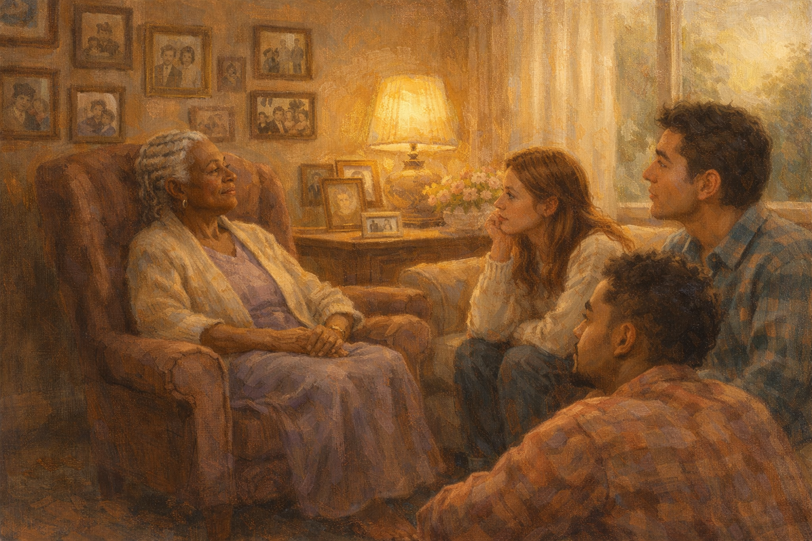 -->

Image Prompt

(This is panel 1. Do not put the panel number in the image.)
Please generate a 16:9 image in warm contemporary realism depicting Pearl, 82, seated quietly in a wingback armchair in a warm lived-in living room filled with family photographs on the walls. She looks out the window absently. Her three adult grandchildren — Kayla, DeShawn, Maya — sit near her on a couch and the rug, watching her. The color palette is deep amber, soft rose, warm cream, honey brown. The emotional tone is quiet loss and gentle determination. No speech bubbles. Generate the image immediately without asking clarifying questions.

Grandma Pearl had stopped telling stories sometime in the last six months. She still knew their faces, most afternoons. She still lit up at hugs. But the running narration — the quick-tongued retelling of church gossip and old baseball scores and who had disappointed her at work in 1974 — had quieted. Kayla missed the stories the most. DeShawn missed the jokes. Maya, the youngest, missed the way her grandmother used to sing under her breath while she cooked. Nobody sang in the kitchen anymore.

## Panel 2 – The Idea

<!-- 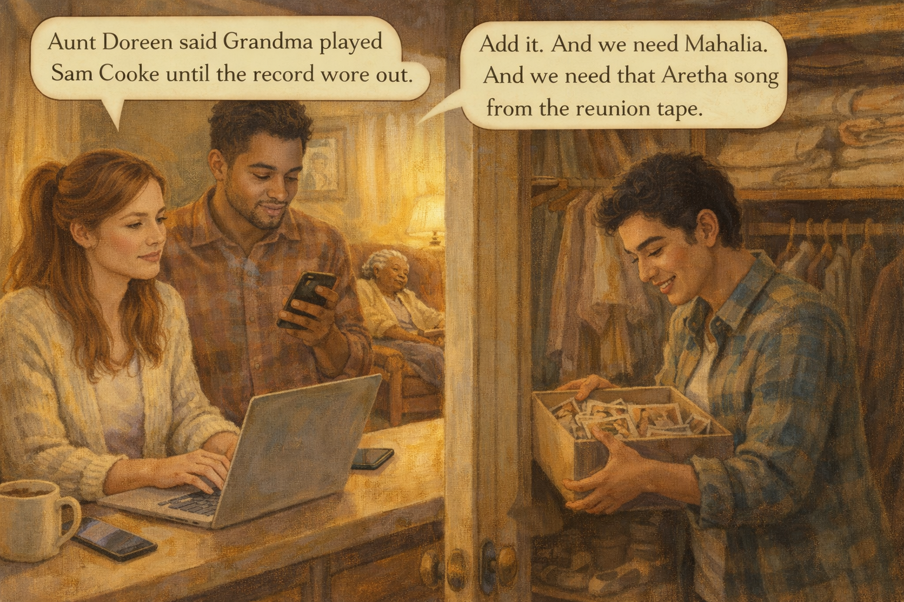 -->

Image Prompt

(This is panel 2. Do not put the panel number in the image.)
Please generate a 16:9 image in warm contemporary realism depicting Kayla, 28, at a kitchen counter with a laptop, DeShawn, 31, beside her with his phone, and Maya, 26, pulling a shoebox of old family photos out of a closet. Pearl is visible in the background in her armchair, dozing. The color palette is warm amber, muted teal, honey, cream. The emotional tone is bright determined planning. Speech bubble from DeShawn: "Aunt Doreen said Grandma played Sam Cooke until the record wore out." Speech bubble from Kayla: "Add it. And we need Mahalia. And we need that Aretha song from the reunion tape." Generate the image immediately without asking clarifying questions.

The idea came from an article DeShawn had read: music from a person's young adulthood often reached them in dementia even when nothing else did. The three of them spent a Saturday morning building a list. They called Great-Aunt Doreen in Mobile. They called their father, who had been a small boy in 1961 but still remembered his mother singing him to sleep. They pulled down a shoebox of old photos and found Pearl at nineteen, at a dance, in a red dress, and they built the playlist around her nineteen-year-old self.

## Panel 3 – The First Song

<!-- 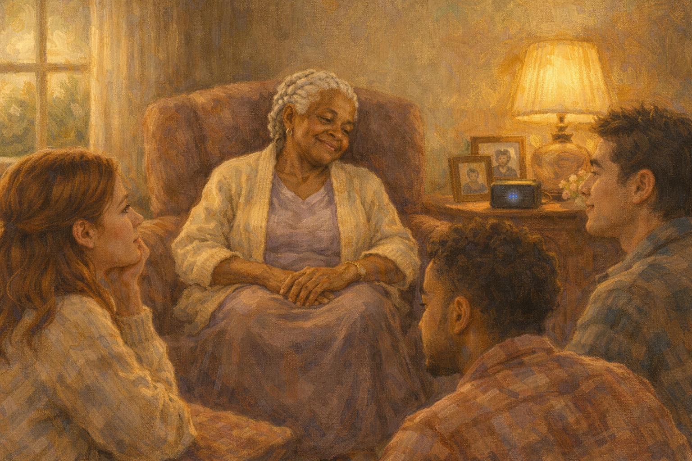 -->

Image Prompt

(This is panel 3. Do not put the panel number in the image.)
Please generate a 16:9 image in warm contemporary realism depicting Pearl in her armchair as a Sam Cooke song begins to play from a small speaker on the side table. Her face is just beginning to change — her eyes soften, her head tilts slightly to the side, a faint smile forming. The grandchildren watch, breath held. Warm golden afternoon light. The color palette is deep amber, warm gold, rose, cream. The emotional tone is the held breath before a door opens. No speech bubbles. Generate the image immediately without asking clarifying questions.

They played *You Send Me* first because Aunt Doreen had said, *baby, if you want to reach her, start with Sam.* The first notes came out of the small speaker and Pearl's head tilted. Her eyes, which had been vacant, sharpened just a little. The corner of her mouth lifted. None of the grandchildren breathed. Pearl, after a long second, began to hum along. Maya put her hand over her mouth.

## Panel 4 – Singing

<!-- 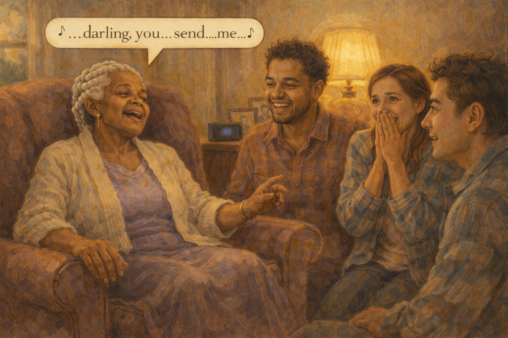 -->

Image Prompt

(This is panel 4. Do not put the panel number in the image.)
Please generate a 16:9 image in warm contemporary realism depicting Pearl in the armchair, eyes closed, mouth open, singing along softly to a song. One hand taps rhythmically on the armrest. Her grandchildren have frozen in delighted shock. Kayla is crying. DeShawn is grinning. Maya has her hands pressed together in front of her face. The color palette is deep amber, warm gold, rose, cream. The emotional tone is joyful reappearance. Speech bubble from Pearl (singing, clear): "...darling, you...send...me..." Generate the image immediately without asking clarifying questions.

By the third song, Pearl was singing. Full voice, on key, every word. She did not stumble. She did not search. *You send me,* she sang, in the dusty contralto that had once led the choir at Mt. Olive Baptist. Kayla was crying. DeShawn was grinning so hard his face hurt. Maya said, to nobody, "Where has she *been?*"

## Panel 5 – The Boy at the Dance

<!-- 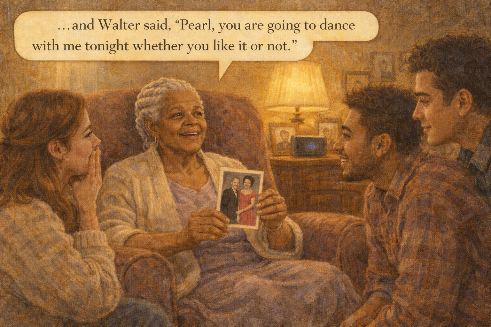 -->

Image Prompt

(This is panel 5. Do not put the panel number in the image.)
Please generate a 16:9 image in warm contemporary realism depicting Pearl smiling, her eyes distant but vivid, telling a story. She holds an old black-and-white photograph of herself at nineteen in a red dress. The grandchildren are on the rug, listening raptly, leaning in. The color palette is deep amber, honey, rose, sepia. The emotional tone is a story returning. Speech bubble from Pearl (warm, remembering): "...and Walter said, 'Pearl, you are going to dance with me tonight whether you like it or not.'" Generate the image immediately without asking clarifying questions.

When the fifth song ended, Pearl picked up the photograph of herself at nineteen, held it between her thumb and finger, and said, "Walter took me to this dance. His uncle had lent him the car." The grandchildren did not move. Pearl kept going. The dress had been borrowed from her cousin Beulah. She had been scared her slip would show. Walter had stepped on her foot exactly twice. She had laughed so hard she had snorted punch out of her nose. It was the longest her grandchildren had heard her speak in six months.

## Panel 6 – The Playlist Goes With Her

<!-- 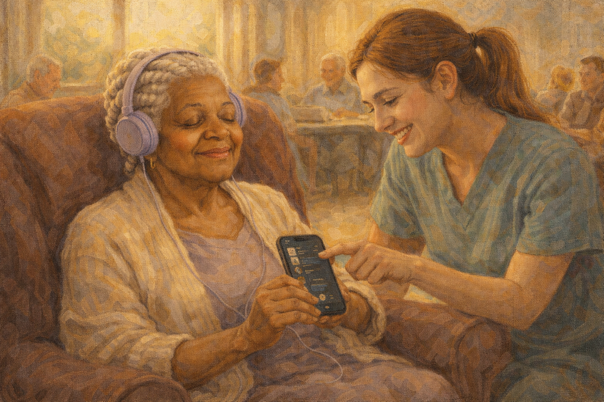 -->

Image Prompt

(This is panel 6. Do not put the panel number in the image.)
Please generate a 16:9 image in warm contemporary realism depicting Pearl sitting at a sunny adult day center, wearing soft purple headphones, eyes closed, smiling faintly. A young care aide kneels beside her, smiling too, pointing at the phone Pearl is loosely holding. Other adults are visible in the background at tables. The color palette is warm gold, soft teal, rose, cream. The emotional tone is music as portable home. No speech bubbles. Generate the image immediately without asking clarifying questions.

The grandchildren put the playlist on Pearl's phone. They bought her soft over-ear headphones. When Pearl went to adult day care three mornings a week, the playlist went with her. The staff put it on when she was agitated. It worked every time. Pearl, who had been known as "quiet" at the center, became known as "the grandma who sings" by the end of the month.

## Panel 7 – Moving Day

<!-- 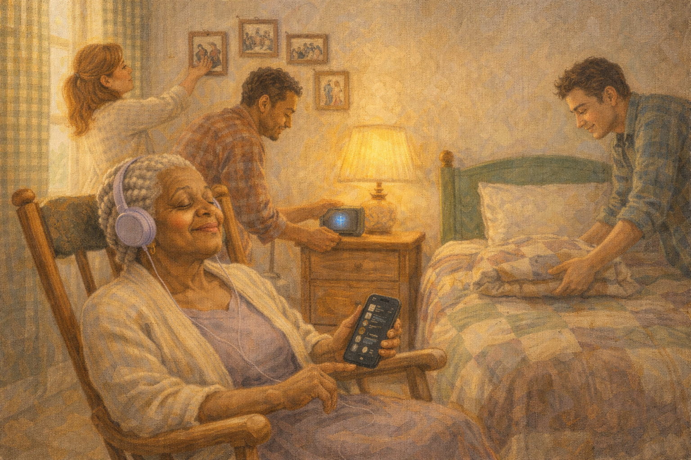 -->

Image Prompt

(This is panel 7. Do not put the panel number in the image.)
Please generate a 16:9 image in warm contemporary realism depicting Pearl sitting in a rocking chair in a small new bedroom at a memory care home. The grandchildren are setting up her room — hanging photos, placing the small speaker on the bedside table, putting a folded quilt on the bed. Pearl is wearing headphones, eyes closed, a tiny smile on her face as she hums. Afternoon sunlight streams through a gingham curtain. The color palette is soft lavender, warm cream, deep green, honey. The emotional tone is a hard day made possible by music. No speech bubbles. Generate the image immediately without asking clarifying questions.

The day Pearl moved into memory care was the hardest day the grandchildren had ever had. They hung the old photographs. They folded her quilt onto the bed. They plugged in the small speaker. They put on Otis Redding. Pearl, who had been frightened and confused in the car, relaxed into the rocking chair. She closed her eyes. She said, in a voice as calm as summer, "This will do just fine." DeShawn went out into the hallway and leaned his forehead against the wall and cried for ten minutes.

## Panel 8 – The Aide Who Learned

<!-- 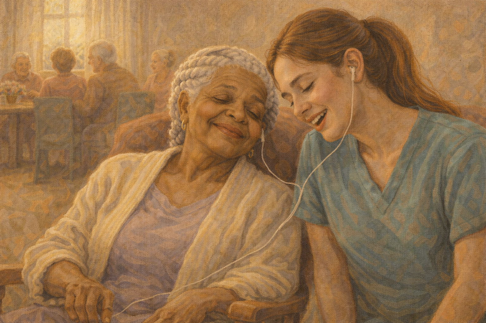 -->

Image Prompt

(This is panel 8. Do not put the panel number in the image.)
Please generate a 16:9 image in warm contemporary realism depicting a young memory-care aide — a woman in her twenties in scrubs — sitting beside Pearl in the day room, both wearing split headphones, sharing earbuds, humming together. Other residents are visible in the background. The color palette is warm cream, soft pink, honey, deep teal. The emotional tone is a small beautiful friendship forming. No speech bubbles. Generate the image immediately without asking clarifying questions.

The aide assigned to Pearl's wing was a young woman named Tasha. Tasha asked, on the first day, if Pearl would mind if she shared an earbud sometimes. Pearl, through the fog, smiled and nodded. Tasha, who was twenty-three years old, learned the entire 1963 Motown catalog from a woman born in 1943. They sometimes sat for an hour together, humming. Tasha called Kayla one day and said, "I don't know how to thank you for the playlist. Your grandma taught me Sam Cooke."

## Panel 9 – Hospice

<!-- 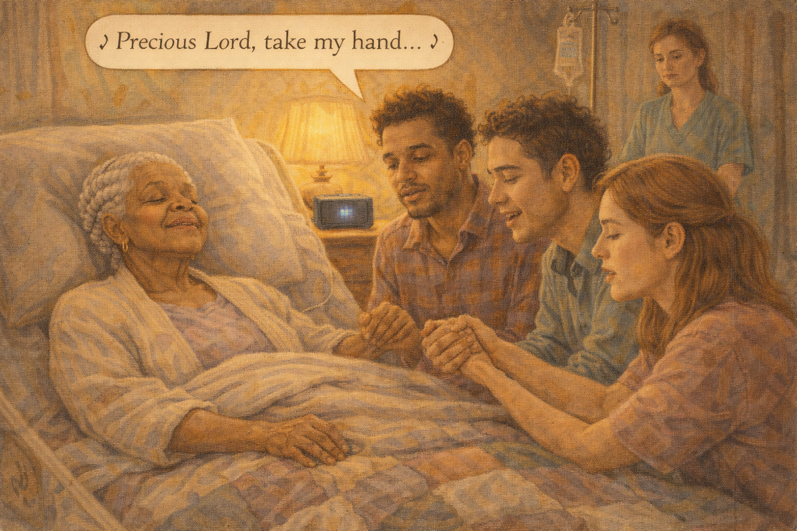 -->

Image Prompt

(This is panel 9. Do not put the panel number in the image.)
Please generate a 16:9 image in warm contemporary realism depicting Pearl, very frail now, in a hospital bed at the memory care home, in her last days of hospice. Her eyes are closed. Her three grandchildren are gathered around, holding her hands, softly singing along to a gospel song playing from the small speaker. A hospice nurse watches from a respectful distance. The color palette is deep amber, warm gold, rose, soft cream. The emotional tone is reverent farewell. Speech bubble (sung softly, all three): "Precious Lord, take my hand..." Generate the image immediately without asking clarifying questions.

Two years and four months after that first Sunday, Pearl entered hospice. Her eyes did not open much anymore. Her breathing was slow. The grandchildren gathered. The playlist played. When *Precious Lord* came on — the Mahalia Jackson recording their grandmother had sung at three funerals in her life — the three of them sang along, softly, harmonizing without meaning to, the way the family had always harmonized. Pearl's lips moved. She was singing with them. Her last clear word was *Lord.*

## Panel 10 – At the Funeral

<!-- 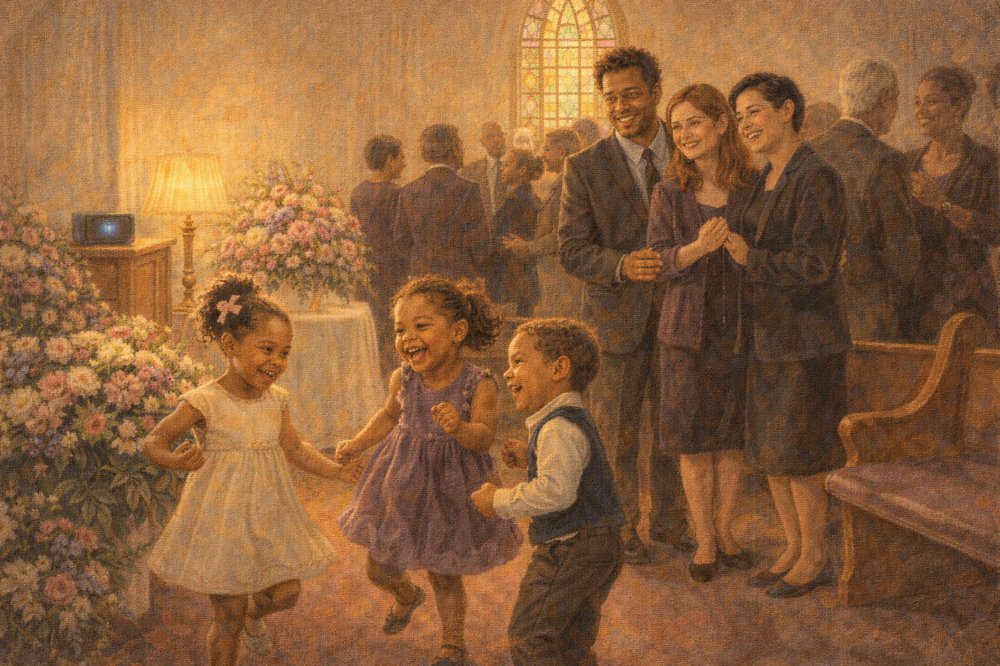 -->

Image Prompt

(This is panel 10. Do not put the panel number in the image.)
Please generate a 16:9 image in warm contemporary realism depicting the interior of a warm Black Baptist church during a funeral reception. The mood is celebratory, not sorrowful. A speaker plays the playlist at a gentle volume. Kayla, DeShawn, and Maya stand among aunts, uncles, cousins. Three small great-grandchildren are dancing in the aisle near the flowers, laughing. Light pours through stained glass. The color palette is warm gold, deep burgundy, rich purple, cream. The emotional tone is joyful inheritance. No speech bubbles. Generate the image immediately without asking clarifying questions.

At Pearl's funeral the same playlist played through the church speakers during the reception. Three of her great-grandchildren, ages four, six, and eight, started dancing in the aisle during *Respect.* Nobody stopped them. Aunt Doreen, leaning on a cane, sang the Mahalia harmony part from memory and made Kayla cry all over again. The old church, which had known Pearl since 1952, rocked with the music she had loved at nineteen.

## Panel 11 – Passing It Down

<!-- 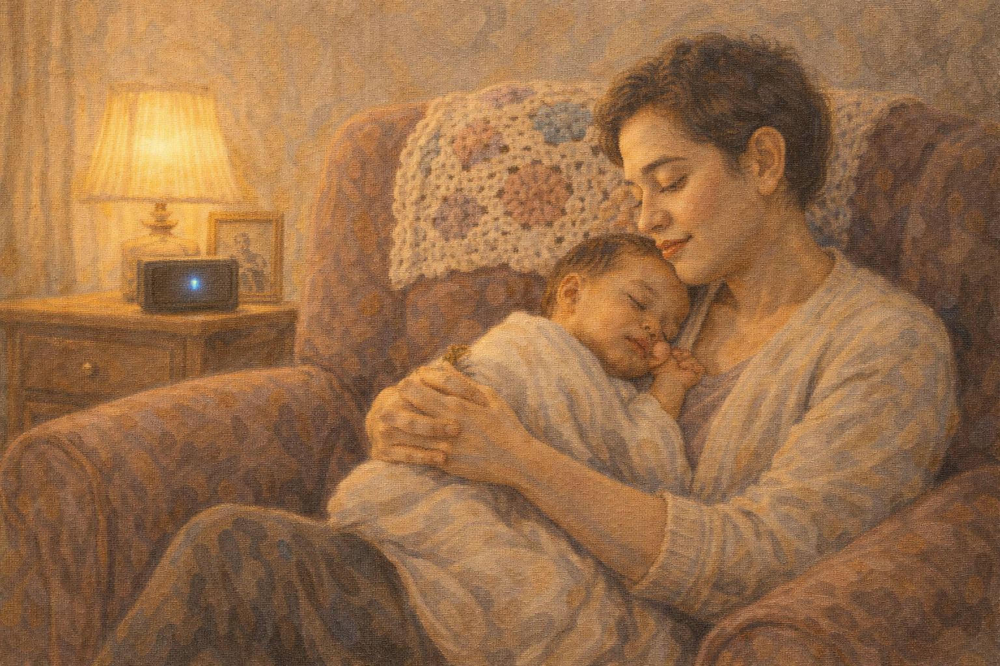 -->

Image Prompt

(This is panel 11. Do not put the panel number in the image.)
Please generate a 16:9 image in warm contemporary realism depicting Maya, now holding a new baby, sitting on her grandmother's old armchair at home. A small speaker plays soft Sam Cooke. The baby is soothed, eyes heavy. Maya's face is tender and full of memory. The armchair still has a crocheted throw over the back. The color palette is warm amber, rose, cream, soft gold. The emotional tone is continuation. No speech bubbles. Generate the image immediately without asking clarifying questions.

Two years after Pearl's funeral, Maya had a baby. The baby would not sleep. In desperation one night Maya sat in her grandmother's old armchair, which she had brought home from the move, and played *You Send Me.* The baby quieted. The baby slept. Maya, sitting in the chair in the dark, understood that her grandmother's music had become her daughter's music, and that some things don't end, they just move down one generation and keep playing.

## Panel 12 – The Gift Continues

<!-- 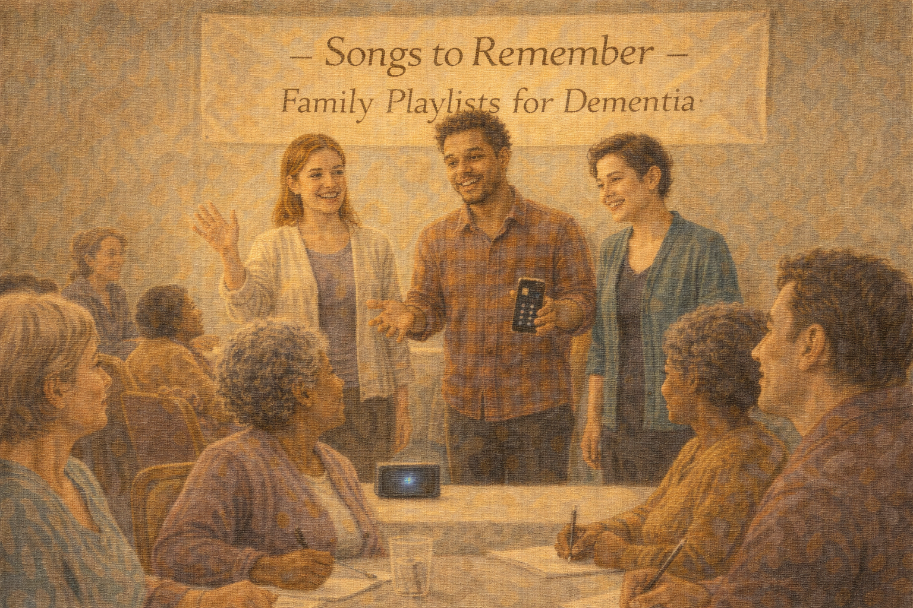 -->

Image Prompt

(This is panel 12. Do not put the panel number in the image.)
Please generate a 16:9 image in warm contemporary realism depicting a community event at a senior center — Kayla, DeShawn, and Maya are leading a small group of adult caregivers through building playlists for their own loved ones. A banner reads "Songs to Remember — Family Playlists for Dementia." Caregivers are smiling, listening, taking notes. The color palette is warm teal, honey gold, cream, deep amber. The emotional tone is a gift multiplied outward. No speech bubbles. Generate the image immediately without asking clarifying questions.

A year after the funeral, Kayla, DeShawn, and Maya started leading a free monthly workshop at the local senior center: *Songs to Remember — Family Playlists for Dementia.* They helped caregivers interview their relatives, dig through family photos, and build the right playlist for the right person. Pearl's gift had not ended with Pearl. It was still opening doors, in other houses, to other grandmothers, and would for as long as someone bothered to press *play.*

### Epilogue – What the Family Learned

| Moment | What They Did | Lesson for Families |
|--------|--------------|--------------------|
| Grandma stopped telling stories | Built a playlist of songs from her young adulthood | Music from ages 15-25 often reaches people when words don't |
| Needed the right songs | Interviewed aunts, cousins, and old photos | The family archive is a playlist-building tool; use it |
| Pearl was withdrawn at adult day care | Sent the playlist and headphones with her | Let music travel with your loved one to every new place |
| Moving to memory care was traumatic | Played *You Send Me* in the new room | Music makes an unfamiliar place familiar in a way words cannot |
| Saying goodbye felt impossible | Sang *Precious Lord* with her at hospice | Songs give you something to do at a bedside when there are no more words |
| Wanted to honor her | Led community workshops on family playlists | A grandmother's gift can keep opening doors for decades |

### A Note to Readers

The science is real. Music familiar from a person's young adulthood — roughly ages 15 to 25 — is stored in brain regions that Alzheimer's damages *last*. That is why a woman who cannot name her daughter can sing every word of *Moon River*. It is why a man who has not spoken in a month starts tapping his foot when Glenn Miller comes on.

To build a playlist for your loved one:

1. **Interview older family members** about what your loved one loved at 18, 20, 25
2. **Dig through old photos** — yearbooks, wedding albums, reunion tapes
3. **Include wedding songs, church hymns, dance songs, lullabies they sang**
4. **Keep it 30-60 minutes long** — enough for a long bath or a car ride
5. **Get good headphones** — comfortable, over-ear
6. **Send it with them** to every new place — day care, memory care, hospice

The **Music & Memory** nonprofit organization has trained thousands of care communities in personalized playlists. The Alzheimer's Association 24/7 Helpline (**1-800-272-3900**) can refer you to trained music therapists near you.

A song is not a cure. But a song is a door. And sometimes a door is what you need.

---

*"Where has she been? She's right here. You just have to know which song."*
—Maya, granddaughter

*"Your grandma taught me Sam Cooke. I will remember her the rest of my life."*
—Tasha, memory-care aide

*"Some things don't end. They just move down one generation and keep playing."*
—Maya

---

## References

1. [Music and Memory – Wikipedia](https://en.wikipedia.org/wiki/Music_%26_Memory) - Nonprofit pioneering personalized music for dementia care.
2. [Music Therapy for Dementia – Wikipedia](https://en.wikipedia.org/wiki/Music_therapy#Dementia_care) - Background on evidence-based music therapy.
3. [Art and Music – Alzheimer's Association](https://www.alz.org/help-support/caregiving/daily-care/art-music) - Guidance on using music in caregiving.
4. [Personalized Music for Dementia – National Institute on Aging](https://www.nia.nih.gov/news/music-and-memory-relief-caregivers-people-dementia) - Federal overview of music interventions.
5. [American Music Therapy Association](https://www.musictherapy.org/) - Directory of board-certified music therapists.
