# The Tour: Choosing a Memory Care Home Without Guilt

<!--  -->

Cover Image Prompt

Please generate a 16:9 image in warm, painterly contemporary realism depicting a bright, homey memory-care common room. Large windows with climbing wisteria, a fireplace with a soft fire, residents and staff in warm conversation at small tables, a piano with sheet music. In the foreground, Denise, 58, with chin-length brown hair and reading glasses, holds a clipboard and notebook, walking slowly beside Pat, a friendly middle-aged memory-care director in a cardigan and name tag. Denise is looking around thoughtfully. The color palette is warm amber, deep sage green, honey wood, soft teal, and cream. The emotional tone is tender, hopeful evaluation — a daughter seeing a place where her mother could actually live. Generate the image immediately without asking clarifying questions.

Narrative Prompt

This is a graphic novel for family caregivers of people living with dementia. The central character is Denise, 58, a marketing executive whose mother Evelyn, 85, has mid-to-late stage Alzheimer's. For two years Denise has cared for her mother in her own home. Recently her mother has been wandering at night, falling, and needing help bathing and toileting. Denise is exhausted. Her own health is suffering. Her mother needs more than she can give. Denise has decided to tour three memory care communities this week. The story follows three tours: one glossy and corporate (red flags), one faith-based and warm (mixed), and one small, homelike, specialized in dementia (the right fit). Denise learns what to look for: smell, staff ratios, how residents are dressed and occupied, how staff speak to residents, locked unit vs. secured garden, activity calendar, whether the director greets her or an aide whose eyes she cannot meet. She also confronts her own guilt. Her brother Robert calls mid-tour and says she's "giving up on Mom." Denise pushes through. By the end, she has chosen the small home, toured it twice more with her mother, and moved Evelyn in. Her mother's first week is hard. The second week is better. Evelyn joins a daily singing group and sings for the first time in a year. Tone: honest about grief, unflinching about red flags, deeply hopeful. Include Alzheimer's Association 24/7 Helpline (1-800-272-3900). American English spelling.

### Prologue – Three Brochures on the Counter

It is a Sunday night. On Denise's kitchen counter are three glossy brochures from three memory-care communities. Upstairs, her mother is asleep in the bedroom that used to belong to Denise's teenage son. Denise has fallen asleep at this counter twice in the last week. She has been caring for her mother for two years. She is fifty-eight years old and her back aches and she cried in the car today. Tomorrow she starts the tours.

<!-- 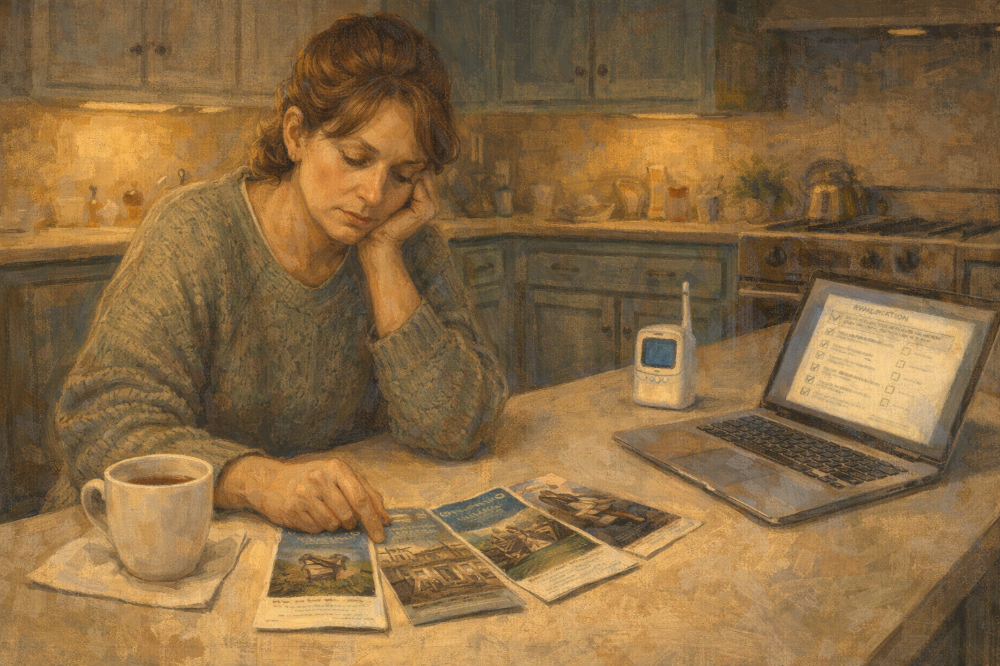 -->

Image Prompt

Please generate a 16:9 image in warm contemporary realism depicting a tired kitchen scene at late evening. Denise, 58, chin-length brown hair pulled back, in a loose sweater, sits at the kitchen counter with her chin in her hand, looking at three glossy brochures fanned in front of her. A half-finished cup of tea has gone cold. A laptop open to an evaluation checklist. A baby monitor on the counter. The color palette is soft amber, muted teal, deep cream, and warm brown. The emotional tone is bone-tired resolve. No speech bubbles. Generate the image immediately without asking clarifying questions.

The three brochures on the counter had photographs of smiling gray-haired women doing watercolor paintings and eating berries with forks. Denise, a marketing executive, knew how those photographs were made. She did not blame the marketing. She blamed herself for needing to read them at all. The baby monitor on the counter was set to her mother's bedroom. It had been her son's, once. Two generations of people who could not be left alone had slept in that bed.

## Panel 2 – Tour One: The Glossy One

<!-- 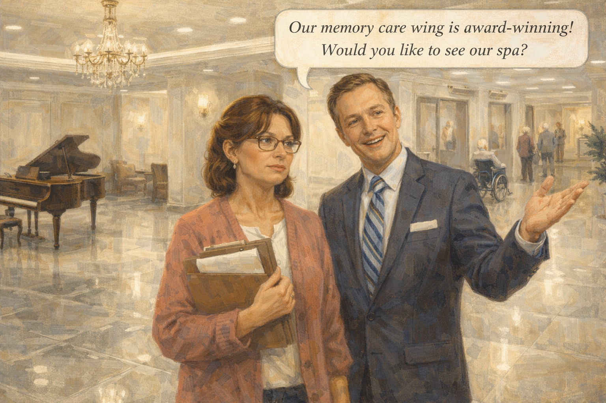 -->

Image Prompt

Please generate a 16:9 image in warm contemporary realism depicting the lobby of a large, corporate assisted-living community. Shiny marble floors, a grand piano no one is playing, a chandelier, bright fluorescent accent lighting. Denise, with a clipboard, stands beside a very polished sales representative in a sharp suit, who is gesturing proudly. In the background, a few residents in a hallway look unoccupied, one in a wheelchair alone. The color palette is cold cream, polished gray-white, muted gold, and hard fluorescent white. The emotional tone is glossy unease — Denise sensing something is off beneath the shine. Speech bubble from sales rep (bright): "Our memory care wing is award-winning! Would you like to see our spa?" Generate the image immediately without asking clarifying questions.

The first tour was led by a woman named Brittany in a sharp blazer and a name badge that said *Community Relations Director*. She showed Denise the spa. She showed Denise the chandelier. She showed Denise the marketing video on the lobby television. When Denise asked the staff-to-resident ratio, Brittany said, "We prefer the phrase *care partners*." When Denise asked again, Brittany said, "Let me get back to you on that." Denise wrote *no answer* in her notebook and drew a small star next to it.

## Panel 3 – Tour One: The Smell

<!-- 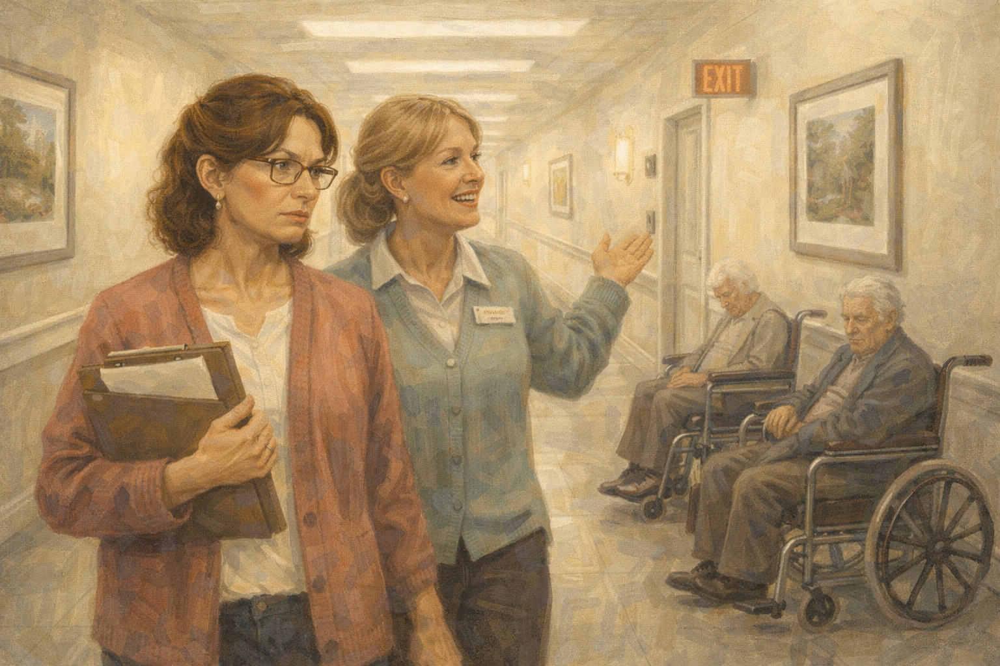 -->

Image Prompt

Please generate a 16:9 image in warm contemporary realism depicting Denise walking down a hallway in the memory care wing of the glossy facility. The hallway has glossy photographs on the walls but harsh fluorescent lighting. Two residents sit in wheelchairs along the wall, unoccupied, one slumped. Brittany gestures cheerfully ahead of Denise. Denise's face has tightened — she has noticed something. A faint yellow haze suggests the smell. The color palette is cold cream, clinical pale yellow, sterile white, with one splash of harsh red emergency exit light. The emotional tone is alarm masked as politeness. No speech bubbles. Generate the image immediately without asking clarifying questions.

Denise smelled it the second they entered the memory care wing. Not a hospital smell. A smell that meant someone had been sitting in a wet brief for too long. Two women sat along the wall in wheelchairs, not being spoken to, not being moved. A television was on, playing a game show nobody was watching. Denise said thank you to Brittany and left twenty minutes earlier than scheduled. In the parking lot she sat in her car and wrote in capital letters across one page: *THE SMELL IS THE FIRST THING.*

## Panel 4 – Tour Two: The Faith-Based One

<!-- 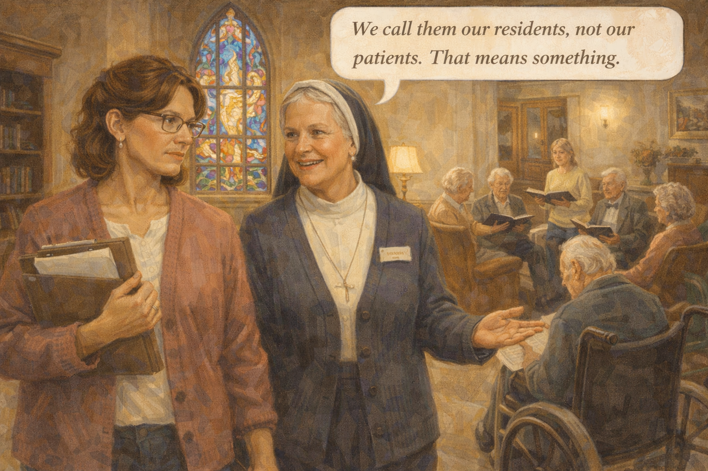 -->

Image Prompt

Please generate a 16:9 image in warm contemporary realism depicting a church-adjacent care community. A stained-glass window casts colored light onto a common room. A small group of residents sits in a circle with a volunteer, singing hymns. The space feels warmer than tour one — but the resident area is crowded, with not enough staff visible. Denise walks beside a kind older nun in a cardigan and modest habit. Denise's expression is thoughtful, noting both strengths and concerns. The color palette is warm honey gold, stained-glass cobalt and ruby, soft cream, deep wood brown. The emotional tone is mixed admiration and careful evaluation. Speech bubble from nun (warm): "We call them our residents, not our patients. That means something." Generate the image immediately without asking clarifying questions.

The second tour was led by Sister Margaret, a small sharp-eyed woman in a modest habit. Stained glass threw blue and ruby light on a common room where a volunteer led an older circle of residents in singing *In the Garden.* The staff who passed in the hall called residents by name. The smell was of vanilla and toast. But the hallway off the common room was crowded — twelve residents per aide. The activity room had eight activities per week, mostly hymns. Denise's mother was not religious. Denise wrote *warm, but not enough staff; not a music fit.*

## Panel 5 – The Call in the Parking Lot

<!-- 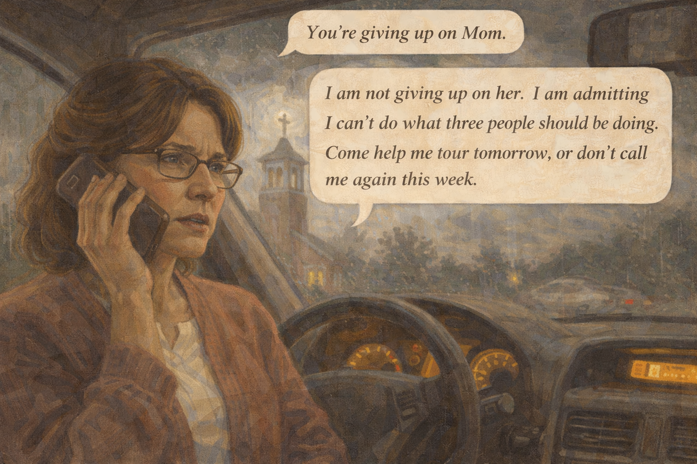 -->

Image Prompt

Please generate a 16:9 image in warm contemporary realism depicting Denise sitting in her car in a parking lot, phone pressed to her ear, her face strained. Through the windshield, the cross atop the church tower is visible. A raincloud sits heavy above. The color palette is deep gray-green, muted cobalt, and warm yellow from the dashboard light. The emotional tone is hurt and resolve. Speech bubble (from phone, small): "You're giving up on Mom." Speech bubble from Denise (firm, measured): "I am not giving up on her. I am admitting I can't do what three people should be doing. Come help me tour tomorrow, or don't call me again this week." Generate the image immediately without asking clarifying questions.

The call came while Denise was eating a granola bar in her car. Her brother Robert, from Phoenix. "You're giving up on Mom," he said. Denise put the granola bar down. She did not cry. She did not yell. She said, "I am not giving up on her. I am admitting I can't do what three people should be doing. Come help me tour tomorrow, or don't call me again this week." There was a long silence. Then Robert said, "Text me the address. I'll fly in tonight."

## Panel 6 – Tour Three: The Small Home

<!-- 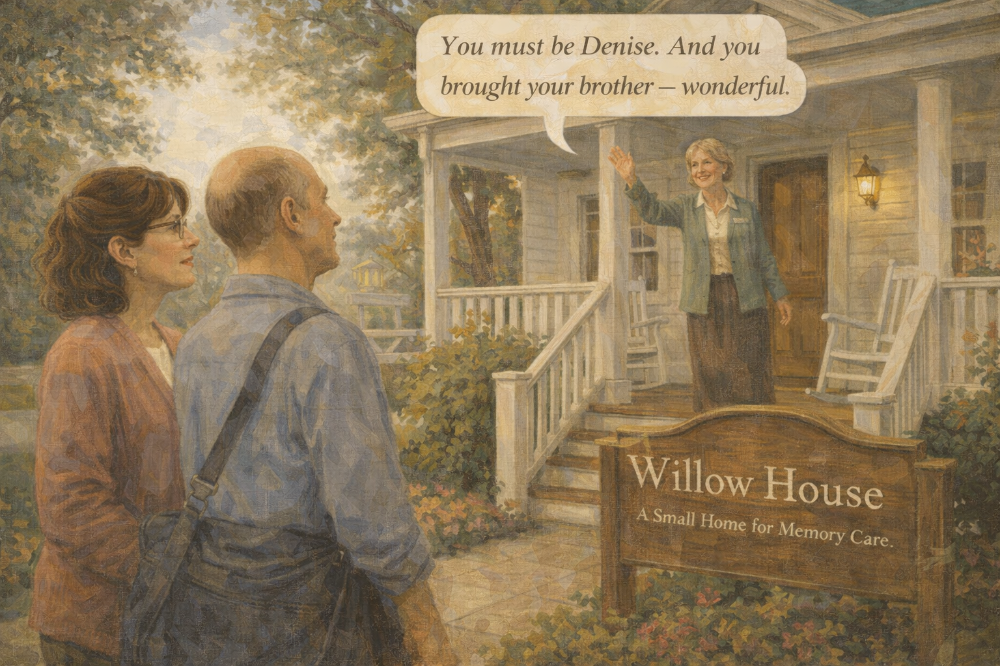 -->

Image Prompt

Please generate a 16:9 image in warm contemporary realism depicting a small, converted house in a leafy residential neighborhood. A white painted porch with rocking chairs. A wooden sign reads "Willow House — A Small Home for Memory Care." Denise, with Robert — 55, balding, gentle eyes, a travel bag still on his shoulder — stands on the walkway looking up. A friendly middle-aged woman in a cardigan, Pat, waves from the porch. The color palette is soft cream, deep sage green, warm amber, and dusty rose. The emotional tone is cautious hope — this one feels different. Speech bubble from Pat (warm): "You must be Denise. And you brought your brother — wonderful." Generate the image immediately without asking clarifying questions.

The third place was a two-story house on a shaded street, not a campus. A hand-painted sign said *Willow House — A Small Home for Memory Care.* Sixteen residents. Eight staff per shift. A woman named Pat — the director — met them at the door in a cardigan that had a grandchild's sticker on it. Robert, still carrying his carry-on bag from the airport, did the thing he had always done when he was unsure: he took off his baseball cap. Inside, the house smelled like cinnamon and coffee. Denise's shoulders came down an inch.

## Panel 7 – Inside Willow House

<!-- 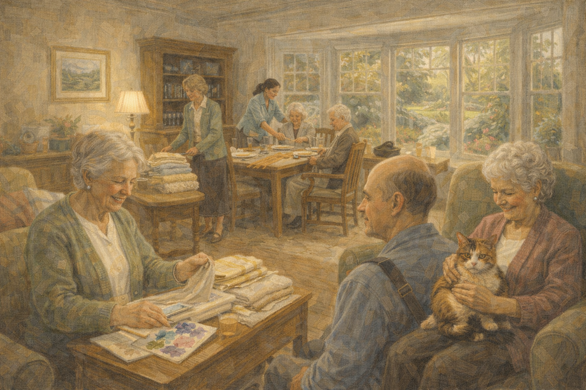 -->

Image Prompt

Please generate a 16:9 image in warm contemporary realism depicting the common room of Willow House. Residents are engaged: one folds laundry slowly and happily, two are setting the table for lunch, another is painting watercolors with help, another is petting a small calico cat in her lap. Staff move among them gently, at eye level. A sunny bay window looks out onto a secured garden with a walking path. The color palette is honey gold, sage green, creamy white, soft lavender. The emotional tone is purposeful peace. No speech bubbles. Generate the image immediately without asking clarifying questions.

Inside, every resident was doing something. One was folding towels, slowly and with concentration. Two were setting the table for lunch. A woman in her eighties was painting watercolors with a young aide who held her hand steady over the brush. A cat named Toast sat on a woman's lap and purred. Staff walked at residents' pace. Nobody sat slumped in a hallway. Nobody was parked. Denise followed Pat into the garden. It was fenced high, but the fence was covered with climbing roses. From inside, it looked like a garden, not a cage.

## Panel 8 – The Questions

<!-- 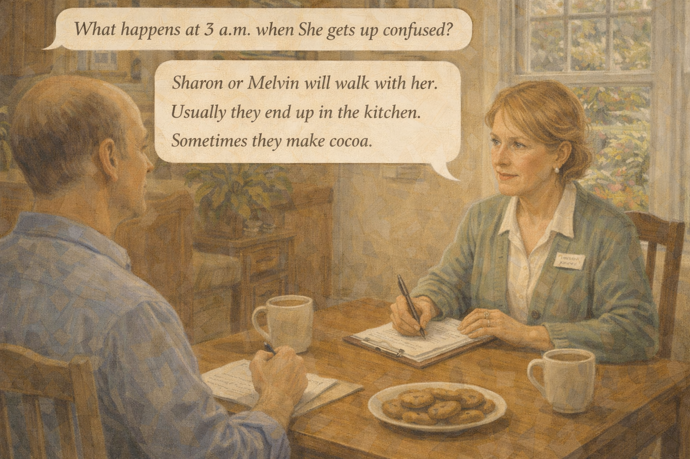 -->

Image Prompt

Please generate a 16:9 image in warm contemporary realism depicting Denise and Robert seated across a small wooden kitchen table from Pat. Denise is asking questions from her clipboard. Pat is answering calmly with direct eye contact. Coffee mugs, a plate of homemade cookies, notes being taken. A window behind Pat looks into the garden. The color palette is warm honey, soft sage, creamy amber. The emotional tone is serious, open, respectful — a real conversation. Speech bubble from Denise: "What happens at 3 a.m. when she gets up confused?" Speech bubble from Pat: "Sharon or Melvin will walk with her. Usually they end up in the kitchen. Sometimes they make cocoa." Generate the image immediately without asking clarifying questions.

At the small kitchen table Pat answered every question without looking at a binder. Staff ratio: two to one overnight. Registered nurse on-site forty hours a week, on-call twenty-four. Direct care staff had a one-in-six turnover rate, not one-in-two. Medication errors reported publicly each quarter. Hospice partners. Family allowed any hour of the day. "What happens at three a.m. when she gets up confused?" Denise asked. Pat said, "Sharon or Melvin will walk with her. Usually they end up in the kitchen. Sometimes they make cocoa."

## Panel 9 – Robert's Test

<!-- 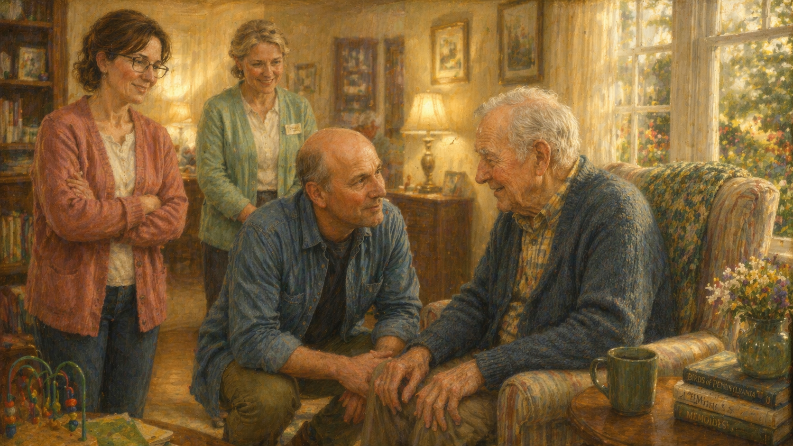 -->

Image Prompt

Please generate a 16:9 image in warm contemporary realism depicting Robert crouching down, at eye level with an elderly male resident seated in an armchair, engaging him in quiet conversation. The resident is smiling softly. Denise and Pat watch from a short distance. The color palette is warm gold, soft denim blue, deep wood brown. The emotional tone is the moment a skeptical brother understands. No speech bubbles. Generate the image immediately without asking clarifying questions.

Robert, who had flown in as a skeptic, wandered off while Denise finished her questions. When Denise found him, he was crouched beside an armchair, talking to an older man who had been a mechanic. They were discussing carburetors. Robert was not the test. The resident was. He had been engaged, in minutes, by a stranger with a basic question, because he had been kept alert enough to have an opinion. That was the test. When Robert stood up, he looked at Denise and nodded, one small nod.

## Panel 10 – The Hard First Week

<!-- 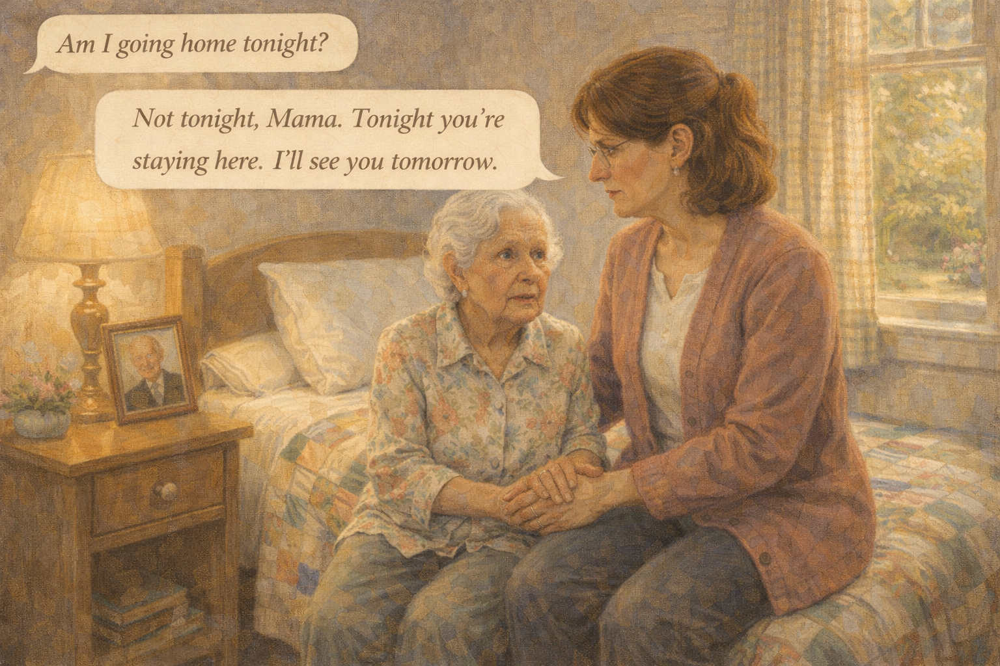 -->

Image Prompt

Please generate a 16:9 image in warm contemporary realism depicting Evelyn, 85, a small silver-haired woman in a floral blouse, sitting on the edge of a neatly made twin bed in her new small bedroom at Willow House. She looks disoriented and a little scared. Her own quilt is on the bed; a framed photo of her late husband is on the nightstand. Denise sits beside her, holding her hand, her own eyes wet. Afternoon light slants through a gingham curtain. The color palette is pale lavender, warm cream, muted teal, soft gold. The emotional tone is raw love and difficulty together. Speech bubble from Evelyn (small, confused): "Am I going home tonight?" Speech bubble from Denise (steady, gentle): "Not tonight, Mama. Tonight you're staying here. I'll see you tomorrow." Generate the image immediately without asking clarifying questions.

The first week was hard the way Denise had been warned it would be. Her mother asked to go home every afternoon at four. Denise drove over every day and read the paper in the garden with her. On the fourth night, her mother, who had not sung in a year, sang along to *You Are My Sunshine* in the common room after dinner. Sharon, the overnight aide, texted Denise a video. Denise watched it in her car in her own driveway and cried harder than she had cried in a decade.

## Panel 11 – Two Weeks Later

<!-- 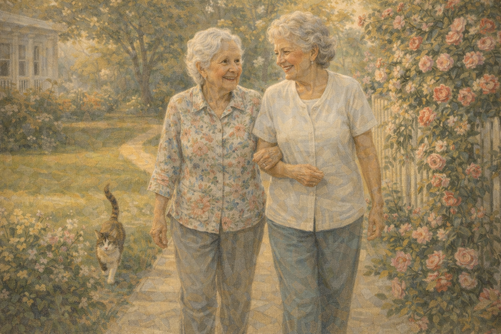 -->

Image Prompt

Please generate a 16:9 image in warm contemporary realism depicting Evelyn two weeks later, in the garden at Willow House, walking arm in arm with another resident of similar age — a woman named Lorraine — both smiling and chatting. A small calico cat trots behind them. Roses climb the fence. The color palette is bright honey gold, deep green, soft pink from climbing roses, clean white. The emotional tone is unexpected joy — a mother who has found a friend. No speech bubbles. Generate the image immediately without asking clarifying questions.

Two weeks in, Evelyn had a friend. Lorraine. They met over morning coffee and, within a week, would not be separated. They walked the garden path together three times a day. They argued gently about bridge hands neither of them could remember playing. Denise visited every other day now, not every day, because on the days she stayed away her mother and Lorraine watched a movie together, which was a thing her mother had not been able to do with Denise for a year because she could not follow the plot.

## Panel 12 – A Different Kind of Love

<!-- 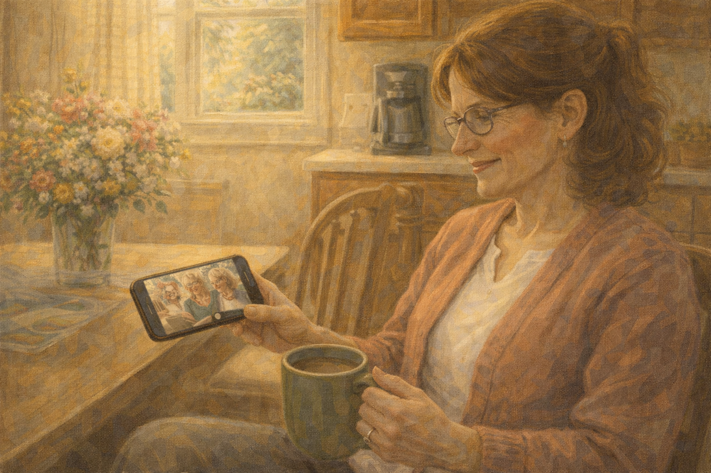 -->

Image Prompt

Please generate a 16:9 image in warm contemporary realism depicting Denise in her own home kitchen, months later, in the same chair where she had once sat exhausted at midnight. Now it is a Saturday morning, sunlight pours in, she has a full mug of coffee, and she is not crying. She is smiling at her phone, watching a short video. Visible on the phone: Evelyn singing in a small group at Willow House. On the counter, fresh flowers. The color palette is bright morning gold, soft cream, warm peach, and deep green. The emotional tone is quiet restoration — a daughter returning to herself. No speech bubbles. Generate the image immediately without asking clarifying questions.

On a Saturday morning four months later, Denise sat at her own kitchen counter and drank a full cup of coffee without standing up. The baby monitor was gone. The brochures were in the recycling. Sharon had sent a video from Willow House of Evelyn singing *In the Mood* with four other residents while a piano played. Denise watched it twice. She thought, *I am still my mother's daughter. I still visit. I still love her.* The love had not ended. It had only stopped breaking her body in half.

### Epilogue – What Denise Learned

| Challenge | How Denise Responded | Lesson for Families |
|-----------|----------------------|---------------------|
| Home care was breaking her health | Accepted that memory care could be *more* love, not less | You are not abandoning someone by admitting you cannot do three people's work |
| Glossy marketing on brochures | Trusted her nose, her eyes, and the smell of the hallway | The lobby is marketing. The memory-care wing is the truth |
| Brother accused her of "giving up" | Invited him to tour instead of arguing on the phone | Bring the doubter *into* the choice; do not defend it from afar |
| Did not know what to look for | Made a checklist: smell, staff ratios, engagement, garden access | Walk the unit at a random time; ask one nurse directly |
| Mother struggled the first week | Visited daily, then tapered as mother made a friend | Transition distress is normal; don't over-interpret it |
| Felt guilty for having her own coffee | Understood that her health was part of her mother's care plan | A rested caregiver is a better daughter than an exhausted one |

### A Note to Readers

If you are choosing a memory care community, here is what to look for:

**Red flags:**
- Smells of urine, feces, or strong bleach masking them
- Residents parked in wheelchairs in hallways with no activity
- Staff who do not make eye contact with residents
- A refusal to give direct staff-to-resident ratios
- Locked units that feel more like jails than homes

**Green flags:**
- Residents are occupied, moving, speaking
- Staff kneel or sit to talk to residents at eye level
- A secured garden or outdoor space
- A rich activity calendar (music, art, pets, cooking)
- Specific turnover and staffing numbers given on request
- You are allowed to visit unannounced, at any hour

**Ask directly:**
- What is your staff-to-resident ratio, day and night?
- What is your staff turnover rate?
- How many medication errors were reported last quarter?
- Can I eat a meal in the common dining room?
- What happens at 3 a.m. when my mother gets up confused?

The Alzheimer's Association 24/7 Helpline (**1-800-272-3900**) has counselors who will walk through the tour process with you, and many chapters will go on tours with families for moral support.

---

*"I was not giving up on my mother. I was admitting I could not do the work of three people. That was the truth that set both of us free."*
—Denise, caregiver

*"The smell is the first thing. Trust your nose."*
—Memory care consultant

*"A good place smells like cinnamon and looks like a Tuesday afternoon."*
—Caregiver support group

---

## References

1. [Choosing Residential Care – Alzheimer's Association](https://www.alz.org/help-support/caregiving/care-options/residential-care) - Guidance on comparing memory care and assisted-living communities.
2. [Memory Care – Wikipedia](https://en.wikipedia.org/wiki/Memory_care) - Overview of memory-care as a specialized form of long-term care.
3. [Nursing Home Compare – Medicare.gov](https://www.medicare.gov/care-compare/) - Federal tool for comparing licensed nursing facilities.
4. [Long-Term Care Ombudsman Program](https://ltcombudsman.org/) - State-level advocates for long-term care residents.
5. [Home Safety Checklist – National Institute on Aging](https://www.nia.nih.gov/health/alzheimers-changes-behavior-and-communication/home-safety-checklist-alzheimers-disease) - When home care is no longer safe enough.
