# Three Forgotten Keys

*When "everybody forgets things" becomes something more*

<!-- 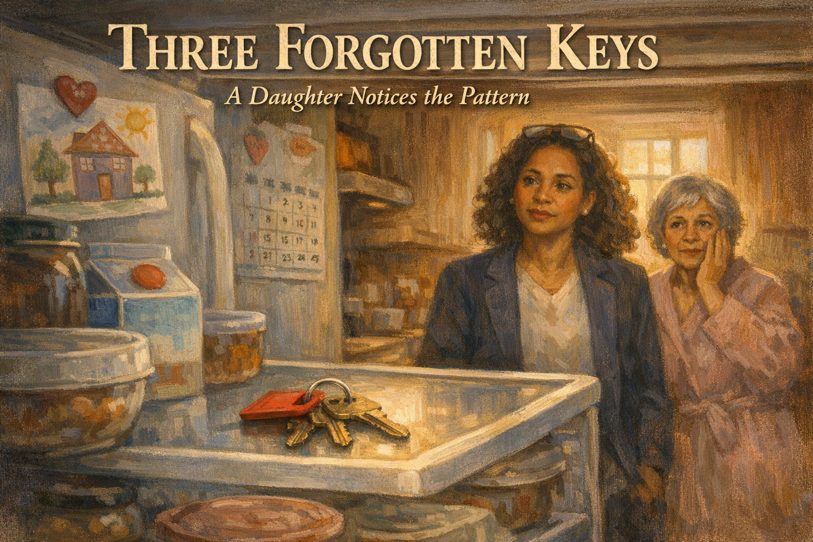 -->

Cover Image Prompt

Contemporary photorealistic illustration, warm cinematic tone, 16:9 wide-landscape format. Close-up composition of a suburban American kitchen refrigerator, door open, cool interior light spilling out into a dim morning kitchen. On the middle shelf, among milk cartons and a bowl of leftovers, sits a small set of **house keys on a red keychain** — clearly out of place. In the soft background, out of focus, we see two women: **Maya**, age 42, medium-brown skin, shoulder-length curly dark hair, reading glasses pushed up on her head, wearing a navy work blazer, standing in the kitchen doorway with a concerned but gentle expression. A few feet behind her, **Gloria**, age 71, warm olive skin, silver-gray hair in a short soft style, wearing a pale pink housecoat, looking slightly embarrassed and puzzled, one hand raised to her cheek. Morning light filters through a window behind them in soft diffused yellow. On the refrigerator door: a family magnet, a child's crayon drawing, a calendar showing the current month. Color palette: soft creams, gentle blues from the fridge interior, a single warm pop of red from the keychain, muted morning yellows. Emotional tone: the quiet moment a daughter realizes something has shifted.

Title text overlay centered at the top in clean modern sans-serif: "THREE FORGOTTEN KEYS" in warm white with a subtle shadow. Subtitle below in smaller italic: "When 'everybody forgets things' becomes something more"

Generate the image immediately without asking clarifying questions.

## Narrative Prompt

This is a fictional composite story built from the experience of thousands of adult children who have been the first in the family to notice the early signs of dementia in a parent. Maya and Gloria are invented characters, but every moment here — the car keys in the fridge, the joking dismissal, the growing dread, the careful first conversation — is drawn from the real progression from *mild cognitive symptoms* to *first honest conversation about memory*. The story teaches one clear skill: how to tell normal age-related forgetfulness from warning signs, and how to bring up a doctor's visit without causing fear. Art style: contemporary photorealistic illustration with a warm domestic tone, present-day suburban America.

## Prologue

Most of us know somebody who "isn't what she used to be." An aunt who tells the same joke twice at Thanksgiving. A grandfather who forgets where he parked. A mother who asks, for the third time, when you're coming home for Christmas. For a long time we laugh these off — everybody forgets things. But somewhere in that fog, a line gets crossed, and the people closest to the person are usually the first to feel it. This is the story of how Maya learned that line. And how she crossed it, gently, toward her mother.

---

## Panel 1: Sunday Dinner

<!-- 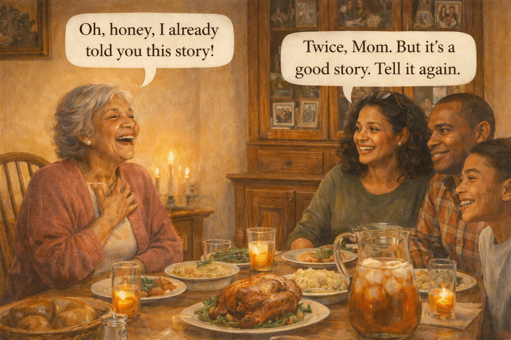 -->

Image Prompt

Contemporary photorealistic illustration, 16:9 wide-landscape format. A warm, busy suburban American dining room at 6 PM on a Sunday. A wooden dining table is set for four, covered with a glossy roast chicken on a white platter, mashed potatoes in a yellow ceramic bowl, green beans, a basket of rolls, and a pitcher of iced tea beading with condensation. At the head of the table, **Gloria** (71, silver-gray short soft hair, olive skin, rose-colored cardigan, small pearl earrings) is laughing with her head thrown slightly back, one hand on her chest — mid-laugh. Across from her on the right, **Maya** (42, curly dark hair shoulder-length, medium-brown skin, reading glasses on top of her head, simple olive-green sweater) is grinning at her mother. Beside Maya sits her husband **Derek** (44, close-cropped dark hair, warm brown skin, plaid button-down) and a teenage son (15, braces, T-shirt, rolling his eyes affectionately). Candlelight flickers on the table. A tall cabinet of china behind Gloria holds family photos. Color palette: warm ambers, roast golden-browns, cream walls, soft rose. Emotional tone: ordinary family warmth, a happy Sunday.

**Speech bubble 1** — tail pointing to **Gloria** (head of table), positioned above her: "Oh, honey, I already told you this story!"

**Speech bubble 2** — tail pointing to **Maya** (right side, smiling), positioned above her: "Twice, Mom. But it's a good story. Tell it again."

Generate the image immediately without asking clarifying questions.

**Narrative:** Maya's mother Gloria had always been the funny one. Sunday dinners at her house were loud and long, with the same stories told in the same order: the one about the lost wedding ring, the one about the neighbor's parrot, the one about Maya's father teaching her to drive. If Gloria sometimes told a story twice in the same evening, Maya laughed it off. Everybody forgets things. Everybody over 70 tells the parrot story twice. This, Maya thought, was just what getting older looked like.

---

## Panel 2: Keys in the Fridge

<!-- 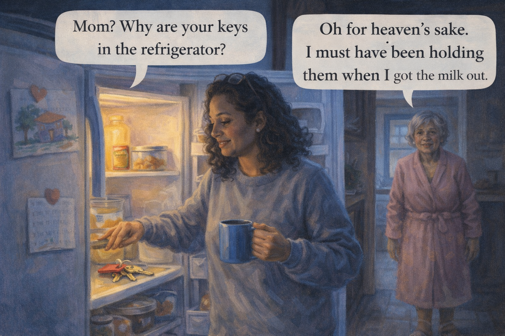 -->

Image Prompt

Contemporary photorealistic illustration, 16:9 wide-landscape format. Early morning kitchen scene, cool bluish morning light. **Maya** is standing at Gloria's open refrigerator in the CENTER of the frame, still in a cozy gray sweatshirt with a coffee mug in one hand — she has stopped mid-motion, staring down at something. Her free hand is reaching toward the middle shelf where, among a carton of orange juice and a Tupperware of leftovers, sits a set of **house keys on a bright red keychain**. Her expression is a mix of amusement and confusion. The fridge interior light makes a soft glow on her face. In the background, **Gloria** (in a pink housecoat and slippers) is visible entering the kitchen from the hallway, hair slightly mussed from sleep, a faint smile but also a slight shift of confusion in her eyes — as if she cannot quite remember coming down yet. Color palette: cool morning blues, warm yellow fridge light, a bright red accent on the keychain. Emotional tone: the first strange thing, laughed at, but noticed.

**Speech bubble 1** — tail pointing to **Maya** (at the fridge), positioned above her: "Mom? Why are your keys in the refrigerator?"

**Speech bubble 2** — tail pointing to **Gloria** (entering from the hall), positioned above her, surprised and joking: "Oh for heaven's sake. I must have been holding them when I got the milk out."

Generate the image immediately without asking clarifying questions.

**Narrative:** It happened for the first time on a Tuesday morning at Gloria's house, where Maya had stayed the night after a late work trip. Maya opened the refrigerator to grab creamer for her coffee. Sitting on the middle shelf, next to the orange juice, was a set of house keys on a red keychain. Maya laughed out loud. Gloria laughed too, a little too quickly, a little too loud. Maya didn't think anything more about it. Everybody puts things in the wrong place sometimes.

---

## Panel 3: The Reading Glasses

<!-- 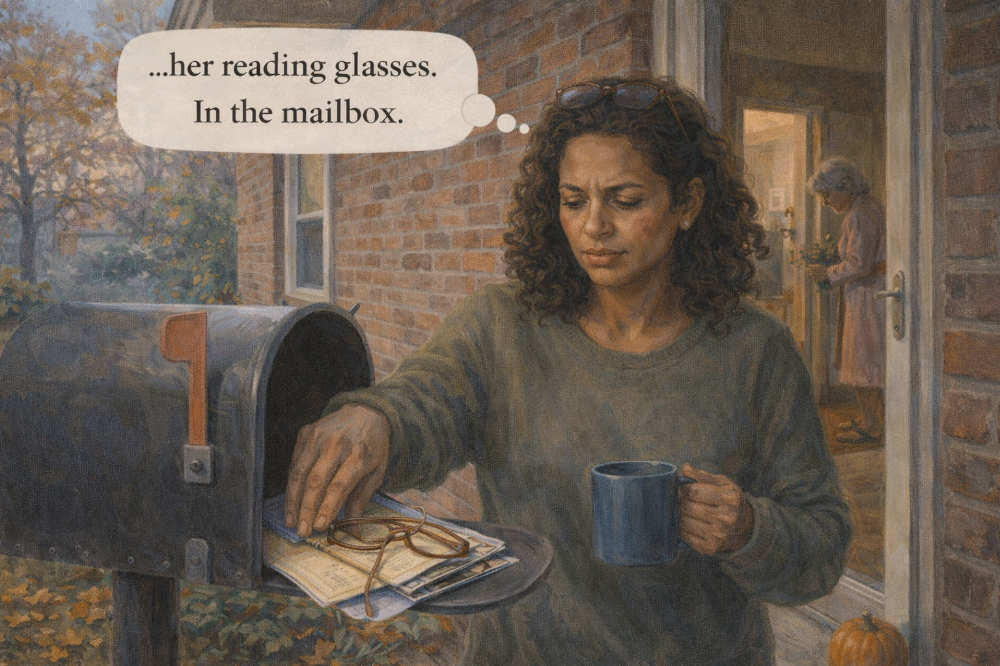 -->

Image Prompt

Contemporary photorealistic illustration, 16:9 wide-landscape format. An outdoor shot from a small front porch of a 1970s brick suburban house. It is a crisp autumn afternoon, leaves scattering in warm tones across the small lawn. **Maya** is standing at an open **mailbox** attached to the house beside the front door, her hand inside the mailbox. She has just pulled out a small stack of envelopes, but on top of them, tangled with a rubber band and a coupon flyer, sits **a pair of tortoise-shell reading glasses**. Her face is no longer laughing — she is frowning slightly, suddenly quiet. Through the front door behind her, open a few inches, we can see the hallway of the house and a sliver of Gloria in the living room watering a plant, unaware. A small orange pumpkin sits on the porch steps. The mailbox has a gentle dent on its flag. Color palette: autumn rust, soft browns, muted yellow leaves, the gray-blue of the cold afternoon sky. Emotional tone: the second strange thing — no longer funny.

**Speech bubble 1** — tail pointing to **Maya** (at mailbox), positioned above her in a small thought-bubble style: "...her reading glasses. In the mailbox."

Generate the image immediately without asking clarifying questions.

**Narrative:** A week later, Maya stopped by to drop off some groceries. The mailbox was stuffed full, so she reached in to help. Beneath the grocery flyers and electric bill, folded quietly like they belonged there, were her mother's reading glasses. Maya stood on the porch holding them for a long moment. Keys in the fridge had been funny. Reading glasses in the mailbox was something else. Her stomach shifted in a way she didn't have a word for yet.

---

## Panel 4: The Remote in the Freezer

<!-- 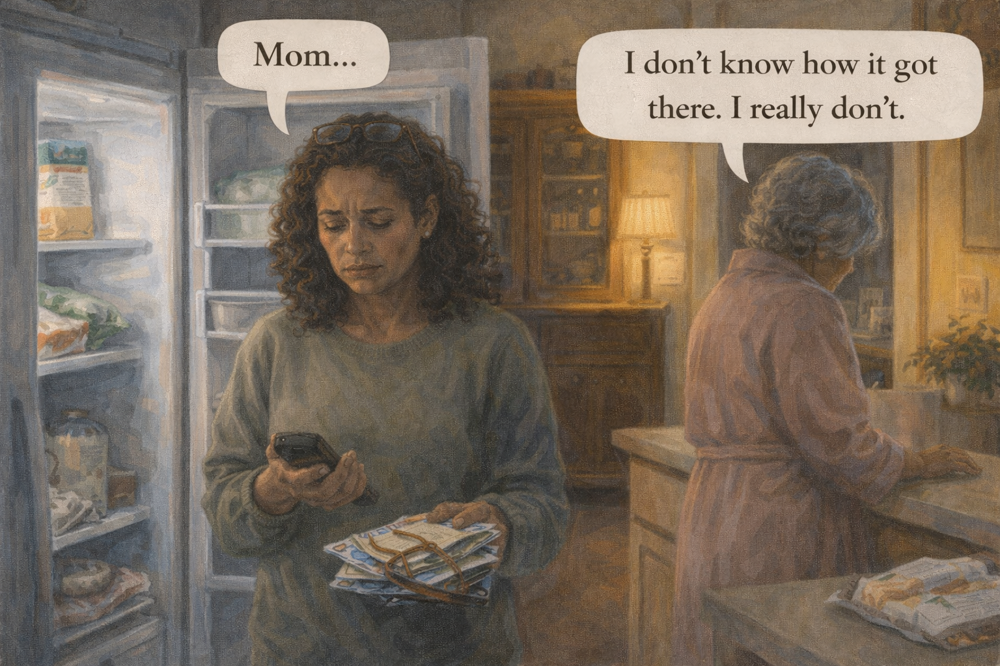 -->

Image Prompt

Contemporary photorealistic illustration, 16:9 wide-landscape format. Interior kitchen, evening. **Maya** is in the CENTER of the frame, the **freezer door** of a side-by-side refrigerator open beside her, her hand pulling out a **black plastic TV remote control** that has been resting against a frozen bag of peas and an ice-cream carton. Her expression has shifted — the amusement of the earlier panels is gone; now there is a pale shocked stillness. She is not laughing. She is looking down at the remote in her palm as if it is a small wound. On the RIGHT side of the frame, half-turned away and facing the living room, **Gloria** stands at the kitchen island with her back partly to Maya. Her shoulders are drawn up tight. One hand is on the counter, steadying herself. We cannot see her face fully, but the tension in her neck and the quiet way she is standing tells us she has seen what Maya is holding, and she is ashamed. An unopened package of frozen chicken on the counter. Color palette: cold whites from the freezer, the warm amber glow of the kitchen lamp on Gloria's side, soft beige walls. Emotional tone: the moment something invisible in the room becomes visible. Shame, love, fear.

**Speech bubble 1** — tail pointing to **Maya** (holding remote), positioned above her, soft and shaky: "Mom..."

**Speech bubble 2** — tail pointing to **Gloria** (back turned, at counter), small and barely audible, positioned above her: "I don't know how it got there. I really don't."

Generate the image immediately without asking clarifying questions.

**Narrative:** It was the remote in the freezer that stopped Maya from laughing. She had come over to watch the news with her mother, and Gloria had said, matter-of-factly, "I can't find the remote anywhere, honey." Maya found it in the freezer, tucked between a bag of peas and a pint of strawberry ice cream. When she turned around to joke about it, she saw her mother's face — and her mother's face did not laugh. Gloria's shoulders had drawn up. One hand was on the counter, steadying. "I don't know how it got there," she said quietly. "I really don't."

---

## Panel 5: The Kitchen Table, Later

<!-- 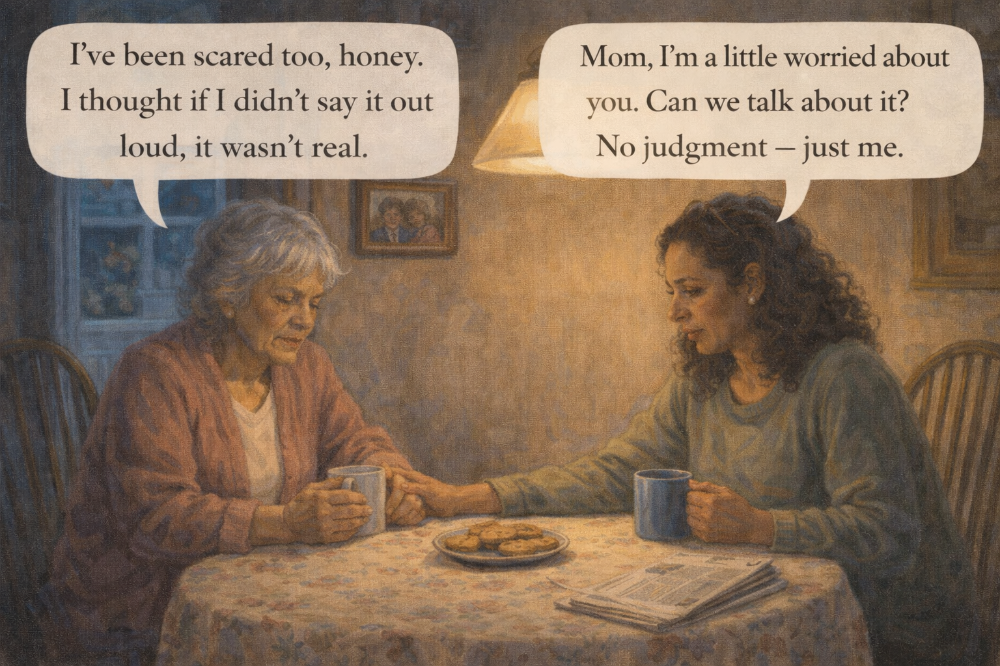 -->

Image Prompt

Contemporary photorealistic illustration, 16:9 wide-landscape format. Quiet domestic scene, evening. Mother and daughter sit across from each other at a small kitchen table with a soft floral tablecloth. A single pendant lamp hangs overhead, casting a warm pool of light on them and leaving the edges of the room in soft shadow. **Gloria** (on the LEFT) has her hands wrapped around a mug of tea, shoulders still small, eyes fixed on the table. **Maya** (on the RIGHT) has reached across and placed one hand gently on top of her mother's hand — not gripping, just resting. Maya's other hand holds her own mug. On the table between them: a plate of cookies, a small stack of napkins, a folded newspaper. A framed photo on the wall behind them of Gloria and her late husband. Color palette: warm ambers, soft pinks, the gentle blue of evening outside the window. Emotional tone: the hard, necessary conversation — love doing the talking.

**Speech bubble 1** — tail pointing to **Maya** (right), positioned above her in a gentle tone: "Mom, I'm a little worried about you. Can we talk about it? No judgment — just me."

**Speech bubble 2** — tail pointing to **Gloria** (left, looking at table), positioned above her, small and quiet: "I've been scared too, honey. I thought if I didn't say it out loud, it wasn't real."

Generate the image immediately without asking clarifying questions.

**Narrative:** Maya sat down at the kitchen table and poured them both a cup of tea. She had planned a hundred versions of this conversation on the drive over. She threw all of them out and reached for her mother's hand. "Mom," she said. "I'm a little worried about you. Can we talk?" Gloria looked at the table for a long time. Then, in a smaller voice than Maya had ever heard from her, she said: "I've been scared too, honey. I thought if I didn't say it out loud, it wasn't real."

---

## Panel 6: What Gloria Had Been Hiding

<!-- 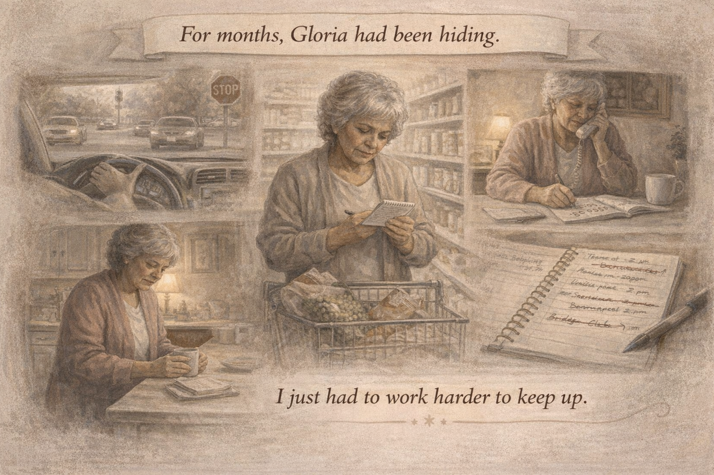 -->

Image Prompt

Contemporary photorealistic illustration, 16:9 wide-landscape format, quiet flashback-style panel. Soft sepia-tinged tone suggesting a memory/recollection. A montage-style arrangement: in the CENTER, a desaturated vignette of Gloria standing in the grocery store aisle holding a shopping list, staring at it with confusion. In the UPPER LEFT, a smaller inset of Gloria in her car at a four-way stop, hesitating, cars behind her. In the UPPER RIGHT, an inset of Gloria on the phone, a notepad in front of her, trying to take down a phone number but writing the same digit three times. In the LOWER LEFT, a small inset of Gloria opening a kitchen drawer and standing still, as if she has forgotten what she came for. In the LOWER RIGHT, an inset of Gloria's handwritten notebook, open, with appointments crossed out and rewritten, corrections in different pen colors. Around the edges of the montage, small handwritten script in a gentle font: *"I just had to work harder to keep up."* Color palette: muted sepia, warm browns, soft ivory, a single thread of soft rose. Emotional tone: private struggle, dignity, the work of hiding.

**Speech bubble 1** — a narrative caption banner at the top of the panel, in a gentle script: "For months, Gloria had been hiding."

*(No character speech bubbles in this montage panel — the captions do the storytelling.)*

Generate the image immediately without asking clarifying questions.

**Narrative:** Over the next hour, Gloria told Maya what she had not told anyone. She had been writing notes to remind herself what to buy at the grocery store. She had been avoiding left turns because four-way stops had started to confuse her. She had missed two doctor's appointments and pretended she had canceled them. She had stopped cooking anything complicated because recipes had begun to feel like long math problems. "I just had to work harder to keep up," Gloria said. The word Maya kept not saying out loud was *dementia*.

---

## Panel 7: The Research, Late at Night

<!-- 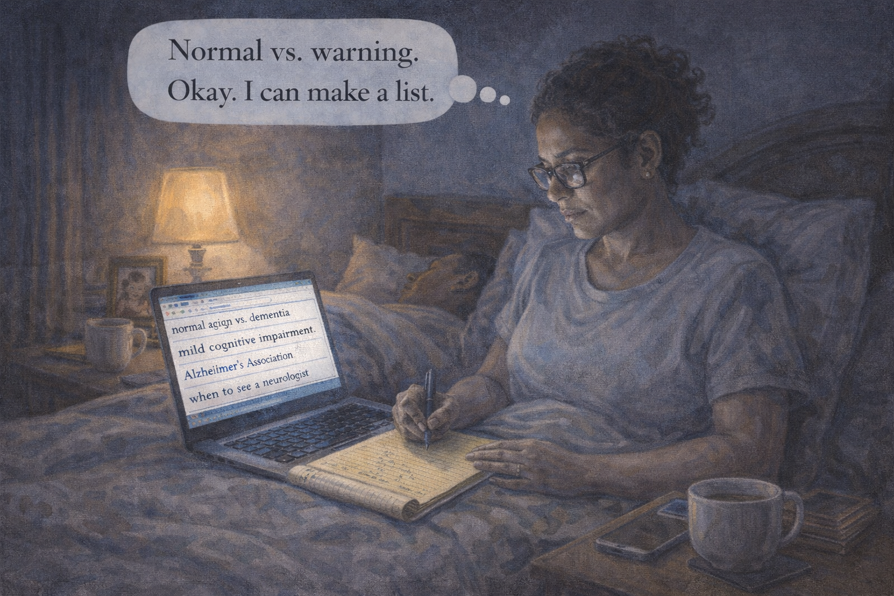 -->

Image Prompt

Contemporary photorealistic illustration, 16:9 wide-landscape format. **Maya** sits in bed late at night, propped against pillows, laptop on her knees, the cool blue glow of the screen lighting her face. She is in a T-shirt, hair pulled back, glasses on her nose — focused, worried, but composed. Her husband **Derek** is asleep beside her, face turned away, breathing peacefully. On the nightstand: a mug of herbal tea, a yellow legal pad with notes, a pen, a phone. The lamp on her side is on low. On the laptop screen we can see partial browser tabs with words like *"normal aging vs. dementia,"* *"mild cognitive impairment,"* *"Alzheimer's Association,"* *"when to see a neurologist."* Maya is writing on the legal pad. A small framed photo on the nightstand of young Gloria holding baby Maya. Color palette: deep indigo bedroom shadows, the warm pool of the lamp, the cool blue of the laptop. Emotional tone: a daughter doing her homework at midnight, because love gets specific.

**Speech bubble 1** — tail pointing to **Maya** (in bed with laptop), positioned above her, in a quiet focused thought-bubble style: "Normal vs. warning. Okay. I can make a list."

Generate the image immediately without asking clarifying questions.

**Narrative:** That night, Maya stayed up past midnight reading. She learned that almost everyone over 60 forgets names sometimes — that's normal. But people who forget *what a key is for,* or who get lost in places they have known for decades, or who cannot follow familiar recipes they have cooked a thousand times — those patterns are different. She learned the phrase *Mild Cognitive Impairment,* and the word *dementia,* and the importance of a proper medical workup before anyone jumped to conclusions. She wrote a list of what she had seen. Tomorrow, she would call her mother's doctor.

---

## Panel 8: The Checklist

<!-- 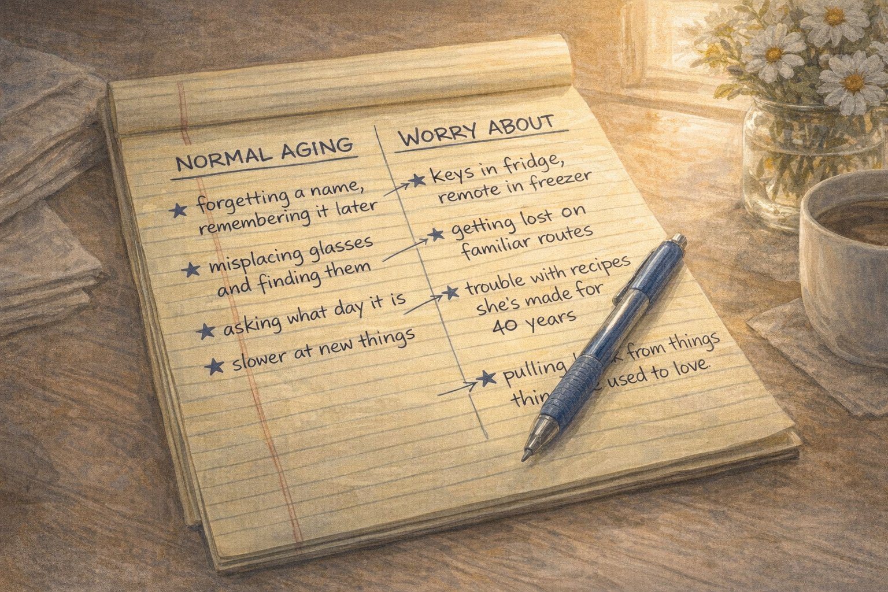 -->

Image Prompt

Contemporary photorealistic illustration, 16:9 wide-landscape format, stylized educational design. The LEFT two-thirds of the frame is a warmly-lit yellow legal pad lying on a kitchen table, filled in Maya's clear handwriting with two columns: **NORMAL AGING** on the left, **WORRY ABOUT** on the right. Under NORMAL AGING: *"forgetting a name, remembering it later"*; *"misplacing glasses and finding them"*; *"asking what day it is"*; *"slower at new things."* Under WORRY ABOUT: *"keys in fridge, remote in freezer"*; *"getting lost on familiar routes"*; *"trouble with recipes she's made for 40 years"*; *"pulling back from things she used to love."* Stars and arrows connect items. The pen lies across the page. On the RIGHT side of the frame, out of focus: a coffee mug, a small vase of daisies, morning light through a window. Color palette: warm yellows, soft cream, the bright blue of Maya's pen ink. Emotional tone: clarity, organization, love taking a shape.

*(No speech bubbles — the notebook is the content of the panel.)*

Generate the image immediately without asking clarifying questions.

**Narrative:** Maya made a simple list and taped it to the inside of her own pantry door, so she would not lose it. Normal aging, on the left: forgetting a name and remembering it ten minutes later. Misplacing glasses and finding them on the counter. Asking what day of the week it is. Worry about it, on the right: forgetting what something is *for* — not where it is. Getting lost in a familiar place. Losing the ability to do a task you have done for forty years. Withdrawing from family, from friends, from hobbies. She had seen three items from the right column in six weeks. That was enough.

---

## Panel 9: The Phone Call to the Doctor

<!-- 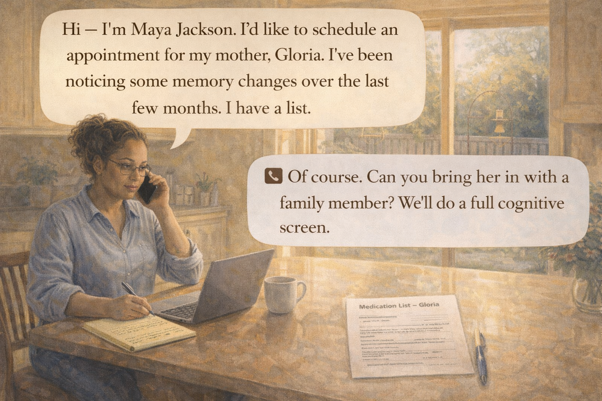 -->

Image Prompt

Contemporary photorealistic illustration, 16:9 wide-landscape format. **Maya** sits at her own kitchen island on a stool in the morning, laptop open in front of her, phone pressed to her ear. She is wearing a simple button-down and jeans, hair pulled back, a steaming coffee beside her. Her expression is focused and calm. On the island are her legal-pad notes and a small printed form titled "Medication List – Gloria." Through the window behind her, a suburban backyard with a wooden fence and a bird feeder in soft morning sun. Color palette: warm cream, pale blues, the golden slant of morning light. Emotional tone: competence, a daughter taking charge, a good first phone call.

**Speech bubble 1** — tail pointing to **Maya**, positioned above her in a calm steady tone: "Hi — I'm Maya Jackson. I'd like to schedule an appointment for my mother, Gloria. I've been noticing some memory changes over the last few months. I have a list."

**Speech bubble 2** — a phone-style speech bubble (with a small phone icon) on the right, representing the doctor's office, warm and professional: "Of course. Can you bring her in with a family member? We'll do a full cognitive screen."

Generate the image immediately without asking clarifying questions.

**Narrative:** Maya called her mother's primary care doctor before she called her mother. She did not want to ambush Gloria with an appointment. She wanted the doctor's office to know what to expect. She read her list, calmly, without drama. The nurse on the phone was kind. She said, "Please come in together — a family member's observations are often the most important part of the visit." Maya wrote down the appointment. The next part — telling her mother — was the one she had been dreading.

---

## Panel 10: Inviting Mom to the Appointment

<!-- 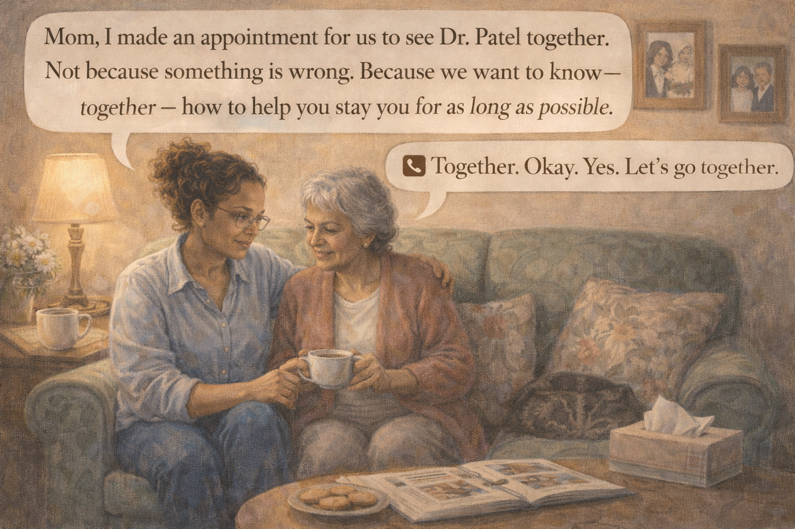 -->

Image Prompt

Contemporary photorealistic illustration, 16:9 wide-landscape format. Interior of Gloria's small living room, mid-afternoon. **Maya** and **Gloria** sit side-by-side on a soft floral couch, angled toward each other, knees nearly touching. Maya has one hand on her mother's knee. Gloria is holding a small white teacup in both hands, steam rising. On the coffee table: a plate of shortbread cookies, an open photo album, a box of tissues. A cat is curled up in an armchair in the background. On the wall above the couch, framed photos of grandchildren, Maya's wedding, a black-and-white photo of Gloria and her late husband as newlyweds. Warm lamp glow. Color palette: soft rose, sage green couch, creamy walls, warm amber lamplight. Emotional tone: a loving invitation, not a confrontation.

**Speech bubble 1** — tail pointing to **Maya** (right, with hand on mom's knee), positioned above her, gentle and warm: "Mom, I made an appointment for us to see Dr. Patel together. Not because something is wrong. Because we want to know — together — how to help you stay you for as long as possible."

**Speech bubble 2** — tail pointing to **Gloria** (left, holding teacup), positioned above her, quiet and moved: "Together. Okay. Yes. Let's go together."

Generate the image immediately without asking clarifying questions.

**Narrative:** Maya rehearsed the words on the drive over. She did not use the word *dementia* — it was too early, and anyway, that was not her word to give. Instead she said: "Mom, I made an appointment for us to see Dr. Patel together. Not because something is wrong. Because we want to know — together — how to help you stay *you* for as long as possible." Gloria nodded once, slowly. Then she set down her teacup, put her head on her daughter's shoulder, and cried for a little while. "Thank you for not making me ask," she said.

---

## Panel 11: The Waiting Room

<!-- 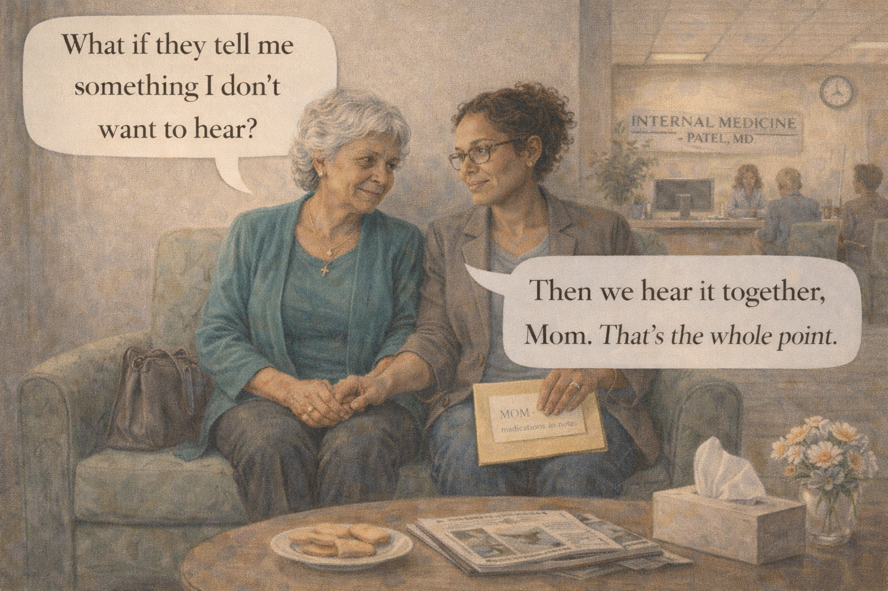 -->

Image Prompt

Contemporary photorealistic illustration, 16:9 wide-landscape format. A modern but warm medical-office waiting room. **Gloria** and **Maya** sit side by side in upholstered chairs against a light-gray wall. Gloria is dressed nicely — a teal blouse, a small gold cross necklace, her handbag on her lap. Maya is in a casual blazer, holding a manila folder labeled "MOM – medications & notes." Their hands are clasped between them, fingers laced. On a low table in front of them: a few magazines, a box of tissues, a small vase with silk flowers. Behind the reception desk in the background, a sign reads "INTERNAL MEDICINE – PATEL, MD." Other patients wait in soft focus. A clock on the wall reads 10:15 AM. Morning light filters through tall windows. Color palette: soft grays, warm teals, cream upholstery, the warm yellow of the light. Emotional tone: nervous, but holding each other.

**Speech bubble 1** — tail pointing to **Gloria** (left), positioned above her, small and brave: "What if they tell me something I don't want to hear?"

**Speech bubble 2** — tail pointing to **Maya** (right), positioned above her, steady and quiet: "Then we hear it together, Mom. That's the whole point."

Generate the image immediately without asking clarifying questions.

**Narrative:** The waiting room was carpeted and too quiet. Gloria wore her good teal blouse and the gold cross her husband had given her. Maya brought a folder with her list, Gloria's medications, and the names of the three events. Gloria held her daughter's hand the way she had once held Maya's hand on the first day of kindergarten. "What if they tell me something I don't want to hear?" Gloria whispered. "Then we hear it together, Mom," Maya whispered back. "That's the whole point."

---

## Panel 12: Walking Out Together

<!-- 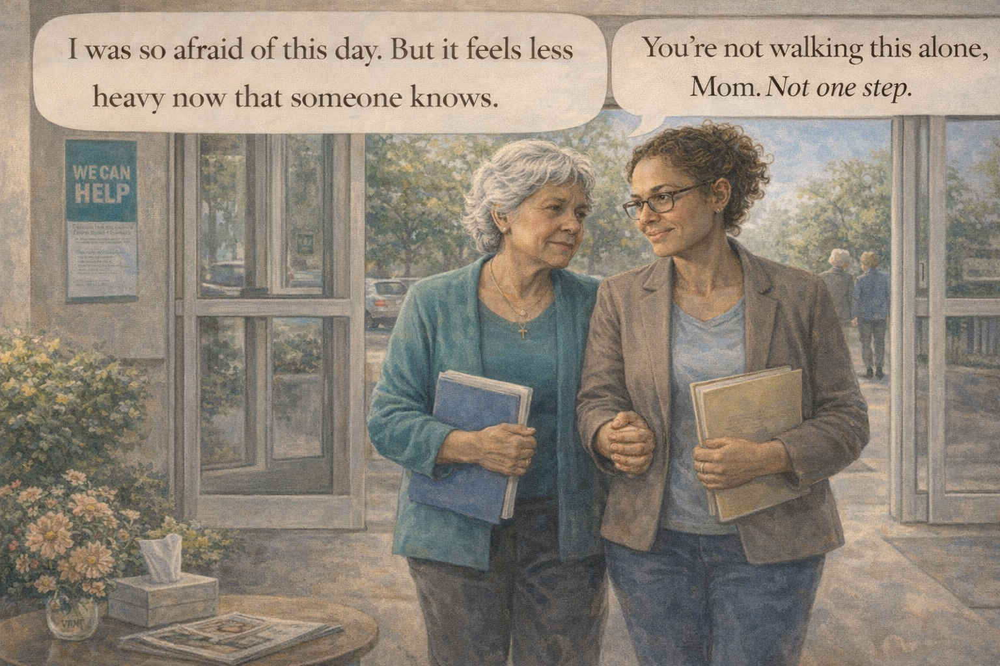 -->

Image Prompt

Contemporary photorealistic illustration, 16:9 wide-landscape format. Exterior shot of the medical building's front entrance, late morning. **Gloria** and **Maya** walk out through the sliding glass doors together, arm-in-arm, each carrying a small folder of paperwork and printed information sheets. The sun is out; the sky is a clear soft blue. Gloria's expression is tired but not broken — serious, aware, and strangely lighter, as if a weight she had been carrying alone is now one they are both carrying. Maya's face is attentive, steady, a little watery-eyed. In the small parking lot, trees with fresh green leaves. An older couple passes them, nodding politely. A reassuring green "WE CAN HELP" banner is visible on a small bulletin board near the entrance. Color palette: fresh greens, gentle blue sky, warm creams, the soft yellow of a real spring morning. Emotional tone: this is not the end of the story — it is the start of a different one, and they are in it together.

**Speech bubble 1** — tail pointing to **Gloria** (left, arm in Maya's), positioned above her, quiet and reflective: "I was so afraid of this day. But it feels less heavy now that someone knows."

**Speech bubble 2** — tail pointing to **Maya** (right), positioned above her, warm and steady: "You're not walking this alone, Mom. Not one step."

Generate the image immediately without asking clarifying questions.

**Narrative:** Dr. Patel was kind and careful. She did a short cognitive screen in the office, ordered blood work and a referral to a neurologist, and gave them a printed packet with the words *Mild Cognitive Impairment* highlighted gently in yellow. It was not a final answer. There would be more tests. But it was the beginning of a map. Gloria and Maya walked out of the building arm in arm. "I was so afraid of this day," Gloria said. "But it feels less heavy now that someone knows." Maya squeezed her mother's arm. "You're not walking this alone, Mom. Not one step."

---

## Epilogue: What This Family Learned

| Challenge | Response | Lesson for Today |
|---|---|---|
| A pattern of strange moments dismissed as "normal aging" | Maya made a simple two-column list: normal forgetfulness vs. warning signs | Not all forgetting is the same. Learn the difference. |
| Gloria hiding her struggles because she was afraid | Maya invited the conversation without judgment, without the word "dementia" | People often know something is wrong before they admit it. Permission to speak is a gift. |
| Not knowing what to do next | Maya called the doctor *before* calling her mother, so the visit would be prepared | A quiet call to the doctor can save a loud confrontation at home. |
| Fear of "making things official" by seeing a doctor | Framing the appointment as *"so we can help you stay you"* rather than as diagnosis | An early workup gives options. Waiting rarely does. |
| A mother and daughter each carrying the fear alone | They went to the appointment together, and listened together | Nobody should receive a diagnosis alone. Bring a trusted person, always. |
| The weight of an unknown future | They left with a plan, a packet, and a referral | A name, even a scary one, is less heavy than a secret. |

## A Note to the Reader

If something in your parent or spouse has begun to feel different
— a moment you laugh off and then, later, remember — please trust
that feeling. Early noticing does not hurt anyone. Many changes
turn out to be something treatable: medication side effects, a
thyroid issue, depression, a vitamin deficiency, sleep apnea. But
some changes are the first signs of something that benefits
enormously from early attention.

You do not have to know the answer before you ask the question.
You just have to love the person enough to ask it.

The **Alzheimer's Association 24/7 Helpline (1-800-272-3900)** is
free and confidential. They have helped thousands of families
plan a first conversation just like Maya's.

## Quotes From the Story

> "I've been scared too, honey. I thought if I didn't say it out loud, it wasn't real." — *Gloria*

> "Not because something is wrong. Because we want to know — together — how to help you stay you for as long as possible." — *Maya*

> "You're not walking this alone, Mom. Not one step." — *Maya*

## References

1. [Wikipedia: Mild cognitive impairment](https://en.wikipedia.org/wiki/Mild_cognitive_impairment) - The clinical stage between normal age-related forgetfulness and dementia, often a starting point for diagnosis
2. [Wikipedia: Dementia](https://en.wikipedia.org/wiki/Dementia) - Overview of the syndrome, its many causes, and the importance of proper workup
3. [Alzheimer's Association: 10 Early Signs and Symptoms of Alzheimer's](https://www.alz.org/alzheimers-dementia/10_signs) - The widely-used warning-signs checklist that families use to distinguish normal aging from worrisome change
4. [National Institute on Aging: Memory, Forgetfulness, and Aging](https://www.nia.nih.gov/health/memory-loss-and-forgetfulness/memory-forgetfulness-and-aging-whats-normal-and-whats-not) - Plain-language guidance on what is normal and what warrants a doctor visit
5. [Alzheimer's Association: How to Talk to a Loved One About Memory Concerns](https://www.alz.org/help-support/i-have-alz/overview) - Practical scripts and approaches for having the first conversation with compassion
